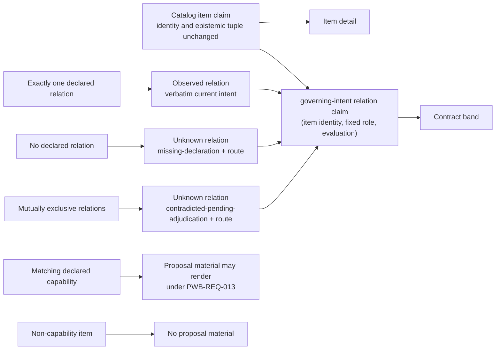

> **Candidate — binds nothing.** This semantic delta is drafted under P-81 Q5
> and CC-REV-2. It performs no act, amends no signed byte and authorizes no
> implementation. The 2026-09-05 PWB specification remains in force unless the
> owner later performs a dedicated amendment act over the final reviewed
> manifest.

# Semantic delta PWB-ITEM-DEPTH-1 — every declared catalog item can be read in depth

**Artifact(s):** the eleven-artifact signed
`openspec/changes/polaris-project-wide-butlers-model/` behavior package. Five
proposed rows move: `spec.md`, `design.md`, `CAPABILITY-COVERAGE.md`,
`CONTRACT-COVERAGE-REPAIR-DELTA.md` and the regenerated
`GOVERNING-DEPENDENCIES.md`. The other six manifest rows equal current bytes.

**Stable IDs affected:** `PWB-REQ-015`, amended in place. `PWB-REQ-007`,
`PWB-REQ-011`, `PWB-REQ-013`, `PWB-REQ-014`, `PWB-REQ-016` and
`PWB-REQ-020` are reached and unchanged. No requirement identifier is minted,
retired, renamed or renumbered; the fixed-role relation identity below is a
claim identity derived from the existing item identity, not a new requirement.

**Change class:** **Normative.** A conforming implementation today may expose
only one capability deep dive. The proposed obligation covers the complete
declared `catalog-entry` population and adds observable identity, mapping,
absence and path requirements. Someone conforming before may not conform
afterward.

**Author:** agent drafting for bead `syzygy-dov.14.2`.

**Date:** 2026-09-27.

## Current meaning

PWB-REQ-015 currently reads, in full:

```markdown
### Requirement: PWB-REQ-015 — Capability detail preserves authority bands and exact intent

Group: Presentation. Form: **invariant**.

Every capability deep dive SHALL contain, in order, an `argument` band marked
non-normative, a `contract` band with verbatim current requirement/scenario,
governing doctrine and non-goal text, and a `reality` band sourced only from
the shared model. Draft capabilities SHALL remain unadopted. Proposed deltas SHALL be adjacent to current text,
visibly distinct, non-anchorable and unable to grant status; competing
proposals SHALL remain separate candidate futures.
The default reading mode SHALL be `Base` and include observed reality. Every
block SHALL carry exactly one of the three band-class attributes. No
reorganized or stored normative copy of doctrine, non-goal, requirement or
scenario text SHALL exist outside its owning artifact.

- **Case (sweep)**: enumerate every capability deep dive at an evaluation that
  includes current intent, a draft capability and two incompatible proposals.
- **Observable**: Base mode, band class/order, verbatim current text, proposal lifecycle,
  non-anchorability and separate futures are recoverable in both channels.
- **Oracle**: compare current requirement/scenario, doctrine and non-goal bytes
  to their owning artifacts, compare
  proposal identities/exclusivity to captured changes, exhaust band and anchor
  populations and perform a static-source sweep for normative copies; exact
  bytes/order, exactly one class per block, zero stored copies and zero proposal
  authority decide.
- **Oracle independence**: current/proposed artifacts and exclusivity inputs
  come from captured OpenSpec state, not Polaris.
- **Falsifier**: a missing/misordered band, summarized normative text, draft
  rendered adopted, proposal substituted/interleaved/anchored/green, or
  competing proposals collapsed.

#### Scenario: Proposed work stays beside exact current intent

- **WHEN** a declared capability has an active proposal
- **THEN** the contract band renders current requirement text verbatim
- **AND** the proposal remains adjacent, distinct, non-anchorable and non-status-bearing

```yaml
warrants:
  primary: RFC7-17
  doctrine: [VIS-1, VIS-2, VIS-4]
  contracts: [RFC1-14, RFC1-27, RFC7-12, RFC7-13, RFC7-14, RFC7-15, RFC7-17, RFC7-18, RFC7-26, RFC7-27, RFC7-29, RFC7-33]
  policies: [CC-BAR-3, CC-BAR-5, CC-TEST-5]
  decisions: [POLARIS-DIR-2026-08-31]
  topology: []
  parent_requirements: []
```
```

This requires the three bands for capability deep dives, but does not require
one detail per declared catalog item or define the honest result when an item
has no unique declared relation to current normative intent.

## Proposed meaning

The proposed replacement is exactly the `spec.md.patch` result. Its warrant
block adds VIS-7, RFC2-24, RFC6-14, RFC6-22 and CC-TEST-6 for the separate
relation tuple, closed reasons, parity and mutation obligation:

```markdown
### Requirement: PWB-REQ-015 — Item detail preserves authority bands and exact intent

Group: Presentation. Form: **invariant**.

Every item in the complete declared `catalog-entry` population SHALL have one
item-detail reading keyed by that item's stable semantic claim identity. An
existing capability deep dive SHALL be that reading for the matching declared
catalog item; no second detail or identity SHALL be created for it.

Every item detail SHALL contain, in order, an `argument` band marked
non-normative, a `contract` band, and a `reality` band sourced only from the
shared model. The argument band SHALL NOT create intent, authority, status or
a capability identity. The contract band SHALL contain only captured governing
identities and verbatim-reachable current requirement/scenario, governing
doctrine and non-goal text.

Each contract band SHALL carry an item-to-intent relation claim whose stable
semantic identity is the tuple of the item's stable claim identity and the
fixed relation role `governing-intent`, at the same evaluation. This relation
claim is distinct from the item claim and SHALL NOT change or borrow the item's
epistemic tuple. Exactly one captured declared governing relation makes the
relation claim Observed and the band renders that current intent verbatim. No
captured governing relation makes the relation claim Unknown with the
RFC2-24 reason `missing-declaration` and its resolution route. Mutually
exclusive captured governing relations make it Unknown with
`contradicted-pending-adjudication` and the owner-adjudication route. The band
SHALL NOT infer a relation from a label, basename, similarity or generated
prose. The relation claim's complete PWB-REQ-007 tuple SHALL be recoverable in
both channels under PWB-REQ-020.

Only an item detail for a matching declared capability may render active or
proposed OpenSpec work. There, draft capabilities SHALL remain unadopted and
proposed deltas SHALL be adjacent to current text, visibly distinct,
non-anchorable and unable to grant status; competing proposals SHALL remain
separate candidate futures. A non-capability item detail SHALL render no
proposal material.

The catalog-to-detail-to-exact-source path SHALL preserve the item's stable
identity and complete epistemic state at every altitude, in both channels,
without making a URL, label, path or coordinate part of that identity.
The default reading mode SHALL be `Base` and include observed reality. Every
block SHALL carry exactly one of the three band-class attributes. No
reorganized or stored normative copy of doctrine, non-goal, requirement or
scenario text SHALL exist outside its owning artifact.

- **Case (sweep)**: enumerate the complete declared `catalog-entry` population
  at an evaluation that includes a uniquely mapped current intent, an Observed
  item whose relation is `missing-declaration`, a contradicted relation, a
  draft capability, a non-capability item with a proposal in the source
  population and two incompatible capability proposals.
- **Observable**: every declared item reaches exactly one item detail; Base
  mode, item and relation identities, their distinct complete epistemic states,
  band class/order, verbatim current text or honest relation absence, and the
  capability-only proposal lifecycle, non-anchorability and separate futures
  are recoverable in both channels.
- **Oracle**: derive the expected item population and identity/state tuples
  from the shared model; independently derive the fixed-role relation identity,
  declared relation cardinality, RFC2-24 reason and route from captured
  authority; compare current requirement/scenario, doctrine and non-goal bytes
  to their owning artifacts; compare proposal identities and exclusivity to
  captured capability changes; exhaust detail, band and anchor populations;
  and perform a static-source sweep for normative copies. Exact population,
  separate item/relation tuple equality, exact bytes/order, exactly one class
  per block, honest relation absence for every unmapped or contradicted item,
  zero non-capability proposal blocks, zero stored copies and zero proposal
  authority decide.
- **Oracle independence**: expected items and tuples come from the shared model,
  while relation cardinality, RFC2-24 values, current/proposed artifacts,
  declared mappings and exclusivity inputs come from captured authority and
  hard-coded accepted vocabularies, never from Polaris or route output.
- **Mutation proof**: independently drop and duplicate an item detail, map an
  item by label alone, assign the item's tuple to its absent relation, remove
  or alter the relation reason/route, render a proposal in a non-capability
  detail, reorder two bands, assign two classes to one block, substitute
  proposal text for current text, and source a reality fact outside the shared
  model; confirm the oracle fails before restoration and reports the complete
  item and relation denominators each time.
- **Falsifier**: a missing/duplicate item detail, changed item identity or
  epistemic state, relation identity/state collapsed into the item, inferred
  intent mapping, absent or invalid relation reason/route, hidden empty contract
  band, proposal material in a non-capability detail,
  missing/misordered/multiply-classed band, summarized normative text, second
  reality computation, draft rendered adopted, proposal substituted,
  interleaved, anchored or green, or competing proposals collapsed.

#### Scenario: Catalog item reaches exact current intent or honest absence

- **WHEN** a reader opens a declared catalog item from the catalog
- **THEN** its detail preserves the item's identity and epistemic state and
  separately renders the fixed-role item-to-intent relation claim
- **AND** exactly one captured declared relation renders current intent verbatim
- **AND** an absent or contradicted relation renders its own RFC2-24 Unknown
  reason and route without changing the item's tuple or guessing intent
- **AND** proposal material appears only for a matching declared capability,
  where it remains adjacent, distinct, non-anchorable, non-status-bearing and
  separate from competing candidate futures

```yaml
warrants:
  primary: RFC7-17
  doctrine: [VIS-1, VIS-2, VIS-4, VIS-7]
  contracts: [RFC1-14, RFC1-27, RFC2-24, RFC6-14, RFC6-22, RFC7-12, RFC7-13, RFC7-14, RFC7-15, RFC7-17, RFC7-18, RFC7-26, RFC7-27, RFC7-29, RFC7-33]
  policies: [CC-BAR-3, CC-BAR-5, CC-TEST-5, CC-TEST-6]
  decisions: [POLARIS-DIR-2026-08-31]
  topology: []
  parent_requirements: []
```
```

### Item truth and relation truth stay separate

The item keeps its own tuple; only the fixed-role governing-intent relation
changes state when its declaration is absent or contradicted.



## What explicitly does NOT change

- The three bands, their order and their three closed authority classes.
- Current authority remains operative; proposal material remains adjacent,
  separate, non-anchorable and unable to grant status.
- Verbatim text remains owned by its authoritative artifact and is not stored
  in Polaris.
- Capability identity is still declared, never inferred from a catalog row.
- PWB-REQ-007 still owns complete epistemic tuples; the item-to-intent relation
  carries its own tuple and never borrows the item's.
- PWB-REQ-013 still confines proposal material to matching capability detail.
- PWB-REQ-011's exact-source authority, content class and fail-closed gates.
- PWB-REQ-014's anchor and non-citability rules, PWB-REQ-016's nonvisual and
  keyboard requirements, and PWB-REQ-020's tuple parity.
- D5 and D6 change doctrine presentation, not these identifiers or obligations;
  CC-REV-8 governs this candidate's answer-first tree and diagram form.
- Consent, policy, registry, response ceilings, retention, egress, writes,
  execution, deployment, release and the one-repository POC boundary.

## Warrant

P-81 Q5 authorizes drafting this delta only. The ruling is recorded in
`POLARIS-PURSUIT-OWNER-RULINGS-P68-P83-DECISION.md`; it explicitly says the
candidate binds nothing and implementation requires a fresh authorization.
The M14 funnel records the observed one-capability implementation and the
request to let catalog items reach per-item depth.

## Evidence or decision basis

- `docs/design/POLARIS-M14-PROVENANCE-DEPTH-FUNNEL.md`, Q5 and Gate 4 slice 5.
- `docs/evidence/polaris-m14-provenance-depth-funnel-2026-09-17.json`.
- PWB-REQ-015's current signed bytes and its performed 2026-09-05 act record.
- RFC7-12 through RFC7-19 and RFC7-26/27/29/33/34.

The funnel review is evidence of the question presented, not confirmation of
this later semantic delta.

## Terms introduced / retired

**Introduced:** `item detail`, the detail reading for one declared
`catalog-entry`, keyed by the item's existing stable semantic claim identity.
It generalizes the current capability deep dive without turning every item into
a capability; and `item-to-intent relation claim`, keyed by the item's identity,
the fixed `governing-intent` role and the evaluation, whose tuple is always
separate from the item's.

**Retired:** none. `Capability deep dive` remains the item-detail form for a
matching declared capability.

## Downstream impact

`IMPACT-LEDGER.md` records the methods, denominator, overlap and disposition.
Five signed subjects move in the proposed bytes. Implementation files are
named only as future consumers and are unchanged here.

## Migration / supersession plan

1. Review the exact candidate and manifest in fresh context under
   `REVIEW-BRIEF.md`; retain raw output verbatim.
2. Resolve every finding. Any semantic repair retires the review and requires
   a fresh independent review of the repaired exact bytes.
3. The owner chooses this package's position relative to the already directed
   `.21 → .30 → .22 → lane B` chain and any intervening PWB successors.
4. Regenerate the patches, dependency declaration, manifest and packet digest
   against the actual predecessor. A changed predecessor retires prior review
   and any copied argument.
5. Only then may the owner be offered the dedicated act phrase. A recorder
   applies all proposed bytes and records the dedicated and aggregate act in
   one logical change. This draft creates no chain link.
6. Implementation remains a separate bead behind a fresh explicit owner
   authorization. Adoption alone authorizes no code or body read.

Rollback before adoption is deletion or reversion of this inert candidate.
After adoption, rollback is another reviewed and owner-signed successor; no
performed act or historical manifest is edited.

## Review

**Required class:** CC-REV-1 full fresh-context review plus CC-REV-4/VIS-3
fresh-reader comprehension. The package is Normative and gate-bound.

**Round 1 reviewed bytes:** commit
`39707e9e2ad4f7671df2a5f728f87d1ae786be79`; manifest-file SHA-256
`1b9b70c091db566be9ec472d0e1f4bc2bf7203d0cf97056c87cdbc8d435f009a`.
The exact fresh-context raw is retained unchanged at
`docs/reviews/R-PWB-ITEM-DEPTH-AMENDMENT-RAW.md`. **Verdict:** `REVISE`.

**Finding 1 — relation state borrowed the item tuple. Accepted and repaired.**
The proposed requirement and design now define a separate fixed-role
item-to-intent relation claim with its own stable identity, evaluation tuple,
RFC2-24 reason and route. PWB-REQ-007 and PWB-REQ-020 are reached unchanged and
named in the impact ledger, coverage row and review brief. The item tuple is
explicitly preserved.

**Finding 2 — proposal scope contradicted PWB-REQ-013. Accepted and repaired.**
Proposal obligations now apply only when item detail is matching declared
capability detail; non-capability detail renders no proposal material.
PWB-REQ-013 is reached unchanged and named in the impact ledger, coverage row,
design, owner packet and review brief.

**Finding 3 — adoption could leave a partial signed tree. Accepted and
repaired in round 1, then superseded by the round-2 repair below.** At reviewed
commit `4d9bc742`, `apply_at_adoption` ran the complete package check and
materialized the proposed-byte map before its first target write; its selftest
corrupted the final patch and confirmed every scratch target stayed unchanged.

**Round 2 reviewed bytes:** commit
`4d9bc74215a8a22562f3ff3fcba4655483c2e0e2`; the manifest-file digest is
recorded verbatim in the exact fresh-context raw retained unchanged at
`docs/reviews/R-PWB-ITEM-DEPTH-AMENDMENT-RECHECK-RAW.md`. **Verdict:**
`REVISE`. It confirmed the three round-1 repairs and found one further blocker.

**Round 2 finding — the standalone builder could write signed subjects without
an act. Accepted and repaired.** The candidate builder no longer defines
`apply_at_adoption`, `--apply` or `--at-adoption`. Its only write mode updates
the inert candidate's generated dependency patch and manifest. A behavior-level
CLI fixture copies the builder, dependencies, candidate, signed subjects and
sibling patches into a scratch mirror, invokes the removed arguments, requires
argparse exit 2 and verifies all five signed-subject target bytes are unchanged.
A future independently reviewed owner-act recorder must own act/order/digest
validation and materialization.

**Rule-6 counterexample [Observed].** In an isolated clone at unsafe head
`4d9bc74215a8a22562f3ff3fcba4655483c2e0e2`, the new predicate's exact command
(`python3 scripts/build_pwb_item_depth_amendment.py --apply --at-adoption`)
returned 0, emitted the old success line, and changed all five signed-subject
targets. It therefore evaluated false against that head's behavior. The same
predicate passes on the repaired builder with argparse return 2, an
`unrecognized arguments` diagnostic and zero changed target bytes.

**Current review state:** this repair changes candidate-builder bytes after
round 2; rule 10 retires that review for the current head. A different fresh
independent reviewer must review the exact repaired head. This author may not
review it. No phrase is offered and the PR remains Draft.
