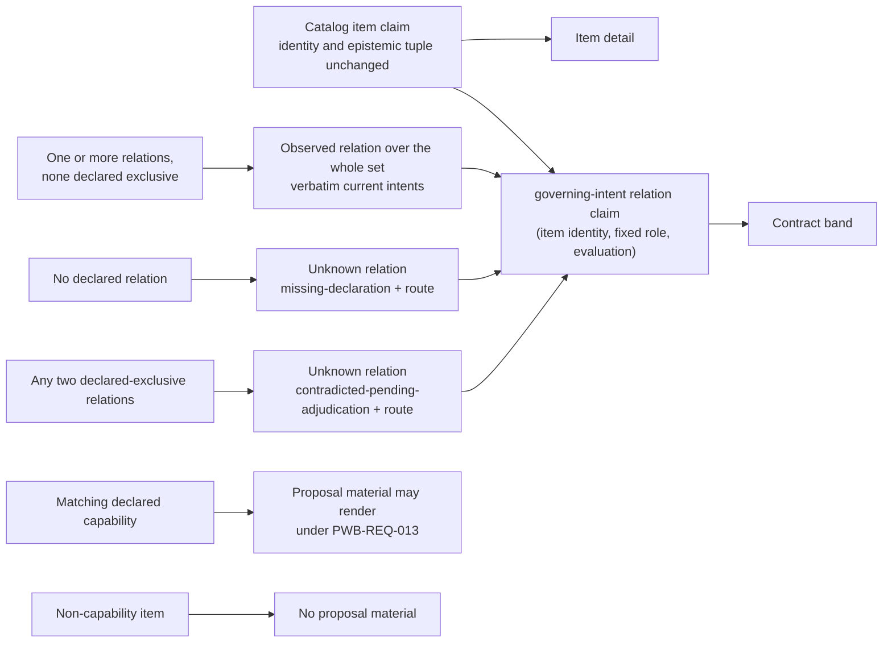

> **Candidate — binds nothing.** This semantic delta is drafted under P-81 Q5
> and CC-REV-2. It performs no act, amends no signed byte and authorizes no
> implementation. The signed PWB specification remains in force until the
> owner signs off a version of this package after a fresh independent review
> of its exact bytes.

# Semantic delta PWB-ITEM-DEPTH-1 — every declared catalog item can be read in depth

**Artifact(s):** the eleven-artifact signed
`openspec/changes/polaris-project-wide-butlers-model/` behavior package. Six
proposed rows move: `spec.md`, `design.md`, `CAPABILITY-COVERAGE.md`,
`CONTRACT-COVERAGE-REPAIR-DELTA.md` and the two regenerated summaries
`GOVERNING-DEPENDENCIES.md` and `CONTRACT-COVERAGE.md`. The other five
manifest rows equal current bytes.

**Stable IDs affected:** `PWB-REQ-015`, amended in place. `PWB-REQ-002`,
`PWB-REQ-003`, `PWB-REQ-004`, `PWB-REQ-007`, `PWB-REQ-011`, `PWB-REQ-013`,
`PWB-REQ-014`, `PWB-REQ-016` and `PWB-REQ-020` are reached and unchanged. No requirement identifier is minted,
retired, renamed or renumbered; the fixed-role relation identity below is a
claim identity derived from the existing item identity, not a new requirement.

**Change class:** **Normative.** A conforming implementation today may expose
only one capability deep dive. The proposed obligation covers the complete
declared `catalog-entry` population and adds observable identity, mapping,
absence and path requirements. Someone conforming before may not conform
afterward.

**Author:** agent drafting for bead `syzygy-dov.14.2`.

**Date:** 2026-10-02, regenerated over the applied opening-band, render-mode,
machine-view, missing-currency, dismissal-expiry and container-shape text.

## Current meaning

PWB-REQ-015 currently reads, in full:

```markdown
### Requirement: PWB-REQ-015 — Capability detail preserves authority bands and exact intent

Group: Presentation. Form: **invariant**.

Every capability deep dive SHALL contain, in order, an `argument` band marked
non-normative, a `contract` band with verbatim current requirement/scenario,
governing doctrine and non-goal text, and a `reality` band sourced only from
the shared model. Draft capabilities SHALL remain unadopted. Proposed deltas SHALL be adjacent to current text,
visibly distinct, non-anchorable and unable to grant status; competing
proposals SHALL remain separate candidate futures.
The default reading mode SHALL be `Base` and include observed reality. Every
block SHALL carry exactly one of the three band-class attributes. No
reorganized or stored normative copy of doctrine, non-goal, requirement or
scenario text SHALL exist outside its owning artifact.

- **Case (sweep)**: enumerate every capability deep dive at an evaluation that
  includes current intent, a draft capability and two incompatible proposals.
- **Observable**: Base mode, band class/order, verbatim current text, proposal lifecycle,
  non-anchorability and separate futures are recoverable in both channels.
- **Oracle**: compare current requirement/scenario, doctrine and non-goal bytes
  to their owning artifacts, compare
  proposal identities/exclusivity to captured changes, exhaust band and anchor
  populations and perform a static-source sweep for normative copies; exact
  bytes/order, exactly one class per block, zero stored copies and zero proposal
  authority decide.
- **Oracle independence**: current/proposed artifacts and exclusivity inputs
  come from captured OpenSpec state, not Polaris.
- **Falsifier**: a missing/misordered band, summarized normative text, draft
  rendered adopted, proposal substituted/interleaved/anchored/green, or
  competing proposals collapsed.

#### Scenario: Proposed work stays beside exact current intent

- **WHEN** a declared capability has an active proposal
- **THEN** the contract band renders current requirement text verbatim
- **AND** the proposal remains adjacent, distinct, non-anchorable and non-status-bearing

```yaml
warrants:
  primary: RFC7-17
  doctrine: [VIS-1, VIS-2, VIS-4]
  contracts: [RFC1-14, RFC1-27, RFC7-12, RFC7-13, RFC7-14, RFC7-15, RFC7-17, RFC7-18, RFC7-26, RFC7-27, RFC7-29, RFC7-33]
  policies: [CC-BAR-3, CC-BAR-5, CC-TEST-5]
  decisions: [POLARIS-DIR-2026-08-31]
  topology: []
  parent_requirements: []
```
```

This requires the three bands for capability deep dives, but does not require
one detail per declared catalog item or define the honest result when an item
has no unique declared relation to current normative intent.

## Proposed meaning

The proposed replacement is exactly the `spec.md.patch` result. Its warrant
block adds VIS-7, RFC2-24, RFC6-14, RFC6-22 and CC-TEST-6 for the separate
relation tuple, closed reasons, parity and mutation obligation. It reads:

```markdown
### Requirement: PWB-REQ-015 — Item detail preserves authority bands and exact intent

Group: Presentation. Form: **invariant**.

Every item in the complete declared `catalog-entry` population SHALL have one
item-detail reading keyed by that item's stable semantic claim identity. A
declared capability matches a catalog item only when the capability's own
declared key equals that item's declared key, compared exactly and without
normalization; a catalog row, label, basename or similarity never makes the
match. A capability matching exactly one item makes that item's detail its
deep dive, and no second detail or identity SHALL be created for it. A
capability matching no item, or more than one, receives no item detail and no
identity from this requirement and renders no proposal material anywhere; it
is disclosed as Unknown with the RFC2-24 reason `missing-declaration` (no
match) or `contradicted-pending-adjudication` (several) and that reason's
resolution route.

Every item detail SHALL contain, in order, an `argument` band marked
non-normative, a `contract` band, and a `reality` band sourced only from the
shared model. The argument band SHALL NOT create intent, authority, status or
a capability identity. The contract band SHALL contain only captured governing
identities, each reaching its current requirement/scenario, governing doctrine
or non-goal text verbatim through PWB-REQ-011's exact-source route, which is
the only place that text is encoded; the band embeds no body text of its own.
A related source that is excluded, missing, unreadable or whose PWB-REQ-011
gate fails leaves that text Unknown with that source's own reason and route
(PWB-REQ-003, PWB-REQ-011); this never changes the relation claim below, which
asserts the captured declaration and not the body.

Each contract band SHALL carry an item-to-intent relation claim whose stable
semantic identity is the tuple of the item's stable claim identity and the
fixed relation role `governing-intent`, at the same evaluation. This relation
claim is distinct from the item claim and SHALL NOT change or borrow the item's
epistemic tuple. It belongs to the derived claim class
`governing-intent-relation`, whose currency treatment PWB-REQ-007 decides as
for every class: a class with no effective currency bound declared renders its
claims Unknown with `no-currency-bound-declared` and that disclosure.

A captured governing relation is a declaration, emitted by the extractor
assigned to an admitted source, that names one catalog item's stable claim
identity and one owning requirement, scenario, doctrine or non-goal artifact.
PWB-REQ-002's nine extraction classes and PWB-REQ-004's closed fact population
admit no such declaration, so this requirement mints none: until a separate
owner-scoped change admits a declaration source, no relation is captured for
any item. Two captured governing relations exclude one another only when an
admitted declaration names them as mutually exclusive for the same item;
class, label, basename, similarity, generated prose and a PWB-REQ-004
precedence outcome never create or resolve an exclusion, and a requirement and
a non-goal never exclude one another by class. Once the class's currency
bound applies, each item's population of captured relations has exactly one
result. With none, the relation claim is Unknown with the RFC2-24 reason
`missing-declaration` and its resolution route. With one or more, no two of
which exclude one another, it is Observed over that whole set; compatible
relations never become separate claims or a conflict. With any two that
exclude one another, it is Unknown over the whole population with
`contradicted-pending-adjudication` and the owner-adjudication route, however
many compatible relations the population also holds, and it leaves only by
owner adjudication. The band SHALL NOT infer a relation from a label,
basename, similarity or generated prose. The relation claim's complete
PWB-REQ-007 tuple SHALL be recoverable in both channels under PWB-REQ-020.

Only an item detail for a matching declared capability may render active or
proposed OpenSpec work. There, draft capabilities SHALL remain unadopted and
proposed deltas SHALL be adjacent to current text, visibly distinct,
non-anchorable and unable to grant status; competing proposals SHALL remain
separate candidate futures. A non-capability item detail SHALL render no
proposal material.

The catalog-to-detail-to-exact-source path SHALL preserve the item's stable
identity and complete epistemic state at every altitude, in both channels,
without making a URL, label, path or coordinate part of that identity.
The default reading mode SHALL be `Base` and include observed reality. Every
block SHALL carry exactly one of the three band-class attributes. No
reorganized or stored normative copy of doctrine, non-goal, requirement or
scenario text SHALL exist outside its owning artifact.

- **Case (sweep)**: enumerate the complete declared `catalog-entry` population
  at an evaluation with no admitted relation source, where every item's
  relation claim is the absent-relation arm; then decide the relation rules
  over the oracle's hard-coded populations (a fixture that never feeds the
  production model): a uniquely mapped current intent, two compatible mappings
  (a requirement and a non-goal), three relations of which two exclude one
  another and one is compatible with both, a requirement-plus-non-goal pair
  with no declared exclusion, and a mapping whose source is excluded or fails
  its PWB-REQ-011 gate. Include a draft capability, a non-capability item with
  a proposal in the source population, two incompatible capability proposals,
  and capabilities matching zero, one and two items.
- **Observable**: every declared item reaches exactly one item detail; Base
  mode, item and relation identities, their distinct complete epistemic states,
  band class/order, exact-source reachability of each governing identity or
  its honest text absence, and the capability-only proposal lifecycle,
  non-anchorability and separate futures are recoverable in both channels.
- **Oracle**: derive the expected item population and identity/state tuples
  from the shared model; independently derive the fixed-role relation identity,
  declared relation cardinality and declared exclusions, RFC2-24 reason and
  route from captured authority and hard-coded populations; derive each
  capability's match by exact key equality; compare current requirement/
  scenario, doctrine and non-goal bytes, as served by the exact-source route,
  to their owning artifacts; compare proposal identities and exclusivity to
  captured capability changes; exhaust detail, band and anchor populations;
  and perform a static-source sweep for normative copies. Exact population,
  separate item/relation tuple equality, exact bytes/order, exactly one class
  per block, honest relation absence for every unmapped or contradicted item,
  zero body text outside the exact-source route, zero non-capability proposal
  blocks, zero stored copies and zero proposal authority decide.
- **Oracle independence**: expected items and tuples come from the shared model,
  while relation cardinality and exclusions, capability keys, RFC2-24 values,
  current/proposed artifacts, declared mappings and exclusivity inputs come from
  captured authority and hard-coded accepted vocabularies, never from Polaris
  or route output.
- **Mutation proof**: independently drop and duplicate an item detail, map an
  item by label alone, drop one member of a compatible relation set, report a
  compatible set as contradicted or as separate claims, report a mixed
  population as Observed over its compatible subset, infer an exclusion from
  class or let a precedence outcome resolve one, assign the item's tuple to
  its absent relation, change the relation claim when its source is withheld,
  embed body text in the band outside the exact-source route, match a
  capability by label, create a second detail for a capability matching two
  items or render its proposal, remove or alter the relation reason/route,
  render a proposal in a non-capability detail, reorder two bands, assign two
  classes to one block, substitute proposal text for current text, and source
  a reality fact outside the shared model; confirm the oracle fails before
  restoration and reports the complete item and relation denominators each
  time.
- **Falsifier**: a missing/duplicate item detail, changed item identity or
  epistemic state, relation identity/state collapsed into the item, inferred
  intent mapping, a compatible relation set collapsed to one relation, split
  into claims or reported as contradicted, a mixed population not reported as
  contradicted, an inferred or precedence-resolved exclusion, a relation
  claim changed by a withheld source, band body text outside the exact-source
  route, a capability matched other than by exact key or given a second
  detail, absent or invalid relation reason/route, hidden empty contract
  band, proposal material in a non-capability detail,
  missing/misordered/multiply-classed band, summarized normative text, second
  reality computation, draft rendered adopted, proposal substituted,
  interleaved, anchored or green, or competing proposals collapsed.

#### Scenario: Catalog item reaches exact current intent or honest absence

- **WHEN** a reader opens a declared catalog item from the catalog
- **THEN** its detail preserves the item's identity and epistemic state and
  separately renders the fixed-role item-to-intent relation claim
- **AND** one or more captured, mutually compatible declared relations render
  one Observed relation claim, each related governing identity reaching its
  verbatim current text through the exact-source route
- **AND** an absent relation, or any two exclusive relations, renders the
  relation claim's own RFC2-24 Unknown reason and route without changing the
  item's tuple or guessing intent
- **AND** an excluded, missing, unreadable or gate-failed related source leaves
  only that text Unknown with its own reason and route
- **AND** proposal material appears only for a declared capability matching
  exactly one item, where it remains adjacent, distinct, non-anchorable,
  non-status-bearing and separate from competing candidate futures

```yaml
warrants:
  primary: RFC7-17
  doctrine: [VIS-1, VIS-2, VIS-4, VIS-7]
  contracts: [RFC1-14, RFC1-27, RFC2-24, RFC6-14, RFC6-22, RFC7-12, RFC7-13, RFC7-14, RFC7-15, RFC7-17, RFC7-18, RFC7-26, RFC7-27, RFC7-29, RFC7-33]
  policies: [CC-BAR-3, CC-BAR-5, CC-TEST-5, CC-TEST-6]
  decisions: [POLARIS-DIR-2026-08-31]
  topology: []
  parent_requirements: []
```
```

### Item truth and relation truth stay separate

The item keeps its own tuple; only the fixed-role governing-intent relation
changes state when its declaration is absent or contradicted, and compatible
declarations form one set-valued relation, never several claims. No extraction
class admits a relation declaration today, so every relation claim is the
absent arm until a separate owner-scoped change admits a source.



## What explicitly does NOT change

- The three bands, their order and their three closed authority classes.
- Current authority remains operative; proposal material remains adjacent,
  separate, non-anchorable and unable to grant status.
- Verbatim text remains owned by its authoritative artifact and is not stored
  in Polaris.
- Capability identity is still declared, never inferred from a catalog row.
- PWB-REQ-007 still owns complete epistemic tuples; the item-to-intent relation
  carries its own tuple and never borrows the item's. Its closed Unknown
  vocabulary, missing-currency disclosure and dismissal rules apply to the
  relation claim as to any claim.
- PWB-REQ-013 still confines proposal material to matching capability detail.
- PWB-REQ-002's nine extraction classes and PWB-REQ-004's closed fact population
  are not amended: no relation declaration is admitted, and the amended text
  mints none.
- PWB-REQ-010's opening-before-detail guard and PWB-REQ-011's level list still
  name capability detail. Item detail is read as one of those levels' available
  depths and neither requirement becomes false; the unchanged wording may read
  narrower than the path, and a later wording amendment may align it.
- PWB-REQ-011's exact-source authority, content class and fail-closed gates.
- PWB-REQ-014's anchor and non-citability rules, PWB-REQ-016's nonvisual and
  keyboard requirements, and PWB-REQ-020's tuple parity.
- D5 and D6 change doctrine presentation, not these identifiers or obligations;
  CC-REV-8 governs this candidate's answer-first tree and diagram form.
- Consent, policy, registry, response ceilings, retention, egress, writes,
  execution, deployment, release and the one-repository POC boundary.

## Warrant

P-81 Q5 authorizes drafting this delta only. The ruling is recorded in
`POLARIS-PURSUIT-OWNER-RULINGS-P68-P83-DECISION.md`; it explicitly says the
candidate binds nothing and implementation requires a fresh authorization.
The M14 funnel records the observed one-capability implementation and the
request to let catalog items reach per-item depth.

## Evidence or decision basis

- `docs/design/POLARIS-M14-PROVENANCE-DEPTH-FUNNEL.md`, Q5 and Gate 4 slice 5.
- `docs/evidence/polaris-m14-provenance-depth-funnel-2026-09-17.json`.
- PWB-REQ-015's current signed bytes and its performed 2026-09-05 act record.
- RFC7-12 through RFC7-19 and RFC7-26/27/29/33/34.

The funnel review is evidence of the question presented, not confirmation of
this later semantic delta.

## Terms introduced / retired

**Introduced:** `item detail`, the detail reading for one declared
`catalog-entry`, keyed by the item's existing stable semantic claim identity.
It generalizes the current capability deep dive without turning every item into
a capability; and `item-to-intent relation claim`, keyed by the item's identity,
the fixed `governing-intent` role and the evaluation, whose tuple is always
separate from the item's and whose Observed value is the set of all captured,
mutually compatible governing relations.

**Retired:** none. `Capability deep dive` remains the item-detail form for a
matching declared capability.

## Downstream impact

`IMPACT-LEDGER.md` records the methods, denominator, overlap and disposition.
Six signed subjects move in the proposed bytes. Implementation files are
named only as future consumers and are unchanged here.

## Open points for the owner

These are choices the drafted text makes and the owner may reverse; each is
also a row of `OWNER-DECISION-PACKET.md`.

1. **Relations are inert until a source is admitted.** PWB-REQ-002's nine
   classes and PWB-REQ-004's closed fact population admit no governing-relation
   declaration, and no currency bound is declared for the relation claim's
   class. The drafted text therefore leaves every relation claim Unknown (the
   absent arm, under PWB-REQ-007's currency rule) and defines the Observed and
   contradicted arms for when a later owner-scoped change admits an extraction
   class and key and a bound. The alternative is to amend those requirements
   here, which widens the delta beyond PWB-REQ-015.
2. **Compatible plural relations and exclusion.** Relations form one Observed
   set unless an admitted declaration names two of them as mutually exclusive;
   then the whole population is contradicted, however many compatible relations
   it holds, and only owner adjudication resolves it. The other lawful arm
   classifies any plural population as a contradiction, which needs a governing
   invariant that makes the relation functional.
3. **Capability matching and the unmatched capability.** A capability matches
   an item only by exact equality of their declared keys. One matching no item
   or several gets no detail and renders no proposal, disclosed Unknown, so
   today's deep dive disappears for such a capability. That assumes the
   capability artifact declares a key comparable to the catalog item's declared
   key; whether it does is not established here.
4. **Failed gate behind a related intent.** The relation claim asserts the
   captured declaration, so an excluded, missing, unreadable or gate-failed
   related source leaves only that text Unknown with its own reason and route.
   The other arm makes the relation claim Unknown too, which mixes declaration
   truth with body availability.

## Migration / supersession plan

1. A fresh independent reviewer reads the exact package under
   `REVIEW-BRIEF.md`; the raw is stored verbatim.
2. The owner is asked once, by version, whether to sign off the confirmed
   bytes (`scripts/record_versioned_signoff.py`).
3. The recorder applies the six patches through the builder, writes the
   dedicated record and the aggregate block, and prints the tag to create.
4. A later amendment that touches the same files regenerates the dependency
   patch and the manifest over the then-current text.
5. Implementation is a separate bead behind a fresh explicit owner
   authorization. Sign-off alone authorizes no code or body read.

Rollback before sign-off is deletion or reversion of this inert candidate.
After sign-off, rollback is another reviewed and owner-signed version; no
performed record or earlier manifest is edited.

## Review

**Required class:** CC-REV-1 full fresh-context review plus CC-REV-4/VIS-3
fresh-reader comprehension. The package is Normative and gate-bound. The
reviewer is independent of everyone who drafted or repaired the package, and a
semantic edit after review requires a new review.
