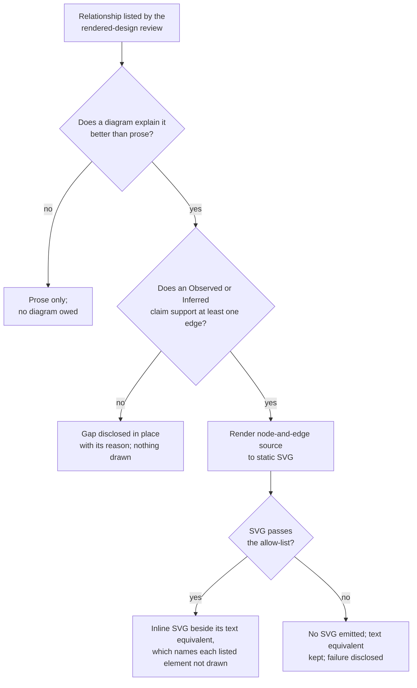

> **Candidate — binds nothing.** This semantic delta is drafted under bead
> `syzygy-73e.9` and CC-REV-2. It performs no act, amends no signed byte and
> authorizes no implementation. The signed PWB specification remains in force
> until the owner signs off a version of this package after a fresh independent
> review of its exact bytes.

# Semantic delta PWB-TREE-FRAMING-1 — Polaris's own framing reads as a tree, with supported diagrams

Polaris's own words would open every group with its answer, under its
children's weakest label, and draw the relationships a diagram explains
better, while Butlers' words stay verbatim and nothing is drawn without a
model claim behind it.

**Artifact(s):** the eleven-artifact signed
`openspec/changes/polaris-project-wide-butlers-model/` behavior package. Five
proposed rows move: `spec.md`, `design.md`, `proposal.md`,
`CAPABILITY-COVERAGE.md` and the regenerated `GOVERNING-DEPENDENCIES.md`. The
other six manifest rows equal current bytes.

**Stable IDs affected:** `PWB-REQ-014`, amended in place. `PWB-REQ-006`,
`PWB-REQ-007`, `PWB-REQ-010`, `PWB-REQ-011`, `PWB-REQ-012`, `PWB-REQ-015`,
`PWB-REQ-016`, `PWB-REQ-020` and `PWB-REQ-021` are reached and unchanged. No
requirement identifier is minted, retired, renamed or renumbered; the title of
PWB-REQ-014 is unchanged, so the reading guide's table stays true.

**Change class:** **Normative.** A conforming page today may open a group
directly on Butlers text and draw no diagram. Under the proposed text it must
open every group with a model-derived answer and draw each relationship the
rendered-design review lists as both clearer as a diagram and drawable, so a
page that conformed before may not conform after.

**Author:** agent drafting for bead `syzygy-73e.9`.

**Date:** 2026-10-03, drafted over the spec as signed at
`pwb-readability-successor-v1.0`.

## What changes, in one diagram

Each relationship the independent rendered-design review lists resolves to
exactly one outcome:



The diagram repeats the proposed text and adds no state or route.

## Current meaning

PWB-REQ-014 requires every narrative unit to carry one claim role and the
`presentation-artifact` and `non-citable` attributes, every anchored block to
carry a minimal covering anchor set, and Polaris never to be cited as
authority. It says nothing about how a group opens or about diagrams. Its
falsifier currently reads, in full:

```markdown
- **Falsifier**: an unclassified narrative unit, uncovered claim, surplus or
  ambiguous anchor, missing non-citable attribute, or downstream citation to
  Polaris.
```

and its warrant block lists `doctrine: [VIS-1, VIS-2, VIS-7]` and
`policies: [CC-BAR-3, CC-REV-3, CC-TEST-5]`.

[Observed] On the page served at Syzygy `a0d218a52eca8e10214401306fc88d7e06ddc7dc`
over Butlers `9f351ffeac066d81464fc0d264f81dff4010b9ef`, none of the eight
top-level groups opens with its answer:

- five open directly on a child heading ("What Butlers is" on Butlers' purpose
  text, "Project catalog" on the declared-capabilities table, "Evidence and
  gaps" on the observation record, and likewise "Scope and principles" and
  "How Butlers is built");
- two open on a fixed scope line that describes the group rather than answers
  it ("What V1 ships", "One capability in depth");
- one opens on its own count (the opening Unknown aggregate).

The page contains no `<svg>` element on either host form; the capability's
claim relationships render as a list of eleven nodes and nine edges.

## Proposed meaning

PWB-REQ-014 keeps every current bullet and gains two labelled clauses, seven
scenarios and additions to four verification bullets (case, oracle, oracle
independence, falsifier). The patch is `proposed/spec.md.patch`.

- **Tree form.** Every group opens with one Syzygy-authored sentence that
  states its answer.
  - A group is a project-level category of PWB-REQ-010's first reading level
    (a top-level group), a project catalog (PWB-REQ-011), an item detail
    (PWB-REQ-015) or an evidence group, which renders the source records and
    Unknown disclosures of one category, catalog or item.
  - The sentence is a lede under PWB-REQ-012 whose one copy role is
    `project-fact`, and a narrative unit whose one claim role is
    epistemically labeled claim. Its label marker and routes are separate
    `epistemic-disclosure` and `action-label` strings. An item detail's
    opening precedes its `argument` band and belongs to no band.
  - It states only what that group's rendered children state, derived from
    the same evaluation's shared model, and never a claim found nowhere
    beneath it.
  - It carries the weakest label among its children (a withheld or excluded
    child counts as Unknown), names its scope when it states fewer than all
    its children, and mints no reason of its own: its routes reach each
    Unknown child's own reason and resolution route. Stopping at any opening
    leaves a coarser true account, never one more favourable than the group.
  - The machine narrative carries each opening with its group, its label and
    the identities of the children it summarizes, which stand in place of an
    anchor set.
  - Above Butlers text it names which declared text follows. It never
    paraphrases, condenses or stands in for that text, which stays verbatim;
    a source identity holding a word PWB-REQ-012 bars from a lede is named in
    the route string instead.
  - It counts no claims, sources or rows, so PWB-REQ-010's opening aggregate
    stays the only aggregate before the first capability catalog.
  - Headings, identifiers, the RFC7-13 order, the RFC7-17 bands and the
    exact-source route keep their structure.
- **Diagrams.** The independent rendered-design review decides which
  relationships need one, as the diagram above shows.
  - Its record lists every flow, dependency, ordering, boundary or placement
    it judged, with the nodes and edges it expects, whether a diagram
    explains it better, and whether it is drawable. A prose-sufficient
    relationship owes nothing. The machine narrative names the record a page
    follows by path and SHA-256; a relationship it does not list owes
    nothing.
  - An element is supported when a model claim establishes it with an
    Observed or Inferred label. Drawable means at least one edge is
    supported, so a relationship whose only claimed edges are Unknown is not
    drawable. A listed relationship that is not drawable is disclosed in
    place and never drawn from prose, labels or inference.
  - Every element a disclosure or text equivalent names as not drawn carries
    its reason: an Unknown claim's own RFC2-24 reason and route, or
    `missing-declaration` and its route where no claim establishes it.
  - Every drawn node, edge and label draws exactly one model claim (or
    anchored narrative claim) by stable identity and carries its Observed,
    Inferred or Unknown label into the render and the text equivalent.
  - A drawn diagram accounts for its whole listed relationship: each listed
    element it does not draw is named in the text equivalent as not drawn,
    and the figure is marked partial.
  - Each diagram has an adjacent text equivalent (PWB-REQ-016), each drawn
    tuple equals its machine claim's (PWB-REQ-020), and the node-and-edge
    source is recoverable from the machine narrative.
  - The render is inline static SVG validated against an allow-list of
    shapes, paths, text and styling before it reaches a sink, with label
    text encoded as SVG text content. A failed render or validation emits no
    SVG, keeps the text equivalent and discloses the failure.
  - Openings and diagrams stay non-citable presentation, count toward
    PWB-REQ-006's human-output ceiling and are never authority.
- **Warrants.** `doctrine` gains `SEC-3` (inert output) and `policies` gains
  `CC-REV-8`; contracts are unchanged, so the generated
  `GOVERNING-DEPENDENCIES.md` moves and `CONTRACT-COVERAGE.md` does not.

The seven scenarios are *A group opens with its answer*, *An opening over an
Unknown child is never more favourable*, *An opening above Butlers text stays
outside it*, *A supported relationship is drawn inertly*, *A partly supported
relationship names what it leaves out*, *A relationship with no supported
edge is disclosed, not drawn* and *A failed or unsafe diagram emits nothing
active*. `proposal.md` gains two sub-bullets under "Copy is short and
direct", `design.md` gains decision 11 (with the diagram above) and two risk
lines, and `CAPABILITY-COVERAGE.md` gains row 33, covered by PWB-REQ-014 (33
rows: 27 covered, 6 lawfully out of scope).

## What explicitly does NOT change

- **Butlers text.** Every Butlers excerpt, verbatim requirement section and
  whole-body source stays byte-for-byte; tree form applies only to
  Syzygy-authored openings and ledes.
- **PWB-REQ-006.** Its text is not amended. Under the owner's 2026-09-28
  ruling (`decisions/POLARIS-TREE-FORM-AMENDMENT-ADOPTION.md`), "active"
  governs the whole output list, so allow-listed static SVG is inert; the
  ruling names this package as where it carries over. A Butlers source that
  contains SVG is still excluded whole by the input sentence. Once diagrams
  exist, PWB-REQ-006's sink-byte scan meets legitimate `<svg>` bytes; the
  proposed PWB-REQ-014 oracle admits an emitted SVG only when the
  independent allow-list scan passes it, and label text is encoded as SVG
  text content, so a markup-like code span in a label stays inert text.
- **PWB-REQ-010, 011, 012, 013, 015.** The opening order, the single opening
  aggregate, the progressive path, the copy rubric, proposal confinement and
  the three item-detail bands are unchanged. Openings obey PWB-REQ-012 with
  one role each, and an item detail's opening stands before its bands, so
  the argument band's and contract band's limits never apply to it.
- **PWB-REQ-007 and PWB-REQ-020.** No new reason, tier or freshness value;
  every drawn element carries an existing claim's tuple, and parity stays per
  tuple.
- **The generator.** No generated draft, generated prose or generated diagram
  is emitted on `/polaris`. Openings and diagrams are derived from the shared
  model at render time; the design's non-goal "LLM generation or inference at
  observation or render time" stands.
- **Authority and scope.** Consent, policy, registry, content class, response
  ceilings, retention, egress, writes, execution, deployment, release and the
  one-repository POC boundary.

## Warrant

- CC-REV-8 (owner-approved 2026-09-27) governs "every document Syzygy
  generates for a governed project", and the tree-style rollout direction of
  2026-09-28 (`decisions/OWNER-DIRECTION-2026-09-28-TREE-STYLE-ROLLOUT.md`)
  asks for the whole of Syzygy in line with it. That direction covers no code
  behavior and no change of meaning, so a behavior change to Polaris travels
  as this delta.
- The Polaris tree-form amendment (adopted 2026-09-28) names "the Butlers page
  package" as the place that decides diagrams on Butlers' page, after the
  pending `pwb-*` packages. Every one of those is now signed or declined.
- The bead `syzygy-73e.9` authorizes drafting only.

## Evidence or decision basis

- The served-page outline above, captured by this drafting session from a
  private daemon (`--port 0`, scratch state) on a clean committed tree.
- `decisions/POLARIS-TREE-FORM-AMENDMENT.md` and its adoption record, for the
  generator's equivalent REQ-polaris-generation-004 clauses this delta
  mirrors.
- `apps/three-surface-poc/src/polaris-generation/svg-inert.ts` and
  `diagram-layout.ts`, the generator preview's allow-list validator and
  dependency-free layout, which a later implementation would reuse.

## Terms introduced / retired

**Introduced:** `group`, a project-level category, project catalog, item
detail or evidence group; `top-level group`, a project-level category of
PWB-REQ-010's first reading level; `opening`, the one Syzygy-authored
sentence that starts a group and states its answer; `text equivalent`, the
adjacent text naming every node, edge, label and marking a diagram draws, and
every listed element it leaves undrawn; `supported`, an element a model claim
establishes with an Observed or Inferred label; `drawable`, a listed
relationship with at least one supported edge.

**Retired:** none.

## Downstream impact

`IMPACT-LEDGER.md` records the citer sweep, the sibling classification, the
page-size measurement and the future implementation consumers. Five signed
subjects move in the proposed bytes; no implementation file moves here.

## Open points for the owner

Each is a choice the drafted text makes; each is a row of
`OWNER-DECISION-PACKET.md`.

1. **Where the rule lives.** The drafted text amends PWB-REQ-014, because
   openings and diagrams are narrative units. The other arm mints a new
   requirement, which changes the reading guide's table, the requirement
   count and every coverage table.
2. **Who decides which diagrams are owed.** The drafted text gives that to the
   independent rendered-design review, as the generator amendment does. The
   other arm names a closed list in the spec (today's candidates: the
   capability's claim relationships and the root index's precedence order),
   which is easier to test but goes stale as the model grows.
3. **Which groups open.** The drafted text opens every group: each
   project-level category, project catalog, item detail and evidence group.
   The other arm opens only the top-level groups (eight today), which costs
   fewer bytes and leaves deeper groups starting on their first child.
4. **What a failed diagram does.** The drafted text emits no SVG, keeps the
   text equivalent and discloses the failure. The other arm treats any
   failure as a final-output failure for the whole page, which is stricter and
   blanks the page over one figure.
5. **How an opening shows a weaker child.** The drafted text gives each
   opening its children's weakest label and its scope, and lets no opening
   count, so the opening aggregate stays alone and no count wall forms. The
   other arm lets an opening name its Unknown and withheld counts, which is
   more specific but makes each such opening an aggregate owing PWB-REQ-007's
   full disclosure beside a twenty-word lede.
6. **A relationship whose only claimed edges are Unknown.** The drafted text
   treats it as not drawable and discloses each edge with its reason. The
   other arm draws an all-Unknown figure, which shows the expected shape but
   draws a picture with no supported edge in it.

## Migration / supersession plan

1. A fresh independent reviewer reads the exact package under
   `REVIEW-BRIEF.md`; the raw is stored verbatim.
2. The owner is asked once, by version, whether to sign off the confirmed
   bytes (`scripts/record_versioned_signoff.py`).
3. The recorder applies the five patches through the builder, writes the
   dedicated record and the aggregate block, and prints the tag to create.
4. Implementation is a separate bead behind a fresh explicit owner
   authorization. Sign-off alone authorizes no code.

Rollback before sign-off is deletion or reversion of this inert candidate.
After sign-off, rollback is another reviewed and owner-signed version; no
performed record or earlier manifest is edited.

## Review

**Required class:** CC-REV-1 full fresh-context review plus CC-REV-4/VIS-3
fresh-reader comprehension. The package is Normative and gate-bound. The
reviewer is independent of everyone who drafted or repaired the package, and a
semantic edit after review requires a new review.
