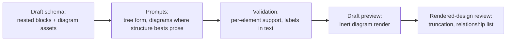

# Polaris tree-form and diagram amendment

> **Status:** Adopted 2026-09-28, with implementation authorized and question
> 2 ruled "Permitted". The record is
> [`POLARIS-TREE-FORM-AMENDMENT-ADOPTION.md`](POLARIS-TREE-FORM-AMENDMENT-ADOPTION.md).

Generated Polaris pages will read as abstraction trees. Every structural
relationship that a diagram explains better than prose will get a diagram
wherever its premises support one, and a disclosed gap where they do not. This holds the pages Syzygy writes for governed projects to the same
bar as its own governed documents (CC-REV-8).

## Owner questions

1. **Adopt and implement?**
   - Answering "Adopt and implement the Polaris tree-form amendment" adopts
     the change to REQ-polaris-generation-004 below.
   - It also authorizes the generator implementation described under
     [What implementation means](#what-implementation-means).
2. **May the generator's draft preview draw diagrams as sanitized static SVG?**
   - **Scope assumption.** PWB-REQ-006's title is "Project-shape content stays
     contained, inert and bounded", and its subject is "the POC". The draft
     preview is part of the POC app but renders generator output, not
     project-shape content. This packet conservatively assumes PWB-REQ-006
     reaches the preview; you may rule that it does not.
   - **Reading "permitted":** its output sentence forbids emitting "active
     HTML, SVG, scripts, event handlers or unsafe URL schemes". "Active" can
     govern the whole list, so SVG stripped to static shapes and text would
     be inert.
   - **Reading "banned":** the same requirement's input sentence lists bare
     "SVG", with no "active", among the constructs that exclude a whole
     source. That suggests SVG is treated as active in itself.
   - **Cost of "permitted":** the sanitizer's allow-list becomes a security
     boundary that must be tested like one.
   - **Cost of "banned":** diagrams render as HTML/CSS boxes, which are
     plainer and need layout code of our own. The obligations are the same.
   - **Drafter's recommendation, not a finding:** permitted, with the
     allow-list tested by mutation. Server-rendered SVG is the most legible
     option under the preview's `default-src 'none'` CSP; HTML/CSS boxes also
     work but are plainer.
   - **Recording:** the answer is recorded as a dated owner direction under
     `decisions/`, because it sets the security posture of POC output.

## What changes

REQ-004's clause gains about 410 words and five scenarios. Counted over the
predecessor plus the amendment, the effective composition goes from 31
requirements and 177 scenarios to 31 and 182
(`python3 scripts/count_polaris_effective_scenarios.py`). All three diff
hunks sit inside the REQ-004 block.

- **Tree form.**
  - Each section opens with its answer, in one sentence or one bullet.
  - Each parent block truly summarizes its children, so truncating at any
    nesting depth leaves a true account.
  - Required headings, the altitude order, the authority bands and verbatim
    exact-source text keep their structure.
    - A generated opening above verbatim text is marked as generated.
    - It never replaces that text or presents a paraphrase as it; the verbatim
      leaf remains the owning text.
  - REQ-002's coherent argument is kept.
- **Which relationships need a diagram.**
  - The author may propose relationships. Only the independent
    rendered-design review decides which ones need a diagram.
  - It lists the flows, lifecycles, state machines, boundaries, dependencies
    and placements that the account explains and that a diagram would explain
    better than prose.
  - Its record keeps that list, and also the relationships it judged prose
    explains well enough. A prose-sufficient relationship needs nothing,
    unless the request or the acceptance criteria require a diagram on some
    other basis.
- **How each listed relationship resolves.**
  - **Drawable or not.** A relationship is drawable only when its premises
    support at least one of its edges. The review records which applies.
  - **Undrawable:**
    - It gets an omitted disposition with its reason, and its gap is
      disclosed in the page at the depth it affects.
    - Being listed does not make it required. If the request or the
      acceptance criteria require that visual on another basis, it remains
      unmet.
  - **Drawable:**
    - It is a required asset with its own REQ-019 identity, issued by
      whichever authoring operation introduces it.
    - It is produced, or it is unresolved when no renderer or permission is
      available.
    - An unresolved or missing diagram is a blocking finding.
    - Boxes without any of the relationship's edges do not count as
      produced.
- **Diagram honesty.**
  - The declarative source is kept with the asset, and the render is inert and
    static.
  - The diagram asserts nothing the account does not state.
  - Every node, edge and label it draws has admitted support. An unsupported
    element is never drawn; it is disclosed as a gap.
  - Observed, Inferred and Unknown markings carry into the render and its text
    equivalent. An element may be Unknown only when support establishes the
    element and its state is Unknown.
- **Five scenarios:**
  - *Section reads as an abstraction tree*
  - *Supported structure gets its diagram*
  - *Relationship that needs a diagram has none*
  - *Partly supported diagram*
  - *Diagram rendered inertly from declarative source*
- **Warrants:** the warrant block adds `CC-REV-8`.

## What stays fixed

The new clauses add to REQ-004 and narrow its diagram and stopping-depth
sentences where they overlap. Two narrowings are deliberate:

- labels now need support too;
- support now covers every drawn edge, not only factual ones.

REQ-004's required-asset sentence and *Required visual unavailable* still
govern every visual that the request, a reading obligation or the acceptance
criteria require. The new clause only declines to make an undrawable
relationship required merely because the review listed it.

Everything else in REQ-004 is unchanged: the stopping depths, the RFC7-13
altitude order, the RFC7-17 authority bands and the no-quota sentence.

- **Other requirements:** the other 30 requirements and the predecessor spec
  are unchanged.
- **REQ-012:** it still governs inert rendering and diagram text equivalents.
- **Banner:** the spec keeps its candidate-era banner. This packet and its
  adoption record decide status.

## What implementation means

"Implement" covers the generator and its draft preview only. It emits nothing
on `/polaris`, and it grants no new project read, provider egress or output
write beyond what existing acts admit.

- **Schema** (`packages/polaris-generation-core/src/provider-draft.ts`):
  - Blocks may nest.
  - A diagram asset carries its Mermaid source, the relationship it explains,
    and each element's support reference and epistemic marking.
- **Prompts** (`packages/polaris-generation-core/src/prompts.ts`):
  - "Connected prose" becomes "an abstraction tree that keeps the argument
    connected".
  - The ban on HTML and SVG output stays. Diagrams arrive as Mermaid source.
- **Validation:**
  - Every drawn element needs a support reference.
  - Its labels must also appear in the section text. That check is necessary
    but not sufficient.
  - Unsupported elements are disclosed as gaps, never drawn.
- **Draft preview**
  (`apps/three-surface-poc/src/polaris-generation/draft-preview.ts`):
  - **If question 2 is answered "permitted":**
    - Mermaid renders to SVG on the server.
    - The SVG is reduced to an allow-list of shapes, paths, text and
      styling.
    - Excluded: script, event-handler attributes, animation,
      `foreignObject`, links, and external or unsafe-scheme references.
    - The sanitizer's mutation tests cover each excluded class.
    - The result is inlined, because the CSP admits no script and no image
      fetch.
  - **Otherwise:** the preview renders HTML/CSS boxes.
  - **Either way:** a render failure leaves the asset unresolved.

## Interactions

- **Butlers `/polaris`:**
  - Showing generated diagrams on Butlers' page is the Butlers page package's
    question. That package follows the pending `pwb-*` packages.
  - Question 2's ruling carries over to it.
- **Pending edit/repair deletion package (P-73 slice 4):**
  - It patches REQ-006 in the same `spec.md`. Its patch still applies after
    this change: both hunks succeed at an offset of 55 lines (checked with
    `patch --dry-run`).
  - Its manifest is already stale on `main`, because CC-REV-8 and
    `PROJECT-STATUS.md` moved after it was built. Regenerate it with
    `--write` before its act.

## Review

VIS-3 requires a fresh-reader review.

- **Review 1** —
  [`POLARIS-TREE-FORM-AMENDMENT-REVIEW-1-RAW.md`](POLARIS-TREE-FORM-AMENDMENT-REVIEW-1-RAW.md),
  verdict **REVISE**.
  - Findings: five material (dispositions, quota, denominator, PWB-REQ-006,
    verbatim text) and twelve minor.
  - Repairs were made, then re-checked by review 2.
- **Review 2** —
  [`POLARIS-TREE-FORM-AMENDMENT-REVIEW-2-RAW.md`](POLARIS-TREE-FORM-AMENDMENT-REVIEW-2-RAW.md),
  verdict **REVISE**.
  - Status of review 1's findings: M3, M5 and ten minor findings resolved;
    M1, M2, M4, m2 and m12 partial.
  - Its three material findings are repaired:
    - **N1:** the quota reappeared in a scenario. The review now enumerates
      only relationships a diagram explains better. Prose that is just as
      clear needs nothing.
    - **N2:** requiredness had no owner. Each enumerated diagram is required,
      and the review, not the author, fixes the list.
    - **N3:** PWB-REQ-006 binds the POC, not just `/polaris`. The SVG reading
      is now owner question 2, with an HTML/CSS fallback.
  - Its minor findings were repaired as follows (review 3 found m-b and m-f partial):
    - m-a: a partly supported diagram scenario;
    - m-b: an unsupported element is never drawn;
    - m-c, m-d: labels need support, and no unstated relationship;
    - m-e: REQ-002's full argument;
    - m-f: a guard on openings above verbatim text;
    - m-g: "rendered-design review" and "blocking finding";
    - m-h–m-l: this packet's claims and the P-73 offset.
- **Review 3** —
  [`POLARIS-TREE-FORM-AMENDMENT-REVIEW-3-RAW.md`](POLARIS-TREE-FORM-AMENDMENT-REVIEW-3-RAW.md),
  verdict **REVISE**. It found no over-reach beyond CC-REV-8 and confirmed
  the counts. Its findings are repaired:
  - **M-1:** "required" contradicted *Required visual unavailable* for
    unsupported relationships. Such a relationship is now not a required
    asset, and the exception is named.
  - **M-2:** question 2 is reframed. Each reading gets its textual basis,
    the scope assumption is stated, both costs are given, and the
    recommendation is labeled as the drafter's.
  - **m-1 to m-7:**
    - the verbatim guard allows a summary but never presents a paraphrase
      as the leaf;
    - another basis can still require a diagram;
    - a drawn Unknown element is defined;
    - unsupported nodes are disclosed, and a partly supported diagram counts
      as produced with its gap recorded;
    - the review record keeps its list, and the repair's authoring
      operation issues each identity;
    - the render rule is an allow-list;
    - authoring may propose relationships.
  - Review 2's m-b and m-f, which review 3 found partial, are closed by m-3
    and m-1 above.
- **Review 4** —
  [`POLARIS-TREE-FORM-AMENDMENT-REVIEW-4-RAW.md`](POLARIS-TREE-FORM-AMENDMENT-REVIEW-4-RAW.md),
  verdict **REVISE**.
  - It confirmed M-2 and m-3 and m-7, and found question 2 fairly framed
    apart from one line.
  - Its findings are repaired:
    - **N-1:** the undrawable-relationship exception could have waived a
      visual that the acceptance criteria require. It now yields when another
      basis requires the visual.
    - **N-2:** boxes without edges could count as "produced". A diagram is
      now drawable only with at least one supported edge. The review records
      which branch applied, and edgeless boxes are not produced.
    - **n-1 to n-5:** the recommendation wording, the verbatim-guard summary,
      the identity route (original or repair, with an omitted disposition for
      undrawable relationships), the sanitizer allow-list in this packet, and
      where a gap is disclosed.
- **Stopping point.** The owner adopted without a fifth review. The review-4
  repairs stand as drafted.
