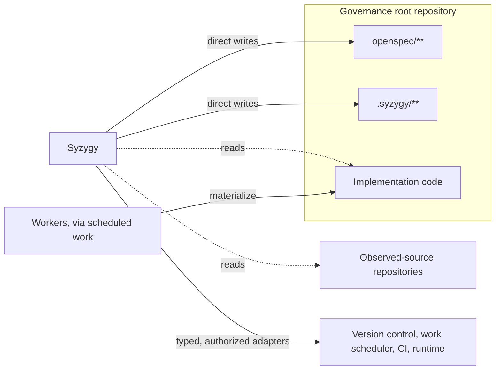
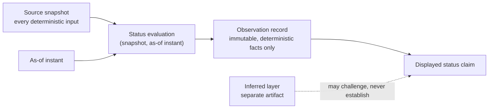
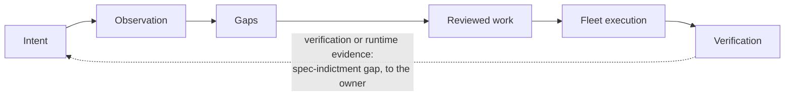
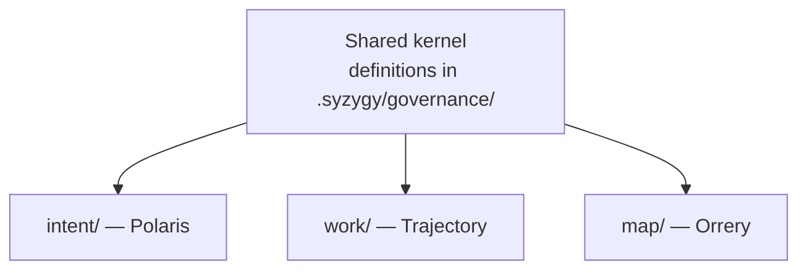

# Structural philosophy

Syzygy is one kernel, projected through three surfaces, governing an in-tree
plane it writes in only two places, and every status it shows is computed from
an identified snapshot at an identified instant.

- **What lives here:** constitutional structure only.
- **What does not:** load-bearing technical contracts — graph schemas,
  adjudication and certificate semantics, execution profiles, deeper
  `.syzygy/**` schemas — belong to RFCs.

## Governed projects and the two-namespace plane

A governed project has one governance root, where Syzygy writes only
`openspec/**` and `.syzygy/**`; everything else it reads or reaches through
adapters.

A **governed project** is one or more repositories, one owner, and **exactly
one designated governance root**: the repository holding the project's single
`openspec/**` and `.syzygy/**` plane. The project has been explicitly brought
under Syzygy observation.

- Any other repository in the project is a declared **observed-source
  repository**, read-only to Syzygy unless separately onboarded as a governed
  project.
- Onboarding is recorded, per-repository consent (security.md SEC-4).
  **Every observed repository consents, governance root or not.**

Syzygy governs an orthogonal, **in-tree** plane at the governance root.

- **Its direct project-content write authority is confined to exactly two
  namespaces, `openspec/**` and `.syzygy/**`** (vision.md VIS-5); no manifest,
  configuration, or convention may widen it.
- **Reading reaches declared sources anywhere in the project; direct writing
  is confined to two roots.** Syzygy may *read*
  declared implementation and evidence sources anywhere in the project, but
  may never directly create, modify, move, or delete project content outside
  its two roots.
- **Every other authority** — version-control metadata, the work scheduler,
  CI, runtime systems — it affects only through typed, explicitly authorized
  adapters (see typed authority); those stores are never Syzygy-owned
  namespaces.
- **Code changes materialize only through workers executing scheduled work.**



Every edge from Syzygy is gated: each observed repository, governance root
included, has consented (SEC-4), and adapters act only when explicitly
authorized.

**The two roots have different schema owners.**

- `openspec/**` follows the constitutional OpenSpec artifact contract. Syzygy
  writes it only in OpenSpec-compatible form and may not reorganize it for its
  own convenience. The OpenSpec CLI is a substitutable adapter; the artifact
  contract is not silently replaceable.
- `.syzygy/**` is Syzygy's **native, schema-versioned namespace**. Syzygy owns
  its organization and may change it through explicit, reviewable,
  identity-preserving migrations.

### The `.syzygy/` namespace

Directory names are literal and stable; the poetic names are UI codenames
only.

```
governance_root/
├── openspec/            # behavioral requirements (OpenSpec artifact contract)
└── .syzygy/
    ├── project.yaml     # project declaration: identity, consents, declared
    │                    #   observed-source repositories (format: RFC material)
    ├── governance/      # shared kernel plane — minimum reserved categories:
    │   ├── doctrine/    #   adopted doctrine (this cluster)
    │   ├── contracts/   #   accepted load-bearing contracts (RFCs)
    │   ├── policies/    #   quality, evidence, and security policies
    │   └── decisions/   #   recorded owner decisions
    ├── intent/          # intent surface artifacts        (UI codename: Polaris)
    ├── work/            # work/convergence surface state  (UI codename: Trajectory)
    ├── map/             # semantic/spatial representation of observed, intended,
    │                    #   proposed, and historical system state (UI codename: Orrery)
    ├── cache/           # derived, rebuildable projections (VIS-6)
    └── local/           # personal presentation state (VIS-6a; never truth-bearing)
```

- **The four `governance/` categories are constitutional minimums.**
  - Their schemas and deeper organization — including where identities,
    promoted annotations, dismissals, and declared topology sit within
    `governance/` — are RFC material.
  - `governance/` is the shared cross-surface location: surfaces stay
    projections over one shared semantic kernel and must never become
    independently authoritative.
- **Some required Genome material lives in the code tree**: explicitly
  designated executable specifications and declared handcrafted regions (both
  defined under Project Genome, below).
  - Syzygy governs these *by reference and annotation only*, never by edit:
    marking a region handcrafted, or a test authoritative, is a governance
    annotation in `.syzygy/governance/`, not a code change.
  - Handcrafted regions are an explicit exception to "code is a replaceable
    realization": they must survive regeneration.
- **On offboarding, the plane stays with the repository.**
  - What stays: `openspec/**` and the governance, intent, work, and map parts
    of `.syzygy/**`, including committed-out annotations and dismissals.
  - Syzygy exports the owner's remaining personal state (`.syzygy/local/`) and
    then deletes its projections (`.syzygy/cache/` and any external ones).
  - The plane is in-tree by explicit owner ruling; the orphan-branch
    alternative was considered and **rejected** (FD-034, resolving OQ-006).

## Typed authority

Authority is typed by question; a contradiction — across authorities or
within one — renders Unknown and goes to the owner, never settled silently.

There is no single universal source of truth. Authority is typed by question,
and each role names its current realization — all substitutable (see
"adapters" below; deeper `.syzygy/governance/` layout is RFC material):

| Question | Authority (location / initial substrate) |
|---|---|
| Why does the project exist? What principles govern it? | Doctrine in `.syzygy/governance/` |
| How do load-bearing technical contracts work? | Accepted contracts (RFCs) in `.syzygy/governance/` |
| What observable behavior is required? | The behavioral-requirements system (`openspec/`; initial substrate: OpenSpec) |
| Where do intended components and boundaries sit? | Declared topology in `.syzygy/governance/` |
| What quality and evidence standards apply? | Quality and evidence policy in `.syzygy/governance/` |
| What currently exists? | Code, tests, CI, runtime observations |
| What work is scheduled, and in what state? | The work-scheduling system (initial substrate: Beads) — reached only through its typed adapter |
| What does Syzygy display? | A rebuildable projection of all the above |

**External authorities stay external.**

- The work-scheduling system is authoritative for work lifecycle state, and
  the version-control system (initial substrate: git) for version history.
- Neither is authoritative for intent or observed behavior.
- Both are external authorities Syzygy affects only through typed, explicitly
  authorized adapters (VIS-5), never Syzygy-owned namespaces.

**Contradictions and gaps are different things.**

- A **contradiction** is a set of authoritative claims in the same declared
  scope that cannot all be satisfied, whether they come from different typed
  authorities or from one. It renders the affected conclusion Unknown and
  routes to adjudication by the owner. It is never resolved silently by
  precedence and never auto-scheduled into work; no surface may silently pick
  a winner.
- A **gap** is compatible desired state not yet realized in observed state:
  the intent-vs-observed, work-generating difference (v1.md, V1 scope).

**Substrate tools are adapters, not doctrine.**

- The Genome is defined by the *questions* it must answer, and any substrate
  that answers them can be swapped in without amending doctrine.
- The one exception is stated above: the `openspec/` *artifact contract* is
  constitutional even though the OpenSpec CLI is not.

## Project Genome

The **Project Genome** is the complete normative corpus: everything that must
survive deletion of the implementation.

- The behavioral-requirements system holds its behavioral part, not all of
  it — "regenerate from the specification" must never shrink to "regenerate
  from behavioral scenarios alone."

Verification material splits three ways, and the split matters for
regeneration, write authority, and offboarding:

- **The verification contract** — acceptance criteria, invariants,
  tests-as-spec obligations, and the required classes of proof: the normative
  statement of what must be verified. Always Genome.
- **Explicitly designated executable specifications** — concrete tests a
  project deliberately marks as authoritative and non-regeneratable. Genome
  only by that designation, and then their *content*, not just a path
  reference, must survive deletion of the implementation.
- **Generated or implementation-coupled tests** — realization artifacts that
  may be regenerated. Never Genome.

The Genome inventory has three tiers:

- **Universally required** — doctrine and behavioral requirements; topology
  and quality policy; the verification contract; and a declaration of
  handcrafted (non-regeneratable) regions, **which may be empty**. Every
  region it lists is Genome.
- **Required when present** — no project must create these, but once adopted
  they are Genome: accepted load-bearing RFCs; explicitly designated
  executable specifications; generation policy and provenance; normative data
  contracts and external service contracts.
- **Not Genome** — observed and generated artifacts (current schemas,
  generated or implementation-coupled tests, migration plans); environment and
  dependency locks (high-level technology standards are Genome-worthy,
  lockfiles are not); operational and incident knowledge. **Raw incident
  records are evidence (trust-and-evidence.md), never Genome**; a lesson
  becomes Genome only by being distilled into a normative artifact.

### Definitions (owned by doctrine, computed by the kernel)

These meanings change only by doctrine amendment.

- **Project** — one or more repositories with one owner and exactly one
  designated governance root (holding the project's single `openspec/**` +
  `.syzygy/**` plane). Other repositories are declared observed-source
  repositories, read-only to Syzygy unless separately onboarded. How
  `project.yaml` represents this is RFC material.
- **Capability** — a named unit of declared behavior that the project's own
  spec or shape documents say exists, at the granularity a human would use to
  describe what the project does.
- **Aligned** — a scoped relation between **one observed subject and one cited
  normative claim, at one identified evaluation**: the subject satisfies the
  claim, and the evidence trail is current at the evaluation's as-of instant.
- **Converged** — an **aggregate state over a declared target scope** at one
  identified evaluation, where all of these hold:
  - every mandatory normative claim in scope is aligned;
  - the realization is behaviorally equivalent under the declared
    verification oracle, and complies with the project's declared
    architecture, quality, performance, security, and evidence policies;
  - no unresolved contradiction touches the scope;
  - no actionable gap in the scope remains open.
- **Genome-complete** — a claim about the **normative corpus itself**: every
  required Genome element is present, current, and traceable at the
  evaluation. It says nothing about runtime realization (that is Aligned and
  Converged territory). It is deliberately *not* called "mature": maturity has
  many dimensions — shape, verification, operational battle-testing,
  freshness, and more — and may never be collapsed into one status. Those
  axes, and any composite maturity view, belong to the graph/status RFC. (The
  `/th-projects` substrate's own "Mature" shape rating is one such axis, not
  this concept.)

**Convergence claims are scoped to the declared oracle** and must show the
oracle's declared coverage beside them.

- Oracle **adequacy is assessed by a human, or by a deterministic measure
  declared in the project's quality policy (`.syzygy/governance/`)**.
- An inferred adequacy judgment has challenge authority only
  (trust-and-evidence.md): it may suspend a claim to Unknown, showing its
  inferred provenance, but never raise one toward converged.
- An oracle with unassessed adequacy yields Unknown.
- Behavioral equivalence has known limits — model nondeterminism and
  environment dependence — and convergence claims must not paper over them.

**Data contracts split three ways:**

- **Normative** — data meaning, invariants, required relationships,
  privacy/retention obligations, compatibility promises, migration safety.
  Genome material.
- **Observed** — current DDL, migration history, indexes, volumes. Never
  enshrined in specs.
- **Generated** — target schemas, migration plans, adapters. Governance
  artifacts Syzygy may author but never apply (VIS-5).

The regeneration target is a realization that satisfies the logical data
contract and can safely migrate or adapt observed state — never a
byte-identical schema.

## Snapshots and the loop

Every status is computed from an identified snapshot at an identified instant,
so the deterministic layer always gives the same answer for the same inputs,
and time alone can only make an answer worse.

**A snapshot identifies every deterministic input that can affect the observed
graph or a status claim.** That is the constitutional rule; whether it is one
tuple or a composite of source, evidence, and policy snapshots is RFC
material. At minimum it identifies, by version or hash:

- the repository and declared working-tree state;
- governance artifacts;
- the work-state export;
- consumed test and CI reports;
- the runtime observation dataset and window, when used;
- observer, adapter, policy, and layout versions;
- deterministic configuration that affects parsing or classification.

**A source not captured in the snapshot must not influence its deterministic
claims**; it renders unavailable or Unknown instead.

**Time is an explicit input, never an ambient one.** A **status evaluation**
is identified by the pair (source snapshot, **as-of instant**). Every
time-sensitive judgment — evidence currency, staleness, dismissal expiry — is
made at that as-of instant.

- A wall clock never silently changes a displayed status. Time passing
  changes a status only through a new identified evaluation.
- Time alone may only degrade a claim (toward stale or Unknown), never
  establish or improve one. **Improvement needs a new source snapshot
  containing a permitted authoritative input, such as new evidence or an
  adjudication result.**

An **observation record** is the immutable result of one identified evaluation
and holds deterministic facts only.

- **Determinism (VIS-7) is asserted per identified evaluation**, over the
  deterministic observed graph and base layout — **including logical
  freshness state (fresh, stale, broken, superseded), which changes status and
  therefore counts toward identity**.
- **Only display formatting** — localized timestamps and relative-age
  strings — is excluded from the identity test; widening that exclusion is a
  doctrine amendment.

The **inferred layer is a separate artifact.**

- It records the model, version, and inputs that produced it, and declares its
  own reproducibility standard.
- It is excluded from the VIS-7 identity test and has no positive status
  authority.
- Its limited power to suspend a claim is defined in trust-and-evidence.md.



**The loop:** intent → observation → gaps → reviewed work → fleet execution →
verification. It has one upward arrow: verification and runtime evidence may
open spec-indictment gaps that route to the owner. The loop is
**human-triggered**: someone specs a desired shape, then deliberately triggers
a propagate/sync pass. Work-to-code and code-to-deployment belong to the
orchestration toolchain, outside Syzygy's body.



**Observation determinism and idempotence of authoritative effects are
constitutional. Zero-token synchronization, cache reproducibility, and
byte-identical inference output are engineering goals** — craft and RFC
targets, spent first under VIS-1's rank 5, never doctrine.

The idempotence invariant, exactly: a pass over an unchanged source snapshot
with no gaps — at any as-of instant — must not change authoritative project
artifacts, must not create or reprioritize work, and must not establish or
improve any status claim. (A later evaluation over the same snapshot may only
degrade claims, per the time rule above.)

## One kernel, three surfaces

One shared kernel holds the semantics every surface uses, and the three
surfaces are only projections of it.

The kernel's shared semantics — the definitions above, materialized in
`.syzygy/governance/` — must never fork across surfaces, and no surface is
independently authoritative. The owner has ruled a **single repository
(monorepo)** the constitutional realization of that invariant; revisiting it
is a doctrine amendment.

- **`intent/`** — the intent and comprehension surface (UI codename Polaris).
- **`work/`** — the gaps, work, and convergence surface (UI codename
  Trajectory).
- **`map/`** — the semantic/spatial representation of observed, intended,
  proposed, and historical system state, including the spatial view
  (UI codename Orrery).

Each surface can be tested, navigated, feature-planned, and — later, if
useful — deployed on its own; all are projections over the one shared kernel.



The constitutional visualization requirement is a spatial comprehension
surface anchored to **capability identities, not file paths**.

- Refactoring must not scatter the map.
- The same snapshot must produce the same layout.
- Exact 2D/tabular equivalents are always available.
- The concrete V0 mandate (3D) is scope, recorded in v1.md.

## Vocabulary

Technical nouns are frozen; poetic names are working codenames.

These technical nouns are frozen and stable for citation: project,
capability, gap, contradiction, evidence, warrant, aligned, converged,
genome-complete, genome, snapshot, evaluation, observation record. "Mature" is
deliberately not frozen (see Genome-complete).

The poetic names — Syzygy, Polaris, Trajectory, Orrery — are **working
codenames only**; final product naming is a later, separate owner decision.
Technical directory names (`intent/`, `work/`, `map/`, `governance/`) and the
technical domain names used in APIs, schemas, and RFCs stay literal.
