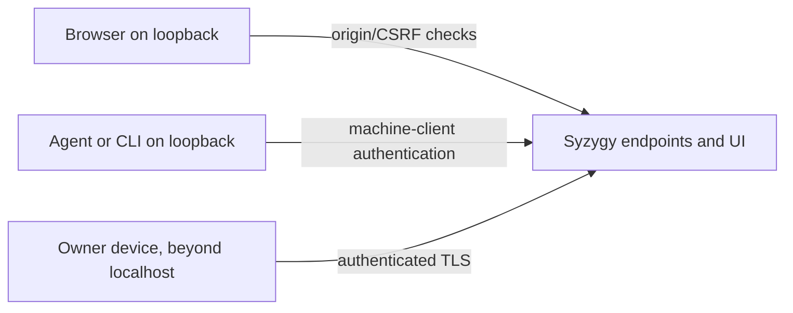

# Security and blast radius

Syzygy treats observed code as untrusted everywhere, admits clients only as
SEC-1 allows, sends data out only with scoped consent, keeps secrets out, and
makes only consented, revertable writes.

- **Why this needs doctrine:** Syzygy indexes a whole portfolio, listens on a
  network, may execute observed-project code, and writes into the
  repositories it governs.
- **What lives here:** constitutional constraints only. The execution-profile
  and authentication RFCs must satisfy them.

## Non-negotiable rules

**SEC-1 — Authenticated by default.** Only loopback may serve without
authentication, and even there client classes are told apart; loopback
location alone never proves a client's identity.

- **Client classes, told apart even on loopback:**
  - **Browser requests must pass origin/CSRF protections, including on
    loopback.** Browser-originated `localhost` calls and DNS rebinding are in
    scope as attackers.
  - **Non-browser agent and CLI clients are admitted only through an explicit
    machine-client authentication mechanism** (an authentication-RFC matter).
  - Loopback location alone never proves a client's identity.
  - A missing browser `Origin` header is neither trusted automatically nor
    treated as a browser-origin violation.
- **Beyond localhost:** access must be authenticated, TLS-protected, and
  limited to the owner's own devices. An unauthenticated network-exposed
  configuration is never the default.
- *Violation:* a fresh install serving portfolio data on a LAN address with no
  credential; a loopback endpoint answering an arbitrary web page's fetch; a
  machine client admitted on loopback location alone.

**SEC-2 — Portfolio data leaves owner-controlled infrastructure only through
explicit, scoped consent.** No governed-project content, or anything derived
from it, is sent to a store or service the owner does not control — model
providers included — without explicit, recorded, per-project consent.

- **What is covered:** source structure, specs, work history, and anything
  derived from them, including prompts.
- **Model providers are such services.**
- **What consent must say:**
  - Onboarding consent must name the providers permitted for the project and
    the content classes they may receive; Syzygy renders that consent on the
    project's surface.
  - A provider not named needs fresh consent.
- **Without consent**, the inferred layer renders Unknown instead of being
  computed.
- **Remote backing dependencies** are allowed under the same consent rule.
- *Violation:* an index synced to a third-party service as a side effect of a
  feature; project source sent to an unnamed model provider.

**SEC-3 — Observed code is untrusted, everywhere.** Observed-project code runs
only inside an explicit, opt-in execution profile.

- **It is untrusted whoever owns the project.**
- **The profile is:** default-deny, with isolated credentials, declared
  network access, resource limits, and gates on destructive operations.
- **The profile contract is a blocking RFC:** no observed-project code runs
  until it is accepted.
- *Violation:* an execution profile that inherits the host user's ambient
  credentials "for convenience."

**SEC-4 — Writes are consented, attributed, and revertable.** Syzygy writes
into a governed repository only with recorded consent, and every write can be
traced and undone.

- **Consent first:** writes need recorded per-repository consent
  (onboarding).
- **Every write** is attributed to Syzygy, atomic, and individually
  revertable.
- **No silent overwrite:** Syzygy never overwrites a governance artifact it
  did not author without surfacing the conflict.
- *Violation:* first-pass doctrine drafting silently replacing an existing
  `.syzygy/governance/` tree.

**SEC-5 — Secrets are never indexed.** Anything that matches the declared
secret-detection policy, or cannot be classified, is excluded; a matching
exclusion is rendered.

- **The policy** is declared in `.syzygy/governance/` and applied during
  observation.
- **Matching content** is excluded, and the exclusion is rendered.
- **Unclassifiable content** is excluded too: classification fails closed.
- **A secret reproduced** in any Syzygy surface, store, or endpoint breaks the
  trust floor (trust-and-evidence.md, floor bullet 4).
- *Violation:* a connection string appearing in a map tooltip or API response.
