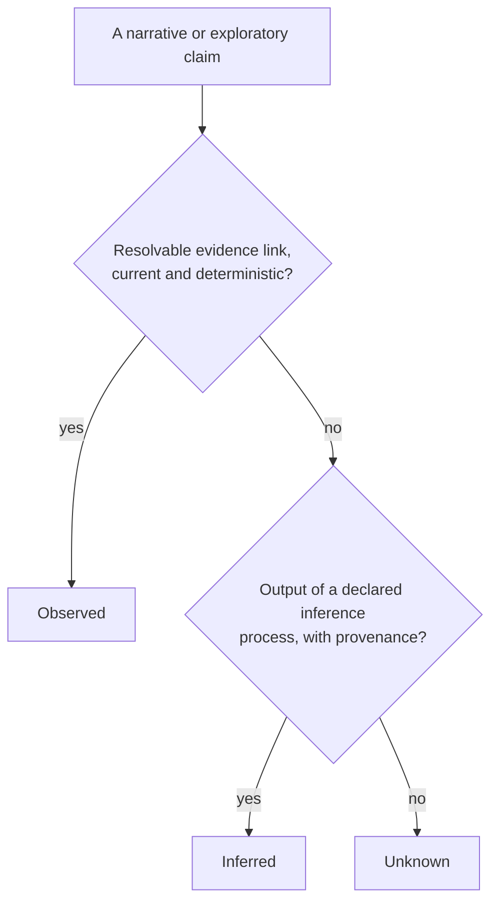

# Trust and evidence

A claim is only as good as its evidence: no evidence means Unknown, inference
may challenge a status but never establish one, and the observatory must
never present something false.

- **What this file does:** elaborates VIS-1, VIS-2, and VIS-7, and holds the
  **normative statement of the trust floor**.
- **What it leaves out:** review and testing standards, which live in the
  quality policy (`.syzygy/governance/`).

## Evidence, and the two other warrants

Status rests on evidence; a recorded human decision and a work warrant
authorize other acts, but neither is evidence.

**Evidence is a durable, identified, integrity-verifiable artifact carrying
its source, capture time, scope, and provenance.**

- **Examples:** a test run, a tool exit status, a file hash, a commit SHA, an
  observation record, a captured runtime trace or incident record.
- **Reproducibility is a declared property of an evidence class, not a
  prerequisite for being evidence.** A one-off runtime observation or an
  anomalous external response, durably captured and identified, is evidence.
- **An LLM assertion is Inferred, never Observed**, however confident.
- **Every claim class declares a currency bound:** how old its evidence may be
  and still count as current.
  - Currency is judged at a status evaluation's identified as-of instant
    (architecture.md); the wall clock never changes a status outside a new
    identified evaluation.
  - Until a class declares its bound, its evidence is not current and its
    claims render Unknown.
  - The bound values belong to craft policy and RFCs; the duty to declare
    one is doctrine.

**Two acts are authorized by warrants that are *not* evidence:**

- **A recorded human decision** — attributed, timestamped, and individually
  revertable.
  - It may suppress a gap, rendered as *dismissed by human decision* and
    never as resolved, aligned, or green.
  - It takes effect only once committed out to the governed plane with a
    reason and an expiry (vision.md VIS-6).
- **A work warrant** — creating or prioritizing work needs traceable
  authority, not empirical evidence.
  - Traceable authority means an approved requirement, a confirmed finding, a
    declared policy, or an explicit owner decision.
  - Status describes; a warrant authorizes. A claim that both declares status
    and spawns work must pass both gates.

## Status claims vs narrative claims

Anything that does a status claim's work needs evidence, whatever it looks
like; a gap may also be dismissed by recorded human decision; narrative
claims carry exactly one of three labels.

**Certificate and status claims need evidence.** A claim is one if it:

- turns a badge or indicator green;
- declares alignment, convergence, or genome-completeness;
- affects a certificate *(certificates are post-V1; this trigger is
  future-tagged until their RFC exists)*; or
- says a gap is **factually resolved or absent**.

No evidence means **Unknown**, not success. A claim that meets any trigger is
a status claim **whatever its prose form**: a narrative sentence doing a green
badge's work is judged as a badge.

**A gap leaves a surface in exactly two ways, and they are not
interchangeable.**

- *Factual resolution or absence* — the gap is closed, or never existed — is a
  status claim and needs evidence.
- *Policy dismissal or suppression* — a decision not to act on a real or
  asserted gap — is warranted only by a recorded human decision (above).
  - It claims nothing about the facts.
  - It always renders as **dismissed by decision**, with its reason and
    expiry visible.
  - It is never shown as green, resolved, or aligned (vision.md VIS-6).

**Narrative and exploratory claims** carry exactly one label:

- **Observed** — a deterministic claim with a resolvable evidence link.
- **Inferred** — the output of a declared inference process, carrying its
  inference provenance.
- **Unknown** — anything else, including a claim whose evidence is missing,
  inaccessible, or stale.

**Missing evidence never makes a claim Inferred.**

- Absence of evidence does not make a claim probabilistic; it makes it
  Unknown.
- That boundary is mechanical; how densely to link beyond it is a
  quality-policy matter (`.syzygy/governance/`).
- Inferences may be woven into explanatory narrative but must never be
  indistinguishable from deterministic fact.

## The deterministic/inferred seam

Deterministic facts and inferences live in separate layers, and inference can
challenge a status but never establish one.

- **Separate layers.** Deterministic facts and probabilistic inferences are
  computed and stored apart.
  - **An observation record contains deterministic facts only.**
  - The inferred layer is a separate artifact that records the model,
    version, and inputs that produced it, declares its own reproducibility
    standard, and is excluded from the VIS-7 identity test (architecture.md).
- **Inference has no authority to establish a status — only to challenge
  one.**
  - Inferred evidence never establishes, raises, or independently satisfies a
    positive status claim, and never establishes alignment, convergence, or
    genome-completeness.
  - It may raise a **challenge**. By default an open inferred challenge
    suspends the displayed claim to Unknown, showing its inferred provenance
    beside the deterministic evidence it questions, until a human or a
    declared deterministic policy resolves it.
  - Inference never silently overrides or replaces deterministic evidence:
    the suspended claim's deterministic basis stays visible, and resolving
    the challenge is what restores or revises the status.
  - **Admissibility:** a challenge names one exact claim, states a specific
    falsifiable concern, carries its inference provenance, and can be
    resolved on its own. Mere model uncertainty is not a challenge. Detailed
    criteria belong to an RFC.
- **Rendering may blend the layers**, provided provenance is available where
  the claim is consumed (hover, query, API field) and inferred structure stays
  visually distinct from observed structure.
  - A speculated future component must never look like an existing one.

## Staleness

A superseded observation record may still be shown, but always visibly stale
and never silently green.

- **An observation record** is the immutable result of one identified status
  evaluation (source snapshot + as-of instant, architecture.md).
- **After its evaluation is superseded**, it may still be shown, but:
  - its staleness is visible on the primary surface, not buried in
    drill-down;
  - it cannot contribute to a current convergence certificate
    *(future-tagged, post-V1)*;
  - it cannot silently stay green.
- **Staleness is judged at the current evaluation's as-of instant**, never by
  an ambient wall clock.
- **A broken observer** falls back to its last good observation record,
  clearly marked stale or broken; it never fails invisibly.

## The trust floor (normative statement)

The observatory forfeits its reason to exist the moment it presents false
information, so a Syzygy release that breaks any of four properties is
blocked.

The floor is **release-blocking for Syzygy's own releases** (Syzygy never
gates a governed project's releases — vision.md, "Not an enforcement
engine"):

- the deterministic layer of an observation record is identical across runs
  of one identified evaluation — source snapshot + as-of instant
  (architecture.md identity test);
- every rendered **internal project-entity link** — code, requirement, work
  item, capability, evidence, decision, and map entity — resolves to its
  identified target; external URLs are explicitly classified as external and
  may be unavailable without falsifying the internal project graph (this is
  the normative link rule; vision.md VIS-7 cites it);
- every visual encoding means exactly what its legend says;
- no credential or secret material appears in any surface, store, or endpoint
  (security.md SEC-5).

A change to Syzygy that breaks this floor, or presents inference as fact, may
be rejected however well it otherwise works.
