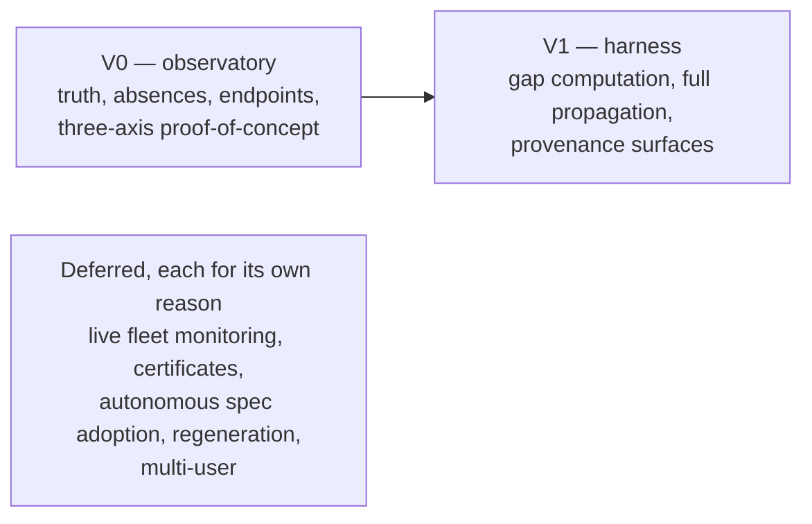

# Scope — V0, V1, and deferrals

V0 is an honest observatory with one working slice of the loop on each axis;
V1 turns it into the full harness; everything else waits, with a stated
reason.

## V0 — the trustworthy observatory, with proof the loop is real

V0 shows whatever Genome artifacts and evidence each governed project has, marks
everything else Unknown, and proves one working slice of the loop on each
axis.

- **What V0 observes:** **whatever Project Genome artifacts and evidence
  exist** — doctrine and declared topology (`.syzygy/governance/`), spec
  structure (`openspec/`), work-scheduling state, and code structure,
  including test and CI artifacts on disk.
  - Missing artifacts render Unknown (VIS-2).
  - What bounds the truth claim is honesty, not a whitelist of sources.
- **The V0/V1 gap boundary.** V0 surfaces *absence*; V1 computes *gaps*.
  - *Absence:* a declared capability with no mapped evidence, or code that
    maps to no declared capability — rendered as Unknown.
  - *Gaps:* intent-vs-observed differences as navigable, work-generating
    objects.
  - So at V0 the Trajectory surface shows work-dependency graphs and
    absences, not computed gaps.

V0 ships, in increments:

- **Portfolio truth** — every governed project's vision, work state, and
  structural health, honest about what is Unknown.
- **Spatial code visualization** — the owner has mandated **3D** as V0's
  realization of the constitutional spatial requirement (architecture.md).
  - It is one projection over the stable project graph.
  - Exact 2D/tabular views are kept for precision, accessibility, and
    debugging, and keyboard/non-3D navigation is always available.
  - Coarse granularity is acceptable (project → capability → component →
    source/test evidence).
  - **Capability identities come from the governed project's own declared
    artifacts.** Code that maps to no declared capability renders Unknown; it
    is never silently inferred into one.
  - On a project whose declared artifacts are missing or incomplete, V0's
    first action is to *draft* them for owner sign-off (see non-code writes,
    below). Until signed off, drafted capabilities render as unadopted and may
    not anchor the map.
  - **A mostly-Unknown map of an undeclared project is the correct output,
    not a defect.**
- **Work navigation** — pending and completed work as navigable dependency
  graphs.
- **Machine-queryable endpoints** (V0-mandatory) — agents consume the same
  observed truth the owner sees.
- **Propagation proof-of-concept** (V0-mandatory, by owner ruling) — one
  minimal working slice per axis:
  - *intent*: tune an intent artifact and see the change in rendered truth;
  - *work*: from one signed-off spec delta, dispatch one scheduled work item
    end to end for a worker to materialize;
  - *code*: navigate from a code region to the spec and work that govern it.
- **Non-code writes** — under VIS-5, Syzygy writes directly only within
  `openspec/**` and `.syzygy/**`, and reaches the work scheduler through its
  typed adapter. Syzygy never writes code.
  - That includes **drafting** a newly governed project's doctrine and shape
    documents into `.syzygy/governance/` as first-pass work.
  - Drafting is not adopting: drafted doctrine is stored and rendered as
    unadopted until the owner signs off (VIS-4).

Three further points apply to V0:

- **Increments.** No increment may be called V0-complete, a validation of the
  thesis, or more than an observatory unless it has both: endpoints in real
  actuator use, *and* the three-axis propagation proof-of-concept.
- **Trust floor.** trust-and-evidence.md holds the normative statement; it
  blocks Syzygy's own releases.
- **Proving ground.** The owner's other live projects — real, messy, already
  running, and mostly *undeclared*, which is why first-pass drafting is V0
  work. Observing the Syzygy repository itself is not the credibility test.

## V1 — the harness

V1 computes gaps, propagates intent at full breadth, and shows why each unit
of work exists. This is directional; RFCs and specs make it concrete.

- **Gap computation** between declared intent and observed state, surfaced as
  navigable objects with an upward path: evidence may indict the spec.
- **Human-triggered propagation at full breadth** — from a tuned vision or
  spec, dispatch scheduled work for workers to materialize. "Specifications
  for features, beads for bugs": a bug goes straight to work only when an
  existing spec already defines the correct behavior; otherwise it is a spec
  gap first.
- **Provenance surfaces** — structured summaries linking each unit of work to
  the spec and vision that motivated it.

## Deferred, with rationale

Five capabilities wait, each for a stated reason.

| Capability | Why deferred |
|---|---|
| Live agent-fleet monitoring | Meaningless without the observed truth it would annotate. The vision.md mandate keeps it named and sequenced, with entry criteria, on every roadmap |
| Convergence certificates | Semantics (invalidation, expiry) are deliberately left to an RFC; post-V1. References to certificates elsewhere are future-tagged |
| Autonomous spec adoption | Permitted in principle; opening the gate needs the adjudication RFC **and** an owner doctrine amendment (VIS-4) |
| Full regeneration flows | The north star, not scope; RFCs attack its feasibility risk (spec completeness) first |
| Multi-user collaboration | Owner-first; access serves one owner's devices, not teams |

## Platform and audience

Currently a local-first tool (open to RFC) for one owner first and the
open-source public second, with no stack chosen by doctrine.

- **Platform:** a local-first daemon with a browser app (the current shape;
  open to RFC).
  - Reachable beyond localhost only through authenticated, TLS-protected
    access limited to the owner's own devices (SEC-1).
  - Remote backing dependencies fall under SEC-2's consent rules.
- **Observed code:** executing it is opt-in, profiled, and blocked until the
  execution-profile RFC is accepted (SEC-3). SEC-3's one permitted case
  outside a profile is a Syzygy instruction, on the owner's recorded choice
  for that run, to the owner's own attended agent session.
- **Audience:** the owner's portfolio practice first, the open-source public
  second.
  - Substrate tools are adapters (architecture.md); the designated initial
    actuator substrate is the public ai-bootstrap toolchain (glossary:
    `governance/doctrine/README.md`).
- **Stack** (languages, databases, frameworks) is **not chosen here**; the
  only structural commitments are those in architecture.md.

## Evidence of success (stage-labeled, each with its artifact)

Each success test is an owner judgment backed by a named artifact; without
the artifact the test renders Unknown, never met.

- Success tests are human judgments (vision.md).
- Each declares an evidence artifact so its verdict can be reviewed later.

| Stage | Test | Passes when | Evidence artifact |
|---|---|---|---|
| V0 | Instinctive open | Syzygy replaces the README / sample-script / ad-hoc-investigation ritual as the owner's first stop. | Recorded first-stop sessions over time. |
| V0 | Comprehension | A reader new to the project, using the spatial view, names its top-level declared capabilities and at least one region of absent or Unknown evidence, and explains the project more accurately than before. | The recorded walkthrough, checked against the declared artifacts. |
| V0 | Agent consumption | Agent workflows on proving-ground projects use Syzygy endpoints as their source of observed truth **in real use**; a workflow written only to satisfy this test does not count. | The named workflows and the commits or sessions that used them. |
| V1 | Fleet account | At the end of an orchestration day the owner can give, from Syzygy alone, an accurate account of what the fleet changed and why, without reading raw diffs. | The account itself, linked to the day's work items. |
| V1 | Cost of discovery | Broken assumptions that used to surface at deployment now surface at spec or observation time. | Named instances, recorded as they occur. |
| V1 | Early surfacing | Alignment drift and underspecification surface in Syzygy before deployment exposes them. | The surfaced findings, timestamped relative to deployment. |
