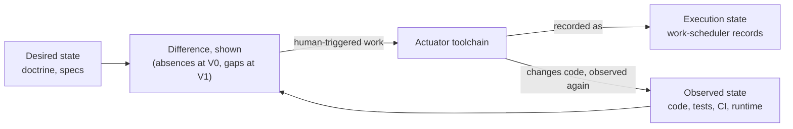

# Vision

Syzygy shows the owner the truth about their projects — what is intended,
what is real, what work is under way — and, when a human triggers it,
harnesses existing tools to close the difference. Showing the truth comes
before everything else.

## What changes for the owner

In the owner's words: "I can work with my projects on any level of the
vision-spec-code hierarchy: open one place, understand what a project's vision
and goals are, tune or guide them if necessary, and know that the rest of the
project will (eventually) mold itself to fit around that goal. I end an
orchestration day knowing what was actually built and why — not with oversized
diffs, scattered completions, and no coherent account. I stop discovering
broken assumptions at deployment, and I stop commissioning ad-hoc deep-dive
audits every time a project's shape changes."

## Thesis

Syzygy (glossary: `governance/doctrine/README.md`) is a specification-driven
control plane for a portfolio of software projects, making each project's
vision → spec → code hierarchy legible, truthful, and navigable, for the
owner and for the agents that do the work.

- **Three kinds of state stay apart.**
  - **Desired state** — human-guided doctrine and specifications.
  - **Observed state** — code, tests, CI, and runtime evidence.
  - **Execution state** — work-scheduler records.
- **Work is never proof.** Scheduled or completed work never shows that the
  implementation satisfies intent.
- **Syzygy closes the gap through others.** It computes the difference
  between desired and observed state, shows it, and harnesses the existing
  actuator toolchain to close it.
- **Stages.** At V0 it is an observatory with a proof-of-concept harness; at
  V1 the harness is complete.

**Showing the truth is the soul of the product.** In the diagram, execution
state feeds nothing back into the difference: work records are never proof.

## The human problem, and whose it is

The primary user is an owner running a portfolio of projects built largely by
agent fleets, and who suffers the failures below.

- **The failures Syzygy exists to end:**
  - "I don't know what my agents are doing": a day of orchestration yields
    oversized diffs and scattered completions with no coherent account.
  - Underspecification is discovered at the most expensive moment, after
    deployment.
  - A change in a project's shape can propagate only through a manual
    deep-dive audit.
  - Projects are learned from READMEs and ad-hoc investigation, none of it
    comprehensive.
- **Owner-first, but open-source.** Syzygy assumes the public actuator
  toolchain (glossary: `governance/doctrine/README.md`), never one private
  machine.
- **Two first-class consumers from day one:** the owner, spatially and
  visually; and agents, through machine-queryable endpoints.

## What Syzygy is

A witness, a harness, and a governance plane that lives alongside each
governed project and reaches its code only through scheduled work.

- A **witness** (V0): an observatory over vision, specs, work, and code,
  trustworthy enough to believe when it says "Unknown."
- A **harness** (proof-of-concept at V0, full at V1; see v1.md): where the
  owner steers vision and triggers propagation — "specifications blooming into
  functional changes" (the owner's phrase) — through the existing toolchain.
- An **orthogonal plane**: governance artifacts that live alongside each
  governed project and reach its code only through scheduled work.

## What Syzygy is not

Syzygy is not merely an issue tracker with a code browser, not a documentation
portal, not a replacement for its substrate, not an outward enforcer, and not
autonomous.

- **Not an issue tracker with a code browser.** From V0, its observed truth
  is machine-consumable and actually consumed by the actuator toolchain, and
  V0 carries a working proof-of-concept on all three axes — intent, work, and
  code — including one end-to-end propagation slice (v1.md).
- **Not a documentation portal.** Rendering and drafting governance artifacts
  is a means; what sets Syzygy apart is that intent changes produce dispatched
  work. A Syzygy that never dispatches work has failed, however good its
  documents look.
- **Not a replacement for its substrate.** The spec, work-scheduling, and
  orchestration tools remain the mechanisms; Syzygy integrates them
  (architecture.md, "adapters").
- **Not an enforcement engine — outward.** It shows untruth in governed
  projects but does not make untruth impossible; gating other projects is
  secondary and cuttable.
  - Inward it does enforce: the integrity of its own claims, authority
    boundaries, and write contract (VIS-4–VIS-7) is non-negotiable.
- **Not autonomous.** The loop is human-triggered; autonomy beyond VIS-4's
  stated bounds is licensed only through the mechanism VIS-4 names, never by
  reinterpretation.

## Non-negotiable rules

Seven rules bind every downstream decision. Rules are numbered `VIS-n` here
and `SEC-n` in security.md; the prefixes are deliberately distinct from the
release stages V0 and V1 (v1.md).

**VIS-1 — Comprehensible truth first; never comprehensible fiction.** When
goals compete, truth wins, and comprehension is bought by simplifying the
presentation, never the content.

- **Priorities, highest first:**
  1. truth and observation determinism;
  2. comprehension of how the truth is presented;
  3. momentum (delivery speed);
  4. breadth of scope and fidelity of presentation;
  5. reproducibility of derived conveniences (caches, incremental refresh,
     zero-token synchronization, byte-identical inference output).
- **Lower ranks are spent before higher ones; rank 1 is never spent.**
- **A view may aggregate, defer, or progressively disclose Unknowns**, but may
  never show a confident state in place of an Unknown one.
  - *Honest simplification:* forty Unknown modules collapsed into one region
    labeled "Unknown ×40."
  - *Violation:* that region rendered green because its neighbours are green.

**VIS-2 — No evidence means Unknown, not success.** Nothing turns green, and
no project is declared aligned, converged, or genome-complete (defined in
architecture.md), without current evidence.

- **Evidence** is a durable, identified, integrity-verifiable artifact
  (trust-and-evidence.md).
  - Reproducibility is a declared property of an evidence class, not a
    prerequisite.
- **Currency is judged at a status evaluation's identified as-of instant**
  (architecture.md), so the wall clock never silently changes a displayed
  status.
  - A claim class with no declared currency bound has no current evidence,
    and its claims render Unknown.
- *Violation:* "spec-aligned ✓" computed from a stale index; a stale view left
  green; a status that flips without a new identified evaluation.

**VIS-3 — Human interpretability is a core tenet.** Every normative
artifact — spec, doctrine, contract — must stay digestible by a human who does
not know the project.

- **The test is a fresh-reader review**, run at adoption and on every material
  amendment.
  - A reader (human or agent) with no access to the authoring context must
    restate the artifact's intent and constraints correctly.
  - A failure is recorded on the artifact's surface.
- **What a failure freezes:**
  - In the Syzygy repository, a failing artifact freezes **autonomous
    adoption, not agent authorship**: agents may draft repairs, but every
    amendment to that artifact requires owner adoption until it passes a
    fresh-reader review.
  - In governed projects the failure is shown as status; whether to freeze is
    that project's own policy (Syzygy does not enforce outward).
- *Violation:* specs eroding, one LLM edit at a time, into something only LLMs
  can parse.

**VIS-4 — Humans steer the vision; agents shape within it.** Shape-defining
changes always need the owner's sign-off; Syzygy and its agents may draft
them, never adopt them.

- **Shape-defining changes** — doctrine (heart-and-soul), craft-and-care
  standards, topology, and RFC acceptance — need owner sign-off every time.
- **Behavioral specs (`openspec/`) sit below that line.** LLM adoption of spec
  changes is permitted in principle, but opening that gate is a **doctrine
  amendment event** needing both:
  - an accepted adjudication RFC, defining what makes adversarial judgment
    independent, how the ambiguity determination is recorded, and how each
    adopted change stays individually revertable; *and*
  - the owner's explicit doctrine amendment recording that the gate opens.
- **RFC acceptance alone never opens it.**
- **Always human-gated, gate open or not:** spec changes touching security
  posture, privacy or retention obligations, or normative data contracts.
- **Classification is never the author's call.** Whether a change is
  spec-level or shape-level is contested by default and is never decided by
  the agent making the change; it is settled without a human only while an
  opened gate is in force.
- *Violation:* an agent sprouting specs inside an ambiguous vision; an agent
  certifying its own governing vision as unambiguous; an agent editing a spec
  to match code it just wrote; treating RFC acceptance alone as opening the
  gate.

**VIS-5 — Syzygy never writes code; direct writes are confined to two
namespaces.** Syzygy writes project content directly only in its two roots,
affects everything else only through typed, explicitly authorized adapters,
and never materializes implementation code.

- **Direct project-content writes** touch only:
  - `openspec/**`, in OpenSpec-compatible form (architecture.md, schema
    ownership); and
  - `.syzygy/**`, its native, schema-versioned namespace.
  - No manifest, configuration, or convention may widen that set.
- **Reading reaches declared sources anywhere in the project; direct writing
  is confined to two roots.** Syzygy may *read*
  declared implementation and evidence sources anywhere, but may never
  directly create, modify, move, or delete project content outside those two
  roots.
- **Every other authority Syzygy affects only through typed, explicitly
  authorized adapters**, under that authority's own contract: version-control metadata
  such as commits and tags, the work scheduler, CI, runtime systems. Those
  stores are never Syzygy-owned namespaces.
- **Proposals, never materialization.** Syzygy never writes the form or
  function of implementation code.
  - It may *generate* code-shaped proposals (target schemas, migration plans,
    adapters) as governance artifacts, and commit the **proposal artifact
    itself** into `.syzygy/**` — VIS-6's commit-out, through the
    version-control adapter.
  - It may never apply, commit, or merge a proposal's *generated contents*
    into the implementation tree or any implementation branch:
    materialization is only ever a worker acting on scheduled work.
- **This rule is about attribution and separation, not human control of
  code.** The human gates on code change are VIS-4's sign-offs and the worker
  toolchain's own review gates, which live outside Syzygy and are not
  guaranteed here.
- *Violation:* Syzygy committing a source-file edit to a governed repository;
  a direct write outside `openspec/**` and `.syzygy/**`; a manifest claiming
  to widen the write set; an adapter effect without explicit authorization.

**VIS-6 — Syzygy is derived, with two closed exceptions.** Every fact Syzygy
holds must be rebuildable from the artifact that owns it.

- **Syzygy's databases and views are projections.** Content it authors is
  committed out to the governed plane, which then becomes the authoritative
  source.
- **The only exceptions:**
  - **(a) The owner's personal presentation state** — layouts, filters,
    bookmarks, unpromoted notes.
    - It may never affect truth, work, status, or certificates.
    - Promoting a note into governance (as an annotation or a dismissal)
      commits it to the governed plane, attributed and with a reason.
    - A dismissal carries an expiry; once its reason is no longer current at
      an evaluation's as-of instant, the gap renders again (expiry acts only
      through a new identified evaluation, architecture.md).
  - **(b) Observation records** — historical evidence: immutable,
    evaluation-identified, marked stale, and exempt from rebuildability.
- *Violation:* any other fact living only inside Syzygy; a view preference
  influencing a status claim; a dismissal taking effect without living in the
  governed plane.

**VIS-7 — The observatory itself must be trustworthy.** Syzygy's own releases
are blocked by the trust floor, stated normatively in trust-and-evidence.md.

- **The floor, in short:**
  - the deterministic layer of an observation record is identical across
    runs of one identified evaluation (source snapshot + as-of instant,
    architecture.md);
  - every rendered internal project-entity link resolves to its identified
    target (the link rule exactly as stated in trust-and-evidence.md, floor
    bullet 2);
  - every encoding means what its legend says;
  - no secret material appears in any surface or store.
- **Scope:** the floor blocks Syzygy's own releases; Syzygy never gates a
  governed project's releases.
- *Violation:* a dangling internal link; an unfaithful heatmap; two runs of
  one identified evaluation disagreeing in the deterministic layer.

## Performance

No performance target is constitutional, and performance is never bought
with truth, determinism, or completeness.

- **Responsiveness belongs to RFCs and specs.**
- **The only currency performance may spend** is VIS-1's rank 4 — breadth of
  scope and fidelity of presentation — and never below the comprehension
  constraint.
- **Performance may *narrow an explicitly declared scope***; it may never
  present incomplete coverage as complete within that scope.

## The north star (honestly labeled)

Full regeneration of a codebase from its normative corpus is the **north star,
not present doctrine**: it sets direction, and no artifact may claim it as a
current capability.

- **The ideal:** a project's complete normative corpus (its **Project
  Genome**, architecture.md) could regenerate the whole codebase, with code a
  replaceable realization — apart from the declared handcrafted regions
  (architecture.md).
- **How it binds:** decisions should nudge projects toward it. A decision
  that materially forecloses it must record the foreclosure; the unrecorded
  foreclosure is the violation.
- **The reverse flow is legitimate today:** deriving *candidate* vision and
  shape drafts, work, and map surfaces from an existing codebase. Inferred
  intent becomes desired state only after owner adoption (VIS-4).
- **[Unknown] whether full regeneration is achievable.** The biggest named
  risk is spec completeness, especially adapting existing durable state
  without freezing schemas into specs.

## Eventual mandate: live fleet observability

Syzygy is not complete until the owner can watch agent fleets work live, and
every roadmap must carry that as a named, sequenced item.

- **Why it waits:** it waits only because live monitoring means nothing without the observed truth
  it would annotate.
- **How it binds:** each roadmap carries it with stated entry criteria;
  dropping it, or leaving it unsequenced, violates doctrine.
- **The usual evidence rules apply:** streamed process output is Observed only
  once captured as a durable, identified artifact, and live views never
  contribute to status claims.
- **What sets it apart from a terminal cockpit:** every stream is anchored to
  the spec and work item that motivated it.

## Success — and what failure would look like

Success is the owner reaching for Syzygy first, and ending orchestration days
with an evidence-linked account of what changed and why.

- **Success means:**
  - the observatory replaces the README-and-ad-hoc-investigation ritual as
    the owner's instinctive first stop; and
  - orchestration days end with a coherent, evidence-linked account of what
    changed and why.
- **No single quantitative metric is constitutional**, by explicit owner ruling:
  usefulness differs between people and, for one person, between projects.
  - The stage-labeled tests, each with a declared evidence artifact, live in
    v1.md.
  - Success tests are human judgments, recorded as such and never rendered
    Observed; the owner re-judges them at each stage gate.
- **The thesis is falsifiable.** If, after sustained real use across the
  proving ground, the owner still learns projects through the old ritual and
  still cannot account for fleet days from Syzygy alone, the thesis — not the
  scope — is judged wrong and reformulated.
