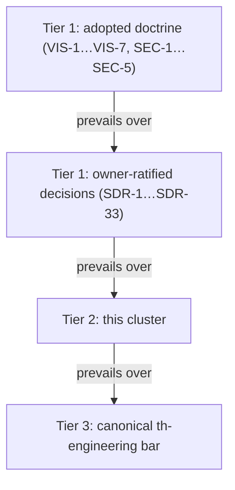

> **Approved** — owner decision D2 (2026-08-01), amendment B21 applied where noted. **This directory (`.syzygy/governance/policies/craft-and-care/`) is the canonical home of these policies.** The bootstrap-phase copy is preserved separately as historical review evidence. Binding force on implementation work begins with the owner's digest-bound acceptance of the foundational design contracts (the act defined in the active acceptance record; the policies cite RFC clauses that bind nothing until then).

# Craft and Care — Syzygy engineering policy cluster

This cluster sets the quality and evidence standards that constrain any
future Syzygy implementation. It adopts the canonical `th-engineering` bar by
reference and records only Syzygy's overrides and additions.

- **Its place in doctrine:** it is the quality-and-evidence policy layer
  named in doctrine's typed-authority table ("What quality and evidence
  standards apply?" → `.syzygy/governance/` policies).
- **Stack-neutral by construction:** no language, framework, database, or
  tool command appears here, because no stack has been selected (v1.md,
  "Stack … is not chosen here").
- **Reach:** the policies constrain *any* future implementation.

## Adoption by reference

The canonical `th-engineering` bar is Syzygy's baseline engineering standard;
this cluster pins it, vendors it, and ranks below doctrine and owner rulings.

- **What is adopted:** the `th-engineering` skill package, specifically:
  - its `engineering-bar` subskill (default biases 1–9 and its Definition of
    Done);
  - its `test-rigor` bar (rules 1–10);
  - its `dependency-hygiene` bar (rules 1–7).

**Vendored, not read from a founder-machine path.** A byte-identical local
copy of the bar is tracked in this repository, verified against a recorded
upstream lock.

- **Source:** owner override, 2026-08-06.
- **Where:** `.claude/skills/th-engineering/` and
  `.codex/skills/th-engineering/`.
- **Scope:** the root `SKILL.md` and these three subskills only — nothing
  else from the upstream package.
- **Provenance:** `../GOVERNANCE-SUBSTRATE-LOCK.yaml` records the upstream
  provenance the vendored copy is pinned against: public repository, exact
  commit, exact paths, and recomputable digests.
- **Verification:** read the lock to verify the vendored copy, not a machine
  path. [Observed — vendored files' sha256 matches the lock's
  `installed.relevant_paths`; the bar itself states that project
  craft-and-care pillars adopt it by reference and override individual
  biases.]

**The cluster does not restate the canonical bar.** Every file below records
only Syzygy-specific **overrides and additions**; where a file is silent, the
canonical bar applies unmodified.

**Precedence, on any conflict:**

1. **Syzygy adopted doctrine** (`.syzygy/governance/doctrine/`, rules
   VIS-1…VIS-7 and SEC-1…SEC-5) and owner-ratified decisions
   (`.syzygy/governance/decisions/SURFACE-DECISION-RECORD.md`, SDR-1…SDR-33);
2. **this cluster**;
3. **the canonical `th-engineering` bar**.

- **Within tier 1, doctrine prevails over the SDRs** on any conflict — the
  SDR itself declares that it modifies no doctrine text.
- **A lower layer can strengthen a higher one; it can never weaken it.**

**The adopted baseline is pinned.** The `th-engineering` bar was re-pinned
2026-08-06 to commit `f4cf1c7`, and a re-check found no override conflicts.

- **What the pin covers:** engineering-bar biases 1–9 + Definition of Done,
  including "Test delta accounted"; test-rigor rules 1–10;
  dependency-hygiene rules 1–7.
- **The drift it resolved:** the previous 2026-07-30 pin, commit `61bd8fa`,
  had fallen two commits behind what was on the founder machine — tracked as
  `PENDING-OWNER-DECISIONS.md` P-26, now executed.
- **The re-check:** CC-BAR-1 and CC-TEST-* were re-checked against
  test-rigor's two new bars (9: suite tiering and targetability; 10:
  governed test growth) and the new Definition of Done item. No override
  conflicts were found — see CC-BAR-1's register and
  `testing-and-verification.md`.
- **Future updates:** if the vendored bar is ever updated again, this same
  re-check-before-absorbing discipline applies.

## Citation convention

Policies carry stable per-file identifiers so reviews and RFCs can cite them,
and every clause binds equally whatever its epistemic label.

- **Numbering:** per file (`CC-BAR-1`, `CC-TEST-3`, …).
- **Stability:** identifiers are stable after approval: amend text in place;
  retire rather than renumber (mirrors doctrine's identifier rule).
- **Labels:** substantive claims inside policies are labeled [Observed]
  (with source), [Inferred], or [Unknown].
  - The labels describe a clause's **derivation, never its authority**.
  - On owner approval, every clause in this cluster binds equally,
    [Inferred]-labeled or not — no implementing agent may treat an
    [Inferred] obligation as advisory or as holding "challenge authority
    only."

## Reading order

Read in this order.

1. [engineering-bar.md](engineering-bar.md) — Syzygy definition of done;
   merge and release constraints; the non-downgradable risk floors.
2. [testing-and-verification.md](testing-and-verification.md) — reproducing
   tests, gate artifacts, determinism verification, oracle discipline.
3. [review-and-documentation.md](review-and-documentation.md) — mandatory
   independent review classes, the same-logical-change rule, single-home
   authority, fresh-reader review.
4. [interfaces-and-dependencies.md](interfaces-and-dependencies.md) — stable
   identities, schema-versioned migration discipline, typed adapters,
   dependency admission and promotion.
5. [observability-and-operations.md](observability-and-operations.md) —
   deterministic observation, the inference seam, labelled degradation,
   idempotent operations.
6. [security-and-secrets.md](security-and-secrets.md) — SEC-1…SEC-5 as
   build-time engineering obligations.
7. [performance-and-visual-discipline.md](performance-and-visual-discipline.md)
   — what performance may and may not be bought with; truthful visual
   encodings; 3D/non-3D equivalence.
8. [agent-provenance-and-execution-evidence.md](agent-provenance-and-execution-evidence.md)
   — structured run summaries, retention bounds, report facts vs gate facts,
   cost evidence.

## Scope boundary

This cluster states obligations; doctrine sits upstream of it and concrete
mechanisms belong to RFCs.

- **Upstream:** doctrine (WHY, constitutional rules) is untouched here.
- **Downstream:** concrete schemas, envelope formats, currency-bound values,
  and authentication mechanisms are RFC material (SDR §5).
- **Here:** the obligations those RFCs and all implementation work must
  satisfy.

## Adopted home

On owner approval this cluster installs at **`.syzygy/governance/policies/`**,
and this draft copy is banner-marked historical.

- **Why that home:** it is a doctrine-reserved governance category.
- **Why the draft is marked:** a surviving unmarked copy would be exactly the
  duplicate authority CC-REV-3 forbids.
- **Deliberate divergence:** the canonical bar's own text names
  `about/craft-and-care/` as the pillar home; this repository's
  owner-directed `.syzygy` canon deliberately diverges (no `about/**` tree
  exists or will be scaffolded here).
