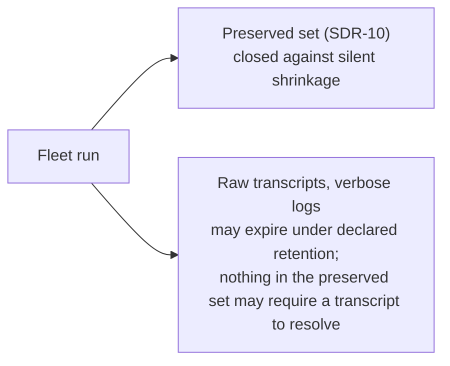
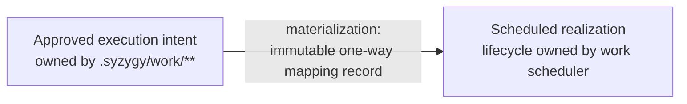

> **Approved** — owner decision D2 (2026-08-01), amendment B21 applied where noted. **This directory (`.syzygy/governance/policies/craft-and-care/`) is the canonical home of these policies.** The bootstrap-phase copy is preserved separately as historical review evidence. Binding force on implementation work begins with the owner's digest-bound acceptance of the foundational design contracts (the act defined in the active acceptance record; the policies cite RFC clauses that bind nothing until then).

# Agent provenance and execution evidence

Agent execution is *accountable by construction*: every run leaves captured
evidence, only raw transcripts and verbose logs may expire under a declared
retention policy, and execution reports are rendered without manufacturing
green.

- **Why:** Syzygy's founding complaint is the unaccountable fleet day
  (vision.md).
- **What these policies cover:** what every run must leave behind, what may
  expire, and how execution reports are rendered.
- **What they leave to RFC 0004:** envelope schemas and the adapter version
  registry. These are the obligations that RFC and all fleet tooling must
  satisfy.

## CC-PROV-1 — Execution records are evidence artifacts

An execution record is an **Evidence artifact** under `.syzygy/work/**` and
meets the full evidence bar; no new doctrine-level evidence class exists
(SDR-8).

- **The bar it meets** (trust-and-evidence.md):
  - durable, identified, integrity-verifiable;
  - carrying source, capture time, scope, and provenance.
- **What is not evidence:** a record that exists only in a coordinator's
  context, a chat transcript, or a terminal scrollback. It was never
  captured.
- **Capture identity:** captured records carry their **capture time and
  capturing observer identity** distinct from the emitter's claimed
  timestamp [Inferred — required by the evidence definition; an
  emitter-only timestamp is a claim about execution, not a captured
  artifact].
- *Violation:* the worker's completion report is read by the coordinator,
  acted on, and discarded — the fleet day ends with decisions traceable to
  nothing.

## CC-PROV-2 — Every run leaves a structured summary; the preserved set is closed

Every fleet run (coordinator, worker, nested span) produces a structured run
summary [Observed — FD-020 E6-b: structured provenance summaries,
transcripts pruned], and compaction and retention preserve a closed set of
provenance.

- **Compaction and retention must preserve**, per SDR-10:
  - structured run summaries;
  - work warrants (the traceable authority under which work was created);
  - decisions;
  - materialization mappings;
  - known cost/token totals;
  - evidence identities and hashes;
  - reconciliation outcomes.
- **The set is closed against silent shrinkage.** Dropping a member is an
  owner decision, not a storage optimization.
- **Anchoring:** run summaries anchor to the work item and the spec that
  motivated the run via resolvable identifiers (vision.md,
  fleet-observability escape property).
  - Execution that cannot be anchored is recorded and rendered as
    **unattributed**, never force-linked.
- *Violation:* a compaction job that keeps summaries but drops materialization
  mappings older than 30 days, severing "what changed" from "who was
  authorized to change it."

## CC-PROV-3 — Transcript retention is bounded; provenance retention is not

Raw transcripts and verbose logs may expire under a declared retention
policy (SDR-10); nothing in the preserved set may require a transcript to
resolve.

- **Why they may expire:** they are bulk, secret-prone, and non-load-bearing
  once the CC-PROV-2 set is extracted.
- **Prompts:** prompt **hashes** are retained, prompt bodies are not
  (CC-SEC-6).
- **The dependency is one-way:** nothing in the preserved set may require a
  transcript to resolve.
  - Expiry of a transcript must never render a preserved claim's evidence
    link dangling (trust floor: rendered internal links resolve).
- *Violation:* a run summary whose "decisions" field is a byte-offset pointer
  into the transcript file that a retention job deletes a month later.

## CC-PROV-4 — Report facts are not the facts they report

A report of success is rendered as a report fact, never as the fact it
reports, and never satisfies a status claim.

- **Per SDR-9, rendered exactly:**
  - "worker reported tests passed" — Observed **as a report fact**;
  - "tests passed" — Observed **only** when backed by a retained,
    resolvable gate artifact (CC-TEST-2); otherwise Inferred or Unknown per
    provenance.
- **Surfaces render the tier explicitly.** Report-fact vs gate-backed vs
  declared-only is a closed rendering-tier registry (RFC 0002 material —
  SDR §5).
- **A report fact never:**
  - satisfies a status claim;
  - turns anything green;
  - is upgraded by repetition or by aggregation across many agreeing
    reports.
- **Scope:** the same discipline covers self-reported success of any kind:
  completion claims, "no regressions," "docs updated."
- *Violation:* a Trajectory view that counts `quality-gate: pass` report
  strings and renders "12/12 verified" with zero gate artifacts behind it —
  the single most likely place this product manufactures green [Observed — the
  non-authoritative Trajectory brief §6 names exactly this risk].

## CC-PROV-5 — Missing cost renders Unknown, never zero

Missing token or cost information renders **Unknown, never zero** (SDR-6).

- **Cost aggregates over partially-instrumented runs** disclose how many
  members lack data ("≥ $4.20 across 7 of 12 runs; 5 Unknown") rather than
  summing absences as zeros.
- **Provider-specific cost figures** render with their provider or not at
  all.
- **Distinct effort measures stay independent** (estimates, elapsed time,
  tokens, attempts, review rounds) — never collapsed into one "effort"
  score, mirroring doctrine's refusal to collapse maturity into one status.
- *Violation:* a portfolio "spend this week" tile that sums only the runs that
  reported cost and presents the total as complete.

## CC-PROV-6 — Materialization is an immutable one-way mapping

Materialization creates an **immutable, one-way mapping record** linking the
approved item to its scheduled realization (SDR-7); it is never edited, and
merge is never treated as reconciliation.

- **Ownership:** `.syzygy/work/**` owns approved execution intent before
  materialization; the work scheduler owns lifecycle state after.
- **Immutability:** the mapping is never edited to re-point history; a
  re-materialization is a new record.
- **Reconciliation:**
  - V0: merged-but-unreconciled work renders "reconciliation evidence
    absent / Unknown".
  - V1: computing the reconciliation gap (SDR-12).
  - No surface may shortcut this by treating merge as reconciliation.
- *Violation:* re-pointing an existing materialization record at a replacement
  work item after the original was abandoned, erasing the abandonment from
  history.

## CC-PROV-7 — Inherited mutations are accounted in the parent run summary

Small mutations a worker performs under an inherited warrant appear in the
**parent run summary** with rationale and touched surfaces — not one
scheduler item each (SDR-11).

- **What counts as inherited:** incidental fixes in scope of the parent's
  authority.
- **The account must exist.** The granularity is relaxed; the
  accountability is not.
- **Scope limit:** a mutation that exceeds the inherited warrant's scope is
  not "inherited" — it requires its own warrant.
- *Violation:* a worker "quickly fixing" an unrelated adapter while holding a
  rendering-work warrant, recorded nowhere — an unaccounted change in exactly
  the style the fleet-account test exists to end.
