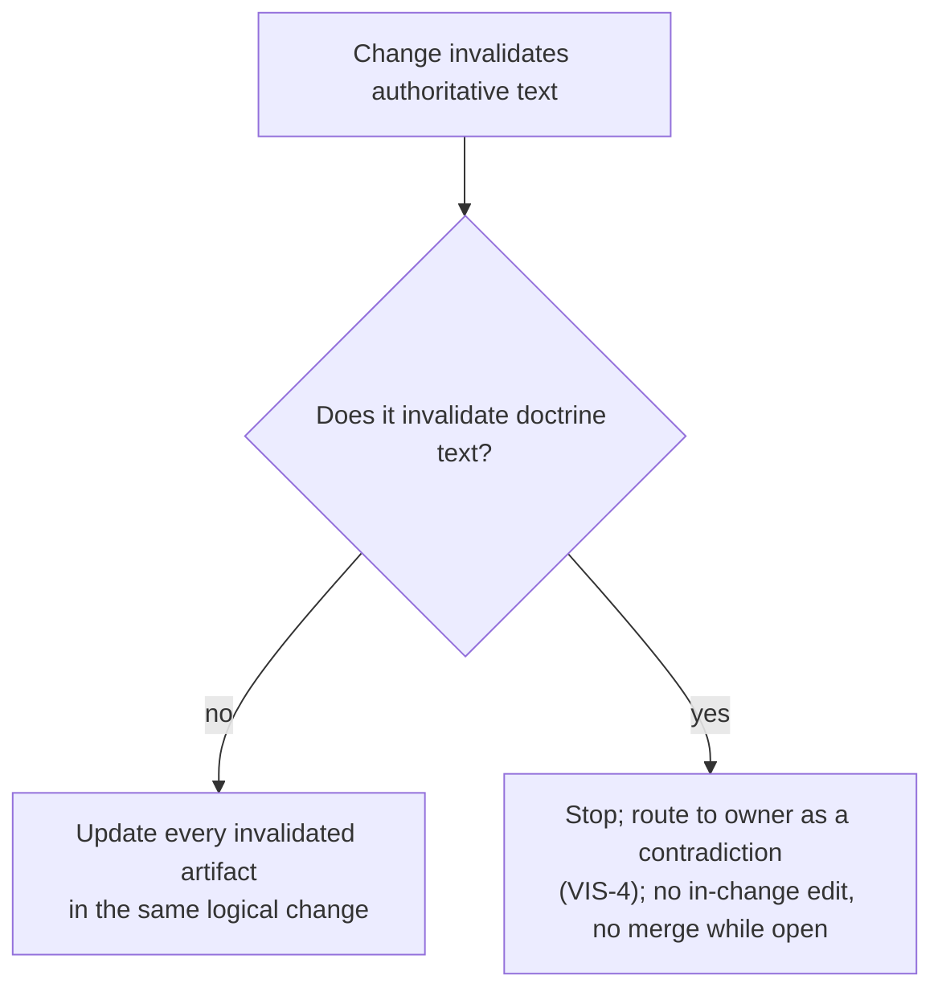

> **Approved** — owner decision D2 (2026-08-01), amendment B21 applied where noted. **This directory (`.syzygy/governance/policies/craft-and-care/`) is the canonical home of these policies.** The bootstrap-phase copy is preserved separately as historical review evidence. Binding force on implementation work begins with the owner's digest-bound acceptance of the foundational design contracts (the act defined in the active acceptance record; the policies cite RFC clauses that bind nothing until then).

# Review and documentation

Syzygy's additions to the canonical bar concern *which* changes must be
independently reviewed, and how documentation stays a single truthful
authority.

- **Baseline, applied by reference:** the canonical bar's review discipline
  and its same-change documentation bias.
  - Cite the violated expectation with evidence.
  - Severity follows blast radius.
  - Independent review is preserved when a reviewer authors semantic
    changes.

## CC-REV-1 — Mandatory independent review classes

Changes touching any of seven classes require review by an independent,
fresh-context reviewer, and the agent performing the change never finally
decides which classes it touches.

**The reviewer:**

- did not author the change;
- does not share the authoring session's context;
- receives the artifact, its governing doctrine/RFC references, and
  acceptance criteria — not the author's reasoning or a desired verdict.

**The classes:**

1. **authority boundaries** — write-universe, typed-authority table,
   adapter authorization (VIS-5, VIS-6);
2. **graph identity** — entity identity minting, continuity, split/merge
   (SDR-2, SDR-22 identity-based counting);
3. **deterministic observation** — snapshot composition, evaluation
   identity, the deterministic/inferred seam (VIS-7);
4. **security** — anything under SEC-1…SEC-5, auth surfaces, egress paths;
5. **data migration** — `.syzygy/**` schema migrations, any
   identity-affecting store change;
6. **public interface** — machine-queryable endpoints, adapter contracts,
   anything an external consumer can depend on;
7. **certificate logic** — when certificates exist (post-V1,
   future-tagged), any code that grants, invalidates, or renders them.

**Class membership is contested by default and is never finally determined
by the agent performing the change** (mirroring VIS-4's classification
rule).

- **The change record states** which classes the change touches, or "none,"
  so a misclassification is a findable violation after the fact.
- **A reviewer or the owner** may reclassify at any time.
- **Self-declared complexity** never exempts these classes (CC-BAR-6).

**Who reviews:**

- The implementing agent never reviews its own change here.
- Per the canonical bar, if the reviewer authors semantic fixes, the exact
  resulting head gets fresh independent review.

**Review prompts are standing artifacts**, keeping steering out of the
channel context isolation cannot close.

- Prompts for these mandatory classes are maintained like the bootstrap's
  `review-prompts/`, not authored per review.
- The author's side may select the artifact cluster, never compose the
  reviewer's instructions.
- *Violation:* an agent modifies snapshot hashing "as a refactor,"
  self-reviews because the diff is small, and merges — a class-3 change with
  no independent eyes.

## CC-REV-2 — The same-logical-change rule

A change that invalidates any authoritative artifact updates **every**
invalidated authoritative artifact in the same logical change; if doctrine
would be invalidated, the change instead stops, routes to the owner, and
does not merge while the contradiction is open.

- **Authoritative artifacts:** behavioral specs (`openspec/`), declared
  topology, accepted contracts, and the policies in this cluster.
- **"We'll sync the spec later" is a violation, not a plan** (canonical
  bias 7, strengthened to *all* typed authorities). [Observed — FD-020 E1-b
  (done includes same-change spec update, topology when structure moved)
  and E10 (same-change-mandatory sync).]
- **The rule is a merge invariant, not a property of how work is
  packaged.**
  - No merge may leave mainline with an invalidated authoritative artifact
    still asserting the old truth.
  - Splitting one logical change across sequenced merges that pass through
    such a state *is* the violation — an open follow-up PR is "syncing
    later" by another name.

**The one structural carve-out: doctrine** is amended only through the owner
gate (VIS-4).

- When a change would invalidate doctrine text, the change stops and routes
  to the owner as a contradiction.
- It does not edit doctrine in-change, and it does not merge while the
  contradiction is open.
- *Violation:* moving a responsibility between two surfaces, updating code and
  specs, and leaving declared topology asserting the old placement — creating
  exactly the intent-vs-observed drift Syzygy exists to expose.

## CC-REV-3 — No hidden duplicate authority

Every fact has exactly one authoritative home per the typed-authority table;
everything else is a labeled, rebuildable projection or an explicit citation
(VIS-6; FD-020 E4-d rejects second sources of truth).

In practice:

- **Documentation cites** authoritative artifacts; it does not restate them
  normatively — a restated rule drifts and becomes a shadow authority.
- **No cache, index, view, or surface-local store** may be the only holder
  of a truth-bearing fact; surfaces are never independently authoritative
  (architecture.md, one kernel).
- **The same question answered in two homes** is a contradiction to
  surface, never a precedence call to make silently.
- *Violation:* a surface keeps its own "effective capability list" that is
  edited directly when the declared artifacts lag — a second authority hidden
  inside a projection.

## CC-REV-4 — Fresh-reader review for normative artifacts

Every normative artifact passes fresh-reader review at adoption and on
material amendment (VIS-3).

- **The test:** a reader with no authoring context restates intent and
  constraints correctly.
- **Failures** are recorded on the artifact's surface.
- **Scope, per SDR-14:** material changes and release milestones, not every
  prose correction.
- **Two failed review rounds** signal upstream ambiguity — return to the
  source decision, don't polish prose.
- *Violation:* a contract amended in five successive LLM sessions, each edit
  locally reasonable, none fresh-reader-reviewed, until only its authors can
  parse it.

## CC-REV-5 — Epistemic labels in documentation

Substantive claims in engineering documentation carry [Observed] (with a
resolvable source), [Inferred], or [Unknown], so provenance is recoverable
where the claim is read.

- **The labels are exclusive**, and missing evidence renders Unknown, never
  Inferred [Observed — trust-and-evidence.md].
- **Narrative may blend**, but provenance must be recoverable at the point
  of consumption.
- **Generated prose** is a non-citable editorial draft until a human adopts
  it (SDR-15).
- *Violation:* a design doc stating "the adapter layer handles reconnection
  transparently" about behavior nobody has observed — an [Unknown] wearing
  declarative prose.

## CC-REV-6 — Review findings are dispositioned, never dropped

Every review finding stays on record: raw output is kept, and every
revise-severity finding is either fixed or explicitly overruled with
recorded rationale by the accountable authority.

- **Raw reviewer output** is stored unchanged before synthesis.
- **Every revise-severity finding** is either fixed or explicitly overruled
  with recorded rationale by the accountable authority (the owner, for
  owner-gated artifacts).
- **A useful review** names concrete risks even when accepting;
  rubber-stamp reviews are themselves findings.
- *Violation:* a synthesis that quietly omits the one reviewer finding the
  author disagreed with, leaving no record it was raised.

## CC-REV-7 — Identifiers are stable; retire, never renumber

Policy numbers, rule identifiers, decision numbers, and RFC numbers are
stable after adoption, so every historical citation still resolves.

- **Amend text in place; retire rather than renumber** (mirrors doctrine's
  identifier rule).
- **A retired identifier's entry remains**, marked retired, so historical
  citations still resolve.
- *Violation:* deleting a retired `CC-DEP-2` and shifting `CC-DEP-3…7` up by
  one, silently re-pointing every existing citation at the wrong rule.

## CC-REV-8 — Documents are abstraction trees, with diagrams where structure beats prose

Every governed document (`.syzygy/**`, `openspec/**`) and every document
Syzygy generates for a governed project is written so that a reader can stop
at any depth and still hold a correct answer.

- **Answer first.** Each document and each section opens with its conclusion
  in one sentence or one bullet; support follows.
- **Every level summarizes its subtree.** Truncating at any depth leaves a
  coarser answer, never a missing one.
  - Deeper levels add resolution, never new conclusions.
  - A caveat that changes the answer belongs in the parent, not a leaf.
- **Abstraction falls with depth.** Outcome or rule at the top; concepts and
  conditions below; mechanisms below that; evidence at the leaves.
  - Identifiers, paths, numbers, and digests sink to the lowest level that
    needs them.
  - One idea per bullet: a long bullet is split into parent and children,
    never compressed.
- **Diagrams wherever structure beats prose.** Flows, lifecycles, state
  machines, boundaries, dependencies, and placements get a diagram, using
  real names.
  - Diagram source is text in the document (Mermaid by default), so it is
    diffed and reviewed like prose.
  - A diagram asserts nothing the text does not, and every encoding means
    what its legend says (VIS-7). In generated documents, diagram elements
    carry the same Observed / Inferred / Unknown labels as the claims they
    draw.
- **Format requirements win.** Headings, identifiers, and markup that parsers
  or citations depend on stay as they are: OpenSpec requirement and scenario
  headings, rule and clause lead-ins (`**VIS-2 — …**`), and cited section
  titles.
- **Normative text keeps its qualifiers attached.** A condition, exception,
  or modal verb stays in the bullet it qualifies; splitting it into a sibling
  changes the rule.

This rule governs form. What a document may claim is governed by CC-REV-3
and CC-REV-5.

*Violation:* a contract module whose operative rule sits in the fourth
paragraph of a section, after three paragraphs of history; a generated
project page that describes a six-stage pipeline in prose with no diagram.
