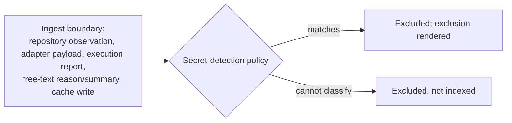

> **Approved** — owner decision D2 (2026-08-01), amendment B21 applied where noted. **This directory (`.syzygy/governance/policies/craft-and-care/`) is the canonical home of these policies.** The bootstrap-phase copy is preserved separately as historical review evidence. Binding force on implementation work begins with the owner's digest-bound acceptance of the foundational design contracts (the act defined in the active acceptance record; the policies cite RFC clauses that bind nothing until then).

# Security and secrets

Every change must exhibit the build-time security posture that follows
from doctrine's SEC-1…SEC-5: default-deny surfaces, consent-checked egress,
no observed-code execution outside an accepted profile, consented revertable
writes, and secrets kept out.

- **Who owns what:**
  - Doctrine owns the trust model (SEC-1…SEC-5, security.md).
  - The authentication mechanism and execution profiles are RFC material
    (SDR §5, RFC 0005).
  - This file states the build-time engineering obligations that follow
    from the doctrine rules — the posture every change must exhibit,
    stack-neutral.
- **Cite, never restate** (CC-REV-3):
  - Clauses here **cite** doctrine rather than restate it.
  - Where a sentence goes beyond what SEC-1…SEC-5 themselves require, it is
    a Syzygy addition and says so.
  - Doctrine's text prevails over any paraphrase here.
- **Standing protections:**
  - All of SEC-1…SEC-5 sit inside the non-downgradable risk floors
    (CC-BAR-5 floor 6).
  - All security-class changes take mandatory independent review (CC-REV-1
    class 4) and are always human-gated at the spec level (VIS-4).

## CC-SEC-1 — Default-deny is the born state of every surface

New endpoints, listeners, and UI routes carry SEC-1's full default posture
**from their first commit** (a Syzygy addition).

- **Why:** security is not a hardening pass applied before
  release — the born state is the shipped state.
- **Loopback is not trust** — SEC-1's own boundary, cited not extended:
  - browser requests pass origin/CSRF protections even on loopback;
  - machine clients are admitted only via the explicit machine-client
    mechanism (RFC 0005);
  - location alone never proves identity.
- **A change adding an exposure outside SEC-1's regime** "temporarily, for
  development" is rejected.
- *Violation:* a debug endpoint bound to `0.0.0.0` in a development build,
  serving portfolio data credential-free — the exact fresh-install failure
  SEC-1 names.

## CC-SEC-2 — Egress is consent-checked in code, at every path

No code path transmits governed-project content to a store or service the
owner does not control without checking the recorded, per-project consent
naming that provider and content class (SEC-2).

- **Governed-project content:** source structure, specs, work history,
  derivations, **prompts included**.
- **Absent consent**, the dependent feature renders Unknown rather than
  being computed; it does not queue, cache, or "anonymize" its way around
  the check.
- **Consent state is rendered on the project surface**, so what is being
  sent where is inspectable.
- *Violation:* a semantic-search feature that ships project text to an
  embedding provider not named in the project's consent record, because the
  provider was "already configured globally."

## CC-SEC-3 — Observed code never executes outside an accepted profile

Observed-project code is untrusted regardless of owner (SEC-3), and runs
only inside an accepted, explicit opt-in execution profile.

- **Until the execution-profile RFC is accepted:** **no observed-project
  code executes, period** — observation is parsing and reading, never
  evaluation.
- **After acceptance**, execution happens only inside an explicit opt-in
  profile with:
  - default-deny;
  - isolated credentials;
  - declared network access;
  - resource limits;
  - destructive-operation gates.
- "Run the project's own test command to get better evidence" is exactly
  the tempting violation.
- *Violation:* an observer that executes a governed repository's build
  script to discover its structure, inheriting the host user's ambient
  credentials.

## CC-SEC-4 — Writes are consented, attributed, atomic, revertable

Every Syzygy write into a governed repository follows SEC-4.

- **What SEC-4 requires:**
  - recorded per-repository consent precedes the first write;
  - each write is attributed to Syzygy, atomic, and individually
    revertable;
  - Syzygy never overwrites a governance artifact it did not author without
    surfacing the conflict.
- **Engineering consequence:** write paths are built as discrete
  attributable operations with a revert story — never bulk in-place
  mutation with shared authorship.
- *Violation:* first-pass doctrine drafting that finds an existing
  `.syzygy/governance/` tree and regenerates it wholesale under Syzygy's
  name.

## CC-SEC-5 — Secrets fail closed at every boundary

The declared secret-detection policy applies at **every ingest boundary**,
and anything it matches or cannot classify is excluded.

- **The ingest boundaries:** repository observation, adapter payloads,
  execution reports, free-text `reason`/summary fields, and cache writes.
- **Matching content** is excluded and the exclusion rendered.
- **Content that cannot be classified** is excluded, not indexed (SEC-5 —
  unclassifiable fails closed).
- **A secret appearing in any surface, store, or endpoint** is a trust-floor
  violation and release-blocking (VIS-7).
- **Free-text fields authored by models or carrying command output** are the
  highest-risk carriers and get no exemption [Inferred — envelope analysis
  in the non-authoritative observation brief identifies free-text reason
  fields as the highest secret-leak risk].
- *Violation:* a worker's failure report containing a connection string is
  stored verbatim as an execution evidence artifact and later rendered in a
  tooltip.

## CC-SEC-6 — Provenance retains hashes, never secret-bearing bodies

Provenance and evidence artifacts reference sensitive bodies by hash and
identity, not by content.

- **What is kept instead of bodies:**
  - prompt **hashes**, not prompt text;
  - artifact identities and digests, not captured environment dumps.
- **Grounds:** SEC-2 names prompts as governed content; SDR-10 lists hashes
  among what compaction preserves.
- **Where a durable artifact must retain body content to be evidence:**
  - the necessity determination is a **recorded decision under a declared
    policy or an owner decision naming the artifact class** — never a
    per-artifact implementer judgment;
  - "needed for reproducibility" self-granted at write time is the
    violation, not a justification;
  - the content passes CC-SEC-5 screening first.
- *Violation:* "for reproducibility," a run summary embeds the full prompt
  and environment variables — turning the provenance store into a secrets
  store.
