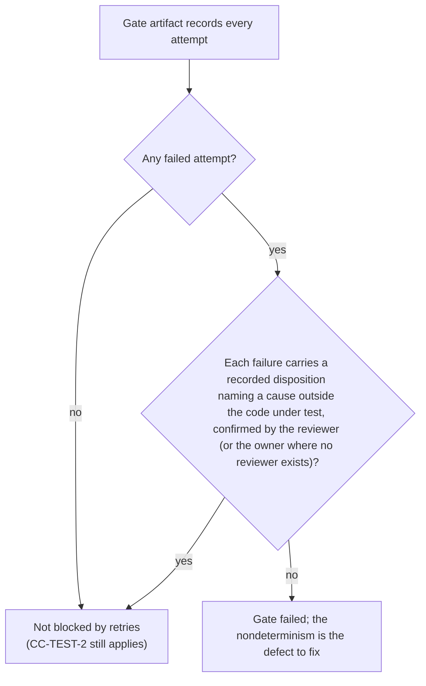

> **Approved** — owner decision D2 (2026-08-01), amendment B21 applied where noted. **This directory (`.syzygy/governance/policies/craft-and-care/`) is the canonical home of these policies.** The bootstrap-phase copy is preserved separately as historical review evidence. Binding force on implementation work begins with the owner's digest-bound acceptance of the foundational design contracts (the act defined in the active acceptance record; the policies cite RFC clauses that bind nothing until then).

# Testing and verification

For Syzygy, test results are not just development feedback — they are
**evidence artifacts** the product itself renders. Most of this file's
obligations, added on top of the canonical bar, follow from that one fact.

- **Baseline:** the canonical `test-rigor` bar applies by reference — rules
  1–10: behavior-focused assertions, regression tests, edge/failure
  coverage, no tautologies, boundary-only mocking, determinism,
  defect-naming failures, maintained test code, suite tiering and
  targetability, governed test growth.

## CC-TEST-1 — Every defect fix ships a reproducing test; exceptions are rare and recorded

A defect fix includes a test that fails on the pre-fix behavior and passes on
the fixed behavior; write-order is flexible [Observed — FD-020 E5-b:
reproducing test required, order flexible].

- **When an exception is permitted:** only when reproduction is genuinely
  infeasible at a reasonable seam (e.g. a one-off external-service anomaly
  with no controllable boundary).
- **How it is recorded:** every exception is **recorded in the change record
  with the reason and the compensating verification performed**.
- **An unrecorded exception is a violation, not a judgment call.**
- *Violation:* "fixed the stale-index crash; couldn't figure out a test" with
  no recorded infeasibility reason — the fix is unverified and the defect
  class unprotected.

## CC-TEST-2 — Gate claims require retained, resolvable gate artifacts

"Tests passed" is a status-bearing claim and follows SDR-9 exactly: it is
Observed, and may satisfy a gate, only when backed by a retained, resolvable
gate artifact; a worker's own report is never one.

- **A report is a report fact.** An execution report saying tests passed may
  be recorded as **Observed as a report fact** ("the worker reported X").
- **The claim needs a gate artifact.** The claim **"tests passed"** is
  Observed only when backed by a retained, resolvable gate artifact (a
  captured run report, CI check record, or equivalent durable identified
  artifact).
  - Otherwise it is Inferred or Unknown per its provenance and **may not
    satisfy any status claim or merge/release gate**.
- **Captured by an observer distinct from the emitter.** A gate artifact
  additionally meets CC-PROV-1's capture requirement: it is captured by an
  observer **distinct from the emitter** (CI-side capture, coordinator-side
  observer).
  - A report the worker itself wrote and attached is an emitter-captured
    **report fact** — a lower tier that never satisfies a gate, however
    durable and hash-carrying the file is.
  - Integrity-verifiability proves non-tampering, not genuineness.
  - *(Amended 2026-08-02, rev7 rework, review 9a Blocker — same class as
    B21's craft-follows-owner-decision amendment. The rest of this bullet,
    including its sub-bullets, is the amended text.)* This emitter-distinct
    requirement states the capture predicate behind RFC4-13 **routes 1 and
    2**. The owner created two further routes it does not govern, each with
    its own guard:
    - **route 3**, an owner-declared trusted oracle — bounded to a (project,
      gate class) pair with an expiry, honored only under RFC3-16(a);
    - **route 4**, a governed checker (RFC4-13(b)) — whose definition must
      be lawfully adopted for the clause class and which a worker may run
      but never author or amend for its own change.
    - A worker's self-written report remains a report fact under every
      route.
- **It binds Syzygy's own development too.** This applies to Syzygy's own
  development the same as to what Syzygy renders about governed projects: a
  merge gate satisfied by an agent's assertion is manufactured green.
  [Observed — SDR-9; trust-and-evidence.md: an LLM assertion is Inferred,
  never Observed.]
- *Violation:* a coordinator marks a work item verified because the worker
  reported `quality-gate tests=pass`, with the underlying run output
  discarded — nothing resolvable remains behind the green mark.

## CC-TEST-3 — Determinism is verified, not assumed

The VIS-7 identity test is itself under test: observation-pipeline changes
must show that one identified evaluation, run at least twice, yields
identical deterministic layers.

- **The identity test:** the deterministic layer of an observation record
  is identical across runs of one identified evaluation (source snapshot +
  as-of instant).
- **What verification includes:** for any observation-pipeline change,
  executing one identified evaluation at least twice and comparing the
  deterministic layers, including **logical freshness state, which is
  identity-bearing** [Observed — architecture.md: freshness
  (fresh/stale/broken/superseded) changes status and is in the identity
  test; only display formatting is excluded].
- **Nondeterminism found here** is a release-blocking defect (trust floor),
  never a flake to retry.
- *Violation:* a determinism check that compares rendered JSON with
  timestamps stripped *and* freshness labels stripped — excluding an
  identity-bearing field, so two runs disagreeing on stale-vs-fresh still
  "pass."

## CC-TEST-4 — Deterministic or quarantined; a flaky gate poisons evidence

The canonical rule (fix nondeterminism or delete the test; never
retry-until-green) is strengthened: because gate results become durable
evidence (CC-TEST-2), a retried-until-green gate does not merely erode team
trust — it **falsifies the evidence record**.

The narrow retry clause (a registered override of canonical test-rigor
rule 6 — CC-BAR-1):

- **Infrastructure failures only, never self-classified.** Retry logic around
  a gate may exist only for **infrastructure** failures, and the
  classification of a failure as infrastructure is **never made by the
  implementing agent alone**.
  - It is a recorded disposition naming a cause outside the code under test,
    confirmed by the change's reviewer (or the owner where no reviewer
    exists).
- **Every attempt recorded.** Every attempt is recorded in the gate
  artifact; an artifact showing only the final passing attempt is
  untruthful.
- **A failed attempt blocks the claim.** A gate artifact containing a failed
  attempt **does not satisfy a status claim** unless each failure carries
  such a confirmed infrastructure disposition.
  - Absent that, the gate is failed and the nondeterminism is the defect to
    fix.
  - A fully-logged fail-fail-pass is still retry-until-green, and honesty of
    the artifact never launders the verdict.
- *Violation:* a gate wrapper that reruns a failing suite up to three times
  and captures only the last run's output as the gate artifact.

## CC-TEST-5 — Verification scope is declared; tests-as-spec is an explicit designation

Suites that feed alignment/convergence claims declare their scope and
coverage, and a test becomes normative only by explicit, recorded
designation.

- **Declared scope.** Any suite whose results feed alignment/convergence
  claims declares its scope and coverage so the claim can render "converged
  **under this oracle**" honestly.
  - An oracle whose adequacy is unassessed yields Unknown [Observed —
    architecture.md, oracle adequacy].
- **Explicit designation.** A test becomes an **explicitly designated
  executable specification** (Genome, non-regeneratable) only by recorded
  designation in `.syzygy/governance/`.
  - No test is silently promoted to normative status, and generated or
    implementation-coupled tests are never Genome [Observed —
    architecture.md, verification split].
- *Violation:* a convergence claim rendered from a smoke suite covering two
  of nine declared capabilities, with no coverage statement alongside it.

## CC-TEST-6 — Unknown and absence paths are first-class test targets

Every status-rendering or evidence-consuming feature ships tests for its
no-data branches, and each must show the doctrine-prescribed outcome, never
a silent default.

- **The no-data branches:** missing evidence, stale evidence, absent
  currency bound, unclassifiable content, missing cost/token data, unmapped
  code.
- **Expected behavior** in each is the doctrine-prescribed one — Unknown,
  excluded, aggregated-with-count — never a silent default (VIS-2; SDR-6;
  SDR-25; SEC-5).
- **Severity:** happy-path-only coverage of an epistemic surface is a
  finding under canonical test-rigor rule 3, at elevated severity: for this
  product the failure mode of the empty branch is *lying*.
- *Violation:* the cost-rollup tests cover one, several, and many runs — but
  not the run whose token counts are absent, which the implementation sums
  as 0.

## CC-TEST-7 — Re-check record: canonical bars 9 and 10 admitted without conflict

Canonical test-rigor bars 9 and 10 were re-checked before absorption and
found not to conflict; this cluster adopts them unmodified, by reference,
the same as bars 1–8.

- **Trigger:** the adopted `test-rigor` pin moved from rules 1–8 to 1–10
  (README's "Adoption by reference" re-pin, 2026-08-06, closing P-26).
- **What the cluster's own rule required:** CC-TEST-1…6 and CC-BAR-1's
  override register to be re-checked against the two new canonical bars —
  suite tiering/targetability (9) and governed test growth (10) — before
  silently absorbing them.
- **Result: no conflict.**
  - Neither new bar overrides or is overridden by any rule above.
  - CC-BAR-1's three registered overrides (bias 1, canonical rules 2 and 6)
    are unaffected, since bars 9 and 10 are additions, not renumberings of
    anything CC-BAR-1 already overrides.
- *Note:* canonical bars 9 and 10 point readers to
  `subskills/test-rigor/references/suite-discipline.md` for tier
  definitions, run commands, and growth-governance detail.
  - That file is outside this lock's vendored scope
    (`../GOVERNANCE-SUBSTRATE-LOCK.yaml`,
    `th_engineering.vendored.scope_note`) — a known gap, not silently
    absorbed.
