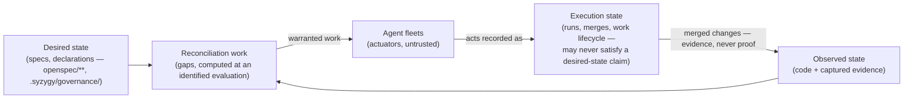
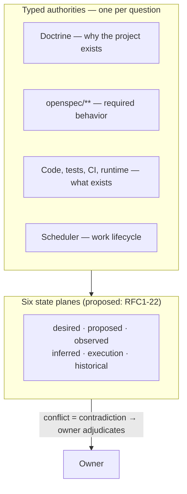
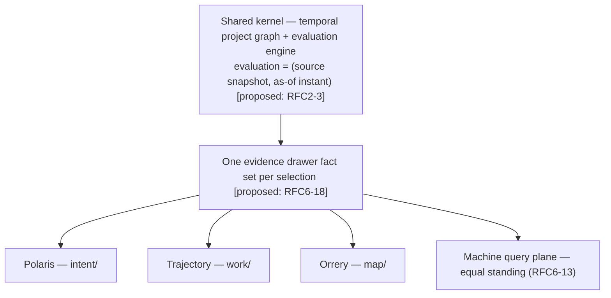
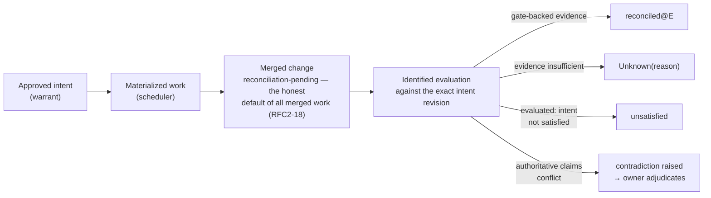
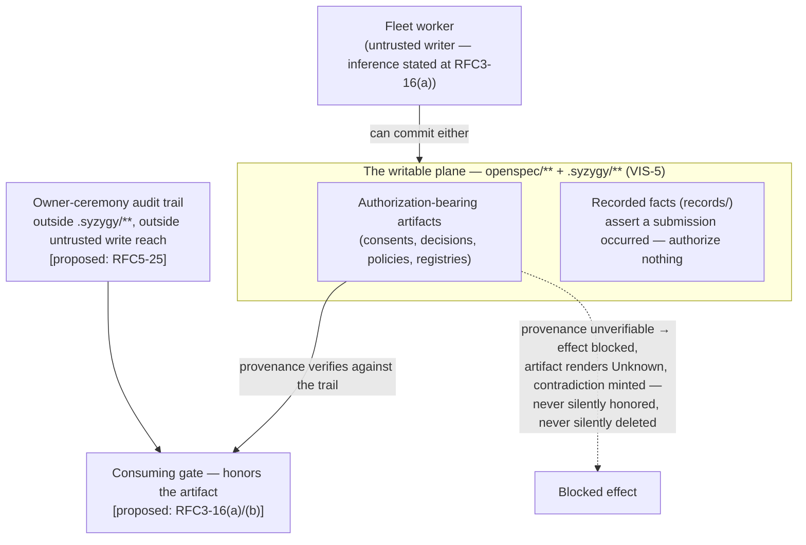

> **Reviewed presentation draft — grounded in proposed foundational
> contracts; adopted only by its own owner act, `ADOPT PROJECT OVERVIEW:
> <digest>`, binding this file's exact content digest — never implicitly on
> the RFC gate (RFC3-16: this stamp is a self-declaration; effective status
> lives in the owner-act record).**
> This is the first Polaris-style overview, written as a dogfood of the
> intent surface's own rules: every factual claim below is anchored to an
> adopted doctrine rule, an owner decision, or a proposed RFC clause, and
> where the ground is a *proposed* contract the anchor says so. Nothing
> here may be cited as authority (RFC7-3's rule, applied to itself).

# Syzygy — what it is, in one reading

*(Syzygy is a provisional codename; poetic names carry literal subtitles —
AGENTS.md naming rule.)*

## 1. The product thesis

A single owner runs fleets of AI agents against their own projects. The
day that motivates everything: the owner dispatches a fleet, gets oversized
diffs and scattered completions, and has no evidence-linked account of what
changed, under whose authority, or whether any of it satisfied the intent
[Observed: vision.md — "a day of orchestration yields oversized diffs and
scattered completions with no coherent account"].

Syzygy's answer is a **specification-driven control plane** built on one
discipline:

- human-readable **specifications define desired state**;
- **code and evidence define observed state**;
- fleet activity is **execution state** — a third thing, never either of
  the other two;
- the computed difference is **reconciliation work**;
- agent fleets are **actuators** — and **doing the work is never proof the
  intent was satisfied** [Observed: vision.md three-state thesis; VIS-2;
  proposed: RFC1-22 "work is never proof"].

## 2. Authority and state planes

There is no single universal source of truth. Each question has exactly one
typed authority [Observed: architecture.md typed-authority table], and every
source-state assertion in the project graph lives on one of six state
planes [proposed:
RFC1-22]: **desired / proposed / observed / inferred / execution /
historical** — while relation edges and kernel-derived objects occupy no
plane, each edge instead carrying a semantic class naming what it derives
from [proposed: RFC1-25]. Conflicts between authorities surface as contradictions routed
to the owner — never auto-resolved [Observed: architecture.md contradiction
rule; proposed detail: RFC1-21, RFC2-15].

The epistemic floor beneath all of it [Observed: trust-and-evidence.md;
VIS-1/2]: claims are **Observed, Inferred, or Unknown**; no evidence means
**Unknown with a reason**, never green and never zero; inference (AI) can
**challenge but never confirm**; and between evaluations claims can only
degrade — improvement needs new evidence, a decision, or an adopted change
[proposed: RFC2-4].

## 3. One kernel, three surfaces

One semantic kernel — a temporal project graph plus an evaluation engine —
computes every truth exactly once. Three human surfaces and a machine query
plane of equal standing — "one truth, two consumers" [proposed: RFC6-13] —
*project* it; none is independently authoritative
[Observed: architecture.md "one kernel, three surfaces"; SDR §1–2]:

- **Polaris** (`.syzygy/intent/`) — the intent surface: a progressively
  disclosed argument for what the project is, down to verbatim requirement
  text. *(This document is its first draft artifact.)*
- **Trajectory** (`.syzygy/work/`) — the work surface: what remains, what
  runs, what merged — and what merged *without yet being reconciled*.
- **Orrery** (`.syzygy/map/`) — the map surface: a spatial city-view over
  capability identities where Unknown is a first-class color; historical
  state is in scope by adopted amendment D1.

Same facts, same labels, same provenance on every surface; two surfaces
disagreeing over one selection is a kernel defect, not a UI quirk
[proposed: RFC6-18/22/23].

## 4. The reconciliation lifecycle

Every change enters a reconciliation chain and stays visibly
"reconciliation-pending" until checked against the intent revision that
warranted it — and V0 spends most of its life there: a wall of such
pending states on a fleet-built project is *correct output*, not failure
[proposed: RFC2-17…21; RFC2-19]. The four terminal answers in the diagram —
reconciled at E with evidence; merged, not yet evaluated; evaluated and
unsatisfied; evaluated, contradiction raised — are **four different answers
that never share a rendering**: an unadjudicated contradiction is never
routed into work as if it were an ordinary gap [proposed: RFC2-17, RFC8-28].
Positive status flows only through
`gate-backed` evidence whose provenance is verified — including external CI
confirmations, which are **captured at observation time inside snapshot
identity**, so a provider expiring its records never rewrites history
[proposed: RFC4-13, RFC4-13(a)].

## 5. Write and trust boundaries

Syzygy writes exactly two namespaces — `openspec/**` and `.syzygy/**` — and
touches everything else read-only or through typed, authorized, audited
adapters [Observed: VIS-5; proposed: RFC3-3, RFC4-2]. Fleet workers are
**untrusted even inside the writable plane** [Inferred — SEC-3 declares the
executed-code actor class untrusted regardless of project ownership;
extending that classification to what those workers *commit* follows from
architecture.md's worker-materialization model and is stated as an explicit
inference at RFC3-16(a)], which forces
the package's most consequential rule: anything that *authorizes* is honored
only with owner-act provenance the repository itself cannot forge
[proposed: RFC3-16(a)/(b)]. Until that mechanism ships (the committed first
implementation slice), every authorization gate renders its gap honestly.

## Where this stands

*(This section is an authoring-time record, written 2026-08-02; it states
what was true when this overview's digest was fixed, not current status —
current effective status is read from the owner-act records, never from
any artifact's own text, this page included: RFC3-16.)*

As of this overview's authoring: doctrine (VIS-1…7, SEC-1…5) was adopted,
with one owner-ratified amendment (D1) [Observed:
`.syzygy/governance/doctrine/README.md`, adoption stamp and amendment
log]. The owner-decision ledger held **36 recorded identifiers** — A1–A9,
B1–B22, D1–D4, N1 — of which **34 were in force**: B16 retired, N1
superseded [Observed: OWNER-ANSWERS.md decision ledger]. The nine
foundational RFCs stood at the owner's acceptance gate [Observed:
`_bootstrap/rfc-phase/FOUNDATIONAL-RFC-ACCEPTANCE-RECORD.md`, the
gate-defining manifest — not the RFCs' own headers, which are untrusted
self-declarations under RFC3-16]. This overview binds nothing and is
superseded by any clause it summarizes.
