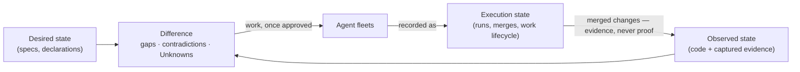
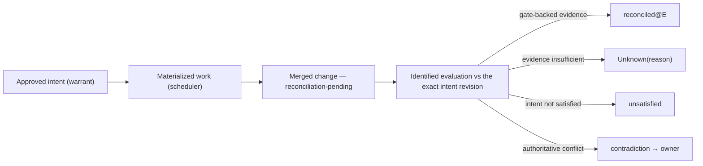

# Syzygy — what it is, in one reading

> **Governed presentation, never authority.** This page explains; it decides
> nothing. Any clause it summarizes overrides it. Current gate state is read
> from [`PROJECT-STATUS.md`](../../PROJECT-STATUS.md), never from here.
> Adopted **only** by its own owner act (`ADOPT PROJECT OVERVIEW:
> <digest>`), which binds this file's exact bytes and nothing else — and
> **that act has not been performed**: until it is, this page is a draft
> like its sibling candidates, however finished it reads.

*(Syzygy, Polaris, Trajectory, Orrery, and Mission Control are working
codenames; poetic names always carry literal subtitles.)*

---

## The thesis, in 30 seconds

**Humans define what should be true. Evidence shows what is true. Agents do
work to close the difference. Syzygy explains all three — honestly, including
when it does not know.**

Two rules everything else follows from:

- **No evidence means Unknown** — never green, never zero.
- **Doing the work is never proof the intent was satisfied.** Scheduled,
  completed, and merged are facts about *activity*, not about *intent*.

## The problem this exists to solve

A single owner runs fleets of AI agents across a portfolio of projects. The
day that motivates everything: the owner dispatches a fleet, gets oversized
diffs and scattered completions, and has no evidence-linked account of what
changed, under whose authority, or whether any of it satisfied the intent.
Underspecification surfaces at the most expensive moment — after deployment.
Project knowledge lives in READMEs and ad-hoc investigation.

## Three kinds of state, kept apart

This is the whole idea. Most tools collapse these three; Syzygy refuses to.

| | What it is | Where it comes from |
|---|---|---|
| **Desired state** | what should be true | human-approved specifications and doctrine |
| **Observed state** | what is true | code, tests, CI, runtime — captured as **evidence** |
| **Execution state** | what was *done* | runs, merges, work lifecycle |

Execution state never substitutes for either of the others. The computed
**difference** between desired and observed — gaps, contradictions, and
Unknowns — is what generates work, and agent fleets are the workers that do
it.

## One shared project model, and what looks at it

A single **shared project model** (the *kernel*, in the technical contracts) —
a project graph that remembers time, plus the rules that compare declared
intent against captured evidence — computes every truth exactly once.
Everything else is a rebuildable view of it, and none of those views is
independently authoritative.

Doctrine commits Syzygy to **two first-class consumers from day one**:

- **the owner**, served spatially and visually, through three project
  **surfaces**;
- **agents**, served through machine-queryable endpoints — a co-equal plane,
  not an export. Scraping a human-rendered table is never a conforming
  integration.

The three project surfaces:

| Surface | Literal subtitle | Answers |
|---|---|---|
| **Polaris** | the intent surface | What is this project supposed to be? |
| **Trajectory** | the work surface | What remains, what is running, what changed, what did it cost — and has the result been verified against intent? Never satisfied by an issue list |
| **Orrery** | the map surface | Where does everything live, and in what state? Unknown is a first-class colour |

And one thing that is **not a fourth project-specific truth surface**:
**Mission Control**, a **workspace-level operator domain** — a *workspace*
being the owner's portfolio of projects rather than any one project — which
answers what bounded, delegated missions are running across them. It mints no
project truth. It rests on a candidate contract and a proposed doctrine
amendment, neither accepted.

## What the owner actually approves

Humans govern intent, guardrails, risk, and budgets. Agents do detailed work
inside an explicitly approved **Mission** — one bounded job, carrying written
bounds it can never widen: objective, permissions, budget, time, the
**evidence bar** (the minimum strength of evidence its results must carry),
and its stop and escalation conditions. Widening any of them is a human act.
The human is interrupted for declared exceptions, not routine steps.

The loop stays human-triggered. Autonomy beyond doctrine's stated bounds is
licensed only through the mechanism doctrine itself names — never by
reinterpretation.

## The north star, honestly labelled

The long-range ideal: a project's **complete normative definition** —
everything that would have to survive deletion of the code — could regenerate
the codebase, with code as a replaceable realization. (Doctrine has a name for
that corpus; Drawer 2 says where to find it.)

Doctrine names this a **north star, not present doctrine**, and forbids any
artifact from presenting it as a current capability. It exerts direction
rather than obligation, with one operative rule: **a decision that materially
forecloses the ideal must record that foreclosure — the unrecorded foreclosure
is the violation.**

## What exists today

**Nothing is implemented** — no daemon, no UI, no store, no endpoints, no
chosen language, framework, or database. This page describes intended shape,
not current capability.

What the repository *does* contain — adopted doctrine, owner-approved
engineering policy, a candidate contract corpus, and which owner gates remain
open — is stated once, in
[`PROJECT-STATUS.md`](../../PROJECT-STATUS.md). It is deliberately **not
restated here**: this file's bytes are frozen by an owner act, and a
gate table frozen inside it would go quietly false the first time a gate
fired.

## Where to read next

| You want | Go to |
|---|---|
| Exact current gate state | [`PROJECT-STATUS.md`](../../PROJECT-STATUS.md) |
| The non-negotiable rules | [`doctrine/vision.md`](../governance/doctrine/vision.md) |
| What the words mean | [`doctrine/README.md`](../governance/doctrine/README.md) — the glossary, read first |
| Scope: what V0 ships vs V1 | [`doctrine/v1.md`](../governance/doctrine/v1.md) |
| The technical model | the two drawers below |

---

You have the argument. **Everything past this point is optional
drill-down** — open a drawer when you need it, and nothing below changes
anything asserted above.

<b>Drawer 1 — the technical model</b> (typed authority; evidence and
Unknown; reconciliation; write boundaries)

### Typed authority

There is no single universal source of truth. Each question has exactly one
owning authority: doctrine answers *why*; accepted contracts answer
*load-bearing how*; `openspec/**` answers *required observable behavior*;
topology answers *intended placement*; craft-and-care answers *the
engineering and evidence bar*; code and captured evidence answer *what
exists*; the work scheduler answers *work lifecycle*; Syzygy itself displays
rebuildable projections.

Conflicts between authorities surface as **contradictions** routed to the
owner — never auto-resolved by precedence, and never silently scheduled into
work. A **gap** (something missing) and a **contradiction** (two authorities
disagreeing) are different findings with different remedies.

### Evidence, claims, and Unknown

Claims carry one of three epistemic labels — **Observed**, **Inferred**, or
**Unknown**. Evidence is a durable, identified, integrity-verifiable
artifact; no evidence means Unknown *with a reason*. Inference (AI) may
**challenge** a positive claim but may never **establish** one.

Every status is computed at an identified **evaluation** — a (source
snapshot, as-of instant) pair. Between evaluations claims can only degrade;
improvement requires new evidence, a decision, or an adopted change, through
a new evaluation.

### Reconciliation

Every merged change enters a reconciliation chain and stays visibly
**reconciliation-pending** until checked against the exact intent revision
that authorized it. *Reconciled at E with evidence*, *merged but not yet
evaluated*, *evaluated and unsatisfied*, and *evaluated, contradiction raised*
are four different answers that must never share a rendering. At V0 the second
is the honest answer for all merged work, and it renders as Unknown carrying
its reason.

A wall of pending states on a fleet-built project is *correct output*, not
failure. Positive status flows only through gate-backed evidence whose
provenance is verified and captured inside snapshot identity.

### Write and trust boundaries

Syzygy's direct project-content writes are confined to exactly two
namespaces — `openspec/**` and `.syzygy/**`. Everything else is read-only or
reached through typed, explicitly authorized adapters. Syzygy never writes
implementation code.

Fleet workers are untrusted **even inside** the writable plane. That forces
the corpus's most consequential rule: anything that *authorizes* an effect is
honored only with owner-act provenance the repository itself cannot forge.
Until that mechanism ships, every authorization gate renders its gap
honestly — "owner-adopted (bootstrap, uncorrelated)", never "verified".

<b>Drawer 2 — exact sources</b> (which authority owns each claim
above)

Adopted doctrine and recorded decisions are binding. Contract clauses marked
*candidate* bind **nothing** until an owner acceptance act; they are listed
so a reader can find the mechanism, not so it can be relied on.

| Claim on this page | Owning authority | Kind |
|---|---|---|
| The two rules; Unknown never zero | `doctrine/vision.md` (VIS-1, VIS-2) | Adopted |
| The owner's problem; the motivating day | `doctrine/vision.md` | Adopted |
| Three-state thesis | `doctrine/vision.md` | Adopted |
| Six-plane state model behind it | RFC-0001 (RFC1-22) | Candidate |
| One kernel; surfaces are projections | `doctrine/architecture.md` | Adopted (D1 in force) |
| Two first-class consumers (owner, agents) | `doctrine/vision.md` | Adopted |
| Machine/human answer parity | RFC-0006 (RFC6-13, RFC6-14) | Candidate |
| Surface charter; Polaris/Trajectory/Orrery | `decisions/SURFACE-DECISION-RECORD.md` (SDR-1…2) | Recorded |
| Orrery renders historical state | doctrine amendment D1 | Adopted |
| Mission Control is not a fourth surface | RFC-0010 (RFC10-1) | Candidate |
| Mission envelope; no self-widening | RFC-0010 (RFC10-7, RFC10-8) | Candidate |
| Autonomy licensed only by doctrine's own mechanism | `doctrine/vision.md` (VIS-4) | Adopted |
| Whether D3 + RFC-0010 satisfy VIS-4 | **open owner question** | Proposed |
| North star; the unrecorded-foreclosure rule; the complete normative corpus doctrine calls the **Project Genome** | `doctrine/vision.md`; `doctrine/architecture.md` | Adopted |
| Typed authority; contradictions vs gaps | `doctrine/architecture.md`; RFC-0001, RFC-0002 | Adopted / candidate |
| Evidence, epistemic labels, staleness | `doctrine/trust-and-evidence.md`; RFC-0002 (RFC2-3, RFC2-4) | Adopted / candidate |
| Reconciliation chain and its four answers | RFC-0002 (RFC2-17…21), RFC-0004, RFC-0008 | Candidate |
| Two-namespace write boundary | `doctrine/vision.md` (VIS-5, VIS-6) | Adopted |
| Untrusted workers; unforgeable owner acts | `doctrine/security.md` (SEC-3); RFC-0003 (RFC3-3, RFC3-16), RFC-0005 (RFC5-25) | Adopted / candidate |
| Engineering and evidence bar | `policies/craft-and-care/` (CC-*) | Owner-approved (D2) |
| Vocabulary | `contracts/candidates/policy-candidates/TERM-REGISTRY.md` | Candidate — a working registry, not a settled vocabulary |

Candidate modules live under `.syzygy/governance/contracts/candidates/`;
their exact digests live in `ACTIVE-CONTRACT-MANIFEST.txt`, and the act
phrases in the acceptance record beside it. **Which of these have been
accepted is not stated here** — that is
[`PROJECT-STATUS.md`](../../PROJECT-STATUS.md)'s job, and duplicating it
would create a second answer that goes stale.

