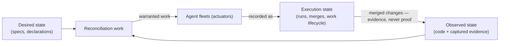
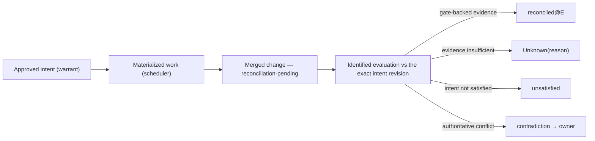

> **Reviewed presentation draft — adopted only by its own owner act,
> `ADOPT PROJECT OVERVIEW: <digest>`, binding this file's exact content
> digest — never implicitly on any other gate (RFC3-16: this stamp is a
> self-declaration; effective status lives in the owner-act record).**
> This overview is a governed presentation artifact and may never be cited
> in place of doctrine, contracts, specifications, policy, or topology
> (RFC7-3's rule, applied to itself). Current project status is read from
> `PROJECT-STATUS.md` and the owner-act records, never from this page.
> Source anchors sit at the end of each claim block; the drill-down table
> in Layer 4 is the full source drawer. Anchors marked *candidate* cite
> contract clauses that bind nothing until owner acceptance.

# Syzygy — what it is, in one reading

*(Syzygy, Polaris, Trajectory, Orrery, and Mission Control are working
codenames; poetic names always carry literal subtitles.)*

## Layer 1 — the 30-second thesis

**Humans define what should be true. Evidence shows what is true. Agents do
work to close the difference. Syzygy explains all three — and lets humans
govern bounded missions instead of micromanaging tasks.**

No evidence means **Unknown** — never green, never zero. Doing the work is
never proof the intent was satisfied.

## Layer 2 — the five-minute argument

**The problem is the owner's.** A single owner runs fleets of AI agents
against a portfolio of projects. The day that motivates everything: the
owner dispatches a fleet, gets oversized diffs and scattered completions,
and has no evidence-linked account of what changed, under whose authority,
or whether any of it satisfied the intent. Underspecification surfaces at
the most expensive moment — after deployment.
*Sources: vision.md (owner transformation; the human problem).*

**Three kinds of state, kept semantically distinct.** Human-readable
specifications define **desired state**. Code, tests, CI, and runtime
evidence define **observed state**. Fleet activity — runs, merges, work
lifecycle — is **execution state**, a third thing that never substitutes
for either of the others: scheduled, completed, or merged work is never
proof that the implementation satisfies intent. The computed difference
becomes **reconciliation work**, and agent fleets are the actuators that
perform it.
*Sources: vision.md (three-state thesis); candidate: RFC1-22.*

**One kernel, four experiences.** A single semantic kernel — a temporal
project graph plus an evaluation engine — computes every truth exactly
once. Three project surfaces and a machine query plane of equal standing
project it; none is independently authoritative:

- **Polaris** (the intent surface) — what is this project supposed to be?
- **Trajectory** (the work surface) — what remains, what runs, what merged
  *without yet being reconciled*?
- **Orrery** (the map surface) — a spatial view over capability identities
  where Unknown is a first-class color; historical state included by
  adopted amendment D1.
- **Mission Control** (the workspace operator surface) — what bounded,
  delegated missions are running across projects? Workspace-level, not a
  fourth project truth surface; defined by candidate contract RFC-0010 and
  pending doctrine amendment D3.

*Sources: architecture.md (one kernel, three surfaces); SDR §1–2;
candidate: RFC6-13, RFC-0010.*

**The north star, honestly labeled.** The long-range ideal is that a
project's complete normative corpus (its **Project Genome**) could regenerate
the codebase, with code as a replaceable realization. Doctrine names this a
**north star, not present doctrine and never a current capability claim**; a
separate standing mandate is live fleet observability — watching agent fleets
work, deferred until there is observed truth to annotate.

**What exists today.** Adopted doctrine, owner-approved engineering policy,
and a candidate contract corpus awaiting owner acceptance. **Nothing is
implemented** — no daemon, no UI, no store, no endpoints, no chosen stack.
This overview describes intended shape, not current capability.
*Sources: PROJECT-STATUS.md (gate table); VIS-2 forbids implying more.*

Foundational terms used so far: desired / observed / execution state,
reconciliation work, kernel, surface, capability, Unknown, mission, owner —
the full vocabulary lives in the term registry.

## Layer 3 — the technical model

**Typed authority.** There is no single universal source of truth; each
question has exactly one owning authority: doctrine answers *why*; accepted
contracts answer *load-bearing how*; `openspec/**` answers *required
observable behavior*; topology answers *intended placement*; craft-and-care
answers *the engineering and evidence bar*; code and captured evidence
answer *what exists*; the work scheduler answers *work lifecycle*; Syzygy
itself displays rebuildable projections. Conflicts between authorities
surface as **contradictions** routed to the owner — never auto-resolved by
precedence, and never silently scheduled into work.
*Sources: architecture.md (typed authority; contradiction rule);
candidate: RFC1-21, RFC2-15.*

**Evidence and Unknown.** Claims are **Observed, Inferred, or Unknown**.
Evidence is a durable, identified, integrity-verifiable artifact; no
evidence means Unknown with a reason. Inference (AI) may *challenge* a
positive claim but may never establish one. Every status is computed at an
identified evaluation — (source snapshot, as-of instant) — and between
evaluations claims can only degrade; improvement requires new evidence, a
decision, or an adopted change through a new evaluation.
*Sources: trust-and-evidence.md; VIS-1, VIS-2; architecture.md (snapshots
and the loop); candidate: RFC2-3, RFC2-4.*

**Reconciliation.** Every merged change enters a reconciliation chain and
stays visibly **reconciliation-pending** until checked against the exact
intent revision that warranted it. The terminal answers — reconciled-with-
evidence, Unknown(reason), unsatisfied, contradiction-raised — are four
different answers that never share a rendering. A wall of pending states on
a fleet-built project is *correct output*, not failure. Positive status
flows only through gate-backed evidence whose provenance is verified and
captured inside snapshot identity.
*Sources: candidate: RFC2-17…21, RFC4-13, RFC8-28.*

**Governance and write boundaries.** Syzygy's direct project-content writes
are confined to exactly two namespaces — `openspec/**` and `.syzygy/**`;
everything else is read-only or reached through typed, explicitly
authorized adapters. Syzygy never writes implementation code. Fleet workers
are untrusted even inside the writable plane, which forces the corpus's
most consequential rule: anything that *authorizes* an effect is honored
only with owner-act provenance the repository itself cannot forge; until
that mechanism ships, every authorization gate renders its gap honestly —
"owner-adopted (bootstrap, uncorrelated)", never "verified".
*Sources: VIS-5, VIS-6; SEC-3; candidate: RFC3-3, RFC3-16(a)/(b), RFC5-25.*

**Bounded autonomy.** Humans govern high-level intent, guardrails, risk,
and budgets; agents perform detailed work inside an explicitly approved
**Mission envelope** — objective, permissions, budget, time, evidence bar,
stop and escalation conditions. The human is interrupted for declared
exceptions (**attention items**), not routine steps. The loop stays
human-triggered: autonomy beyond doctrine's stated bounds is licensed only
through the mechanism doctrine itself names (VIS-4), never by
reinterpretation. Whether the proposed bounded-Mission amendment (D3) plus
the candidate Mission contract satisfy that mechanism is an open owner
question, not a settled one — see the D3 packet and the acceptance record's
owner-attention items.
*Sources: vision.md ("Not autonomous"; VIS-4); candidate: RFC10-1…16;
proposed: doctrine amendment D3.*

## Layer 4 — exact authority drill-down

| Concept in this overview | Owning authority | Status |
|---|---|---|
| Non-negotiable rules VIS-1…7 | `.syzygy/governance/doctrine/vision.md` | Adopted |
| Security rules SEC-1…5 | `.syzygy/governance/doctrine/security.md` | Adopted |
| Typed authority; snapshots; kernel definitions | `.syzygy/governance/doctrine/architecture.md` | Adopted (amendment D1 in force) |
| Evidence, claims, staleness, trust floor | `.syzygy/governance/doctrine/trust-and-evidence.md` | Adopted |
| V0/V1 scope and success tests | `.syzygy/governance/doctrine/v1.md` | Adopted |
| Surface charter, SDR-1…33 | `.syzygy/governance/decisions/SURFACE-DECISION-RECORD.md` | Recorded |
| State planes, graph identity | RFC-0001 | Candidate |
| Evaluation, reconciliation chain | RFC-0002 | Candidate |
| Namespaces, governance homes, owner acts | RFC-0003 | Candidate |
| Evidence adapters and admission routes | RFC-0004 | Candidate |
| AuthN, consent, execution profiles | RFC-0005 | Candidate |
| Selection, query, evidence drawer | RFC-0006 | Candidate |
| Polaris / Trajectory / Orrery contracts | RFC-0007 / 0008 / 0009 | Candidate |
| Mission Control and autonomy envelopes | RFC-0010 | Candidate |
| Context compilation | RFC-0011 | Candidate |
| Engineering and evidence bar (CC-*) | `.syzygy/governance/policies/craft-and-care/` | Owner-approved (D2) |
| Vocabulary | term registry, `contracts/candidates/policy-candidates/` | Candidate |
| Current gate state | `PROJECT-STATUS.md` + acceptance record | — |

Candidate modules live under `.syzygy/governance/contracts/candidates/`;
their exact digests live in `ACTIVE-CONTRACT-MANIFEST.txt`, and the act
phrases in the acceptance record beside it. This overview binds nothing and
is superseded by any clause it summarizes.
