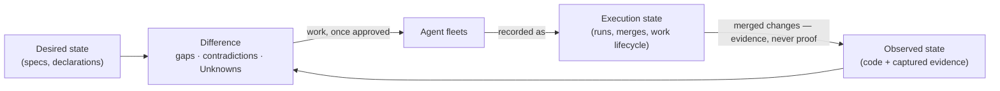
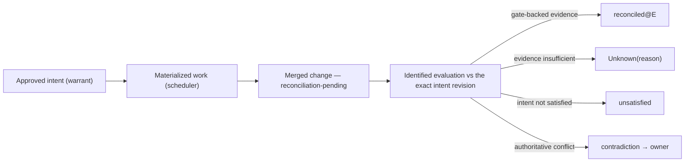

# Syzygy — what it is, in one reading

> **Presentation, never authority.** This page explains and decides nothing;
> any clause it summarizes overrides it. Current state lives in
> [`PROJECT-STATUS.md`](../../PROJECT-STATUS.md). The page is adopted only by
> its own owner act (`ADOPT PROJECT OVERVIEW: <digest>`), which binds these
> exact bytes — and **that act has not been performed**, so this is still a
> draft.

*(Syzygy, Polaris, Trajectory, Orrery, and Mission Control are working
codenames; each poetic name always comes with a literal subtitle.)*

---

## The thesis, in 30 seconds

**Humans define what should be true. Evidence shows what is true. Agents do
work to close the difference. Syzygy explains all three — honestly, including
when it does not know.**

Two rules everything else follows from:

- **Comprehensible truth, never comprehensible fiction** (doctrine
  **VIS-1**) — a simpler presentation is never bought with a less true one.
- **No evidence means Unknown** (**VIS-2**) — never green, never zero.

Doing the work is never proof the intent was satisfied: scheduled,
completed, and merged are facts about *activity*, not about *intent*. That is
doctrine's opening premise, not a third numbered rule.

## The problem this exists to solve

One owner runs fleets of AI agents across a portfolio of projects. The day
that motivates everything: the owner dispatches a fleet and gets back
oversized diffs and scattered completions, with no evidence-linked account of
what changed, under whose authority, or whether any of it met the intent.
Underspecification surfaces at the most expensive moment, after deployment,
and project knowledge lives in READMEs and ad-hoc investigation.

## Three kinds of state, kept apart

This is the whole idea. Most tools blur these three together; Syzygy keeps
them apart.

| | What it is | Where it comes from |
|---|---|---|
| **Desired state** | what should be true | human-approved specifications and doctrine |
| **Observed state** | what is true | code, tests, CI, runtime — captured as **evidence** |
| **Execution state** | what was *done* | runs, merges, work lifecycle |

Execution state never stands in for either of the others. The computed
**difference** between desired and observed state — gaps, contradictions, and
Unknowns — is what generates work, and agent fleets do that work.

```mermaid
flowchart LR
    Desired["Desired state<br/>(specs, declarations)"]
    Observed["Observed state<br/>(code + captured evidence)"]
    Exec["Execution state<br/>(runs, merges, work lifecycle)"]
    Diff["Difference<br/>gaps · contradictions · Unknowns"]
    Fleet["Agent fleets"]
    Desired --> Diff
    Observed --> Diff
    Diff -->|"work, once approved"| Fleet
    Fleet -->|recorded as| Exec
    Exec -->|"merged changes — evidence, never proof"| Observed
```

## One shared project model, and what looks at it

A single **shared project model** (the *kernel*, in the technical contracts)
computes every truth exactly once: a project graph that remembers time, plus
the rules that compare declared intent with captured evidence. Everything else
is a rebuildable view of it, and no view is authoritative on its own.

Doctrine commits Syzygy to **two first-class consumers from day one**:

- **the owner**, served spatially and visually through three project
  **surfaces**;
- **agents**, served through machine-queryable endpoints — a co-equal plane,
  not an export. Scraping a human-rendered table is never a conforming
  integration.

The three project surfaces:

| Surface | Literal subtitle | Answers |
|---|---|---|
| **Polaris** | the intent surface | What is this project supposed to be? |
| **Trajectory** | the work surface | What remains, what is running, what changed, what did it cost — and has the result been verified against intent? Never satisfied by an issue list |
| **Orrery** | the map surface | Where does everything live, and in what state? Unknown is a first-class colour |

**Mission Control** is *not* a fourth project surface. It is a
**workspace-level operator domain** — a *workspace* being the owner's whole
portfolio rather than one project — that shows which bounded, delegated
missions are running across it. It creates no project truth, and it rests on a
candidate contract and a proposed doctrine amendment, neither accepted.

## What the owner actually approves

Humans govern intent, guardrails, risk, and budgets. Agents do the detailed
work inside an explicitly approved **Mission**: one bounded job with written
limits it can never widen — objective, permissions, budget, time, the
**evidence bar** (the minimum strength of evidence its results must carry),
and its stop and escalation conditions. Only a human can widen them. The human
is interrupted for declared exceptions, not routine steps.

The loop stays human-triggered. Autonomy beyond doctrine's stated bounds is
licensed only through the mechanism doctrine itself names — never by
reinterpretation.

## The north star, honestly labelled

The long-range ideal: a project's **complete normative definition** —
everything that would have to survive deletion of the code — could regenerate
the codebase, making code a replaceable realization. (Doctrine names that
corpus; Drawer 2 says where.)

Doctrine calls this a **north star, not present doctrine**, and forbids any
artifact from presenting it as a current capability. It sets direction, not
obligation, with one operative rule: **a decision that materially forecloses
the ideal must record that foreclosure — the unrecorded foreclosure is the
violation.**

## What exists today

What is implemented, and which owner gates remain open, is stated once, in
[`PROJECT-STATUS.md`](../../PROJECT-STATUS.md), and deliberately not restated
here. This file's bytes are frozen by an owner act, so anything it said about
current capability would go quietly false the first time that capability
moved. This page describes intended shape.

## Where to read next

| You want | Go to |
|---|---|
| Current state and open gates | [`PROJECT-STATUS.md`](../../PROJECT-STATUS.md) |
| The non-negotiable rules | [`doctrine/vision.md`](../governance/doctrine/vision.md) |
| What the words mean | [`doctrine/README.md`](../governance/doctrine/README.md) — the glossary, read first |
| Scope: what V0 ships vs V1 | [`doctrine/v1.md`](../governance/doctrine/v1.md) |
| The technical model | the two drawers below |

---

That is the whole argument. **Everything below is optional drill-down** —
open a drawer when you need it; nothing in them changes anything above.

<b>Drawer 1 — the technical model</b> (typed authority; evidence and
Unknown; reconciliation; write boundaries)

### Typed authority

There is no single universal source of truth. Each question has one owning
authority:

| Question | Authority |
|---|---|
| Why? | doctrine |
| Load-bearing how? | accepted contracts |
| Required observable behavior? | `openspec/**` |
| Intended placement? | topology |
| The engineering and evidence bar? | craft-and-care |
| What exists? | code and captured evidence |
| Work lifecycle? | the work scheduler |

Syzygy itself only displays rebuildable projections of these.

When authorities conflict, the conflict surfaces as a **contradiction** routed
to the owner — never auto-resolved by precedence, never silently scheduled
into work. A **gap** (something missing) and a **contradiction** (two
authorities disagreeing) are different findings with different remedies.

### Evidence, claims, and Unknown

Every claim carries one of three labels: **Observed**, **Inferred**, or
**Unknown**. Evidence is a durable, identified, integrity-verifiable artifact;
no evidence means Unknown *with a reason*. Inference (AI) may **challenge** a
positive claim but never **establish** one.

Every status is computed at an identified **evaluation**: a (source snapshot,
as-of instant) pair. Between evaluations a claim can only degrade; improving
it takes new evidence, a decision, or an adopted change, through a new
evaluation.

### Reconciliation

Every merged change enters a reconciliation chain and stays visibly
**reconciliation-pending** until it is checked against the exact intent
revision that authorized it. Four answers must never share a rendering:

- *reconciled at E, with evidence*;
- *merged but not yet evaluated*;
- *evaluated and unsatisfied*;
- *evaluated, contradiction raised*.

At V0 the second is the honest answer for all merged work, and it renders as
Unknown with its reason. A wall of pending states on a fleet-built project is
*correct output*, not failure. Positive status flows only through gate-backed
evidence whose provenance is verified and captured in the snapshot's
identity.

```mermaid
flowchart LR
    Intent["Approved intent (warrant)"] --> Work["Materialized work (scheduler)"]
    Work --> Merged["Merged change — reconciliation-pending"]
    Merged --> Eval["Identified evaluation vs the exact intent revision"]
    Eval -->|gate-backed evidence| Rec["reconciled@E"]
    Eval -->|evidence insufficient| Unk["Unknown(reason)"]
    Eval -->|intent not satisfied| Unsat["unsatisfied"]
    Eval -->|authoritative conflict| Con["contradiction → owner"]
```

### Write and trust boundaries

Syzygy writes project content directly in exactly two namespaces,
`openspec/**` and `.syzygy/**`. Everything else is read-only, or reached
through typed, explicitly authorized adapters. Syzygy never writes
implementation code.

Fleet workers are untrusted **even inside** the writable plane. That leads to
the corpus's most consequential rule: anything that *authorizes* an effect is
honored only with owner-act provenance the repository itself cannot forge.
Until that mechanism ships, every authorization gate shows its gap honestly —
"owner-adopted (bootstrap, uncorrelated)", never "verified".

<b>Drawer 2 — exact sources</b> (which authority owns each claim
above)

Doctrine and recorded decisions are binding. A contract clause binds only
once an owner act has accepted it; which contracts are accepted is stated in
[`PROJECT-STATUS.md`](../../PROJECT-STATUS.md), not here, so this page cannot
hold a second, staler answer.

| Claim on this page | Owning authority |
|---|---|
| The two rules; Unknown never zero | `doctrine/vision.md` (VIS-1, VIS-2) |
| The owner's problem; the motivating day | `doctrine/vision.md` |
| Three-state thesis | `doctrine/vision.md` |
| Six-plane state model behind it | RFC-0001 (RFC1-22) |
| One kernel; surfaces are projections | `doctrine/architecture.md` |
| Two first-class consumers (owner, agents) | `doctrine/vision.md` |
| Machine/human answer parity | RFC-0006 (RFC6-13, RFC6-14) |
| Surface charter; Polaris/Trajectory/Orrery | `decisions/SURFACE-DECISION-RECORD.md` (SDR-1…2) |
| Orrery renders historical state | doctrine amendment D1 |
| Mission Control is not a fourth surface | RFC-0010 (RFC10-1) |
| Mission envelope; no self-widening | RFC-0010 (RFC10-7, RFC10-8) |
| Autonomy licensed only by doctrine's own mechanism | `doctrine/vision.md` (VIS-4) |
| Whether D3 + RFC-0010 satisfy VIS-4 | **open owner question** |
| North star; the unrecorded-foreclosure rule; the complete normative corpus doctrine calls the **Project Genome** | `doctrine/vision.md`; `doctrine/architecture.md` |
| Typed authority; contradictions vs gaps | `doctrine/architecture.md`; RFC-0001, RFC-0002 |
| Evidence, epistemic labels, staleness | `doctrine/trust-and-evidence.md`; RFC-0002 (RFC2-3, RFC2-4) |
| Reconciliation chain and its four answers | RFC-0002 (RFC2-17…21), RFC-0004, RFC-0008 |
| Two-namespace write boundary | `doctrine/vision.md` (VIS-5, VIS-6) |
| Untrusted workers; unforgeable owner acts | `doctrine/security.md` (SEC-3); RFC-0003 (RFC3-3, RFC3-16), RFC-0005 (RFC5-25) |
| Engineering and evidence bar | `policies/craft-and-care/` (CC-*) |
| Vocabulary | `contracts/candidates/policy-candidates/TERM-REGISTRY.md` — a working registry, not a settled vocabulary |

Accepted contracts are installed under `.syzygy/governance/contracts/rfcs/`;
every contract module, accepted or not, is mirrored under
`.syzygy/governance/contracts/candidates/rfcs/`. Exact digests and act phrases
live in the acceptance records, not on this page.

