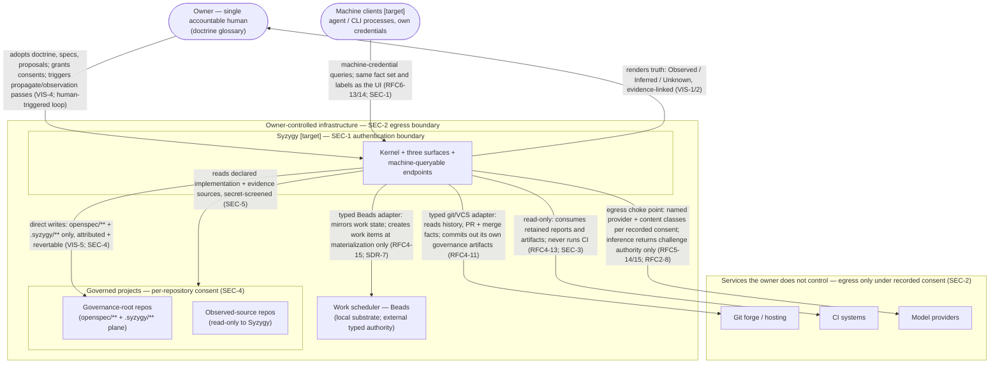

# 01 — System Context

> **Reviewed draft — grounded in proposed foundational contracts (currency note, not an ordering precondition: this bundle's own gate is §2 act 3 of the acceptance record and does not wait on the RFC act).** Reviewed fresh-context (reviews 5–7, dispositions recorded); updated at the rev7 rework for the corrected contracts (D1 historical scope, five governance categories, walkthrough three-way split, captured external confirmation, `Base` scenario context). Becomes canonical only by its **own owner act** — `ACCEPT TOPOLOGY: <bundle-manifest-digest>`, binding the exact digest of every file in the bundle — never implicitly on the RFC gate (RFC3-16: this stamp is a self-declaration; effective status lives in the owner-act record).
>
> Rendering: Mermaid is the durable, renderable fallback chosen for this phase; an Excalidraw + SVG upgrade is a tracked follow-up.

## What this shows

Syzygy in its world: the single owner, the machine clients that consume the
same truth, the governed projects it observes and writes into, and the four
classes of external authority it touches only through typed adapters or
consented egress. Every arrow names what flows and under what authority.

## Authority and trust boundaries

- **SEC-1 boundary** (around Syzygy): every endpoint authenticated by client
  class; loopback location is never identity. Detailed in `07-client-trust-boundaries.md`.
- **SEC-2 boundary** (owner-controlled infrastructure): governed-project
  content crosses it only under explicit, recorded, per-project consent
  naming provider and content classes. Model providers are such services.
- **SEC-4 boundary** (per repository): no consent, no observation — an
  unconsented repository renders Unknown, never an empty graph.
- **Typed authority** [Observed: architecture.md]: the forge answers version
  history; the scheduler answers work lifecycle (after materialization); CI
  and runtime answer what exists; none answers intent. Effects on all of
  them flow only through explicitly authorized adapters (`08-adapter-external-systems.md`).
- Workers/actuators (the agent toolchain that turns work into code) sit
  **outside Syzygy's body** [Observed: vision.md]: work-to-code and
  code-to-deployment belong to the orchestration toolchain.

## [target] vs already true

- **[target]:** Syzygy itself — kernel, surfaces, endpoints, adapters, and
  every arrow into or out of the Syzygy box. No implementation exists; no
  stack is chosen [Observed: repo state; v1.md].
- **[Observed] today:** the substrate tools exist and are designated initial
  realizations (Beads, git/forge, OpenSpec, the `/th-*` agent toolchain)
  [Observed: doctrine README glossary]; this repository already carries a
  `.syzygy/` governance plane and an initialized Beads DB.
- **[Inferred]:** the placement of the scheduler inside owner infrastructure
  reflects the current local-first Beads substrate; a remote scheduler would
  cross the SEC-2 boundary and require consent like any remote backing
  dependency.
