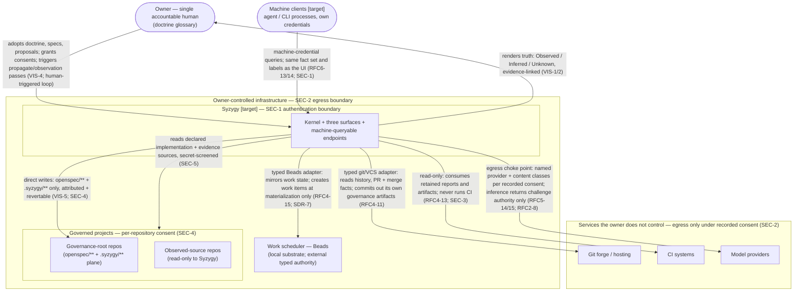

# 01 — System Context

> **Reviewed draft — grounded in proposed foundational contracts (currency note, not an ordering precondition: this bundle's own gate is §2 act 3 of the acceptance record and does not wait on the RFC act).** Reviewed fresh-context (reviews 5–7, dispositions recorded); updated at the rev7 rework for the corrected contracts (D1 historical scope, five governance categories, walkthrough three-way split, captured external confirmation, `Base` scenario context). Becomes canonical only by its **own owner act** — `ACCEPT TOPOLOGY: <bundle-manifest-digest>`, binding the exact digest of every file in the bundle — never implicitly on the RFC gate (RFC3-16: this stamp is a self-declaration; effective status lives in the owner-act record).
>
> Rendering: Mermaid is the durable, renderable fallback chosen for this phase; an Excalidraw + SVG upgrade is a tracked follow-up.

> Restyled 2026-09-28 for readability (no change of meaning); reviews 5–7 reviewed the prior bytes, and this restyle's review is recorded in [the topology restyle packet](../../governance/decisions/TOPOLOGY-TREE-RESTYLE.md).

## What this shows

Syzygy in its world, where every arrow names what flows and under what
authority.

- **Who surrounds it:** the single owner, and the machine clients that
  consume the same truth.
- **What it governs:** the governed projects it observes and writes into.
- **What it only reaches indirectly:** the four classes of external
  authority it touches only through typed adapters or consented egress.

```mermaid
flowchart TB
    Owner(["Owner — single accountable human<br/>(doctrine glossary)"])
    Agents(["Machine clients [target]<br/>agent / CLI processes, own credentials"])

    subgraph OwnerInfra["Owner-controlled infrastructure — SEC-2 egress boundary"]
        subgraph SyzygyBody["Syzygy [target] — SEC-1 authentication boundary"]
            Syzygy["Kernel + three surfaces +<br/>machine-queryable endpoints"]
        end
        subgraph Projects["Governed projects — per-repository consent (SEC-4)"]
            Gov["Governance-root repos<br/>(openspec/** + .syzygy/** plane)"]
            Src["Observed-source repos<br/>(read-only to Syzygy)"]
        end
        Sched["Work scheduler — Beads<br/>(local substrate; external typed authority)"]
    end

    subgraph External["Services the owner does not control — egress only under recorded consent (SEC-2)"]
        Forge["Git forge / hosting"]
        CI["CI systems"]
        Models["Model providers"]
    end

    Owner -->|"adopts doctrine, specs, proposals; grants consents; triggers propagate/observation passes (VIS-4; human-triggered loop)"| Syzygy
    Syzygy -->|"renders truth: Observed / Inferred / Unknown, evidence-linked (VIS-1/2)"| Owner
    Agents -->|"machine-credential queries; same fact set and labels as the UI (RFC6-13/14; SEC-1)"| Syzygy
    Syzygy -->|"direct writes: openspec/** + .syzygy/** only, attributed + revertable (VIS-5; SEC-4)"| Gov
    Syzygy -->|"reads declared implementation + evidence sources, secret-screened (SEC-5)"| Projects
    Syzygy -->|"typed Beads adapter: mirrors work state; creates work items at materialization only (RFC4-15; SDR-7)"| Sched
    Syzygy -->|"typed git/VCS adapter: reads history, PR + merge facts; commits out its own governance artifacts (RFC4-11)"| Forge
    Syzygy -->|"read-only: consumes retained reports and artifacts; never runs CI (RFC4-13; SEC-3)"| CI
    Syzygy -->|"egress choke point: named provider + content classes per recorded consent; inference returns challenge authority only (RFC5-14/15; RFC2-8)"| Models
```

## Authority and trust boundaries

Three SEC boundaries apply (SEC-1 around Syzygy, SEC-2 around
owner-controlled infrastructure, SEC-4 per repository), typed authority
decides which external system answers what, and the workers that write code
sit outside Syzygy.

- **SEC-1 boundary** (around Syzygy): every endpoint authenticated by client
  class; loopback location is never identity.
  - Detailed in `07-client-trust-boundaries.md`.
- **SEC-2 boundary** (owner-controlled infrastructure): governed-project
  content crosses it only under explicit, recorded, per-project consent
  naming provider and content classes.
  - Model providers are such services.
- **SEC-4 boundary** (per repository): no consent, no observation.
  - An unconsented repository renders Unknown, never an empty graph.
- **Typed authority** [Observed: architecture.md]: each external authority
  answers its own question; none answers intent.
  - The forge answers version history.
  - The scheduler answers work lifecycle (after materialization).
  - CI and runtime answer what exists.
  - Effects on all of them flow only through explicitly authorized adapters
    (`08-adapter-external-systems.md`).
- **Workers/actuators sit outside Syzygy's body** [Observed: vision.md]:
  the agent toolchain that turns work into code is not part of Syzygy.
  - Work-to-code and code-to-deployment belong to the orchestration
    toolchain.

## [target] vs already true

Syzygy itself is target; the substrate tools and this repository's
governance plane already exist.

- **[target]:** Syzygy itself — kernel, surfaces, endpoints, adapters, and
  every arrow into or out of the Syzygy box.
  - No implementation exists; no stack is chosen
    [Observed: repo state; v1.md].
- **[Observed] today:**
  - The substrate tools exist and are designated initial realizations
    (Beads, git/forge, OpenSpec, the `/th-*` agent toolchain)
    [Observed: doctrine README glossary].
  - This repository already carries a `.syzygy/` governance plane and an
    initialized Beads DB.
- **[Inferred]:** the placement of the scheduler inside owner
  infrastructure reflects the current local-first Beads substrate.
  - A remote scheduler would cross the SEC-2 boundary and require consent
    like any remote backing dependency.
