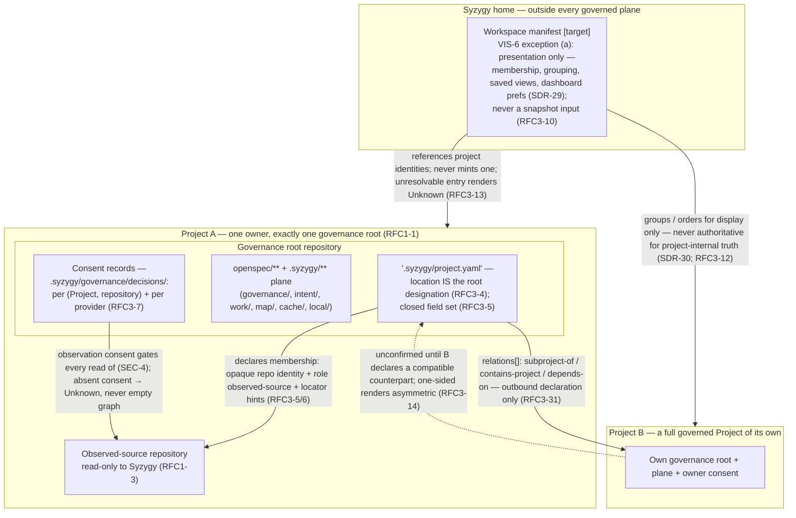

# 02 — Projects, Workspace and Repositories

> **Reviewed draft — grounded in proposed foundational contracts (currency note, not an ordering precondition: this bundle's own gate is §2 act 3 of the acceptance record and does not wait on the RFC act).** Reviewed fresh-context (reviews 5–7, dispositions recorded); updated at the rev7 rework for the corrected contracts (D1 historical scope, five governance categories, walkthrough three-way split, captured external confirmation, `Base` scenario context). Becomes canonical only by its **own owner act** — `ACCEPT TOPOLOGY: <bundle-manifest-digest>`, binding the exact digest of every file in the bundle — never implicitly on the RFC gate (RFC3-16: this stamp is a self-declaration; effective status lives in the owner-act record).
>
> Rendering: Mermaid is the durable, renderable fallback chosen for this phase; an Excalidraw + SVG upgrade is a tracked follow-up.

## What this shows

How the owner's workspace relates to governed Projects, how each Project is
composed of exactly one governance root plus declared observed-source
repositories, where consent records live, and how "nesting" is realized as
declared relations between whole Projects — never sub-roots.

## Authority and ownership boundaries

- **The one-root invariant** [Observed: architecture.md; RFC1-1]: a Project
  has exactly one governance root — the repository holding its single
  `openspec/**` + `.syzygy/**` plane. Zero or two roots is a contradiction
  routed to the owner, never silently repaired (RFC3-4). A `.syzygy/`
  directory anywhere but a repository root designates nothing (RFC3-29).
- **Consent is per pair** [Observed: RFC3-7/30]: role and consent attach to
  the *(Project, repository)* pair. One repository may be its own Project's
  root and simultaneously an observed source of another Project — under
  that Project's own consent, read-only including its plane.
- **Workspace manifest is never truth** [Observed: SDR-29/30; RFC3-12]:
  deleting it changes what is rendered, never any project's state; portfolio
  truth is derived from the projects' own declarations (SDR-28).
- **Nesting is composition by declaration** [Observed: RFC3-31]: a
  "subproject" is a whole governed Project; recursion lives in rendering.
  A parent may never hold authoritative state about a child's internals,
  act on its behalf, or aggregate a child's Unknowns into green (RFC3-32).

## [target] vs already true

- **[target]:** the workspace manifest, consent-record machinery, asymmetric
  relation rendering, and all resolution behavior — RFC 0003 is a draft
  contract; nothing enforces it yet.
- **[Observed] today:** this repository is itself shaped as a governance
  root (`.syzygy/governance/` with doctrine and decisions exists);
  `project.yaml`, consent records, and `relations[]` do not exist anywhere
  yet.
- **[Inferred]:** the two-project picture generalizes to the owner's
  portfolio; multi-workspace and multi-user manifests are deferred with
  multi-user (v1.md).
