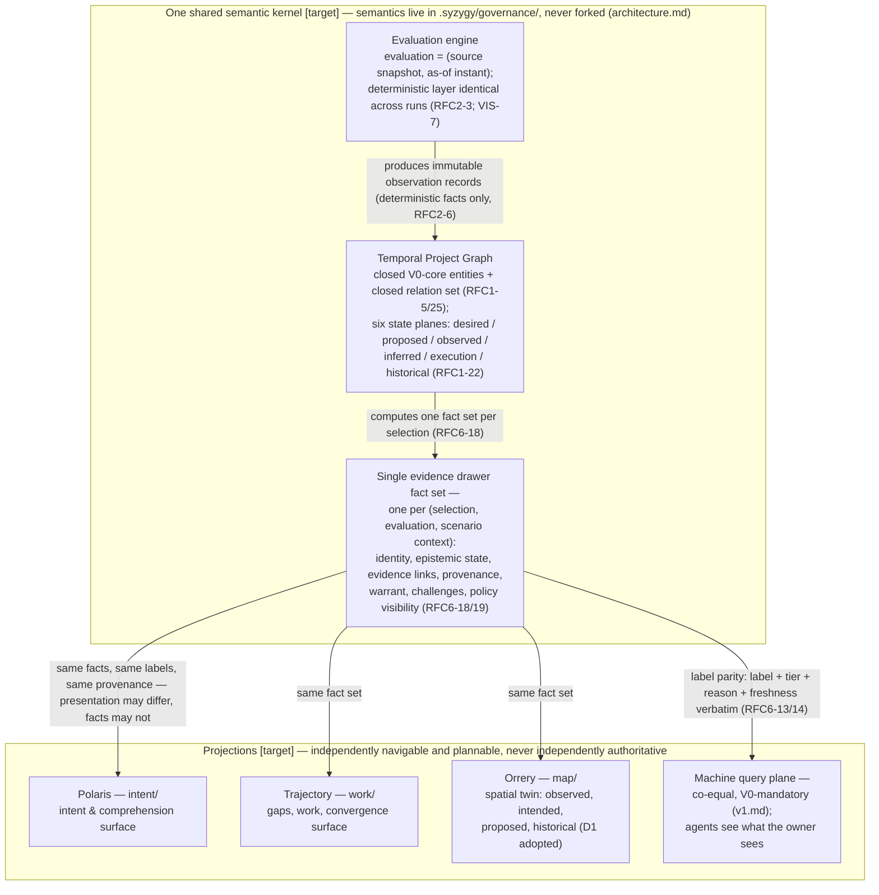

# 03 — One Kernel, Three Surfaces

> **Reviewed draft — grounded in proposed foundational contracts (currency note, not an ordering precondition: this bundle's own gate is §2 act 3 of the acceptance record and does not wait on the RFC act).** Reviewed fresh-context (reviews 5–7, dispositions recorded); updated at the rev7 rework for the corrected contracts (D1 historical scope, five governance categories, walkthrough three-way split, captured external confirmation, `Base` scenario context). Becomes canonical only by its **own owner act** — `ACCEPT TOPOLOGY: <bundle-manifest-digest>`, binding the exact digest of every file in the bundle — never implicitly on the RFC gate (RFC3-16: this stamp is a self-declaration; effective status lives in the owner-act record).
>
> Rendering: Mermaid is the durable, renderable fallback chosen for this phase; an Excalidraw + SVG upgrade is a tracked follow-up.

## What this shows

The single semantic kernel — temporal project graph plus evaluation engine —
and the four co-equal consumers projected from it: three human surfaces and
the machine query plane. One evidence drawer fact set feeds all of them; no
surface is ever independently authoritative.

## Authority boundaries

- **The kernel is the only truth-computer** [Observed: architecture.md, "One
  kernel, three surfaces"]: surfaces render; they never adjudicate, never
  pick winners among contradictions, never fork the shared definitions. The
  owner ruled a single repository (monorepo) the constitutional realization
  of this invariant.
- **The machine plane is co-equal, not secondary** [Observed: vision.md two
  first-class consumers; RFC6-13]: no endpoint-only facts, no UI-only facts.
  Anything a surface renders is queryable and vice versa.
- **One drawer** [Observed: RFC6-18]: two surfaces showing different
  evidence for one selection at one evaluation is a kernel defect, not a UI
  inconsistency. Selection references use only kernel identities — never
  file paths, scene handles, or row indices (RFC6-1).
- **Rendering equivalence** [Observed: SDR-27; RFC6-22/23]: 3D, 2D, table,
  and machine answers must agree on entities, edges, labels, tiers,
  reasons, freshness, and counts over the same declared scope;
  disagreement is release-blocking under the trust floor.

## [target] vs already true

- **[target]:** everything in the diagram — kernel, graph, evaluation
  engine, drawer, all four projections. These are drafted contracts
  (RFC 0001/0002/0006), not running systems.
- **[Observed] today:** the surface charter and codenames are owner-ratified
  decisions (SDR §1–2); the `.syzygy/` directory names (`intent/`, `work/`,
  `map/`) are fixed by adopted doctrine, though only `governance/` is
  populated in this repository.
- **[Observed]:** "Orrery includes historical state" rests on owner
  amendment **D1** (ratified 2026-08-01, applied to
  `.syzygy/governance/doctrine/architecture.md`) — constitutional scope,
  no longer conditional. The concrete historical interaction design (ghost
  steps, milestone scenes, scrubber) remains a non-binding candidate bundle
  behind its own approval (RFC9-41).
