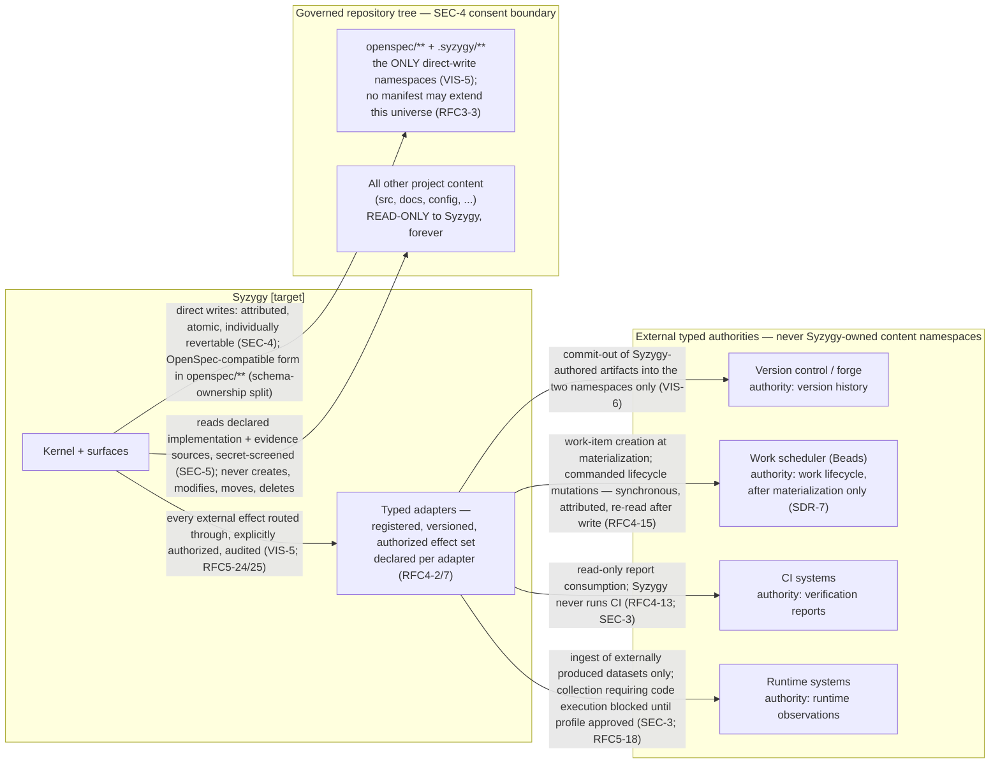

# 04 — Authority and Write Boundaries

> **Reviewed draft — grounded in proposed foundational contracts (currency note, not an ordering precondition: this bundle's own gate is §2 act 3 of the acceptance record and does not wait on the RFC act).** Reviewed fresh-context (reviews 5–7, dispositions recorded); updated at the rev7 rework for the corrected contracts (D1 historical scope, five governance categories, walkthrough three-way split, captured external confirmation, `Base` scenario context). Becomes canonical only by its **own owner act** — `ACCEPT TOPOLOGY: <bundle-manifest-digest>`, binding the exact digest of every file in the bundle — never implicitly on the RFC gate (RFC3-16: this stamp is a self-declaration; effective status lives in the owner-act record).
>
> Rendering: Mermaid is the durable, renderable fallback chosen for this phase; an Excalidraw + SVG upgrade is a tracked follow-up.

## What this shows

The complete write universe of Syzygy: exactly two directly writable
namespaces, everything else read-only, and every external authority reached
only through a typed, explicitly authorized adapter. Includes the typed
authority map and the no-second-store rule.

## The typed authority map [Observed: architecture.md]

| Question | Authority |
|---|---|
| Why does the project exist; what principles govern it? | Doctrine in `.syzygy/governance/` |
| How do load-bearing contracts work? | Accepted RFCs in `.syzygy/governance/` |
| What observable behavior is required? | `openspec/**` (OpenSpec artifact contract) |
| Where do intended components sit? | Declared topology in `.syzygy/governance/` |
| What quality/evidence standards apply? | Policies in `.syzygy/governance/` |
| What currently exists? | Code, tests, CI, runtime observations |
| What work is scheduled, in what state? | The scheduler (Beads) — via its typed adapter |
| What does Syzygy display? | A rebuildable projection of all the above (VIS-6) |

There is no single universal source of truth; a contradiction between typed
authorities routes to owner adjudication, never precedence.

## Governance categories and write-authority classes *(added at the rev7 rework)*

The **five constitutional categories** of `.syzygy/governance/` (RFC3-15),
plus the reserved `declarations/` category — **drafted default only: whether
`declarations/` stands as a sixth category is OPEN at RFC 0003 §8 q4** (B19
ruled on challenges, not on this; the drafted default holds until the owner
rules, reversible by amendment) — and the
**four write-authority classes** (RFC3-2):

| Path | Holds | Install gate | Typical write authority |
|---|---|---|---|
| `governance/doctrine/` | Adopted doctrine | Owner adoption | owner-adopted |
| `governance/contracts/` | Accepted RFCs / load-bearing contracts | Owner acceptance | owner-adopted |
| `governance/policies/` | Quality/evidence/security policies, incl. the craft-and-care cluster and the walkthrough **release policy** (RFC9-45) | Owner approval; honored under RFC3-16(a) | owner-adopted / Syzygy-drafted |
| `governance/decisions/` | Recorded owner decisions — adoptions, dismissals, adjudications, consents, walkthrough **judgments** (RFC7-31, RFC9-45) | Owner recording; a decision is a warrant, never evidence | owner-adopted |
| `governance/records/` | Kernel-authored durable facts on non-owner submissions (the only minting trigger — RFC3-2; kernel-computed expiry derives, mints nothing) — challenge admission/rejection records, submitted withdrawals, walkthrough **execution records** | None — recorded facts, never authorizations, never adoptable | kernel-recorded |
| `governance/declarations/` *(drafted default — §8 q4 OPEN)* | Declaration artifacts (capabilities, topology, regions, mappings) | Owner sign-off (RFC3-17) | owner-adopted / Syzygy-drafted |

There is **no `governance/challenges/`** — challenge artifacts live in
`records/` (RFC3-17(a) as rewritten under B19). The comprehension
walkthrough routes across three of these rows: **fact** → `records/`,
**judgment** → `decisions/`, **release authority** → the adopted policy in
`policies/` — never from a stored verdict alone.

## The no-second-store rule [Observed: RFC4-5, two limbs]

- **Inward:** for every mutable field of an externally owned record, exactly
  one store is writable and it is not Syzygy. Of that field's **current
  value** Syzygy holds only evaluation-stamped, non-editable,
  discard-and-re-derive projections. The limb governs projections of current
  state; it does **not** govern captured evidence about the past — an
  immutable, evaluation-stamped record that a transition *occurred* is a
  historical fact about the external store, not a second source of truth for
  the field, and where a durable Syzygy record depends on such a fact RFC4-16
  *requires* its capture before the substrate's retention horizon.
- **Outward:** Syzygy-owned facts enter external stores only as derived,
  re-derivable pointers (e.g. the warrant pointer in the scheduler's
  `spec_id`, RFC4-17); the `.syzygy/**` record stays authoritative;
  divergence is re-asserted and annotated, never merged, never adjudicated.
- **Schema ownership splits** [Observed: architecture.md]: `.syzygy/**` is
  Syzygy's native schema-versioned namespace (identity-preserving migrations
  only, RFC3-23); `openspec/**` is written only in OpenSpec-compatible form
  and is outside Syzygy's migration authority (RFC3-26).

## [target] vs already true

- **[target]:** all enforcement — the write containment, adapter
  authorization, audit trail, and migration machinery are draft contracts.
- **[Observed] today:** the two-namespace rule and typed-authority table are
  adopted doctrine (VIS-5; architecture.md) binding on any future
  implementation; the boundary already governs bootstrap conduct in this
  repository.
- **[Inferred]:** no violation-detection tooling exists yet; until an
  implementation lands, the boundary is upheld by process, not mechanism.
