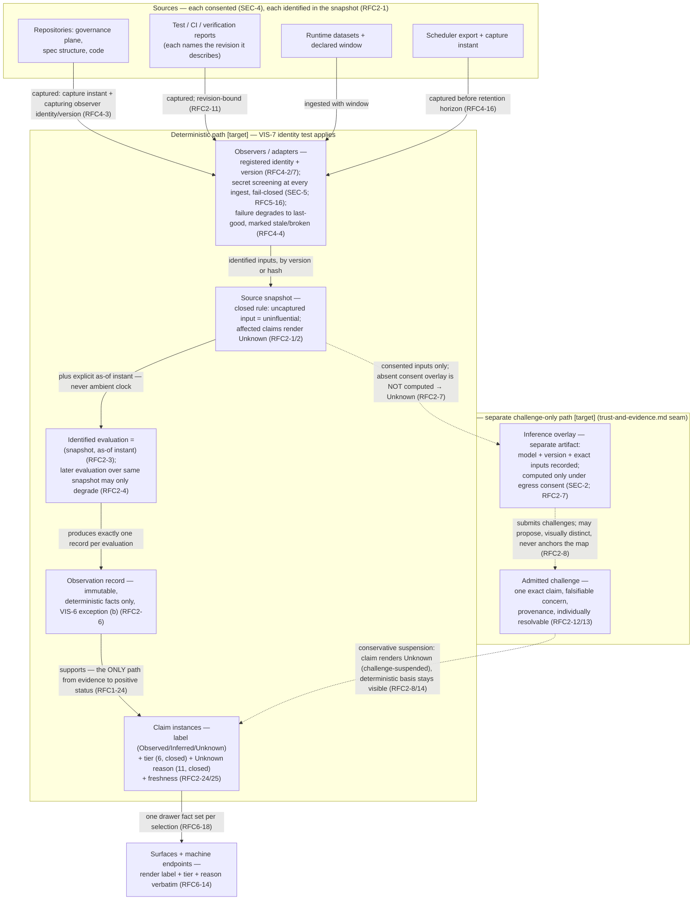

# 05 — Observation and Evidence Flow

> **Reviewed draft — grounded in proposed foundational contracts (currency note, not an ordering precondition: this bundle's own gate is §2 act 3 of the acceptance record and does not wait on the RFC act).** Reviewed fresh-context (reviews 5–7, dispositions recorded); updated at the rev7 rework for the corrected contracts (D1 historical scope, five governance categories, walkthrough three-way split, captured external confirmation, `Base` scenario context). Becomes canonical only by its **own owner act** — `ACCEPT TOPOLOGY: <bundle-manifest-digest>`, binding the exact digest of every file in the bundle — never implicitly on the RFC gate (RFC3-16: this stamp is a self-declaration; effective status lives in the owner-act record).
>
> Rendering: Mermaid is the durable, renderable fallback chosen for this phase; an Excalidraw + SVG upgrade is a tracked follow-up.

## What this shows

The deterministic path from sources to rendered claims — capture, snapshot,
evaluation, immutable record, claims — and, deliberately separate, the
inference overlay path that can only challenge, never establish. Solid
arrows are the deterministic layer; dashed arrows are the inferred layer.

## Authority boundaries

- **The seam is structural** [Observed: trust-and-evidence.md]: observation
  records contain deterministic facts only; overlays are separate,
  separately versioned artifacts excluded from the VIS-7 identity test. An
  LLM assertion is Inferred, never Observed.
- **Challenge authority only** [Observed: RFC2-8]: an overlay never
  establishes, raises, or independently satisfies a positive status claim.
  Only `gate-backed` Observed evidence turns anything green (RFC2-25).
- **Time is an input** [Observed: architecture.md]: no status changes
  without a new identified evaluation; the wall clock never flips a badge.
- **Failure is rendered** [Observed: RFC2-23]: broken observers, unreachable
  sources, withdrawn consent, partial snapshots, excluded secrets, and
  missing quantities each have a defined rendering — Unknown with reason,
  never silence, never zero.

## [target] vs already true

- **[target]:** the entire pipeline — no observer, snapshot, evaluation, or
  overlay machinery exists.
- **[Observed] today:** the semantics are fixed by adopted doctrine
  (snapshot closed rule, temporal rule, seam) and drafted in RFC 0002/0004;
  the twelve Unknown reasons and six tiers are RFC-draft vocabulary, not yet
  accepted.
- **[Inferred]:** initial capture fidelity will be constrained by the
  substrate's forgetfulness (squash-merge history loss, `bd gc` horizons) —
  RFC 0004 renders that as labeled reduced fidelity rather than invented
  precision (RFC4-16/24).
