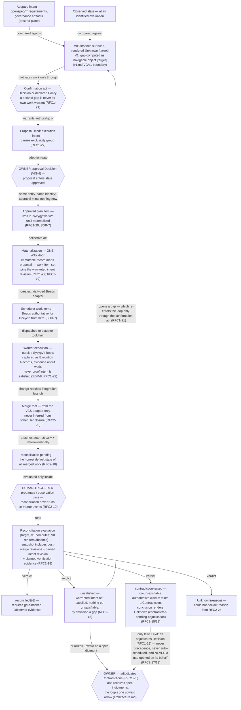

# 06 — Intent to Reconciliation Flow

> **Reviewed draft — grounded in proposed foundational contracts (currency note, not an ordering precondition: this bundle's own gate is §2 act 3 of the acceptance record and does not wait on the RFC act).** Reviewed fresh-context (reviews 5–7, dispositions recorded); updated at the rev7 rework for the corrected contracts (D1 historical scope, five governance categories, walkthrough three-way split, captured external confirmation, `Base` scenario context). Becomes canonical only by its **own owner act** — `ACCEPT TOPOLOGY: <bundle-manifest-digest>`, binding the exact digest of every file in the bundle — never implicitly on the RFC gate (RFC3-16: this stamp is a self-declaration; effective status lives in the owner-act record).
>
> Rendering: Mermaid is the durable, renderable fallback chosen for this phase; an Excalidraw + SVG upgrade is a tracked follow-up.

## What this shows

The full loop from adopted intent to a reconciliation verdict, with every
human-triggered gate marked (hexagons), the one-way materialization door,
and the post-merge reconciliation chain (RFC2-18) — with its four
separately-named, separately-routed outcomes — that no substrate provides
today. The whole loop is human-triggered; nothing here runs autonomously.

## Authority boundaries and gates

- **Human gates (hexagons):** gap confirmation, proposal approval, the
  propagate/observation trigger, the owner's adjudication of Contradictions,
  and the owner's handling of spec-indictments — two distinct owner acts, not
  one. Autonomy beyond VIS-4's bounds is licensed only through the mechanism
  VIS-4 names.
- **The two negative outcomes never merge** [Observed: RFC2-17/18]:
  `unsatisfied` means the warranted intent revision is not satisfied and
  nothing is co-unsatisfiable — that is a **gap**, so it opens one or routes
  upward as a spec-indictment. `contradiction-raised` means the evaluation
  found co-unsatisfiable authoritative claims — a **Contradiction** is minted,
  the conclusion renders Unknown (reason #8, `suspended` tier), and its only
  lawful exit is an `adjudicates` Decision: never resolved by precedence,
  never auto-scheduled into work, and specifically **never routed into work
  through a gap opened on its behalf** (RFC1-21). The two are separately
  named, separately counted, and separately routed; no surface, aggregate,
  endpoint, count, or UI string may merge them (RFC2-17).
- **Sequenced authority, no duplication** [Observed: RFC1-29]: before
  materialization the approved Proposal in `.syzygy/work/**` answers "what
  is the state of this planned work"; after it, the scheduler through its
  typed adapter. The materialization record is immutable — later scheduler
  divergence is a fact about the scheduler, never grounds to rewrite it.
- **Execution never proves intent** [Observed: vision.md thesis; RFC1-22]:
  merged and closed are execution states; the reconciliation verdict binds
  to the *warranted* intent revision, so post-merge intent drift surfaces
  as a new gap, not retroactive failure (RFC2-18).
- **The closure fallacy is forbidden** [Observed: RFC2-20]: scheduler
  closure never implies reconciled; scheduler-internal "reconciliation"
  (state repair) never shares a field or count with this chain (RFC2-17).

## [target] vs already true

- **[target]:** the entire flow. V0 targets: absence surfacing, the
  propagation proof-of-concept slice (one spec delta → one dispatched work
  item), and honest "reconciliation evidence absent / Unknown" rendering
  for merged work (SDR-12). V1 targets: gap computation and the computed
  reconciliation evaluation.
- **[Observed] today:** the reconciliation evaluation exists nowhere in any
  substrate — no object, no field, no convention (RFC 0002 Summary); the
  chain is created by these drafts.
- **[Inferred]:** the wall of reconciliation-pending Unknowns on a
  fleet-built project will be V0's most visible honest output; doctrine
  classifies it as correct, not a defect (RFC2-19).
