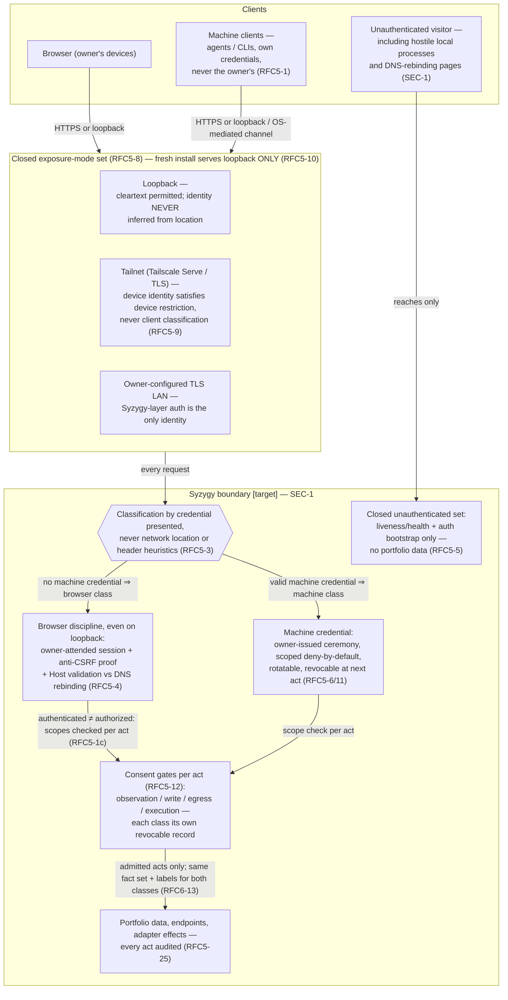

# 07 — Client Trust Boundaries

> **Reviewed draft — grounded in proposed foundational contracts (currency note, not an ordering precondition: this bundle's own gate is §2 act 3 of the acceptance record and does not wait on the RFC act).** Reviewed fresh-context (reviews 5–7, dispositions recorded); updated at the rev7 rework for the corrected contracts (D1 historical scope, five governance categories, walkthrough three-way split, captured external confirmation, `Base` scenario context). Becomes canonical only by its **own owner act** — `ACCEPT TOPOLOGY: <bundle-manifest-digest>`, binding the exact digest of every file in the bundle — never implicitly on the RFC gate (RFC3-16: this stamp is a self-declaration; effective status lives in the owner-act record).
>
> Rendering: Mermaid is the durable, renderable fallback chosen for this phase; an Excalidraw + SVG upgrade is a tracked follow-up.

## What this shows

Who may talk to Syzygy and through what: the two client classes, the three
closed exposure modes, classification by credential (never location), and
where the consent gates sit between an admitted client and any effect.

## Trust boundaries

- **Location is never identity** [Observed: SEC-1; RFC5-3]: loopback gets
  the full discipline; a browser page's fetch of `localhost` must fail
  origin validation and the anti-forgery proof structurally. An absent
  Origin header neither admits nor condemns.
- **Two credential populations plus one more** [Observed: RFC5-2/24]:
  browser sessions, machine credentials, and Syzygy's own adapter
  credentials are disjoint; none is transferable, and an execution profile
  can never name an adapter credential as injectable.
- **Fail closed** [Observed: RFC5-8]: an unauthenticated network-exposed
  configuration is invalid — Syzygy refuses to serve rather than serve it.
- **Acts vs claims** [Observed: RFC5-11]: revocation of a credential,
  consent, or profile takes effect at the next act, immediately; only the
  rendering of its consequences flows through identified evaluations.
- **Execution consent is the fourth gate** [Observed: RFC5-18]: observed
  code runs only under an owner-approved execution-profile version —
  default-deny credentials, declared network, resource limits, destructive
  operation gates (SEC-3); blocked entirely until RFC 0005 is accepted.

## [target] vs already true

- **[target]:** everything — no daemon, endpoint, session, credential, or
  profile machinery exists. The machine-client mechanism itself is an open
  enumerated choice for acceptance (RFC5-7; RFC 0005 §8 q1).
- **[Observed] today:** SEC-1..5 are adopted doctrine; the platform posture
  (local-first daemon + browser app, owner devices only) is recorded scope
  (v1.md) and remains RFC-open.
- **[Inferred]:** the tailnet mode reflects the owner's current device
  topology (FD-029/OQ-007); the class is "owner-controlled overlay with
  device identity and TLS," so Tailscale itself is substitutable.
