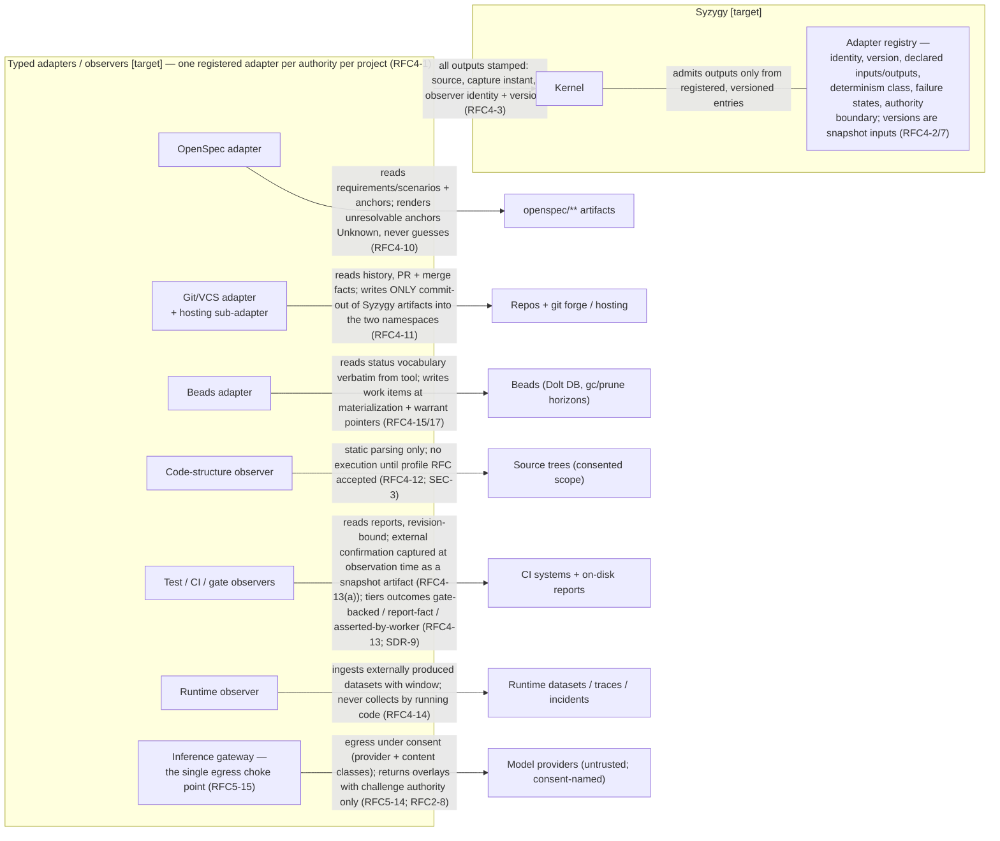

# 08 — Adapters and External Systems

> **Reviewed draft — grounded in proposed foundational contracts (currency note, not an ordering precondition: this bundle's own gate is §2 act 3 of the acceptance record and does not wait on the RFC act).** Reviewed fresh-context (reviews 5–7, dispositions recorded); updated at the rev7 rework for the corrected contracts (D1 historical scope, five governance categories, walkthrough three-way split, captured external confirmation, `Base` scenario context). Becomes canonical only by its **own owner act** — `ACCEPT TOPOLOGY: <bundle-manifest-digest>`, binding the exact digest of every file in the bundle — never implicitly on the RFC gate (RFC3-16: this stamp is a self-declaration; effective status lives in the owner-act record).
>
> Rendering: Mermaid is the durable, renderable fallback chosen for this phase; an Excalidraw + SVG upgrade is a tracked follow-up.

## What this shows

Every named adapter and observer of RFC 0004, the external authority each
mediates, the direction of trust on each arrow, and (in the table) each
one's authority boundary and degraded modes. All substrates are
substitutable realizations of roles; substitution is a registry event that
never rewrites history (RFC4-9).

## Per-adapter authority, trust direction, degraded modes

| Adapter / observer | Authority (answers only) | Trust direction | Degraded modes |
|---|---|---|---|
| **OpenSpec** (RFC4-10) | Requirement/scenario content + identity under the constitutional artifact contract — never intent adjudication, never status | Syzygy trusts artifact content as the external authority's; declares anchor stability class; continuity across edits [Unknown] | Unreadable artifact → source-unreachable; malformed artifact rendered as a fact; unresolvable anchor → Unknown, never rejection |
| **Git/VCS + hosting** (RFC4-11) | Version history only — never intent, never observed behavior | Inward: forge values win; outward: only Syzygy's own commit-out (SEC-4 attributed, revertable) | Unreachable remote → last-good marked stale; squash+branch-deletion → PR-granularity `reduced-fidelity`, never reconstructed; dangling SHA → broken reference |
| **Beads** (RFC4-15/16/17) | Work lifecycle after materialization only — never why work exists | Inward: substrate status verbatim, capture-stamped; outward: warrant pointer as re-derivable pointer, re-asserted on divergence, never merged | Export unavailable → last-good stale; replace-in-place fields `reduced-fidelity`; facts lost to gc/prune horizon → Unknown citing the retention event, never "no work existed" |
| **Code-structure** (RFC4-12) | What code exists — structure, never semantic ownership (SDR-3) | Observed code is untrusted (SEC-3); read-only static parsing; identity not path-only | Continuity unestablishable → new/retired elements via successor machinery, never similarity re-binding; unclassifiable content excluded, fails closed (SEC-5) |
| **Test/CI/gate** (RFC4-13) | Verification evidence as it exists — Syzygy reads reports, never runs them | Reports trusted only as artifacts about the revision they name (RFC2-11); externally confirmed outcomes carry their confirmation as a **captured artifact inside snapshot identity** (RFC4-13(a)) — provider record expiry never mutates a stored evaluation; tier never upgraded by the observer | Revision mismatch → stale on primary surface; missing referenced artifact → tier drops, dangling ref rendered broken; missing capture artifact → route unsatisfied, caps at report-fact |
| **Runtime** (RFC4-14) | Runtime observations (datasets, traces, incidents) with declared window | One-off captures are legitimate evidence; reproducibility a declared class property | Missing dataset/window → dependent claims Unknown; collection requiring execution blocked (SEC-3) |
| **Inference / model providers** (RFC2-7/8; RFC5-14/15) | None over truth — challenge authority only | Providers are services the owner does not control: egress consent-gated per provider + content class; composites inherit the highest embedded class | Absent/withdrawn consent → overlay not computed, renders Unknown (`unconsented-source-or-provider`); admitted challenges persist through their lifecycle after revocation (RFC5-13) |

## Cross-cutting rules

- **Substrate-term translation** [Observed: RFC4-6]: substrate vocabulary
  never impersonates kernel vocabulary — the scheduler's own
  "reconciliation" (state repair) never shares a field or count with
  doctrinal reconciliation (RFC2-17); `bead_id` and PR numbers are
  substrate-qualified aliases, never primary keys.
- **The confident adapter is the enemy** [Inferred: RFC 0004 §2]: silent
  normalization, interpolation, or forgetting manufactures comprehensible
  fiction; every fidelity loss carries a structured `reduced-fidelity`
  label with declared granularity, cause, and upgrade path (RFC4-24).
- **Derivation-first** [Observed: SDR-31; RFC4-28/29]: Syzygy is fully
  truthful from existing toolchain traces alone; instrumentation is a named
  co-evolution roadmap, never a dependency — a toolchain that emits nothing
  is rendered honestly, not rejected.

## [target] vs already true

- **[target]:** every adapter and the registry — none is implemented.
- **[Observed] today:** the external systems exist (git, GitHub-class
  forges, Beads with its gc/prune behavior, OpenSpec CLI, CI toolchains,
  model providers); the substrate audit findings adopted into RFC 0004
  (no run identity, unretained gate artifacts, squash-merge history loss)
  describe the currently installed toolchain.
- **[Inferred]:** adapter credentials and their SEC-5 storage discipline
  (RFC5-24) will constrain deployment shape before any stack choice is
  made.
