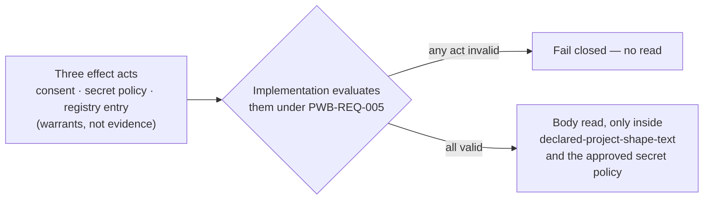

# Project status

> **As-of: 2026-09-15 (launch-gate v2.5/schema 2.1 approved for local installation; older entries retain their cited evidence dates).** To check whether that is still true, run
> `git log -1 --date=short --format='%h %ad' PROJECT-STATUS.md`: it names the
> commit that last touched this page. **If its date is later than the As-of
> above, someone edited this page without restating this line**, and the rows
> below may be older than they look. *(Until 2026-09-06 this line read
> "As-of: 2026-09-02 (the commit introducing this revision)" and named a
> command that returns the last commit, not the first — so the line falsified
> itself four days later and said nothing about it.)* A hand-authored pointer page:
> it **must not be the sole source** for any fact it states. Each row cites
> the record that owns it, and where they disagree the record wins and this
> page is stale.
>
> This page holds **current state only**. The launch-gate review chronology
> is at `.syzygy/governance/decisions/launch-gate/HISTORY.md`; process
> lessons are at `.syzygy/governance/decisions/PROCESS-LESSONS.md`; each
> pass's reports live in the `round-*` trees. None is default reading.

Syzygy is in **bounded Three-Surface POC mode (non-release)**. Capability 1
and its local runtime are implemented; the generalized Polaris generator
specification is adopted and its implementation authorized and in progress;
the Polaris project-wide Butlers (PWB) work is authorized for one consented
content class. Each section cites the record that owns its rows.

## Generalized Polaris generation

The generator specification and its two amendments are adopted, and
its implementation is authorized and in progress, with no provider or effect
authority and no model yet called on the current path.

- [Observed] On 2026-09-12 the owner adopted the generator specification and
  scoped applicability judgments, and authorized its full implementation.
  - The owning records are [specification adoption](.syzygy/governance/decisions/POLARIS-GENERATOR-SPECIFICATION-ADOPTION-ACT.md),
    [applicability](.syzygy/governance/decisions/POLARIS-GENERATOR-APPLICABILITY-ACT.md)
    and [implementation authorization](.syzygy/governance/decisions/POLARIS-GENERATOR-IMPLEMENTATION-AUTHORIZATION-ACT.md).
  - These are bootstrap owner acts with A1 explicitly absent.
  - The specification file keeps its original candidate banner, while the
    proposal and design carry present-tense status since the 2026-09-29
    [readability successor](.syzygy/governance/decisions/POLARIS-GENERATOR-BASE-READABILITY-SUCCESSOR-ACT.md);
    the acts determine status.
- [Observed] The owner adopted the [project-understanding amendment](.syzygy/governance/decisions/POLARIS-UNDERSTANDING-SPECIFICATION-ADOPTION-ACT.md)
  on 2026-09-13.
  - It extends seven generator requirements and adds discovery and owner
    clarification as 030/031.
  - Read the predecessor together with
    [the adopted amendment](openspec/changes/polaris-manifesto-understanding-amendment/specs/polaris-generation/spec.md):
    31 requirements and 182 scenarios without the signed-off
    [dossier local-agent addition](openspec/changes/polaris-dossier-local-agent-mode/specs/polaris-generation/spec.md)
    ([v1.0 sign-off](.syzygy/governance/decisions/POLARIS-DOSSIER-LOCAL-AGENT-MODE-SIGNOFF-v1.0.md);
    [v1.1 sign-off](.syzygy/governance/decisions/POLARIS-DOSSIER-LOCAL-AGENT-MODE-SIGNOFF-v1.1.md)), and
    35 requirements and 232 scenarios in the effective composition with it.
  - Its `spec.md` keeps its reviewed candidate-era banner; its proposal and
    design carry present-tense status since the 2026-09-29
    [readability successor](.syzygy/governance/decisions/POLARIS-UNDERSTANDING-READABILITY-SUCCESSOR-ACT.md).
    The acts determine status.
  - This is specification adoption, with no new implementation or effect
    permission inferred.
  - On 2026-09-28 the owner adopted the [tree-form and diagram amendment](.syzygy/governance/decisions/POLARIS-TREE-FORM-AMENDMENT-ADOPTION.md)
    to REQ-004, which adds five scenarios, authorized its generator
    implementation, and ruled that sanitized static SVG is inert under
    PWB-REQ-006.
  - [Observed] The later [technical digest reconciliation](docs/evidence/polaris-understanding-reconciliation-2026-09-28/technical-record.json)
    links that existing owner adoption to its exact REQ-004 bytes. The record
    adds no adoption or permission; run the checker in the battery below.
    The checker reads CC-SPEC and its own bytes as history, bound by a
    retained history review ([how](docs/evidence/polaris-understanding-reconciliation-2026-09-28/HISTORY-READING.md)).

**Implementation is in progress.**

- **Completion requires** the full owner workflow and reviewed output from
  the unchanged generator on two separately admitted real projects,
  including source-change regeneration.
  - Existing Butlers presentation and synthetic checks do not prove this
    outcome.
- **Still separately admitted:** project reads, provider egress and output
  writes.
- **Scope of the POC boundary below:** the older single-project POC boundary
  below still describes the existing PWB runtime, not this new generator's
  full authorized implementation target.
- **No model yet:** The current operator path calls no real model or provider.
  No model has been called on that path; the honesty layer and independent
  review remain the current critical path, without provider/effect
  authority.

## Lifecycle stage

**Bounded Three-Surface POC mode (non-release).** Capability 1 and its local
runtime are implemented trusted groundwork.

- **The direction:** on 2026-08-29 the owner directly authorized a
  deliberately bounded proof of concept across Polaris, Trajectory, and
  Orrery, using Butlers as the initial external proving project.
  - For this experiment only, the direction supersedes the
    Capability-1-only and no-external-project-onboarding restrictions.
  - It authorizes implementation outside Capability 1 only where required by
    the experiment; it does not amend doctrine, accepted contracts, or the
    adopted Capability 1 specification.
  - The owning record is `decisions/THREE-SURFACE-POC-MODE-DIRECTION.md`.
- **Its bounds:** the POC remains local, single-project, file-backed,
  human-triggered, and experimental.
  - It does not authorize production release or deployment, autonomous
    adoption of intent, Syzygy-authored implementation code, broad remote
    access, or multi-user support.
- **Its invariants:**
  - desired, execution, and observed state remain distinct;
  - no evidence means Unknown;
  - activity or merge state is never intent satisfaction;
  - human and machine views consume one shared fact model;
  - every positive claim has resolvable provenance.
- **What runs today:** the runnable POC now includes
  - an explicit human-triggered action that creates or reuses one bounded
    Bead;
  - Git-based worker-change observation for that item;
  - a separately invoked file-backed JUnit capture, ingestion and
    verification path.
- **What that does not prove:** these mechanisms being implemented is not
  evidence that a work item was materialized, a worker changed code, or a
  matching test artifact is current in any particular run.
  - The shared model renders the records it actually has and fails closed on
    absent or mismatched evidence.
  - The daemon never runs the observed test suite automatically and Syzygy
    never dispatches a worker or writes implementation code.

Dated groups of acts, 2026-09-01 to 2026-09-05, define human-act
provenance and the PWB authority for the one Butlers content class; each
names its own record.

**2026-09-01 — general trusted-bootstrap transaction.** The owner separately
performed the indivisible five-row general trusted-bootstrap authorization
transaction recorded in
`decisions/GENERAL-TRUSTED-BOOTSTRAP-AUTHORIZATION-ACT.md` and the append-only
`decisions/ACCEPTANCE-ACT-RECORD.md`.

- **It amended** the accepted RFC 0001–0009 bytes at the exact 30-module
  amendment manifest, seven signed contract-coverage artifacts, and
  CC-SPEC-8.
- **State (1) and state (2):** a valid exact-scope human act may now be
  effective in state (1), `owner-adopted (bootstrap, uncorrelated)`, or
  state (2), `Syzygy-verified`; only state (2) is independently verified.
- **It granted no** effect-specific consent, policy approval, registry
  adoption, observation, write, egress, execution, deployment, release,
  recovery, mission, or implementation authority.

**2026-09-02 — PWB state-(1) amendment.** The owner separately performed the
exact PWB state-(1) amendment sign-off recorded in
`decisions/PWB-STATE1-AMENDMENT-ACT.md` and the append-only act record.

- The eleven-artifact package at manifest `14a84aba…b1e` is now the signed
  behavioral authority: PWB-REQ-005 and PWB-REQ-022 accept valid exact-scope
  human acts in state (1) or state (2), preserve the exact state, fail
  invalid acts closed and never call state (1) independently verified.
- This sign-off created no consent, policy approval, registry adoption,
  body-read or implementation authority.

**2026-09-05 — PWB truth-and-readiness packet.** All three acts of the packet
are performed; consent is unchanged.

- **Decision 1:** the owner signed Decision 1 of the PWB truth-and-readiness
  packet, recorded in `decisions/PWB-TRUTH-READINESS-AMENDMENT-ACT.md` and the
  append-only act record: the eleven-artifact package at
  `contracts/candidates/pwb-truth-policy-amendment/PWB-BEHAVIOR-AMENDMENT-MANIFEST.txt`
  supersedes the 2026-09-02 digests as the signed behavioral authority
  (closed fact/precedence grammar, inert-code admission, deterministic
  resource envelope, one transient verbatim baseline requirement, PWB-REQ-021
  readiness).
- **Decision 2:** the same day the owner approved Decision 2, the amended
  secret-classification policy, as a separate state-(1) act bound to the
  policy's own SHA-256 and recorded in
  `decisions/PWB-SECRET-CLASSIFICATION-POLICY-AMENDMENT-ACT.md`; it
  supersedes the 2026-09-02 policy approval for that role only, and that
  earlier record stays immutable history.
- **Decision 3:** the owner then adopted Decision 3, the amended observer
  registry entry, the same way
  (`decisions/PWB-OBSERVER-REGISTRY-ENTRY-AMENDMENT-ACT.md`), superseding the
  2026-09-02 adoption for the registry role only.
- **Implementation continuation:** the owner then continued PWB
  implementation authorization for the 2026-09-05 amendment by direct
  direction the same day
  (`decisions/PWB-IMPLEMENTATION-AUTHORIZATION-CONTINUATION-ACT.md`, closing
  bead syzygy-8i7): the amended semantics, policy and registry entry are now
  the implementation target, with every 2026-09-02 exclusion retained and no
  new authority added.

**Later on 2026-09-02 — the three effect-specific acts, then implementation
authorization.** The owner performed the three separate effect-specific acts
PWB-REQ-005 requires, each a state-(1) act bound to its artifact's own
SHA-256 at frozen subject `48e0f5d`:

- observation consent for the configured Butlers repository
  (`decisions/PWB-BUTLERS-OBSERVATION-CONSENT-ACT.md`);
- approval of the concrete secret-classification policy
  (`decisions/PWB-SECRET-CLASSIFICATION-POLICY-ACT.md`);
- adoption of the project-shape observer registry entry
  (`decisions/PWB-OBSERVER-REGISTRY-ENTRY-ACT.md`).

What those acts do, and what followed:

- Each is recorded in the append-only act record with A1 explicitly absent;
  none is independently verified.
- Together they close the effect gate for the one Butlers project-shape
  content class. They grant no implementation authority by themselves.
- The owner then granted **PWB implementation authorization** the same day
  (`decisions/PWB-IMPLEMENTATION-AUTHORIZATION-ACT.md`, closing task 1.8):
  the owner's one-word reply is recorded verbatim with the recorder's
  explicit scope reading.
  - Implementation of tasks §2–§5 is now dispatchable in the ordinary
    implementation plane.
  - The first Butlers body read is lawful only after the implementation
    itself evaluates the three acts under PWB-REQ-005, and only for the
    consented content class.

## The launch path, in one table

The launch target is **Capability 1 — Project registration and honest shape
visibility**. Its contract prerequisite is **Waves A + B only**.

| Step | State | Owning record |
|---|---|---|
| Wave A (RFC 0001–0006, 19 modules) | **ACCEPTED — original act performed 2026-08-17.** The owner wrote the exact phrase over the RD-31b-confirmed argument `8972d963…`; the 19 modules were installed at `contracts/rfcs/` under shape (M). That act-time manifest remains immutable history. The installed modules remain accepted and their current bytes are now bound by the 2026-09-01 30-module contract-amendment manifest. | `decisions/ACCEPTANCE-ACT-RECORD.md`; historical tag `wave-a-accepted-2026-08-17`; `contracts/candidates/general-trusted-bootstrap-authorization/CONTRACT-AMENDMENT-MANIFEST.txt` |
| Wave B (RFC 0007–0009 + the three surfaces, 11 modules) | **ACCEPTED — original act performed 2026-08-17, after Wave A.** The owner wrote the exact phrase over the RD-32c-confirmed argument `193e3c1e…`; the 11 modules were installed under shape (M). That act-time manifest remains immutable history. The installed modules remain accepted and their current bytes are now bound by the same 2026-09-01 30-module contract-amendment manifest. | `decisions/ACCEPTANCE-ACT-RECORD.md`; historical tag `wave-b-accepted-2026-08-17`; `contracts/candidates/general-trusted-bootstrap-authorization/CONTRACT-AMENDMENT-MANIFEST.txt` |
| Waves C1/C2/D1/D2 | **Deferred** — candidate, not accepted, not used by the launch target, not offered. Not retired. | `contracts/candidates/DEFERRED-WAVE-POSTURE.md` |
| Owner rulings, 2026-08-16 | **P-31, P-33, P-35, P-36, P-37, P-38, P-39, P-40 ruled** in one adversarially-reviewed sitting, plus P-34 below. Zero contract bytes moved; both wave confirmations survive. | `decisions/DECISION-HISTORY.md` §"Resolved on 2026-08-16 (owner ruling via adversarially-reviewed questionnaire packet)"; each row names its owning record |
| Launch-gate policy | [Observed] **Owner-approved v2.5 / schema 2.1**, 2026-09-15: RD-56 f11 and P-53 corrected. RD-67 f1 and RD-68 f1 remain disclosed; F5 remains unpromoted. Historical review verdicts and P-34 approval remain unchanged. | `decisions/LAUNCH-GATE-V2.5-AUTHORITY-DECISION.md`; predecessor `decisions/LAUNCH-GATE-AUTHORITY-DECISION.md` |
| P-41 + P-42, offered jointly | **PERFORMED — original acts 6 and 7, 2026-08-17, one sitting** (the joint-sitting requirement satisfied). CC-SPEC-1…11 and CC-IMPACT-1…7 remain **in force as owner-confirmed craft**. The original act-time statements and digests remain immutable history. The 2026-09-01 transaction separately amended CC-SPEC-8 at the current policy digest; CC-IMPACT was not amended. | `decisions/ACCEPTANCE-ACT-RECORD.md`; `.syzygy/governance/policies/craft-and-care/INSTALL-RECORD.md`; historical tag `craft-acts-6-7-confirmed-2026-08-17` |
| General trusted-bootstrap authorization transaction | **PERFORMED 2026-09-01 — one indivisible five-row transaction.** RFC 0001–0009 remain accepted at the amended 30-module manifest; the Capability 1 and Three-Surface coverage files plus five PWB coverage artifacts are amended; CC-SPEC-8 is amended. State (1) and state (2) may each carry an effective valid human act, but only state (2) is independently verified. At this act PWB-REQ-005/022 remained state-(2)-only; the separate 2026-09-02 act below superseded that behavior. RFC 0010/0011 remain candidate. | `decisions/GENERAL-TRUSTED-BOOTSTRAP-AUTHORIZATION-ACT.md`; `decisions/ACCEPTANCE-ACT-RECORD.md`; `contracts/candidates/general-trusted-bootstrap-authorization/TRANSACTION-MANIFEST.txt` |
| Contract readability restyle (RFC 0001–0009) | **PERFORMED 2026-09-28 — link 2 of the contract successor chain.** 29 of the 30 accepted modules take their CC-REV-8 restyled bytes on both mirrors; clause leads, front matter and headings are unchanged, and `RFC-0007/rendering-and-surface.md` stays bound where it was. Grants no implementation or other permission. | `decisions/CONTRACT-READABILITY-RESTYLE-ADOPTION-ACT.md`; `decisions/ACCEPTANCE-ACT-RECORD.md`; `contracts/candidates/contract-readability-restyle/CONTRACT-AMENDMENT-MANIFEST.txt` |
| Specification-policy readability restyle (CC-SPEC, CC-IMPACT) | **PERFORMED 2026-09-28.** Both in-force specification policies take their CC-REV-8 restyled bytes; every clause identifier, lead and heading is unchanged, and the three disclosed banner fixes are in. The act-6, act-7 and bootstrap-transaction digests for them are now history. Grants no implementation or other permission. | `decisions/SPEC-POLICY-READABILITY-RESTYLE-ADOPTION-ACT.md`; `decisions/ACCEPTANCE-ACT-RECORD.md`; `contracts/candidates/spec-policy-readability-restyle/SPEC-POLICY-AMENDMENT-MANIFEST.txt` |
| Specification readability successors (Three-Surface POC, Capability 1, Polaris generator base, Polaris understanding) | **PERFORMED 2026-09-29 — four separate owner acts in one sitting.** Each adopted specification's proposal and design take their CC-REV-8 restyled bytes, with present-tense status banners naming the acts that adopted them; the POC also takes its restyled requirement layout and regenerated dependencies. Every requirement identity, scenario and warrant is unchanged. Grants no implementation or other permission. | `decisions/THREE-SURFACE-POC-READABILITY-SUCCESSOR-ACT.md`; `decisions/CAPABILITY-1-READABILITY-SUCCESSOR-ACT.md`; `decisions/POLARIS-GENERATOR-BASE-READABILITY-SUCCESSOR-ACT.md`; `decisions/POLARIS-UNDERSTANDING-READABILITY-SUCCESSOR-ACT.md`; `decisions/ACCEPTANCE-ACT-RECORD.md` |
| PWB observer-registry currency and briefing amendment | **PERFORMED 2026-09-30 — one superseding `adopt-registry-entry` act, state (1), bound to the entry's own SHA-256.** The registry entry moves to version `1.2.0-candidate.1`: 13 declared per-class currency bounds under one closed semantics block (an undeclared class stays Unknown; an out-of-bound assessment is a typed result), and one further response ceiling, `maxBriefingResponseBytes`, for single-claim briefing views. Supersedes the 2026-09-05 registry adoption for the registry role only. No code consumes the new fields until a separate continuation direction; no briefing route is served before its machine-view specification is signed off. Itself superseded for the registry role on 2026-10-02 by the behaviour-contract re-pin. | `decisions/PWB-OBSERVER-REGISTRY-CURRENCY-BRIEFING-AMENDMENT-ACT.md`; `decisions/ACCEPTANCE-ACT-RECORD.md`; `contracts/candidates/pwb-registry-currency-briefing-amendment/` |
| PWB behaviour-contract re-pin, secret policy and registry entry (`syzygy-jloi`) | **PERFORMED 2026-10-02 — two separate superseding state-(1) acts, each bound to its artifact's own SHA-256, plus plain continuation direction C.** The secret-classification policy (`approve-policy`, superseding the 2026-09-05 approval) and the observer registry entry (`adopt-registry-entry`, superseding the 2026-09-30 adoption) now pin `governingBehaviorContract` to the PWB `spec.md` signed as `pwb-readability-successor-v1.0`, and name that sign-off; nothing else in either file moves, and no version label changes. Given by one option selection ("A + B + C now"), not typed phrases; the question's garbled parenthetical is disclosed and the binding is to the manifest rows. By direction C the body-read gate evaluates the two new acts; no new field is read. Bound to the round-1 notes-only `CONFIRM WITH EXCEPTIONS`. | `decisions/PWB-SECRET-CLASSIFICATION-POLICY-BEHAVIOR-CONTRACT-REPIN-ACT.md`; `decisions/PWB-OBSERVER-REGISTRY-BEHAVIOR-CONTRACT-REPIN-ACT.md`; `decisions/OWNER-INSTRUCTIONS-2026-10-02-PWB-BEHAVIOR-CONTRACT-REPIN.md`; `decisions/ACCEPTANCE-ACT-RECORD.md`; `contracts/candidates/pwb-behavior-contract-repin/` |
| Polaris understanding dependency-union successor (`syzygy-c51h`) | **PERFORMED 2026-10-02 — one digest-bound successor act over one file.** The amendment's generated `GOVERNING-DEPENDENCIES.md` is regenerated from its specification's warrants blocks: the policies class gains `CC-REV-8`, which REQ-polaris-generation-004 already declared. No other byte of the amendment moves; it supersedes the 2026-09-29 understanding readability act for that one file only. Given by one option selection ("Sign off"), late on 2026-10-02 local time, recorded 2026-10-03; act instant 2026-10-02 UTC. Bound to the round-1 notes-only `CONFIRM WITH EXCEPTIONS`. Grants no implementation or other permission. | `decisions/POLARIS-UNDERSTANDING-DEPENDENCY-UNION-SUCCESSOR-ACT.md`; `decisions/OWNER-INSTRUCTIONS-2026-10-02-POLARIS-UNDERSTANDING-DEPENDENCY-UNION.md`; `decisions/ACCEPTANCE-ACT-RECORD.md`; `contracts/candidates/polaris-understanding-dependency-union-successor/` |
| Response-ceiling reading under compression (P-77 Q2) | **Issued 2026-09-30 — plain owner direction.** Each "final encoded HTTP body" response ceiling measures the body before any HTTP content coding, including ceilings adopted later; gzip may ship only when it shrinks the body, so bytes sent never exceed bytes checked. No ceiling value, route or specification byte changes. Unblocks M10 slice 4b. | `decisions/POLARIS-RESPONSE-CEILING-READING-DIRECTION.md`; `decisions/POLARIS-RESPONSE-CEILING-READING-DECISION-PACKET.md` |
| Version-tagged sign-off for implementation-phase artifacts (Scope A) | **Issued 2026-10-02 — plain owner direction.** For the PWB specification deltas, the observer registry entry and the queued contract successors, the owner's selection of an option naming a package and a `major.minor` version is the sign-off, bound by the git tag `<package>-v<major>.<minor>`; no typed phrase and no digest argument. Doctrine, accepted contracts and every act already performed keep their digests. Recorder: `scripts/record_versioned_signoff.py` (covers the RFC-0007 scoped-values successor and lane B so far). | `decisions/OWNER-DIRECTION-VERSIONED-SIGNOFF-SCOPE-A-2026-10-02.md` |
| PWB opening-band aggregate scenario (P-71 Q7) | **PERFORMED 2026-10-01 — one amendment act over the eleven PWB behavioral artifacts, bound to its manifest digest.** PWB-REQ-010 gains one conditional scenario: if Polaris's first reading level renders an aggregate over the Unknown project-shape claims of one evaluation before the first capability catalog, there is exactly one, it displaces no category, it carries the PWB-REQ-007 tuple with separate primary and secondary counts and no headline status, and every counted claim stays disclosed in place. Nothing requires the band to be built. Authorizes no implementation; slice 3 needs a separate authorization and slices 4–5 stay gated on `syzygy-dov.26`. Bound to round 11's notes-only `CONFIRM WITH EXCEPTIONS`. | `decisions/PWB-OPENING-BAND-SCENARIO-ACT.md`; `decisions/ACCEPTANCE-ACT-RECORD.md`; `contracts/candidates/pwb-opening-band-scenario/` |
| PWB exact-source render-mode amendment (P-81 Q1) | **PERFORMED 2026-10-02 — one amendment act over the eleven PWB behavioral artifacts, bound to its manifest digest.** PWB-REQ-011 serves every admitted source in one of two render modes (requirement-section or whole-body) behind the same complete-body authority, secret and inert-content gates; the nine withheld sources stay unserved and no content class widens. Authorizes no implementation; the M14 slices need a separate authorization. Bound to a fresh round's notes-only `CONFIRM WITH EXCEPTIONS`. | `decisions/PWB-EXACT-SOURCE-RENDER-MODE-AMENDMENT-ACT.md`; `decisions/ACCEPTANCE-ACT-RECORD.md`; `contracts/candidates/pwb-exact-source-render-mode-scenario/` |
| Lane B scoped epistemic attributes (P-68) | **DECLINED 2026-10-02 — plain owner direction.** Narrowed to the page-level evaluation stamp it saves about 50 KB [Inferred], short of the 1.4 MB target; the owner closed it and revised the working page target to 1,650,000 bytes. The specification and RFC7-33 stand unamended; nothing was applied. | `decisions/POLARIS-LANE-B-DECLINED-AND-TARGET-REVISED-DIRECTION.md`; `contracts/candidates/pwb-scoped-attributes-amendment/` |
| PWB machine-view amendment (P-72 Q1, P-76 Q3) | **PERFORMED 2026-10-02 — one amendment act over the eleven PWB behavioral artifacts, bound to its manifest digest.** PWB-REQ-020 names two closed categories of machine response beside the machine answer: the derived read-only machine view (`/api/poc/polaris` and the prospective `/api/poc/briefing`) and the generated editorial draft view (`/polaris/draft/<runId>`). Membership changes only by a later signed amendment; a member needing its own ceiling is not served before the registry entry declares it. Authorizes no implementation. Bound to a fresh round's notes-only `CONFIRM WITH EXCEPTIONS`; the draft view's relation to the render-mode anchors is left to the later route amendment. | `decisions/PWB-MACHINE-VIEW-AMENDMENT-ACT.md`; `decisions/ACCEPTANCE-ACT-RECORD.md`; `contracts/candidates/pwb-machine-view-amendment/` |
| PWB missing-currency disclosure scenario (P-69 Q7a) | **SIGNED v1.0 2026-10-02 — version-tagged sign-off.** PWB-REQ-007 gains one scenario: a class with no effective currency bound renders its claims Unknown with reason `no-currency-bound-declared`, and the unbounded members are never shown as fresh, zero or omitted; an aggregate carries no freshness value of its own and discloses their count through the named disclosure. Authorizes no implementation. Bound to a notes-only `CONFIRM WITH EXCEPTIONS` (round 4). | `decisions/PWB-MISSING-CURRENCY-DISCLOSURE-SCENARIO-SIGNOFF-v1.0.md`; `decisions/ACCEPTANCE-ACT-RECORD.md`; `contracts/candidates/pwb-missing-currency-disclosure-scenario/` |
| PWB dismissal-with-expiry amendment (P-79 Q5) | **SIGNED v1.0 2026-10-02 — version-tagged sign-off.** PWB-REQ-007 admits a recorded, reasoned, expiring human dismissal of an Unknown claim, kept visible and counted apart. Regenerated over the applied missing-currency text; the owner selected "Sign off v1.0 (Recommended)". Authorizes no implementation. Bound to a notes-only `CONFIRM WITH EXCEPTIONS` (round 6); tag `pwb-dismissal-expiry-amendment-v1.0` on the merged sign-off commit. | `decisions/PWB-DISMISSAL-EXPIRY-AMENDMENT-SIGNOFF-v1.0.md`; `decisions/ACCEPTANCE-ACT-RECORD.md`; `contracts/candidates/pwb-dismissal-expiry-amendment/` |
| PWB container-shape profile amendment (N8, `syzygy-u05.8`) | **SIGNED v1.0 2026-10-02 — version-tagged sign-off.** Each project's profile declares its container shapes from closed nine-shape and eight-key-form lists, with no built-in fallback once a profile is loaded. Bound to the round-7 notes-only CONFIRM WITH EXCEPTIONS; tag `pwb-container-shape-profile-amendment-v1.0`. | `contracts/candidates/pwb-container-shape-profile-amendment/`; `decisions/PWB-CONTAINER-SHAPE-PROFILE-AMENDMENT-SIGNOFF-v1.0.md` |
| PWB item-depth amendment (P-81 Q5, `syzygy-dov.14.2`) | **SIGNED v1.0 2026-10-02 — version-tagged sign-off.** PWB-REQ-015 extends the deep dive from capabilities to every declared catalog item, with a separate governing-intent relation claim per item; the relation claim stays Unknown (`no-currency-bound-declared`) until a later change admits a relation source and a currency bound, and a capability keeps its contract band only when exactly one item matches it by declared key. Authorizes no implementation. Bound to the round-3 notes-only CONFIRM WITH EXCEPTIONS; tag `pwb-item-depth-amendment-v1.0`. | `contracts/candidates/pwb-item-depth-amendment/`; `decisions/PWB-ITEM-DEPTH-AMENDMENT-SIGNOFF-v1.0.md` |
| PWB readability successor (`syzygy-73e.5.5`) | **SIGNED v1.0 2026-10-02 — version-tagged sign-off.** Restyles the signed PWB `spec.md`, `proposal.md` and `design.md` (with `GOVERNING-DEPENDENCIES.md` regenerated): a non-normative reading guide, requirements in labelled blocks keeping their exact words, every scenario byte-equal, proposal and design in plain present tense. Changes no requirement. Bound to the round-1 notes-only CONFIRM WITH EXCEPTIONS; tag `pwb-readability-successor-v1.0`. | `contracts/candidates/pwb-readability-successor/`; `decisions/PWB-READABILITY-SUCCESSOR-SIGNOFF-v1.0.md` |
| PWB tree-framing amendment (`syzygy-73e.9`) | **SIGNED v1.0 2026-10-03 — version-tagged sign-off.** PWB-REQ-014 gives `/polaris` model-derived one-sentence openings (weakest child label, scope if partial, no counts) for every group, keeps Butlers text verbatim, and admits static SVG diagrams only for relationships the independent rendered-design review lists, each drawn element a labelled claim with a text equivalent. Authorizes no implementation (`syzygy-73e.20`). Bound to the round-2 notes-only CONFIRM WITH EXCEPTIONS; tag `pwb-tree-framing-amendment-v1.0`. | `contracts/candidates/pwb-tree-framing-amendment/`; `decisions/PWB-TREE-FRAMING-AMENDMENT-SIGNOFF-v1.0.md` |
| Specification readability reconciliation (`syzygy-73e.5.6`) | **Recorded 2026-10-02 — technical record, no act.** All five readability successors have terminal owner outcomes (four digest acts 2026-09-29, PWB by version tag 2026-10-02), each still binding the bytes on disk; the CAP1-REQ, POC-REQ, PWB-REQ and effective REQ-polaris-generation populations are re-derived by two methods, with default routes and generated dependency rows checked against them. Found stale inside bound bytes, each needing its own owner act and none performed: the observer registry entry and the secret-classification policy pin a superseded PWB `spec.md` digest (`syzygy-jloi`) [superseded 2026-10-02: both re-pinned by the behaviour-contract re-pin acts; R6 now reports 0] [superseded 2026-10-03: the PWB tree-framing sign-off moved `spec.md` past the re-pinned row, so R6 reports both pins again (Unknown) until a further re-pin act; the reconciliation is re-derived to name that sign-off as the PWB child's later successor and the PWB census is 17 requirements / 51 scenarios (record §10)], and the understanding amendment's generated dependency union lacks `CC-REV-8` (`syzygy-c51h`) [superseded 2026-10-02: regenerated by the dependency-union successor act; the reconciliation is re-derived to name that act as the understanding child's successor, and R7 now reports 0]. Grants nothing. | `docs/evidence/spec-readability-reconciliation-2026-10-02/README.md`; `scripts/check_spec_reconciliation.py` |
| PWB state-(1) behavioral amendment | **SIGNED 2026-09-02 — exact eleven-artifact package.** Valid state-(1) or state-(2) human acts may satisfy PWB-REQ-005 and PWB-REQ-022 with exact state visible; only state (2) is independently verified, invalid acts fail closed and acts remain warrants. This is behavioral authority only: no effect-specific act, body read or implementation authority was granted. | `decisions/PWB-STATE1-AMENDMENT-ACT.md`; `decisions/ACCEPTANCE-ACT-RECORD.md`; `contracts/candidates/pwb-state1-amendment/PWB-AMENDMENT-MANIFEST.txt` |
| PWB implementation authorization (task 1.8) | **GRANTED 2026-09-02 — owner direction, state (1), recorded verbatim with the recorder's scope reading.** Authorizes tasks §2–§5 of the signed change as one bounded POC improvement cycle and the first body read of the one Butlers repository for content class `declared-project-shape-text`, after the implementation evaluates the three effect acts under PWB-REQ-005. No write, egress, execution, deployment, release, recovery, mission, second repository, or act-bound-artifact edit. | `decisions/PWB-IMPLEMENTATION-AUTHORIZATION-ACT.md` |
| PWB effect-specific acts (consent, policy, registry) | **PERFORMED 2026-09-02 — three separate state-(1) acts, each bound to its artifact's SHA-256.** Observation consent for the configured Butlers repository and content class `declared-project-shape-text`; the concrete secret-classification policy approved; the read-only, empty-write-surface observer registry entry adopted. A1 explicitly absent; not independently verified; acts are warrants, not evidence of effect. No implementation authority and no body read until task 1.8's separate authorization. | `decisions/PWB-BUTLERS-OBSERVATION-CONSENT-ACT.md`; `decisions/PWB-SECRET-CLASSIFICATION-POLICY-ACT.md`; `decisions/PWB-OBSERVER-REGISTRY-ENTRY-ACT.md`; `decisions/ACCEPTANCE-ACT-RECORD.md`; `contracts/candidates/pwb-effect-acts/PWB-EFFECT-ACTS-MANIFEST.txt` |
| Formal launch administration | **Administration 1 performed 2026-08-18 — verdict `NOT READY`** (10 plain Not-met, 2 scoped, 5 Unknown, 0 reopened). Out-of-family (OpenAI GPT-5.6 Pro), fresh context with disclosed limitations, against commit `71e5986` at approved v2.4; the record validated and its verdict computed by the committed scripts. The strongest findings are stale current-state claims on the default path (since repaired), the contract-index drift (since regenerated), Wave A rejection collapsing the launch path (B4), clone-unreachable D1 rationale (C7), and unbounded governance effort (F6). The 2026-08-09 v1.3 **pilot** (`NOT READY`) remains steering evidence only. | `decisions/launch-gate/ADMINISTRATION-2026-08-18-CAPABILITY-1.json` (the record); `decisions/launch-gate/TREND-LOG.md` |
| Owner rulings, 2026-08-19 (the Administration-1 inputs) | **P-45…P-48 all ruled** in one adversarially-reviewed sitting, applied same day: the **A6 resource envelope stated** (2h/week; Claude-family + occasional GPT 5.6-family review; $200/mo ceiling; 2–3 workstreams) with **syzygy itself named the first proving project** (butlers second); **no governance ceiling** — case-by-case recorded knowingly (F6 stays `Not met`, disclosed, non-conjunct); the **governance-reduction plan adopted as directed work** (§1/§2/§4 retirements executed; §3 awaits the first accepted spec; no deferral created); the **repair cycle bounded at two further administrations** (if Administration 3 is not `READY`, the owner decides directly on the record in hand). Zero contract bytes moved. | `decisions/DECISION-HISTORY.md` §"Resolved on 2026-08-19, second sitting"; records `A6-RESOURCE-ENVELOPE-`, `F6-GOVERNANCE-CEILING-`, `F2-GOVERNANCE-REDUCTION-`, `LAUNCH-REPAIR-STOP-CONDITION-DECISION.md` |
| Owner launch decision | **Made 2026-08-20** — Capability 1 specification authoring authorized, with the `NOT READY` verdict in hand and accepted as diagnostic evidence; the P-48 stop-condition cycle ends early by the owner deciding directly. Specification definition only — no implementation, no implementation planning. | `decisions/CAPABILITY-1-SPECIFICATION-AUTHORING-DECISION.md` |
| OpenSpec (`openspec/`) | **Capability 1 remains ADOPTED: `project-registration-and-honest-shape-visibility`** (schema `spec-driven`, OpenSpec pinned 1.9.0). The owner adopted seven artifacts on 2026-08-20; the 2026-09-01 transaction superseded `CONTRACT-COVERAGE.md`'s digest and the 2026-09-29 readability successor superseded `proposal.md`'s and `design.md`'s, leaving `spec.md`, the other three artifacts and all required behavior unchanged. The accepted specification supersedes the Capability 1 charter for required behaviour. Four further changes are in force (POC, PWB, Polaris generator base and understanding amendment); `openspec/README.md` names each one's acts. | `decisions/CAPABILITY-1-SPECIFICATION-ADOPTION-ACT.md` (original act); `decisions/CAPABILITY-1-READABILITY-SUCCESSOR-ACT.md` (current bytes); `decisions/ACCEPTANCE-ACT-RECORD.md`; `openspec/README.md` |
| Implementation | **AUTHORIZED for Capability 1 — act dated 2026-08-21.** Plan first (stack, layout, slices→CAP1-REQ mapping, testing/evidence, review classes), then a bounded Beads backlog and code in ordinary root paths (`apps/**`, `packages/**`, tooling) — never in the governed plane. Capability 1 only; production deployment, onboarding, and release stay separate future decisions. | `decisions/CAPABILITY-1-IMPLEMENTATION-AUTHORIZATION-ACT.md` |
| Three-Surface POC | **AUTHORIZED 2026-08-29, non-release and bounded.** One live Butlers proving project; WIP one for shared-model changes. The runnable implementation exposes human-triggered Bead materialization, worker-change observation, and separate file-backed test-artifact capture/ingestion/verification; availability of those paths is not a positive evidence claim for the current run. The original eight items completed 2026-08-30: all three product assumptions NOT FALSIFIED (`docs/reviews/R-POC-PRODUCT-REVIEW.md`), PRF-1 repair CONFIRMED. The owner's 2026-08-30 direction extends the experiment with **improvement cycles** (review → finding-derived repairs → confirmation, owner-reported per cycle), lifting the eight-item cap and one-review budget; every other bound stands. | `decisions/THREE-SURFACE-POC-MODE-DIRECTION.md`; `decisions/THREE-SURFACE-POC-IMPROVEMENT-CYCLES-DIRECTION.md`; `docs/THREE-SURFACE-POC.md` |

**Four original foundational owner acts were performed on 2026-08-17:** Wave
A, Wave B, and craft acts 6 + 7.

- A separate indivisible five-row amendment transaction was performed on
  2026-09-01, followed by the separate PWB behavioral amendment on
  2026-09-02; neither is a foundational offering.
- `.syzygy/governance/decisions/ACCEPTANCE-ACT-RECORD.md` exists since the
  first act and owns every performed act.
- The nine still-open foundational offerings remain open: deferred Waves
  C1/C2/D1/D2, CC-TEST-2, topology, overview, D3, and **P-12 knowledge
  hygiene** as the ninth.

## Gates already closed

Every gate below is closed; each row names what closed it.

| Gate | State | Owning record |
|---|---|---|
| Doctrine adoption | ✅ Adopted 2026-07-30; amendments D1, D5 (2026-09-27, readability rewrite), D6 (2026-09-27, tree-style restyle) and D9 (2026-10-06, SEC-3's attended-agent-session case) in force | tag `doctrine-adopted-2026-07-30`; `.syzygy/governance/decisions/DOCTRINE-AMENDMENT-LOG.md` |
| Craft-and-care approval | ✅ Approved (owner decision D2); CC-REV-8 added 2026-09-27 | `.syzygy/governance/policies/craft-and-care/INSTALL-RECORD.md` |
| Surface decisions | ✅ Recorded SDR-1…37 | `.syzygy/governance/decisions/SURFACE-DECISION-RECORD.md` |
| The 2026-08-16 rulings | ✅ See the launch-path table above | `decisions/DECISION-HISTORY.md` §"Resolved on 2026-08-16" |
| The 2026-08-18 questionnaire rulings | ✅ P-14 (MIT), P-16 (term registry as drafting vocabulary), P-24 (D4: inside VIS-4's bounds), P-44 (CC-REV-2 exception declined) — applied 2026-08-19 | `decisions/DECISION-HISTORY.md` §"Resolved on 2026-08-19"; each row's own decision record |
| The Administration-1 owner inputs | ✅ P-45…P-48 ruled and applied 2026-08-19 — see the launch-path table above | `decisions/DECISION-HISTORY.md` §"Resolved on 2026-08-19, second sitting" |
| License | ✅ **MIT** — root `LICENSE`; contributor-agreement posture remains a separate open question | `decisions/LICENSE-CHOICE-DECISION.md` |
| General trusted-bootstrap transaction | ✅ Five rows performed indivisibly 2026-09-01; provenance semantics, seven coverage artifacts and CC-SPEC-8 reconciled; no effect-specific or implementation authority granted | `decisions/GENERAL-TRUSTED-BOOTSTRAP-AUTHORIZATION-ACT.md`; `decisions/ACCEPTANCE-ACT-RECORD.md` |
| PWB state-(1) amendment | ✅ Eleven artifacts signed 2026-09-02; PWB-REQ-005/022 now accept valid state (1) or state (2), with exact state visible and invalid acts fail closed; no effect-specific or implementation authority granted | `decisions/PWB-STATE1-AMENDMENT-ACT.md`; `decisions/ACCEPTANCE-ACT-RECORD.md` |
| PWB truth-and-readiness amendment (Decision 1) | ✅ Eleven artifacts signed 2026-09-05, superseding the 2026-09-02 digests; implementation-authorization continuation granted the same day | `decisions/PWB-TRUTH-READINESS-AMENDMENT-ACT.md`; `decisions/ACCEPTANCE-ACT-RECORD.md`; `contracts/candidates/pwb-truth-policy-amendment/OWNER-DECISION-PACKET.md` |
| PWB secret-policy amendment (Decision 2) | ✅ Amended policy approved 2026-09-05 in state (1) at its own SHA-256, superseding the 2026-09-02 approval for the policy role only; the earlier record stays immutable history. Itself superseded for the policy role on 2026-10-02 by the behaviour-contract re-pin | `decisions/PWB-SECRET-CLASSIFICATION-POLICY-AMENDMENT-ACT.md`; `decisions/ACCEPTANCE-ACT-RECORD.md` |
| PWB observer-registry amendment (Decision 3) | ✅ Amended registry entry adopted 2026-09-05 in state (1) at its own SHA-256, superseding the 2026-09-02 adoption for the registry role only; the earlier record stays immutable history. Itself superseded for the registry role on 2026-09-30 by the currency-and-briefing amendment | `decisions/PWB-OBSERVER-REGISTRY-ENTRY-AMENDMENT-ACT.md`; `decisions/PWB-OBSERVER-REGISTRY-CURRENCY-BRIEFING-AMENDMENT-ACT.md`; `decisions/ACCEPTANCE-ACT-RECORD.md` |
| PWB implementation authorization | ✅ Granted 2026-09-02 by owner direction; PWB tasks §2–§5 dispatchable, body read gated on PWB-REQ-005 evaluation inside the implementation | `decisions/PWB-IMPLEMENTATION-AUTHORIZATION-ACT.md` |
| PWB implementation-authorization continuation | ✅ Continued 2026-09-05 by owner direction for the 2026-09-05 amendment only; amended spec, policy and registry entry are the implementation target, every original exclusion retained | `decisions/PWB-IMPLEMENTATION-AUTHORIZATION-CONTINUATION-ACT.md` |
| PWB effect-specific acts | ✅ Consent, secret policy and observer registry entry each signed separately 2026-09-02 in state (1); effect gate closed for the one Butlers project-shape content class; no implementation authority granted | `decisions/PWB-BUTLERS-OBSERVATION-CONSENT-ACT.md`; `decisions/PWB-SECRET-CLASSIFICATION-POLICY-ACT.md`; `decisions/PWB-OBSERVER-REGISTRY-ENTRY-ACT.md` |

## Gates still open, beyond the launch path

These gates remain open; none of them is on the launch path.

| Gate | State | Owning record |
|---|---|---|
| Craft amendment CC-TEST-2 | Awaiting confirmation at the current digest | `INSTALL-RECORD.md` **2026-08-06** correction block |
| Topology bundle | Candidate — no act performed | `.syzygy/map/topology-candidates/BUNDLE-MANIFEST.md` |
| Project overview | Draft — awaiting adoption | `.syzygy/intent/OVERVIEW.md` |
| Doctrine amendment D3 (bounded missions) | Proposed — adopt, amend, or decline. **D4 was ruled 2026-08-18** (inside VIS-4's bounds; reviewer's §1.2 wording designated) — a D3 rev2 and its VIS-3 fresh-reader review precede act 5 | `contracts/candidates/DOCTRINE-AMENDMENT-BOUNDED-MISSION-D3.md` (rev1); `decisions/D4-RULING-DECISION.md` |
| Knowledge-hygiene craft policy | Candidate — own craft act (P-12) | `policy-candidates/CRAFT-KNOWLEDGE-HYGIENE-POLICY.md` |
| Decision-record convention (P-43) | Open — not launch-gating; earliest gate is a deferral-bearing administration | `decisions/PENDING-OWNER-DECISIONS.md` row P-43 |
| PWB behaviour-contract re-pin to the tree-framing sign-off, registry entry and secret policy (`syzygy-2g0d`, P-95) | Candidate, drafted 2026-10-03; binds nothing. Review round 1 was `REVISE`; repaired once, no round 2 dispatched, so unconfirmed. It offers two separate superseding acts (`approve-policy`, `adopt-registry-entry`) re-pinning `governingBehaviorContract` to the `spec.md` signed as `pwb-tree-framing-amendment-v1.0`, superseding the 2026-10-02 re-pin acts, plus one plain continuation direction. Either act makes the body-read gate refuse every Butlers read until that direction re-points it | `contracts/candidates/pwb-behavior-contract-repin-tree-framing/OWNER-DECISION-PACKET.md` |
| PWB anchor-resolution amendment (`syzygy-u05.9`, N9 PWB half, P-96) | Candidate, drafted 2026-10-03; binds nothing. Review round 1 (one round over both N9 packages) was `REVISE`; repaired once, no round 2 dispatched, so unconfirmed. PWB-REQ-014 gains one anchor shape and a counted `anchorsResolved` pair; every narrative unit stays `non-citable`, and whether citability should ever follow resolution is put to the owner as an RFC7-3 question, not drafted | `contracts/candidates/pwb-anchor-resolution-amendment/OWNER-DECISION-PACKET.md` |
| Three-Surface POC block-provenance amendment (`syzygy-u05.9`, N9 POC half, P-97) | Candidate, drafted 2026-10-03; binds nothing. Review round 1 (one round over both N9 packages) was `REVISE`; repaired once, no round 2 dispatched, so unconfirmed. POC-REQ-001 and POC-REQ-010 state each observation's provenance once, in the shared shape, and no row restates its revision or capture instant; the sign-off route follows P-84 Q2 | `contracts/candidates/three-surface-poc-block-provenance-amendment/OWNER-DECISION-PACKET.md` |

## Next lawful step

Project-wide Polaris implementation is now the lawful next work, because the
PWB behavioral amendment, the three effect-specific acts and the
implementation authorization are all signed for the one Butlers project-shape
content class. The order:

1. Implementation follows `docs/PWB-IMPLEMENTATION-PLAN.md` (plan bead
   closed 2026-09-03): slices P1–P8 mapped to the bounded Beads backlog under
   `syzygy-1z3`, shared-model WIP one; the body-read authority evaluator (P1)
   lands before any observer code.
2. Before the first body read, the implementation evaluates the three effect
   acts under PWB-REQ-005 and fails closed on any invalid act; the acts are
   warrants, not evidence. Reads stay inside `declared-project-shape-text`
   and the approved secret-classification policy.
3. Review → repair → confirmation on frozen heads, then an owner report
   before any next cycle (tasks §5).
4. Add write, egress, execution, deployment, release, recovery, or mission
   authorization only if that effect is actually requested; none is today.

How step 2 gates the first Butlers body read:



RFC 0010/0011 and the nine still-open foundational
offerings — including P-12 knowledge hygiene — remain candidate/open.

## How to verify this page

Run the block below from the repository root and read each check's own
output; it is the canonical battery.

```sh
python3 scripts/check_governance.py
python3 scripts/check_governance.py --selftest
python3 scripts/record_polaris_understanding_adoption.py --check
python3 scripts/record_polaris_understanding_adoption.py --selftest
python3 scripts/launch_gate_results.py --selftest            # historical Markdown records
python3 scripts/validate_launch_administration.py --selftest # the structured record path
python3 scripts/render_launch_administration.py --selftest
CS=.syzygy/governance/contracts/candidates/scripts
python3 $CS/verify_final_prespec.py
python3 $CS/build_contract_index.py --check
python3 $CS/build_contract_index.py --selftest   # needs PyYAML (test-only); without it the YAML cases fail, never skip
python3 $CS/build_dependency_index.py --check
python3 $CS/build_budget_report.py --check
python3 $CS/build_active_manifest.py --check
python3 $CS/build_task_router.py --check
python3 $CS/build_task_router.py --selftest
python3 $CS/build_capability_1_views.py --check      # capability 1: charter -> views
python3 $CS/build_capability_1_views.py --selftest
python3 scripts/build_capability_1_spec_dependencies.py --check  # capability 1 spec: warrants -> generated union
python3 scripts/build_capability_1_spec_dependencies.py --selftest
python3 scripts/build_general_trusted_bootstrap_impact_ledger.py --check
python3 scripts/build_general_trusted_bootstrap_transaction.py --check
python3 scripts/build_polaris_project_wide_contract_coverage.py --check
python3 scripts/build_polaris_project_wide_spec_dependencies.py --check
python3 scripts/build_pwb_truth_policy_amendment.py --check
python3 scripts/record_versioned_signoff.py --check pwb-missing-currency-disclosure-scenario --version 1.0   # missing-currency sign-off, v1.0 2026-10-02: record, aggregate block and applied tree
python3 scripts/record_versioned_signoff.py --check pwb-dismissal-expiry-amendment --version 1.0   # dismissal-expiry sign-off, v1.0 2026-10-02: record, aggregate block and applied tree
python3 scripts/record_versioned_signoff.py --check pwb-container-shape-profile-amendment --version 1.0   # container-shape sign-off, v1.0 2026-10-02: record, aggregate block and applied tree
python3 scripts/record_versioned_signoff.py --check pwb-item-depth-amendment --version 1.0   # item-depth sign-off, v1.0 2026-10-02: record, aggregate block and applied tree
python3 scripts/record_versioned_signoff.py --check pwb-readability-successor --version 1.0   # PWB readability sign-off, v1.0 2026-10-02: record, aggregate block and applied tree
python3 scripts/record_versioned_signoff.py --check pwb-tree-framing-amendment --version 1.0   # tree-framing sign-off, v1.0 2026-10-03: record, aggregate block and applied tree
python3 scripts/record_versioned_signoff.py --check polaris-dossier-local-agent-mode --version 1.0   # dossier local-agent sign-off, v1.0 2026-10-06: record, aggregate block and applied tree
python3 scripts/record_versioned_signoff.py --check polaris-dossier-local-agent-mode --version 1.1   # dossier local-agent sign-off, v1.1 2026-10-07: record, options, aggregate block and applied tree
# Lane B and its RFC-0007 successor are declined (decisions/POLARIS-LANE-B-DECLINED-AND-TARGET-REVISED-DIRECTION.md); their checks left the battery.
python3 scripts/record_pwb_behavior_amendment_acts.py --check render-mode 527be5ac3732619608355ae9658c92cee45341e831521bc526398481dd915785 --date 2026-10-02   # render-mode act, performed 2026-10-02: record, aggregate block and applied tree
python3 scripts/record_pwb_behavior_amendment_acts.py --check machine-view acabc7915e4461186b5878ce40cc0c62ed7cf91eadd7eead1cb179c80f672e72 --date 2026-10-02   # machine-view act, performed 2026-10-02: record, aggregate block and applied tree
python3 scripts/record_versioned_signoff.py --selftest   # version-tagged sign-off recorder (Scope A); per-package --check lines join the battery with each sign-off
python3 scripts/pwb_signed_selftest.py --selftest   # reruns a signed builder's fixtures against its pre-adoption tree (git archive; needs full history)
python3 scripts/build_pwb_missing_currency_disclosure_scenario.py --selftest   # missing-currency builder fixtures, at its pre-adoption tree
python3 scripts/build_pwb_dismissal_expiry_amendment.py --selftest   # dismissal-expiry builder fixtures, at its pre-adoption tree
python3 scripts/build_pwb_container_shape_profile_amendment.py --selftest   # container-shape builder fixtures, at its pre-adoption tree
python3 scripts/build_pwb_item_depth_amendment.py --selftest   # item-depth builder fixtures, at its pre-adoption tree
python3 scripts/build_pwb_readability_successor.py --selftest   # PWB readability successor builder fixtures, at its pre-adoption tree
python3 scripts/build_pwb_tree_framing_amendment.py --selftest   # tree-framing builder fixtures, at its pre-adoption tree
python3 scripts/build_polaris_dossier_local_agent_mode.py --check   # dossier local-agent package: absent, unapplied or applied, and its status figure
python3 scripts/build_polaris_dossier_local_agent_mode.py --selftest   # dossier local-agent builder fixtures, before and after its sign-off
python3 scripts/build_polaris_dossier_local_agent_mode_v1_1.py --check   # dossier v1.1 package: absent, unapplied or applied over the signed v1.0 bytes, and signed or not
python3 scripts/build_polaris_dossier_local_agent_mode_v1_1.py --selftest   # dossier v1.1 builder fixtures, including the signed-bytes check
python3 scripts/record_pwb_behavior_amendment_acts.py --check opening-band 7f80cb05f644dd1e4f49e7b212d6972ee4754e40682450e59a6c3245546d5c46 --date 2026-10-01   # opening-band act, performed 2026-10-01: record, aggregate block and applied subjects regenerate exactly
python3 scripts/build_pwb_registry_currency_briefing_amendment.py --check   # registry amendment, performed 2026-09-30, superseded 2026-10-02: the re-pinned subject reverses to its proposed bytes
python3 scripts/build_pwb_registry_currency_briefing_amendment.py --selftest
python3 scripts/record_pwb_registry_currency_amendment.py --check 2356b9ed3235b3dff79caeb352803a30c446b7365a2a7ea74df302b9fa51386a --date 2026-09-30  # registry act record and aggregate block regenerate exactly
python3 scripts/record_pwb_registry_currency_amendment.py --selftest
python3 scripts/build_pwb_behavior_contract_repin.py --check   # behaviour-contract re-pin, performed 2026-10-02: both subjects = proposed bytes
python3 scripts/build_pwb_behavior_contract_repin.py --selftest
python3 scripts/record_pwb_behavior_contract_repin_acts.py --check policy 66cd41ee626efb11d666d19c0cd42c6d001ec4482837b71475c42f661f1d936c --date 2026-10-02   # policy re-pin act: record, aggregate block and applied subject
python3 scripts/record_pwb_behavior_contract_repin_acts.py --check registry ad9cd6769bffbb1a3ef94625c73226dec133fb7c9f1e0bc40186b09b15e165fa --date 2026-10-02   # registry re-pin act: record, aggregate block and applied subject
python3 scripts/record_pwb_behavior_contract_repin_acts.py --selftest
python3 scripts/check_polaris_response_ceiling_reading.py --check   # P-77 Q2 reading: quotes intact, compression only under the 2026-09-30 direction
python3 scripts/check_polaris_response_ceiling_reading.py --selftest
python3 scripts/build_contract_readability_restyle.py --check   # restyle package: manifest = exact regeneration, applied
python3 scripts/build_contract_readability_restyle.py --selftest
python3 scripts/record_contract_readability_restyle.py --check  # restyle act, performed 2026-09-28: record and aggregate block intact
python3 scripts/record_contract_readability_restyle.py --selftest
python3 scripts/build_spec_policy_readability_restyle.py --check   # spec-policy restyle: installed bytes = manifest rows
python3 scripts/build_spec_policy_readability_restyle.py --selftest
python3 scripts/record_spec_policy_readability_restyle.py --check  # spec-policy restyle act: performed 2026-09-28; records regenerate exactly
python3 scripts/record_spec_policy_readability_restyle.py --selftest
python3 scripts/build_three_surface_poc_readability_successor.py --check   # POC readability successor: candidate = exact regeneration, or installed rows
python3 scripts/build_three_surface_poc_readability_successor.py --selftest
python3 scripts/record_three_surface_poc_readability_successor.py --check  # POC successor sign-off: performed 2026-09-29; record and aggregate block intact
python3 scripts/record_three_surface_poc_readability_successor.py --selftest
python3 scripts/readability_successor.py --all --check   # readability successors (Capability 1, Polaris base and understanding) performed 2026-09-29, the understanding dependency-union successor 2026-10-02: installed bytes = rows, or a later act's row over them
python3 scripts/readability_successor.py --selftest
python3 scripts/build_polaris_dependency_unions.py --check   # both Polaris dependency unions, and each signed addition's, = their regeneration from the warrants blocks
python3 scripts/build_polaris_dependency_unions.py --selftest
python3 scripts/check_spec_reconciliation.py --check   # five readability outcomes terminal and binding; populations by two methods; routes and generated rows
python3 scripts/check_spec_reconciliation.py --selftest
python3 scripts/build_three_surface_poc_spec_dependencies.py --check
python3 scripts/build_directive_register.py --check     # every identifier -> its definition site
python3 scripts/build_directive_register.py --selftest
python3 scripts/check_quotations.py     # a quotation beside a path:line locator was said by that file (RD-6, syzygy-0wf)
python3 scripts/check_quotations.py --selftest
DR=.syzygy/governance/contracts/candidates/round-2026-08f/fixtures/DRY-RUN-ADMINISTRATION.json
python3 scripts/validate_launch_administration.py $DR
python3 scripts/render_launch_administration.py $DR --check
git tag --list 'doctrine-*'
```

The eighty-three checks above are the same eighty-three the hosted workflow runs
(`.github/workflows/governance-docs.yml`), so "hosted CI is green" and "the
battery is clean" are one claim rather than two a reader conflates. The
`git tag` line is orientation, not a check — it prints and cannot fail.
**CG-26** parses both lists and fails on any divergence, including a
miscounted number in the sentence above.

Two builders that need node and the compiled packages are in neither list:
`scripts/build_public_repo_admission.py --check` and
`scripts/build_public_egress_v2.py --check` regenerate the egress records'
carried-content tables from the generator's code, so they run in the
`node-ci` workflow (`.github/workflows/node-ci.yml`), which is the hosted
denominator for node-dependent checks. Run both from the repository root
after `npm ci` when a change touches the generator.

Two historical generators are deliberately absent from both lists:
`scripts/build_pwb_effect_acts_packet.py` and
`scripts/build_pwb_state1_amendment_manifest.py`. Their 2026-09-02 packets
were superseded by the 2026-09-05 acts, so `--check` now fails by design and
the immutable historical manifests must not be regenerated. Their `--selftest`
modes remain safe for exercising the generator predicates.

**Read the output, not the exit code** — a PASS over zero examined items
verified nothing. Every check prints its own denominator; the WARNs are
declared-by-design. `--selftest` covers **the checks that have a fixture**,
not every check — CG-24 prints which, and that figure is the one to quote.

**Run it in a clone, not only here** — one working tree and its clone have
disagreed before, invisibly from the machine holding the git-excluded
directory. A clone report is valid only for the commit it names; the most
recent is
[`round-2026-08g/FINAL-PUBLIC-CLONE-REPORT.md`](.syzygy/governance/contracts/candidates/round-2026-08g/FINAL-PUBLIC-CLONE-REPORT.md).

**No result figures are quoted on this page.** Run the commands.
