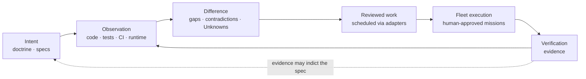

# Syzygy

**A specification-driven control plane for software projects: humans define
what should be true, evidence shows what is true, and agent fleets do bounded
work to close the difference — with the difference always rendered honestly.**

> **Current stage: bounded Three-Surface POC mode (non-release).**
> Capability 1 and its local runtime are implemented groundwork. On
> 2026-08-29 the owner directly authorized a deliberately bounded product
> experiment across Polaris, Trajectory, and Orrery, using Butlers as the
> first external proving project. For this experiment only, that direction
> supersedes the prior Capability-1-only and no-external-onboarding limits;
> it does not authorize production release or deployment, autonomous intent
> adoption, Syzygy-authored implementation code, broad remote access, or
> changes to adopted doctrine or accepted contracts. See the concise
> [owner-direction record](.syzygy/governance/decisions/THREE-SURFACE-POC-MODE-DIRECTION.md)
> and [`PROJECT-STATUS.md`](PROJECT-STATUS.md).

On 2026-09-01 the owner separately performed an indivisible five-row
trusted-bootstrap amendment transaction. RFC 0001–0009 remain accepted and
are now bound at the current 30-module amendment manifest; seven signed
contract-coverage artifacts and CC-SPEC-8 are also amended. Valid exact-scope
human acts may be effective in state (1), owner-adopted but uncorrelated, or
state (2), Syzygy-verified; only state (2) is independently verified. This
amendment granted no consent, observation, write, egress, execution,
deployment, release, recovery, mission, or implementation authority.
The performed record is
[`GENERAL-TRUSTED-BOOTSTRAP-AUTHORIZATION-ACT.md`](.syzygy/governance/decisions/GENERAL-TRUSTED-BOOTSTRAP-AUTHORIZATION-ACT.md).

Concretely, Syzygy has a TypeScript/Node local daemon, a server-rendered human
view, and an authenticated machine endpoint for Capability 1. The POC now asks
the narrower product question: can one shared project model make one real
capability substantially easier to understand and operate through all three
surfaces? The first read-only Butlers slice is runnable; work materialization,
worker progress, and verification evidence remain later bounded items.

## Why it exists

A day of agent-fleet work too often ends with oversized diffs, scattered
completions, and no coherent account of what changed or whether it matched
intent. Underspecification surfaces at the most expensive moment — after
deployment. Project knowledge lives in READMEs and ad-hoc investigation.

*(Terms of art ahead — the adopted glossary is
[`.syzygy/governance/doctrine/README.md`](.syzygy/governance/doctrine/README.md#glossary-read-first);
this page defines nothing itself.)*

Syzygy's answer: keep three kinds of state semantically distinct — **desired
state** (human-guided doctrine and specifications), **observed state** (code,
tests, CI, runtime evidence), and **execution state** (work-scheduler
records) — and make the difference between them legible, truthful, and
navigable for both the owner and the agents doing the work. Scheduled or
merged work is never treated as proof that intent was satisfied.

Two rules everything else follows from:

1. **Comprehensible truth, never comprehensible fiction** (doctrine VIS-1).
   A simpler presentation is never bought with a less true one.
2. **No evidence means Unknown** (VIS-2) — never green, never zero.

## The four experiences

| Name | Literal subtitle | Answers |
|---|---|---|
| **Polaris** | the intent surface | What is this project supposed to be? |
| **Trajectory** | the work surface | **What remains, what is running, what changed, what it cost, and whether the result has been verified against intent.** Five questions, and the fifth is the one no issue tracker answers: a merged change is not a satisfied intent |
| **Orrery** | the map surface | Where does everything live, and in what state? |
| **Mission Control** | workspace-level operator domain — **not a fourth project-specific truth surface** | What bounded, delegated missions are running across projects? |

Polaris, Trajectory, and Orrery are **views over one shared project model**
(called the *kernel* in the technical contracts), never independent truth
stores. Mission Control sits at the level of a **portfolio workspace** — the
set of projects one operator runs, above any single project — and is not a
fourth project-specific truth surface; it is defined by candidate contract
RFC-0010 and a pending doctrine amendment (D3), neither yet accepted. All
four names are working codenames only.

## The core loop



Capability 1 implements trusted observation groundwork, but the complete loop
shown here is not current capability. The Three-Surface POC is the first
bounded attempt to exercise one end-to-end slice. The loop remains
human-triggered. Syzygy writes project content directly only under
`openspec/**` and `.syzygy/**`; it never writes implementation code, and it
reaches every other system through typed, explicitly authorized adapters
(VIS-5).

## What is authoritative here

Authority is **typed** — each question has one owning home:

| Question | Authority | Authority state |
|---|---|---|
| Why; non-negotiable rules | [`.syzygy/governance/doctrine/`](.syzygy/governance/doctrine/) (VIS-1…7, SEC-1…5) | **Adopted** 2026-07-30 |
| Prior owner rulings | [`.syzygy/governance/decisions/`](.syzygy/governance/decisions/) | **Recorded** |
| Engineering and evidence bar | [`.syzygy/governance/policies/craft-and-care/`](.syzygy/governance/policies/craft-and-care/) | **Owner-approved** (D2); CC-SPEC and CC-IMPACT are in force, with CC-SPEC-8 amended by the 2026-09-01 transaction |
| Load-bearing technical contracts | [`.syzygy/governance/contracts/`](.syzygy/governance/contracts/) | **RFC 0001–0009 accepted** — originally through the 2026-08-17 Wave A/B acts and amended at the current 30-module manifest by the 2026-09-01 transaction ([`PROJECT-STATUS.md`](PROJECT-STATUS.md) owns this state); RFC 0010–0011 remain **candidate** in `contracts/candidates/` |
| Intended placement | [`.syzygy/map/topology-candidates/`](.syzygy/map/topology-candidates/) | **Candidate** |
| Required observable behavior | `openspec/` | **Adopted for Capability 1** — the one change `changes/project-registration-and-honest-shape-visibility/`, adopted by the owner on 2026-08-20; only its coverage digest was superseded by the 2026-09-01 transaction, with required behavior unchanged. The POC is explicitly experimental, not a new conformance claim |
| What currently exists | Code, tests, CI, runtime | Capability 1 domain/runtime implementation and its evidence; Three-Surface POC implementation is in progress |

Generated indexes, summaries, and this README are presentation — they cite
authority and are never themselves authoritative.

## Start here

### Run the first Three-Surface slice

From a fresh Syzygy checkout, one command installs dependencies, builds the
bounded POC, and starts it against the local Butlers proving repository:

```sh
npm ci && npm run poc -- --repo /home/tze/GitHub/butlers
```

The daemon binds only to loopback and prints the human URL plus the
authenticated machine endpoint and credential-file location. See
[`docs/THREE-SURFACE-POC.md`](docs/THREE-SURFACE-POC.md) for the ten-minute
first-slice walkthrough and its deliberately absent relationships.

### Project source map

**Unfamiliar word?** Which glossary depends on what kind of word it is:

| Kind of word | Where |
|---|---|
| An adopted product term | [`doctrine/README.md`](.syzygy/governance/doctrine/README.md#glossary-read-first) — the glossary doctrine means when it says "README glossary" (seven entries; *this* file has none) |
| A wider working product term | [`TERM-REGISTRY.md`](.syzygy/governance/contracts/candidates/policy-candidates/TERM-REGISTRY.md) — candidate, approved by no act |
| A **process** word — *act*, *argument*, *wave*, *offer*, `P-nn`, `RD-nn`, *candidate* vs *confirmed* vs *accepted* | [`PROCESS-GLOSSARY.md`](PROCESS-GLOSSARY.md) |

1. [`.syzygy/intent/OVERVIEW.md`](.syzygy/intent/OVERVIEW.md) — the project
   argument, 30 seconds to full depth (draft; adoption pending).
2. [`.syzygy/governance/doctrine/vision.md`](.syzygy/governance/doctrine/vision.md)
   — the thesis and the non-negotiables.
3. [`.syzygy/governance/doctrine/v1.md`](.syzygy/governance/doctrine/v1.md)
   — **what the software would actually do at V0 and V1.** The one adopted
   file that states scope in terms of behavior rather than principle; read it
   if `vision.md` leaves you asking "yes, but what does it *do*?"
4. [`PROJECT-STATUS.md`](PROJECT-STATUS.md) — exact current gate state.
5. [`.syzygy/governance/contracts/`](.syzygy/governance/contracts/)
   — the contract corpus: accepted modules at `rfcs/` (RFC 0001–0009,
   originally accepted by the 2026-08-17 Wave A/B acts and amended at the
   2026-09-01 30-module manifest), the deferred RFC 0010/0011 candidates and
   the acceptance record under `candidates/`.
6. [`.syzygy/governance/policies/craft-and-care/`](.syzygy/governance/policies/craft-and-care/)
   — the engineering bar.
7. [`.syzygy/governance/decisions/`](.syzygy/governance/decisions/README.md)
   — what the owner has decided, what is pending, and what acts exist.
   Start at its [`README.md`](.syzygy/governance/decisions/README.md); the
   queue itself is
   [`PENDING-OWNER-DECISIONS.md`](.syzygy/governance/decisions/PENDING-OWNER-DECISIONS.md).
8. [`CONTRIBUTING.md`](CONTRIBUTING.md) — posture and change discipline.
9. [`SECURITY.md`](SECURITY.md) — committed security posture and reporting.

**Two things in the repository root are process instruments, not project
content**, and are named here so they are not mistaken for either *(added
2026-08-13, RD-50 f10 — both were unmentioned by this page)*:

- [`launch-gate-pre-specifications.md`](launch-gate-pre-specifications.md)
  — the question set used to judge whether this repository is ready for
  anyone to author its first specification. **Owner-approved process policy
  at v2.4** (P-34, ruled 2026-08-16 with disclosed residuals —
  `decisions/LAUNCH-GATE-AUTHORITY-DECISION.md`), and a `READY` verdict
  from it would authorize nothing.
- [`FORMAL-CAPABILITY-1-LAUNCH-PACKET/`](FORMAL-CAPABILITY-1-LAUNCH-PACKET/)
  — everything an outside reviewer would need to run that gate once,
  formally. **Prepared, never administered.**

Agents: read [`AGENTS.md`](AGENTS.md) — operating procedure, not project
truth.

## What is not implemented

There is no released Three-Surface product, generalized project graph,
production deployment, remote or multi-user service, general Beads adapter,
general spatial-layout engine, or broad project onboarding. The first POC
slice is read-only: it does not yet materialize work, observe a worker change,
or ingest a test-run artifact. No claim of alignment, convergence, regeneration,
deployment health, conformance, or release is intended; without current
evidence those relationships remain Unknown (VIS-2).

The trusted-bootstrap transaction does not change that boundary. The signed
PWB behavior remains deliberately stricter for PWB-REQ-005 and PWB-REQ-022:
both are state-(2)-only until a separate behavioral amendment is signed.
Effect-specific consent, policy and registry acts are required before any new
repository-body read, and separate authorization is required before PWB
implementation can resume.

## License

**MIT** — ruled by the owner 2026-08-18 (P-14), granted by the root
[`LICENSE`](LICENSE) file. The decision record is
[`.syzygy/governance/decisions/LICENSE-CHOICE-DECISION.md`](.syzygy/governance/decisions/LICENSE-CHOICE-DECISION.md).
A license grant does not broaden the bounded POC authorization: contribution
posture stays governed by [`CONTRIBUTING.md`](CONTRIBUTING.md) and the current
lifecycle boundary recorded in [`PROJECT-STATUS.md`](PROJECT-STATUS.md).
