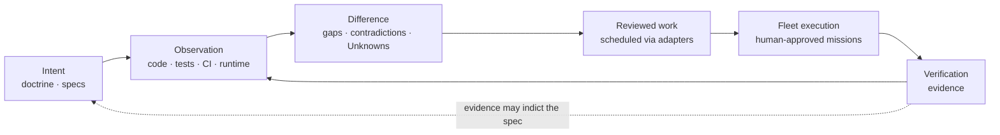

# Syzygy

**A specification-driven control plane for software projects: humans define
what should be true, evidence shows what is true, and agent fleets do bounded
work to close the difference — with the difference always rendered honestly.**

> **Current stage: specification defining.**
> This repository contains **no application code and no implementation
> backlog — deliberately.** What exists is adopted doctrine, owner-approved
> engineering policy, a foundational-contract corpus whose launch-path
> waves (RFC 0001–0009) the owner **accepted by act on 2026-08-17** (the
> remaining waves still candidate), and — since the owner's launch decision
> of **2026-08-20** — one **candidate** behavioral specification under
> authoring: the Capability 1 OpenSpec change
> `project-registration-and-honest-shape-visibility`, binding nothing
> until the owner adopts it. See [`PROJECT-STATUS.md`](PROJECT-STATUS.md)
> for the exact gate state.

Concretely, the intended shape is a **local-first daemon with a browser
app**, serving the owner visually and agents through machine-queryable
endpoints. Nothing of it is built yet (see *Current stage* above); the
platform commitment itself is doctrine-level, while language, framework, and
database are deliberately unchosen.

## Why it exists

A day of agent-fleet work too often ends with oversized diffs, scattered
completions, and no coherent account of what changed or whether it matched
intent. Underspecification surfaces at the most expensive moment — after
deployment. Project knowledge lives in READMEs and ad-hoc investigation.

*(Terms of art ahead — the adopted glossary is
[`.syzygy/governance/doctrine/README.md`](.syzygy/governance/doctrine/README.md#glossary-read-first);
this page defines nothing itself.)*

Syzygy's answer: keep three kinds of state semantically distinct — **desired
state** (human-guided doctrine and specifications), **observed state** (code,
tests, CI, runtime evidence), and **execution state** (work-scheduler
records) — and make the difference between them legible, truthful, and
navigable for both the owner and the agents doing the work. Scheduled or
merged work is never treated as proof that intent was satisfied.

Two rules everything else follows from:

1. **Comprehensible truth, never comprehensible fiction** (doctrine VIS-1).
   A simpler presentation is never bought with a less true one.
2. **No evidence means Unknown** (VIS-2) — never green, never zero.

## The four experiences

| Name | Literal subtitle | Answers |
|---|---|---|
| **Polaris** | the intent surface | What is this project supposed to be? |
| **Trajectory** | the work surface | **What remains, what is running, what changed, what it cost, and whether the result has been verified against intent.** Five questions, and the fifth is the one no issue tracker answers: a merged change is not a satisfied intent |
| **Orrery** | the map surface | Where does everything live, and in what state? |
| **Mission Control** | workspace-level operator domain — **not a fourth project-specific truth surface** | What bounded, delegated missions are running across projects? |

Polaris, Trajectory, and Orrery are **views over one shared project model**
(called the *kernel* in the technical contracts), never independent truth
stores. Mission Control sits at the level of a **portfolio workspace** — the
set of projects one operator runs, above any single project — and is not a
fourth project-specific truth surface; it is defined by candidate contract
RFC-0010 and a pending doctrine amendment (D3), neither yet accepted. All
four names are working codenames only.

## The core loop

This diagram, like everything on this page, describes **intended shape,
not current capability** — nothing below the specification layer exists
yet. The loop is human-triggered. Syzygy writes project content directly
only under `openspec/**` and `.syzygy/**`; it never writes implementation
code, and it reaches every other system through typed, explicitly
authorized adapters (VIS-5).

## What is authoritative here

Authority is **typed** — each question has one owning home:

| Question | Authority | Authority state |
|---|---|---|
| Why; non-negotiable rules | [`.syzygy/governance/doctrine/`](.syzygy/governance/doctrine/) (VIS-1…7, SEC-1…5) | **Adopted** 2026-07-30 |
| Prior owner rulings | [`.syzygy/governance/decisions/`](.syzygy/governance/decisions/) | **Recorded** |
| Engineering and evidence bar | [`.syzygy/governance/policies/craft-and-care/`](.syzygy/governance/policies/craft-and-care/) | **Owner-approved** (D2); clause-level force begins at foundational-contract acceptance |
| Load-bearing technical contracts | [`.syzygy/governance/contracts/`](.syzygy/governance/contracts/) | **RFC 0001–0009 accepted as of 2026-08-17** — the Wave A/B acts, modules installed at `contracts/rfcs/` ([`PROJECT-STATUS.md`](PROJECT-STATUS.md) owns this state); RFC 0010–0011 remain **candidate** in `contracts/candidates/` |
| Intended placement | [`.syzygy/map/topology-candidates/`](.syzygy/map/topology-candidates/) | **Candidate** |
| Required observable behavior | `openspec/` | **Candidate** — one change under authoring since 2026-08-20 (`changes/project-registration-and-honest-shape-visibility/`); adopted by no one, binding nothing |
| What currently exists | Code, tests, CI, runtime | Nothing exists yet |

Generated indexes, summaries, and this README are presentation — they cite
authority and are never themselves authoritative.

## Start here

**Unfamiliar word?** Which glossary depends on what kind of word it is:

| Kind of word | Where |
|---|---|
| An adopted product term | [`doctrine/README.md`](.syzygy/governance/doctrine/README.md#glossary-read-first) — the glossary doctrine means when it says "README glossary" (seven entries; *this* file has none) |
| A wider working product term | [`TERM-REGISTRY.md`](.syzygy/governance/contracts/candidates/policy-candidates/TERM-REGISTRY.md) — candidate, approved by no act |
| A **process** word — *act*, *argument*, *wave*, *offer*, `P-nn`, `RD-nn`, *candidate* vs *confirmed* vs *accepted* | [`PROCESS-GLOSSARY.md`](PROCESS-GLOSSARY.md) |

1. [`.syzygy/intent/OVERVIEW.md`](.syzygy/intent/OVERVIEW.md) — the project
   argument, 30 seconds to full depth (draft; adoption pending).
2. [`.syzygy/governance/doctrine/vision.md`](.syzygy/governance/doctrine/vision.md)
   — the thesis and the non-negotiables.
3. [`.syzygy/governance/doctrine/v1.md`](.syzygy/governance/doctrine/v1.md)
   — **what the software would actually do at V0 and V1.** The one adopted
   file that states scope in terms of behavior rather than principle; read it
   if `vision.md` leaves you asking "yes, but what does it *do*?"
4. [`PROJECT-STATUS.md`](PROJECT-STATUS.md) — exact current gate state.
5. [`.syzygy/governance/contracts/`](.syzygy/governance/contracts/)
   — the contract corpus: accepted modules at `rfcs/` (RFC 0001–0009, the
   2026-08-17 Wave A/B acts), the deferred candidates and the acceptance
   record under `candidates/`.
6. [`.syzygy/governance/policies/craft-and-care/`](.syzygy/governance/policies/craft-and-care/)
   — the engineering bar.
7. [`.syzygy/governance/decisions/`](.syzygy/governance/decisions/README.md)
   — what the owner has decided, what is pending, and what acts exist.
   Start at its [`README.md`](.syzygy/governance/decisions/README.md); the
   queue itself is
   [`PENDING-OWNER-DECISIONS.md`](.syzygy/governance/decisions/PENDING-OWNER-DECISIONS.md).
8. [`CONTRIBUTING.md`](CONTRIBUTING.md) — posture and change discipline.
9. [`SECURITY.md`](SECURITY.md) — committed security posture and reporting.

**Two things in the repository root are process instruments, not project
content**, and are named here so they are not mistaken for either *(added
2026-08-13, RD-50 f10 — both were unmentioned by this page)*:

- [`launch-gate-pre-specifications.md`](launch-gate-pre-specifications.md)
  — the question set used to judge whether this repository is ready for
  anyone to author its first specification. **Owner-approved process policy
  at v2.4** (P-34, ruled 2026-08-16 with disclosed residuals —
  `decisions/LAUNCH-GATE-AUTHORITY-DECISION.md`), and a `READY` verdict
  from it would authorize nothing.
- [`FORMAL-CAPABILITY-1-LAUNCH-PACKET/`](FORMAL-CAPABILITY-1-LAUNCH-PACKET/)
  — everything an outside reviewer would need to run that gate once,
  formally. **Prepared, never administered.**

Agents: read [`AGENTS.md`](AGENTS.md) — operating procedure, not project
truth.

## What is not implemented

Everything. There is no daemon, no UI, no graph store, no adapter, no 3D
view, no endpoint, and no chosen language, framework, or database — stack
choices require an accepted contract. No claim of alignment, convergence, or
regeneration capability is intended by this repository — doctrine (VIS-2)
forbids the class — and any document appearing to make one is wrong by that
doctrine and should be reported as a finding, not read as a promise.

## License

**MIT** — ruled by the owner 2026-08-18 (P-14), granted by the root
[`LICENSE`](LICENSE) file. The decision record is
[`.syzygy/governance/decisions/LICENSE-CHOICE-DECISION.md`](.syzygy/governance/decisions/LICENSE-CHOICE-DECISION.md).
A license grant does not open an implementation backlog: contribution
posture stays governed by [`CONTRIBUTING.md`](CONTRIBUTING.md) and the
current lifecycle boundary (specification defining — no implementation).
