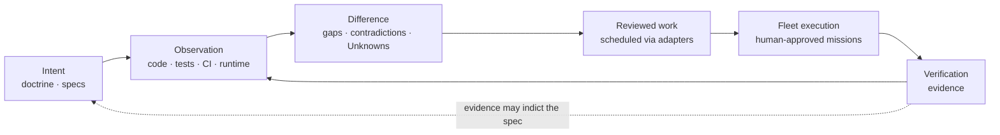

# Syzygy

**A specification-driven control plane for software projects: humans define
what should be true, evidence shows what is true, and agent fleets do bounded
work to close the difference — with the difference always rendered honestly.**

> **Current stage: final pre-specification.**
> This repository contains **no application code, no behavioral
> specifications, and no implementation backlog — deliberately.** What exists
> is adopted doctrine, owner-approved engineering policy, and a candidate
> foundational-contract corpus awaiting explicit owner acceptance. See
> [`PROJECT-STATUS.md`](PROJECT-STATUS.md) for the exact gate state.

Concretely, the intended shape is a **local-first daemon with a browser
app**, serving the owner visually and agents through machine-queryable
endpoints. Nothing of it is built yet (see *Current stage* above); the
platform commitment itself is doctrine-level, while language, framework, and
database are deliberately unchosen.

## Why it exists

A day of agent-fleet work too often ends with oversized diffs, scattered
completions, and no coherent account of what changed or whether it matched
intent. Underspecification surfaces at the most expensive moment — after
deployment. Project knowledge lives in READMEs and ad-hoc investigation.

Syzygy's answer: keep three kinds of state semantically distinct — **desired
state** (human-guided doctrine and specifications), **observed state** (code,
tests, CI, runtime evidence), and **execution state** (work-scheduler
records) — and make the difference between them legible, truthful, and
navigable for both the owner and the agents doing the work. Scheduled or
merged work is never treated as proof that intent was satisfied.

Two rules everything else follows from:

1. **Comprehensible truth, never comprehensible fiction** (doctrine VIS-1).
   A simpler presentation is never bought with a less true one.
2. **No evidence means Unknown** (VIS-2) — never green, never zero.

## The four experiences

| Name | Literal subtitle | Answers |
|---|---|---|
| **Polaris** | the intent surface | What is this project supposed to be? |
| **Trajectory** | the work surface | What remains, what is running, what changed, what did it cost — and has the result been verified against intent? Never satisfied by an issue list |
| **Orrery** | the map surface | Where does everything live, and in what state? |
| **Mission Control** | workspace-level operator domain — **not a fourth project-specific truth surface** | What bounded, delegated missions are running across projects? |

Polaris, Trajectory, and Orrery are **projections over one shared project
model** (the kernel, in the technical contracts), never independent truth
stores. Mission Control is a workspace-level operator domain, not a fourth
project-specific truth surface; it is defined by candidate contract
RFC-0010 and a pending doctrine amendment (D3), neither yet accepted. All
four names are working codenames only.

## The core loop

The loop is human-triggered. Syzygy writes project content directly only
under `openspec/**` and `.syzygy/**`; it never writes implementation code,
and it reaches every other system through typed, explicitly authorized
adapters (VIS-5).

## What is authoritative here

Authority is **typed** — each question has one owning home:

| Question | Authority | Authority state |
|---|---|---|
| Why; non-negotiable rules | [`.syzygy/governance/doctrine/`](.syzygy/governance/doctrine/) (VIS-1…7, SEC-1…5) | **Adopted** 2026-07-30 |
| Prior owner rulings | [`.syzygy/governance/decisions/`](.syzygy/governance/decisions/) | **Recorded** |
| Engineering and evidence bar | [`.syzygy/governance/policies/craft-and-care/`](.syzygy/governance/policies/craft-and-care/) | **Owner-approved** (D2); clause-level force begins at foundational-contract acceptance |
| Load-bearing technical contracts | [`.syzygy/governance/contracts/candidates/`](.syzygy/governance/contracts/candidates/) | **Candidate — accepted by no act yet** |
| Intended placement | [`.syzygy/map/topology-candidates/`](.syzygy/map/topology-candidates/) | **Candidate** |
| Required observable behavior | `openspec/` | Does not exist yet |
| What currently exists | Code, tests, CI, runtime | Nothing exists yet |

Generated indexes, summaries, and this README are presentation — they cite
authority and are never themselves authoritative.

## Start here

**Unfamiliar word?**
[`.syzygy/governance/doctrine/README.md`](.syzygy/governance/doctrine/README.md#glossary-read-first)
holds the adopted glossary — the one doctrine means when it says "README
glossary" (seven entries; this file has none). The wider working
vocabulary, including every term the glossary does not carry, is the
candidate term registry:
[`policy-candidates/TERM-REGISTRY.md`](.syzygy/governance/contracts/candidates/policy-candidates/TERM-REGISTRY.md)
(candidate — approved by no act).

1. [`.syzygy/intent/OVERVIEW.md`](.syzygy/intent/OVERVIEW.md) — the project
   argument, 30 seconds to full depth (draft; adoption pending).
2. [`.syzygy/governance/doctrine/vision.md`](.syzygy/governance/doctrine/vision.md)
   — the thesis and the non-negotiables.
3. [`PROJECT-STATUS.md`](PROJECT-STATUS.md) — exact current gate state.
4. [`.syzygy/governance/contracts/candidates/`](.syzygy/governance/contracts/candidates/)
   — the candidate contract corpus (RFC 0001–0011) and its acceptance record.
5. [`.syzygy/governance/policies/craft-and-care/`](.syzygy/governance/policies/craft-and-care/)
   — the engineering bar.
6. [`.syzygy/governance/decisions/PENDING-OWNER-DECISIONS.md`](.syzygy/governance/decisions/PENDING-OWNER-DECISIONS.md)
   — what the owner has not yet decided.
7. [`CONTRIBUTING.md`](CONTRIBUTING.md) — posture and change discipline.
8. [`SECURITY.md`](SECURITY.md) — committed security posture and reporting.

Agents: read [`AGENTS.md`](AGENTS.md) — operating procedure, not project
truth.

## What is not implemented

Everything. There is no daemon, no UI, no graph store, no adapter, no 3D
view, no endpoint, and no chosen language, framework, or database — stack
choices require an accepted contract. No claim of alignment, convergence, or
regeneration capability is made anywhere in this repository, and any document
appearing to make one is wrong by doctrine (VIS-2).

## License

**No open-source license has yet been adopted.** Public viewing is permitted
by GitHub; reuse rights are not yet granted. A decision packet for the owner
is at
[`.syzygy/governance/decisions/LICENSE-DECISION-PACKET.md`](.syzygy/governance/decisions/LICENSE-DECISION-PACKET.md).
Until a license lands, external code contributions cannot be accepted
(see [`CONTRIBUTING.md`](CONTRIBUTING.md)).
