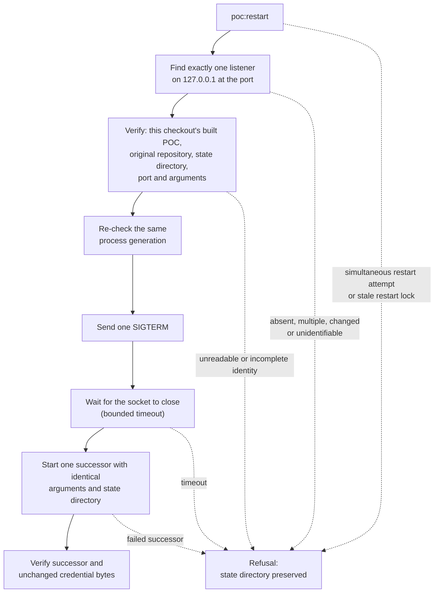

# Three-Surface POC

This is a local, non-release product experiment against one explicit Butlers
checkout. It does not adopt intent, write implementation code, execute Butlers
code, deploy anything, or claim conformance.

## Start from a fresh Syzygy checkout

One command, run from the Syzygy repository root, builds the bounded POC and
serves it on loopback:

```sh
npm ci && npm run poc -- --repo /home/tze/GitHub/butlers
```

- **Binding:** only `127.0.0.1`.
- **Printed:** the human URL, authenticated machine endpoint, observed Butlers
  revision, and the machine credential file's location.
  - It never prints the credential value.
- **Options:** `--port 0` for an ephemeral port; `--state-dir <path>` for an
  explicit local credential directory.

## Check a fresh checkout end to end

```sh
npm run poc:fresh-checkout-demo -- --repo /home/tze/GitHub/butlers
```

It clones Syzygy at the current head, installs, builds and tests, serves the
POC on a private daemon, probes every human and machine route, checks
PWB-REQ-020 parity and a browser pass, and writes a JSON record under
`docs/evidence/`. Pass a suffixed `--date` when a same-day record exists; the
file is overwritten silently.

- **Green** means the command exited 0: every invariant in
  `fresh-checkout-verdict.ts` held, and the record lists none as failed.
- It is mechanical readiness only. It is not an owner walkthrough verdict, a
  PWB-REQ-021 run record (`no-run-record` is the expected pre-walk state), or
  a claim about Butlers beyond the one observed revision the record names.

## Restart one local POC listener

`poc:restart` replaces exactly one verified listener with one identical
successor, and refuses anything it cannot verify. It applies to a POC started
from this checkout with an explicit, nonzero `--port` and `--state-dir`; run it
from the same Syzygy checkout:

```sh
npm run poc:restart -- --port <that-poc-port>
```



**Sequence.**

- Finds exactly one listener on `127.0.0.1` at that port.
- Verifies that its process is this checkout's built POC with the original
  repository, state directory, port and arguments.
- Checks the same process generation again before signaling.
- Sends one SIGTERM and waits for the socket to close.
- Starts one successor with the identical arguments and state directory.
- Verifies the successor and unchanged credential bytes.

**Limits.**

- This local operator command requires Linux `ss` and `/proc` process
  metadata.
- It does not use SIGKILL, a pidfile, an automatic retry, or a Butlers write.
- Use `--timeout-ms <100..30000>` for a bounded wait other than the 10-second
  default.
- The system tests exercise only private fixture listeners and disposable
  state directories.

**Refusals.** An absent, multiple, changed or unidentifiable listener, a
timeout, a failed successor, or a simultaneous restart attempt is a refusal.

- The state directory is preserved; inspect the named failure before a
  further attempt.
- An unreadable or incomplete identity before SIGTERM is refused.
- After SIGTERM, a brief loss or incompleteness of process identity while the
  old socket closes is treated as unknown ownership.
  - The command waits for verified socket absence or the bounded timeout.
  - It never starts the successor merely because the identity could not be
    read.
- A stale restart lock in the OS temporary directory is intentionally
  fail-closed and requires operator inspection before removal.

**Diagnostics.** Each non-2xx daemon response writes one structured JSONL
diagnostic to local stderr.

- The line contains only its status, registered route or unmatched path
  length, closed reason and safe response-limit fields.
- It never includes a credential, request content or handler exception text.
- Human pages expose a compact evaluation and breach line below the header.
  It is an execution disclosure, not a health verdict or a new machine status
  route.
- Below it, one resource entry (`syzygy-u05.3`) gives the resource ledger's
  headroom against all seven declared limits (observed, declared, left) and
  its cost record (bodies read, bytes, parse passes, worst-source passes).
  The machine body carries the same tuples as `resourceHeadroom`, one id per
  tuple; the two channels are compared tuple by tuple. A value the ledger
  did not observe reads Unknown with its reason, never zero: the two response
  ceilings are enforced per response outside the ledger, and an evaluation
  whose project shape was not observed ran no ledger at all. The block holds
  no capture instant, so the response identity's content key covers it.

## Evidence and re-observation

Each evaluation discloses its pinned revision, observation instant and a
currency probe against the current Git head (a disclosure, not a freshness
value); a new evaluation happens only on an explicit re-observe request.

**Evidence block.** Authenticated machine responses carry an additive evidence
block per evaluation.

- Contents:
  - the pinned revision and committer instant;
  - the observation instant;
  - a currency probe comparing the pinned revision with the current Git head.
- Currency bounds remain empty until their separately gated owner act.
- The Polaris opening band presents the same probe identity and changed/added
  counts; the probe is a disclosure, not a project claim or freshness value.

**Re-observation.** The daemon does not poll or advance its observation from
the wall clock.

- To capture a new identified evaluation, POST to `/polaris/reobserve` from
  the same-origin human surface (or its tailnet-mounted path).
- Or start the daemon with `--watch`: each Enter pressed on its console
  re-observes once, and nothing else does. Closing the console's input
  (Ctrl-D) leaves watch mode; the daemon keeps serving.
- Concurrent requests single-flight, whether from the browser or the console.
- A failed re-observation leaves the prior complete model served.
- A materialize rebuilds the served model as a new named evaluation: the
  same repository revision, a fresh observation instant and currency probe,
  superseding the evaluation before it. A failed rebuild swaps nothing.

**Named re-evaluation result** (`syzygy-u05.2`). Each re-observation returns a
result that names:

- its own evaluation identity: the snapshot plus the observation instant, so
  an unchanged repository re-observed still yields a new identity;
- the identity it supersedes, which is never rewritten;
- three clock readings, each marked moved, unchanged or movement Unknown:
  the observed repository's Git HEAD, its working-tree digest, and the Beads
  Dolt revision the evaluation's own work-item observation already read
  (nothing is queried for it; a run without work items shows Unknown);
- two staleness limbs, kept apart: the observed-project limb (sources changed
  and added between the superseded and the new revision, from revision
  metadata only) and the observatory limb (Syzygy commits since the revision
  this daemon was started from). An unreadable count is Unknown, never zero.

The result page and the `--watch` console print all of them. Every human page
carries one more line below the evaluation and breach line, naming the
observed-project limb, the observatory limb and the Dolt clock separately for
the latest re-evaluation. These are presentation lines and have no machine
counterpart: the re-observe action's parity family declares an empty machine
denominator. Superseded evaluations are named but not retained; retention
waits for `syzygy-dov.28`.

**Post-commit hook: not lawful today.** A Butlers post-commit hook that calls
the loopback re-observe route would re-observe without an owner's request in
the moment. It needs two things that are not in force:

- installing it is a write into the Butlers repository, which needs its own
  owner act;
- a hook as a trigger needs doctrine amendment D7 (a candidate packet, owner
  question P-101, binding nothing) plus a companion amendment to RFC2-19
  ("The loop is human-triggered … never autonomously on merge events"). P-69
  allows human-triggered re-observation only.

No hook script ships with Syzygy, and none is to be installed until those
acts exist.

## First-slice walkthrough

The walkthrough crosses three surfaces over one shared model: Polaris for
desired state, Trajectory for execution state, Orrery for observed state.

**Surface headers.**

- The three surface headers identify those distinct planes.
- The home panels and each page's separate surface-state legend derive those
  names from the shared model.
- They are not Observed/Unknown evidence labels or a claim that work
  completion verifies intent.

**Cross-surface links.** They connect the two Polaris region counts, its nine
reality-band entities, Trajectory's governing-intent preview, and Orrery's
mapped capability to their existing human targets. The Orrery spatial block
keeps its exact-table link as well.

- Links use native anchors and the current direct or tailnet mount.
- If the same evaluation lacks a target, the renderer shows an unavailable
  disclosure without an href.
- The served-page test checks the complete 13-link fixture population and
  fetches every target in both forms, including the Orrery link created after
  its local script runs.

**Steps.**

1. Open the printed human URL. Polaris shows the purpose and governing intent
   for WhatsApp transport identity normalization.
2. Confirm the live-runtime relationship is visibly Unknown. Repository state
   is not deployment evidence.
3. In Trajectory, review the materialize panel's preview of the exact Bead a
   human-triggered action would create.
   - The packet preview always renders, read-only.
   - The write is foreclosed: the panel shows "Foreclosed by owner ruling
     P-71-Q5" with its citation
     (`.syzygy/governance/decisions/POLARIS-PURSUIT-OWNER-RULINGS-P68-P83-DECISION.md`),
     and the "Materialize this work item" button is disabled.
   - A direct POST to the action is refused with HTTP 403; Beads is not run
     and nothing is written to the configured Butlers repository.
   - Lifting it needs a dated owner act naming the write, then a
     registry-entry amendment, then a fresh implementation authorization.
4. Trajectory's board shows two separately honest fields for a work item, not
   one:
   - the worker-change observer's state ("External worker: Planned / Active /
     Changed / merged", tracking real git activity against it);
   - its independent Bead status.
   - An ingested, operator-reported test-run artifact (see below) for the
     governing seam renders as "Verification: Not verified by Syzygy —
     operator-reported (report-fact): …", never as Verified (RFC5-19); absent
     one, it stays "Verification: Not verified".
5. Test-run evidence is not captured automatically.
   - Run
     `npm run poc:capture-test-artifact -- print --repo <butlers> --scope <path> --junit <file> --state-dir <dir>`,
     run the pytest command it prints yourself, then hand the JUnit file
     back with its `ingest` step (see "Capturing test-run evidence" below).
   - Trajectory and the machine endpoint then reflect it.
6. In Orrery, follow the selected capability to its intent, manually mapped
   code region, and test definition.
   - The rest of Butlers code remains visible as an Unknown region.
   - Orrery's spatial city view is the one surface with real client-side
     rendering (an inline, self-served script, no build step or CDN).
   - Without JavaScript it falls back to the same facts in exact tables.
7. Query authenticated `GET /api/poc` using the credential at the printed path.
   The JSON entity and relationship facts are the same objects rendered by the
   human page.

## Capturing test-run evidence

Test-run capture is a separate, manually invoked step, and Syzygy never runs
the observed test suite itself — neither the daemon nor this tool (SEC-3,
RFC5-18; owner direction `REDIS-LOCAL-AGENT-SITTING-2026-10-07` item 4,
`syzygy-4mbu`). The tool prints the command; you run it; the tool ingests
the result:

```sh
npm run poc:capture-test-artifact -- print \
  --repo /home/tze/GitHub/butlers \
  --scope <path-under-test> \
  --junit <file> --state-dir <dir> [--python <bin>]
```

- **Who runs it:** the owner or a human operator. An agent session must not
  run the printed test command unless the owner has recorded a SEC-3 choice
  for that run; the printed text says so.
- **What it prints:** the `git rev-parse HEAD` to note the commit, the exact
  focused pytest command to run in your own shell (Butlers needs its own
  `.venv/bin/python`), and the `ingest` command to run afterwards with that
  commit and the exit status. `print` starts no process.
- **What it ingests:** only the JUnit file you hand back, which must be a
  regular file (no symlink, FIFO or device) of at most 4 MiB. It stores the
  command, the exit status you report, the ingest time, the commit, the
  scope, the file's digest and a safe summary, marked `operator-reported`,
  never raw test output. Its one process is `git rev-parse HEAD`. It refuses
  if the checkout has moved from the commit you report, if the exit status
  is not 0–255, if any count in the file is not a non-negative integer, or
  if you report 0 beside failing tests or beside zero tests.
- **What it does not check:** that the tests ran at all, or at that commit,
  or with that exit status — those are your report. It sees only that HEAD
  is the reported commit when it ingests the file, so a checkout switched
  away and back in between, or uncommitted changes in the working tree, go
  undetected.
- **How an ingested run renders:** never as `Verified`. RFC5-19 caps an
  artifact of unverifiable origin at `report-fact` ("however retained,
  well-formed, and revision-bound it is. Reading is free; being believed is
  not."), so Trajectory shows "Verification: Not verified by Syzygy —
  operator-reported (report-fact): <summary>" in the declared Unknown
  encoding, with what Syzygy observed and what it did not. It shows that
  only when all three hold:
  - the reported commit exactly matches the git-observed worker-change commit
    for the same seam;
  - the reported exit status is 0;
  - the ingest time is neither after the evaluation nor earlier than the
    commit itself. Passing this says nothing about when the tests ran.
  Otherwise it stays "Verification: Not verified" with the reason.
- **When verification renders `Verified`:** only for a record whose exit
  status and capture time the capturing process observed itself, which this
  tool no longer produces.
- **Scope:** the worker-change seam (`whatsapp_user_client.py`) — a different
  code path than the identity normalization capability Polaris and Orrery
  describe.

## Deliberately absent in this slice

These absences are product facts, not setup failures. They remain Unknown
until a later bounded POC item produces the corresponding authoritative
record.

- No worker is dispatched and no implementation code is changed by Syzygy.
- No deployment or live-runtime observation is supplied.
- No broad code inventory or generalized spatial layout is computed — Orrery's
  city view is deterministic over observed structure and declared mappings
  only, and unmapped code stays visibly Unknown.
- Test-run capture is a separate, manually invoked step, never automatic.
