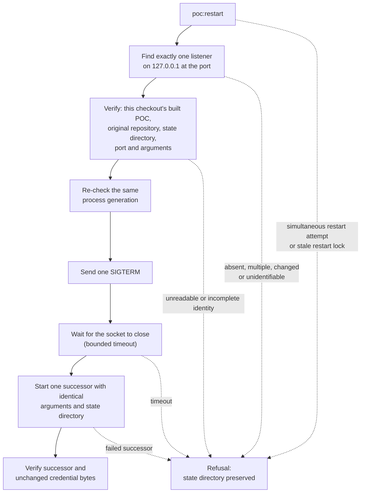

# Three-Surface POC

This is a local, non-release product experiment against one explicit Butlers
checkout. It does not adopt intent, write implementation code, execute Butlers
code, deploy anything, or claim conformance.

## Start from a fresh Syzygy checkout

One command, run from the Syzygy repository root, builds the bounded POC and
serves it on loopback:

```sh
npm ci && npm run poc -- --repo /home/tze/GitHub/butlers
```

- **Binding:** only `127.0.0.1`.
- **Printed:** the human URL, authenticated machine endpoint, observed Butlers
  revision, and the machine credential file's location.
  - It never prints the credential value.
- **Options:** `--port 0` for an ephemeral port; `--state-dir <path>` for an
  explicit local credential directory.

## Check a fresh checkout end to end

```sh
npm run poc:fresh-checkout-demo -- --repo /home/tze/GitHub/butlers
```

It clones Syzygy at the current head, installs, builds and tests, serves the
POC on a private daemon, probes every human and machine route, checks
PWB-REQ-020 parity and a browser pass, and writes a JSON record under
`docs/evidence/`. Pass a suffixed `--date` when a same-day record exists; the
file is overwritten silently.

- **Green** means the command exited 0: every invariant in
  `fresh-checkout-verdict.ts` held, and the record lists none as failed.
- It is mechanical readiness only. It is not an owner walkthrough verdict, a
  PWB-REQ-021 run record (`no-run-record` is the expected pre-walk state), or
  a claim about Butlers beyond the one observed revision the record names.

## Restart one local POC listener

`poc:restart` replaces exactly one verified listener with one identical
successor, and refuses anything it cannot verify. It applies to a POC started
from this checkout with an explicit, nonzero `--port` and `--state-dir`; run it
from the same Syzygy checkout:

```sh
npm run poc:restart -- --port <that-poc-port>
```



**Sequence.**

- Finds exactly one listener on `127.0.0.1` at that port.
- Verifies that its process is this checkout's built POC with the original
  repository, state directory, port and arguments.
- Checks the same process generation again before signaling.
- Sends one SIGTERM and waits for the socket to close.
- Starts one successor with the identical arguments and state directory.
- Verifies the successor and unchanged credential bytes.

**Limits.**

- This local operator command requires Linux `ss` and `/proc` process
  metadata.
- It does not use SIGKILL, a pidfile, an automatic retry, or a Butlers write.
- Use `--timeout-ms <100..30000>` for a bounded wait other than the 10-second
  default.
- The system tests exercise only private fixture listeners and disposable
  state directories.

**Refusals.** An absent, multiple, changed or unidentifiable listener, a
timeout, a failed successor, or a simultaneous restart attempt is a refusal.

- The state directory is preserved; inspect the named failure before a
  further attempt.
- An unreadable or incomplete identity before SIGTERM is refused.
- After SIGTERM, a brief loss or incompleteness of process identity while the
  old socket closes is treated as unknown ownership.
  - The command waits for verified socket absence or the bounded timeout.
  - It never starts the successor merely because the identity could not be
    read.
- A stale restart lock in the OS temporary directory is intentionally
  fail-closed and requires operator inspection before removal.

**Diagnostics.** Each non-2xx daemon response writes one structured JSONL
diagnostic to local stderr.

- The line contains only its status, registered route or unmatched path
  length, closed reason and safe response-limit fields.
- It never includes a credential, request content or handler exception text.
- Human pages expose a compact evaluation and breach line below the header.
  It is an execution disclosure, not a health verdict or a new machine status
  route.

## Evidence and re-observation

Each evaluation discloses its pinned revision, observation instant and a
currency probe against the current Git head (a disclosure, not a freshness
value); a new evaluation happens only on an explicit re-observe request.

**Evidence block.** Authenticated machine responses carry an additive evidence
block per evaluation.

- Contents:
  - the pinned revision and committer instant;
  - the observation instant;
  - a currency probe comparing the pinned revision with the current Git head.
- Currency bounds remain empty until their separately gated owner act.
- The Polaris opening band presents the same probe identity and changed/added
  counts; the probe is a disclosure, not a project claim or freshness value.

**Re-observation.** The daemon does not poll or advance its observation from
the wall clock.

- To capture a new identified evaluation, POST to `/polaris/reobserve` from
  the same-origin human surface (or its tailnet-mounted path).
- Concurrent requests single-flight.
- A failed re-observation leaves the prior complete model served.

## First-slice walkthrough

The walkthrough crosses three surfaces over one shared model: Polaris for
desired state, Trajectory for execution state, Orrery for observed state.

**Surface headers.**

- The three surface headers identify those distinct planes.
- The home panels and each page's separate surface-state legend derive those
  names from the shared model.
- They are not Observed/Unknown evidence labels or a claim that work
  completion verifies intent.

**Cross-surface links.** They connect the two Polaris region counts, its nine
reality-band entities, Trajectory's governing-intent preview, and Orrery's
mapped capability to their existing human targets. The Orrery spatial block
keeps its exact-table link as well.

- Links use native anchors and the current direct or tailnet mount.
- If the same evaluation lacks a target, the renderer shows an unavailable
  disclosure without an href.
- The served-page test checks the complete 13-link fixture population and
  fetches every target in both forms, including the Orrery link created after
  its local script runs.

**Steps.**

1. Open the printed human URL. Polaris shows the purpose and governing intent
   for WhatsApp transport identity normalization.
2. Confirm the live-runtime relationship is visibly Unknown. Repository state
   is not deployment evidence.
3. In Trajectory, review the materialize panel's preview of the exact Bead a
   human-triggered action would create.
   - The packet preview always renders, read-only.
   - The write is foreclosed: the panel shows "Foreclosed by owner ruling
     P-71-Q5" with its citation
     (`.syzygy/governance/decisions/POLARIS-PURSUIT-OWNER-RULINGS-P68-P83-DECISION.md`),
     and the "Materialize this work item" button is disabled.
   - A direct POST to the action is refused with HTTP 403; Beads is not run
     and nothing is written to the configured Butlers repository.
   - Lifting it needs a dated owner act naming the write, then a
     registry-entry amendment, then a fresh implementation authorization.
4. Trajectory's board shows two separately honest fields for a work item, not
   one:
   - the worker-change observer's state ("External worker: Planned / Active /
     Changed / merged", tracking real git activity against it);
   - its independent Bead status.
   - A captured, verified test-run artifact (see below) additionally renders a
     "Verification: Verified — …" badge once a real, matching JUnit artifact
     has been ingested for the governing seam; absent that, it stays
     "Verification: Not verified".
5. Test-run evidence is not captured automatically.
   - Run
     `npm run poc:capture-test-artifact -- --repo <butlers> --scope <path> --state-dir <dir>`
     separately (see "Capturing test-run evidence" below) to ingest a real
     JUnit artifact.
   - Trajectory and the machine endpoint then reflect it.
6. In Orrery, follow the selected capability to its intent, manually mapped
   code region, and test definition.
   - The rest of Butlers code remains visible as an Unknown region.
   - Orrery's spatial city view is the one surface with real client-side
     rendering (an inline, self-served script, no build step or CDN).
   - Without JavaScript it falls back to the same facts in exact tables.
7. Query authenticated `GET /api/poc` using the credential at the printed path.
   The JSON entity and relationship facts are the same objects rendered by the
   human page.

## Capturing test-run evidence

Test-run capture is a separate, manually invoked step — the running daemon
never shells the observed test suite itself:

```sh
npm run poc:capture-test-artifact -- \
  --repo /home/tze/GitHub/butlers \
  --scope <path-under-test> \
  --state-dir <dir> [--python <bin>]
```

- **What it runs:** the real focused pytest suite against the configured
  Butlers checkout.
- **What it ingests:** the resulting JUnit artifact — command, exit status,
  capture time, commit, scope, digest, and a safe summary only, never raw
  test output.
- **When verification renders `Verified`:** only when all three hold:
  - the captured commit exactly matches the git-observed worker-change commit
    for the same seam;
  - the exit code is 0;
  - the capture time is neither future-dated nor earlier than the commit
    itself.
- **Scope:** the worker-change seam (`whatsapp_user_client.py`) — a different
  code path than the identity normalization capability Polaris and Orrery
  describe.

## Deliberately absent in this slice

These absences are product facts, not setup failures. They remain Unknown
until a later bounded POC item produces the corresponding authoritative
record.

- No worker is dispatched and no implementation code is changed by Syzygy.
- No deployment or live-runtime observation is supplied.
- No broad code inventory or generalized spatial layout is computed — Orrery's
  city view is deterministic over observed structure and declared mappings
  only, and unmapped code stays visibly Unknown.
- Test-run capture is a separate, manually invoked step, never automatic.
