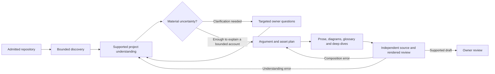

# A project should be able to explain itself

Proposed product vision. [Inferred] The commitments below are design proposals,
not claims that the current implementation has achieved them.

Software accumulates faster than understanding. A repository can contain years
of decisions, several generations of documentation and a working system without
one clear account of why it exists. The owner remembers parts of that story;
a newcomer sees files. Neither should have to reconstruct the whole project
every time they need to explain a choice or orient a collaborator.

Polaris turns that scattered evidence into a coherent, concise manifesto. It
starts with the human problem and the project's response, develops the ideas
that make the application distinctive, and shows how its important parts belong
together. The reader can stop after the introduction with a useful understanding,
or follow a concept into architecture, component explanations and exact sources.

The manifesto is an argued account of this particular project. Its flexible
composition lives within the adopted reading contract: primary thesis/manifesto,
architecture story, capability catalog, capability deep dive and verbatim leaf,
unless an applicable owner ruling changes the order. Deep dives retain argument,
contract and reality bands with their distinct authority classes. Missing material
gets an honest absence/Unknown account; “flexible” does not mean removing an
obligation or inventing a declared capability from a code name.

The argument within those depths is project-specific. Its shape follows
what matters about the project. A library may revolve around a useful abstraction;
a personal automation system around recurring mental work; infrastructure around
a reliability boundary. Their pages should feel related in quality and navigation,
without sounding like the same document with different nouns.

## The product promise

Give Polaris an admitted repository and an audience. It investigates, shows what
it has understood and where the evidence stops, asks a few consequential questions
when necessary, and produces an inspectable manifesto. The owner directs the
meaning and reviews the result; they do not have to assemble source bundles,
write the outline or select every diagram to make the product work.

A repository with incomplete intent can still yield useful architecture and
capability explanations. Its unestablished purpose remains visibly unresolved.
A repository with ambitious documentation and incomplete code can explain its
intended direction and actual limits without turning an aspiration into a shipped
capability. Those distinctions are part of a good account, not footnotes added
only after someone challenges the page.

## Investigate before writing

Polaris begins with a bounded reconnaissance: what projects and boundaries are
present, which source classes it may inspect, what languages and document forms
it can interpret, and where apparently important material lives. It follows
questions, such as “what makes this promise possible?” or “which component owns
this boundary?”, through permitted sources. It does not execute the observed
project to discover the answer.

An admitted entry point is a lead, not a complete source inventory. A README may
be excellent, stale, promotional or silent about the hardest part of the system.
A large folder may be generated output. A small policy document may contain the
qualification that changes the entire thesis. Discovery must make these choices
inspectable rather than silently treating token-window selection as project scope.

Research stops for a stated reason: the material questions are sufficiently
supported within the admitted scope, a needed source is unavailable, a supported
parser cannot resolve it, or the investigation budget is exhausted. “Nothing else
was retrieved” is never the same as “nothing else matters.”

## Build understanding that can be challenged

The central intermediate artifact is a project understanding record. It connects:

- purpose, beneficiary and central proposition;
- capabilities and the problems they address;
- components, responsibilities and supported relationships;
- important choices, alternatives, trade-offs and limits;
- terminology, conflicting accounts and unanswered questions.

Every substantive entry carries its premises, source scope and existing epistemic
classification. An explanation can synthesize several sources, but the resulting
inference remains distinguishable from what a source explicitly declares.
Desired behavior, observed implementation and ongoing work remain separate.
Import relationships cannot silently become causal explanations or product intent.

This record is a reviewable intermediate projection, not a new authority store or
an automatically adopted project ontology. Its identifiers reference owning
records where those exist; temporary research handles do not mint kernel facts.

When evidence disagrees, Polaris preserves the disagreement until an applicable
precedence rule or an attributed clarification resolves the relevant question.
The newest file is not automatically right. The best-written source is not
necessarily authoritative. A rejected interpretation remains traceable as a
review disposition, without continuing to contaminate generated prose.

## Ask questions that earn the owner's attention

The proposed default is to investigate first, then ask the smallest useful set
of questions. Each question explains what cannot be determined, what evidence
was considered, and what part of the manifesto the answer would change. It can
offer supported interpretations, with a free-text alternative and “leave unknown.”
Questions arrive in a bounded group; unresolved dependencies do not trigger an
unending interview or repeated requests for the same answer.

For example: “The scheduling code is clear, but the repository does not establish
whether this exists primarily to save your time or coordinate a team. Who is it
for?” This is more useful than asking the owner to write a mission statement from
scratch or presenting an invented one for passive approval.

An answer is attributed owner input. It may establish the owner's intended
purpose; it does not establish that the implementation fulfills that purpose.
Using an answer in a draft and adopting new project intent remain separate acts.
The owner can revise an answer, see what it affects and regenerate that scope.

## Make the reading an argument

The authoring process selects a central proposition and a progression of questions
that a reader would naturally ask. It decides what belongs in the first minute,
what needs a diagram, and what deserves its own optional explanation. It accounts
for material evidence it leaves out. An editorial omission needs a reason;
a qualification that reverses a promise cannot be hidden in optional depth.

Diagrams explain relationships: responsibilities, flows, boundaries, ownership,
or a consequential dependency. Their edges need support as much as their nodes.
Visual density is evaluated across the page, but there is no diagram quota that
rewards decoration. If a long explanation would be clearer as a relationship
figure, the authoring or design review should say so and require the repair.

Deep dives are small, self-contained explanations connected to the main argument.
They answer why a component exists, what it owns, how it interacts with its
neighbors and where its limits are. A glossary explains project concepts rather
than merely expanding abbreviations. All these artifacts share the same supported
understanding; a terminology correction must not leave a diagram or deep dive
quietly telling the old story.

The page uses available horizontal space for navigation and informative figures,
while keeping prose comfortably readable. The left drawer helps desktop readers
orient themselves. Mobile navigation begins compactly. Sources support the
reading instead of dominating it; exact text remains reachable. The full page,
including its middle and optional depth, must feel deliberately composed.

## A research and editorial system

The phases are editorial workflow labels, not replacement truth states. Owner
review is not automatic adoption. Every loop shares the original bounded run or
requires a visibly new authorized run; disagreement does not create unlimited
research or model spending.

| Responsibility | Tooling required | Limit |
|---|---|---|
| Discover | Path/structure inventory, permitted document and symbol readers, bounded search and snapshot capture | No implicit body reads, shell access, execution or unsupported-language claims |
| Understand | Evidence-linked concepts, relationships, contradictions and research questions | No conversion of implementation evidence into owner intent |
| Compose | Versioned planning/authoring/editing recipes and typed asset generation | No fixed project names, bespoke content patches or unsupported factual edges |
| Challenge | Source-to-account and account-to-source review, counterexamples and owner clarification | The producer cannot supply its own sole evaluation denominator |
| Present | Trusted renderer, navigable depth, source routes and accessible interactions | Attractive output cannot hide uncertainty or substitute for comprehension |
| Maintain | Dependency-aware regeneration and review invalidation | Preserve attributed curation; do not overwrite unfamiliar authored content |

## What generalization means

The engine and evaluation process must work across supported project profiles
without hand-tuning prompts, outlines or renderer code for each repository.
Profiles declare the accepted languages, source classes, repository shapes,
scale bounds and available permissions. The product explains any unsupported
boundary and can offer a limited account whose scope is explicit.

Two real projects are the existing minimum proof obligation. They are not proof
of “any codebase.” Wider claims require a varied evaluation corpus: documentation
rich and poor, single application and multi-package, code/document disagreement,
ambiguous purpose, substantial source volume and a change that alters meaning.
Some cases should remain partial. Correctly asking for missing intent is a
successful behavior; calling that partial account a complete manifesto is not.

Success is a reader explaining this project's purpose and consequential design
choices accurately, an owner recognizing its intent without reconstructing the
page by hand, and a changed project producing an honestly revised account. The
pipeline harness is infrastructure for that outcome.
