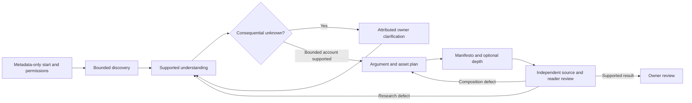

# From investigation to a manifesto

Candidate design accompanying the formal amendment. Observable commitments live
in `specs/polaris-generation/spec.md`; this file explains their design and intended
placement. Source doctrine and existing owner/effect contracts remain controlling.

## Product intent

Software can accumulate without one clear account of why it exists. Polaris
investigates admitted evidence, builds a defensible understanding, asks the owner
consequential questions when that evidence stops, and produces a coherent, concise
manifesto. The reader gets a useful introduction and can follow the argument into
architecture, declared capabilities, meaningful diagrams, glossary, component
depth and exact sources without first understanding governance terminology.

The central artifact is supported project understanding, not a prefilled page
outline. Declared intent, observed implementation and work are separate. Code can
explain a responsibility or dependency without establishing a founder's motives.
A good account preserves uncertainty and disagreements, and a good diagram needs
supported relationships as well as supported nouns.

Project-specific composition lives inside the adopted primary reading altitudes
and argument/contract/reality bands. Desktop navigation makes useful use of the
left side; mobile navigation starts compactly. Prose remains readable, diagrams
explanatory and source detail available without dominating the default reading.

## Research and editorial loop

These are workflow labels, not new global epistemic states or automatic adoption.
Missing central intent keeps the thesis unestablished. A partial architectural
account can still be useful; its usefulness does not satisfy the whole-manifesto
obligation. Every loop retains original bounds or needs a visibly new authorized
run. Discovery cannot run before the effects that cover its reads.

## Record ownership and interfaces

| Record | New information carried | Existing authority preserved |
|---|---|---|
| Discovery scope | Selected boundary/audience/profile, admitted populations, selection and unavailable/exclusion/stop reasons | Owning snapshot, source classifications, permissions and execution bounds |
| Understanding | Purpose/beneficiary candidates, concepts, responsibilities, relationships, choices, qualifications, contradictions and unresolved questions | Premises and owning identities; producer inference never becomes observed fact or an independent oracle |
| Clarification | Question identity, evidence considered, draft consequence, priority, attributed answer/preference, revision and disposition | Existing input/use/retention consent and separate intent/authorship/write acts |
| Argument plan | Reader question, thesis, progression, stopping-depth obligations, omissions and visual/depth reasons | Existing altitude order, authority bands, declared catalog identities and requested-asset dispositions |
| Repair/invalidation | Deficient subject, finding, dependency links, original and changed inputs, affected review applicability | Owning work/run, original budgets, captured evidence and curation history |
| Evaluation case | Frozen source-derived questions/answers, criteria, profile, permitted owner participation and exact generation recipe | Independent evaluation context and separately recorded owner judgment |

These refine the versioned interchange owned by REQ-019. They do not introduce
kernel identity kinds or a second intent/work database. Executable schema and
registered adapter details must preserve these ownership boundaries. New source
classes or recorded answers do not become permitted merely because a schema can
represent them. Where required permission or retention is missing, explain the
limitation without retaining or using disallowed content.

The independent inventory/reviewer checks owning admitted sources. Producer
understanding may be inspected as a subject but cannot replace that source
population. Model instructions found in source content remain untrusted data.
Known source interpretations, discarded hypotheses and disposition warrants remain
traceable without letting rejected content feed later prose.

## Clarification and change

Investigate first, then ask a bounded prioritized group that earns the owner's
attention. Show what is unknown, what evidence was considered and what the answer
would change. Offer supported alternatives where available, free text, correction,
deferral and leave-unknown. Reuse an unchanged answer/disposition; do not ask the
owner to author an inventory, outline or finished page as routine preparation.

An answer can establish the owner's intended purpose without proving its current
implementation or adopting project intent. Changed or withdrawn answers invalidate
affected prose, diagrams, terminology, depth and reviews just as changed source
meaning does. Retain attributed curation and the older review as history; unchanged
labels, URLs and question IDs cannot make it current again.

In product evaluation, new owner premises require an independently frozen oracle
extension before revised-output judgment. The producer's new prose cannot supply
the expected answer. Original insufficient-intent results, evaluator corrections
and newly narrowed requests remain separately visible rather than becoming a
rewritten passing history.

## Evaluation contract

REQ-014 owns the formal requirements. The evaluation uses frozen case metadata
and a source-derived oracle outside the authoring context. It separates scope,
understanding, argument, asset fidelity, reader experience, owner effort,
regeneration and operations, preserving unmet and unproven outcomes rather than
collapsing everything into a quality score.

The corpus challenges sparse intent, unfamiliar/multi-package structure, conflicts,
verbose sources, irrelevant/generated bulk, unsupported edges, unavailable material
and changed meaning. Several characteristics can coexist in one project. Scripted
mutations make individual predicates testable but cannot replace the two separately
admitted real domains and real source-change proof already required. Held-out
projects must not influence project-specific recipe tuning.

Cold readers answer at successive depths and traverse actual diagrams, optional
depth and sources at narrow/wide sizes and with keyboard/nonvisual navigation.
Record unsuccessful attempts and owner interventions: useful clarification differs
from an owner manually rescuing the inventory or prose. Comparable entry-point
and simple-summary baselines test whether Polaris adds understanding; winning that
comparison waives no factual or visual blocker.

## Placement and compatibility

- Core: discovery/understanding/argument contracts, dependency validation, bounded
  repair control and versioned generation/review recipes.
- App adapters: permitted discovery, owner input and classification, provider and
  lifecycle effects with existing protected-host and audit requirements.
- Polaris: inspectable research, contextual clarification, narrative composition,
  supported diagrams and depth; no new queue or silent PWB truth-store split.
- Evaluation tooling: source-derived external case/oracle records and real reader
  evidence independent of internal generator completion flags.

The existing `pipeline.ts` and `provider-draft.ts` are intermediate mechanics.
They do not yet discover repositories, represent this full understanding model,
repair inventories or implement these owner interactions. The amendment does not
retroactively turn their test counts into product proof.
