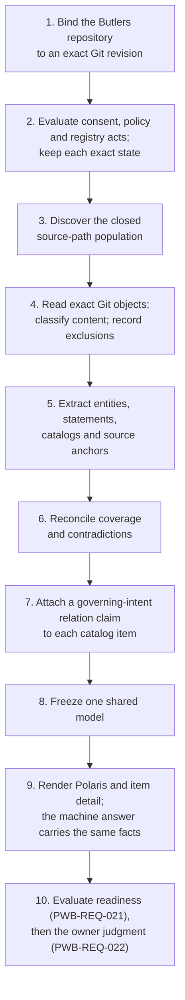
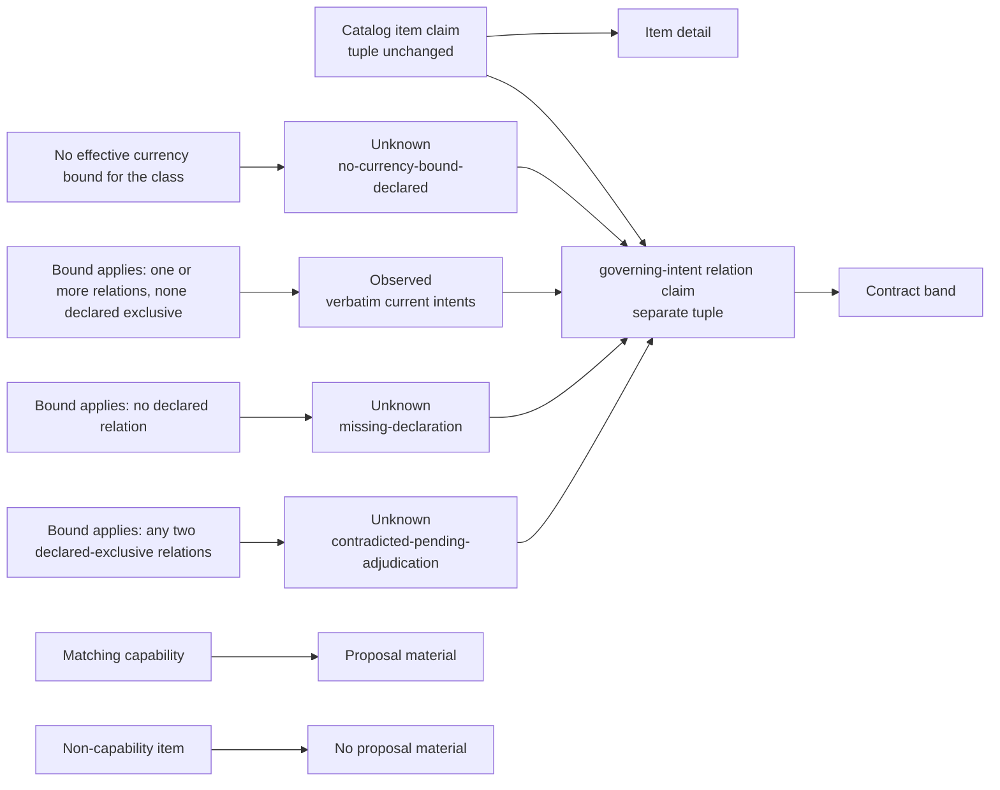

## Context

Polaris needs one revision-bound model of everything Butlers declares about
itself, because one hand-picked capability does not explain the project.

- The original shared model contained one manually selected WhatsApp
  capability. Polaris rendered that small model faithfully, but the owner
  walkthrough showed that it did not explain Butlers. See `proposal.md` and
  `docs/reviews/R-POC-OWNER-WALKTHROUGH-POLARIS.md`.
- Butlers already declares its project shape through the five-pillar index in
  its about/README.md, with roster identity below it.
- The sources are rich enough for a project account but are not perfectly
  consistent. For example, the Butlers about/README.md says there are eight
  domain butlers while its about/heart-and-soul/v1.md declares nine. Polaris
  must expose that conflict instead of choosing whichever value is easier to
  render.

The specification governs. This design explains how its parts fit together
and adds no requirement.

## Goals / Non-Goals

**Goals:**

- Build a revision-bound, deterministic model of all declared Butlers project
  shape.
- Give Polaris a project-level entry with capability drill-down.
- Make omissions and contradictions visible with reconciling denominators.
- Use short headings and direct project language.
- Retain the existing provenance, Unknown, parity and accessibility floors.

**Non-Goals:**

- Semantic indexing of every source file.
- LLM generation or inference at observation or render time.
- Treating every open proposal as current project truth.
- Writing or repairing Butlers artifacts.
- Generalizing this POC adapter to a second project.

## Data Flow

One evaluation runs these steps in order, and both surfaces read the one
model it freezes.

1. Bind the configured Butlers repository to an exact Git revision.
2. Evaluate effective state-(1)/state-(2) consent, policy and registry acts and
   retain each exact state.
3. Discover and expose the closed source-path population.
4. Read exact Git objects and classify content; record exclusions.
5. Extract declared entities, statements, catalogs and source anchors.
6. Reconcile coverage and contradictions.
7. Associate declared catalog items with separate fixed-role governing-intent
   relation claims, preserving item tuples and leaving absent or contradicted
   relations Unknown with their own reason and route.
8. Freeze one shared model for the human and machine surfaces.
9. Render project-level Polaris and item detail from that model.
10. Evaluate nine-answer readiness under PWB-REQ-021, then evaluate the
    separate walkthrough record and owner judgment under PWB-REQ-022 with the
    exact judgment-act state retained.

## Decisions

### 1. Discover a closed source population

The source population is finite and revision-bound, and only closed
extraction rules mint items from it.

- **Four discovery rules.**
  1. the five pillar roots named by Butlers' about/README.md;
  2. the files named by each pillar's own README index, restricted to that
     pillar root;
  3. baseline `openspec/specs/*/spec.md` files listed by the exact Git tree;
     and
  4. top-level roster directories that contain `butler.toml`, plus their
     `MANIFESTO.md` when present.
- **No recursion.** Narrative links do not recurse. Active changes are
  inventoried separately for capability drill-down and never enter the
  current project account.
- **Scope, not a copy.** The source manifest is observation scope, not a
  second copy of Butlers facts. It stores paths, extraction classes and the
  source revision.
- **Item identity.** A declared item identity is `(item class, declared
  key)`; repository-relative paths and content hashes are source-anchor state,
  not identity.
  - The closed extraction classes are the six project-account sections,
    numbered non-negotiables, success list items, top-level V1 catalog
    entries, RFC index rows, baseline spec directories, topology
    component-table first-column identities (qualifying H2s provide context
    and mint nothing), craft policy-file identities and roster directories
    containing butler.toml.
  - No arbitrary heading or narrative link mints an item. Duplicate keys in
    one class surface a contradiction.
- **Profiles.** How each class is read comes from the project's loaded
  profile, whose grammar rows draw only on the specification's closed lists
  of container shapes and item key forms. Butlers is read by the written
  grammar only until its profile is declared; a loaded profile has no
  built-in fallback, and a missing or invalid row leaves that class's item
  denominator Unknown.

Rejected alternatives:

- **Hard-code a larger Butlers summary in Syzygy.** Fast, but it creates a
  drifting second source of project truth.
- **Ask an LLM to summarize the repository.** Broad, but nondeterministic,
  unbounded, difficult to falsify and contrary to the owner's copy concern.
- **Treat every file as Polaris input.** Confuses intent with implementation;
  repository geography belongs to Orrery.

### 2. Model coverage as data

Coverage is data in the shared model: every source stays counted, and every
conflict stays visible with both declarations.

- **Two populations.** The source-path denominator is known from Git and
  never shrinks. The within-source item denominator exists only for a body
  admitted by consent and classification.
  - If a body is unavailable, the source stays counted but its item
    denominator is Unknown; the model never reuses a fixture count as current
    truth.
  - Admitted items carry `modeled`, `unknown` or `contradicted` state and
    reconcile within each source.
- **Disagreements.** When two declarations disagree, the model keeps both
  anchors, applies documented precedence only when it is explicit, and
  discloses the conflict either way.
- **Closed fact population.** The project-fact population is closed rather
  than accepting arbitrary injected fact names. It consists of:
  1. `item:<class>:<declared-key>` for each item in the signed nine-class
     extraction grammar;
  2. `count:<class>` for each of those nine classes;
  3. `catalog-count:<catalog-key>` for each of the nine signed V1 catalog
     headings; and
  4. `project-account:<key>` for the six signed account keys.
  - A declaration enters one of those facts only from an admitted source and
    the extractor assigned to that source.
  - The root-index statement that Butlers has eight domain butlers and the V1
    `Butlers` catalog's derived population of nine therefore both declare
    `catalog-count:Butlers`; neither is a side input.
- **Two root-index grammars.** Two additional root-index grammars are closed.
  - Under the exact H2 `Key Architectural Facts`, an unordered item whose
    leading bold label is `<decimal> daemons` and whose own text contains the
    exact cardinal form `<decimal> staffers ... + <decimal> domain butlers`
    emits only `catalog-count:Staffers` and `catalog-count:Butlers`.
  - Under the exact H3 `Precedence Order When Layers Disagree`, one pipe table
    with the exact columns `#`, `Layer`, `Owns`, `Home` emits the seven
    ordered layer rules only when rows 1 through 7 each occur once and each
    layer/home is unique.
  - Rows 1 through 5 carry exact normalized roots; row 6's exact
    `roster/{butler}/` template expands only for declared roster keys; row
    7's exact `src/, alembic/, tests/` literal is inert because code owns no
    admitted fact.
  - No other prose, number or table mints a declaration or rule.
- **Frozen registry literals.** The registry freezes the exact `Layer`, `Owns`
  and `Home` semantic literals for all seven rows.
  - Raw `Layer` cells must be exactly one bold span; matching trims outer
    ASCII whitespace and unwraps only complete inline code spans in `Owns` and
    `Home`, preserving case, punctuation and internal whitespace.
  - It also freezes a closed twenty-entry family map. `item:<class>` and
    `count:<class>` are separate entries for each of the nine classes; their
    row is 1 for project-account-section, principle, success-criterion and
    catalog-entry, 2 for design-contract, 3 for baseline-spec, 4 for
    craft-policy, 5 for topology-component and 6 for roster-identity.
    `catalog-count` and `project-account` are the remaining two entries and
    both map to row 1. Row 7 owns no fact in this content class.
  - Mixed-family prose or any altered `Owns` cell invalidates the table
    rather than extending the grammar.
- **When precedence applies.** For one conflicting fact, the precedence table
  applies only when exactly one declaration's source is under the
  lowest-numbered listed home assigned by that closed map.
  - The root summary is a non-owning declaration and defers to such an owning
    layer; an unlisted source owns nothing.
  - Missing, malformed, duplicated, out-of-population, self-referential,
    inapplicable or equally ranked rules select nothing.
  - Thus the named live `catalog-count:Butlers` conflict keeps eight from the
    root summary and nine from the Heart and Soul V1 catalog; the admitted
    row-1 Heart and Soul rule may select nine only with that exact rule anchor
    and both declarations still visible. Without that applicable rule the
    result is Unknown.
- **One coverage object.** The machine answer and Polaris consume the same
  coverage object. A page cannot claim whole-project coverage from a smaller
  hidden model.

### 3. Separate the project account from item detail

Polaris explains the project first; every catalog item then opens one detail
whose bands keep argument, contract and reality apart.

- **Progression.** The Polaris entry follows the accepted RFC7 progression:
  1. Overview
  2. Boundaries
  3. Architecture
  4. V1 scope and success
  5. Project catalog
  6. Item detail
  7. Evidence and gaps
  - An aggregate over the evaluation's Unknown project-shape claims may open
    the first reading level before the first capability catalog; there is at
    most one, it displaces no category of the project account, and every
    counted claim stays disclosed at its own place.
- **One detail per item.** Every declared catalog entry reaches one item
  detail keyed by the item's stable semantic claim identity.
  - The existing WhatsApp capability deep dive is the detail for its matching
    declared catalog item, not a second identity or a special route.
  - A capability matches an item only by exact equality of their declared
    keys; a capability matching no item or several gets no detail and renders
    no proposal, and is disclosed Unknown.
  - A route or fragment locates the detail but never becomes item identity.
- **Three bands.** The three authority bands keep their existing order and
  meaning. Argument is non-normative framing and cannot mint intent.
- **The relation claim.** Contract carries a separate item-to-intent relation
  claim whose semantic identity combines the item's stable claim identity
  with the fixed role `governing-intent` at the same evaluation. It never
  borrows or changes the item's epistemic tuple.
  - While its derived class has no effective currency bound, every relation
    claim is Unknown with the single primary reason
    `no-currency-bound-declared` and no second primary reason.
  - Once the bound applies, one or more captured declared relations, no two of
    which a declaration names as exclusive, are one Observed relation over the
    whole set. No relation is Unknown with RFC2-24 `missing-declaration`; any
    two relations a declaration names as exclusive make the whole population
    Unknown with `contradicted-pending-adjudication`, however many compatible
    relations it also holds.
  - Exclusion is declared, never inferred from class, label, basename,
    similarity or a precedence outcome. Each reason keeps its RFC2-24
    resolution route.
  - The relation claim belongs to the derived class
    `governing-intent-relation`, whose currency treatment PWB-REQ-007 decides.
  - A matching capability's contract band also carries its own baseline-spec
    requirement identities, which stand in for no relation.
  - No extraction class admits a governing-relation declaration today, so no
    relation is captured until a separate owner-scoped change admits a
    source. Both channels recover the same relation tuple under PWB-REQ-020.
- **Reality and proposals.** Reality is projected only from the item's facts
  in the one shared model and evaluation.
  - Active and proposed OpenSpec work appears only when item detail is the
    matching declared capability detail, as PWB-REQ-013 requires; a
    non-capability detail renders no proposal material.
  - Capability proposals stay beside current intent, marked with lifecycle
    state and separate by candidate future.

- **What this does not do.** This generalization does not make every item a
  capability. Capability identity continues to come only from a declared
  capability artifact.
  - It also adds no body read: exact intent stays reachable through the
    separately governed exact-source path and its existing authority,
    identity, secret and inert-content gates.
  - That path is the only place band text is encoded, and a failed gate leaves
    that text Unknown without changing the relation claim.

### 4. Use direct copy with a finite rubric

Owner-visible copy follows a small closed rubric that a checker can apply.

- Every owner-visible string has one role: `project-fact`,
  `epistemic-disclosure`, `action-label` or `scope-instruction`.
- Headings use at most six words; entry ledes use at most twenty.
- Heading, lede and notice text may not use “page,” “document,” “reading,”
  “section,” “movement” or “presentation.”
- One scope instruction may state the POC boundary at entry; action labels
  name their action.
- Provenance stays available without being repeated in every sentence.

### 5. Gate body reads on owner authority

No body is read until three exact artifacts each carry an effective human
owner act, and each act's exact state stays visible.

- **The three artifacts.** Before the first body read, the evaluation checks
  the exact per-repository Butlers observation-consent record, the observing
  project's concrete secret-detection/classification policy and the
  project-shape observer's governance-plane registered adapter entry against
  effective human owner acts under RFC3-16(a) and RFC3-16(b).
- **States.** Each act may independently be valid state (1) or state (2);
  all-valid mixed states admit reads.
  - Every artifact identity and digest, act-record identity, act type and
    scope, provenance state, and A1 audit identity or explicit absence is a
    deterministic input.
- **Failure.** Missing or invalid act state produces zero body reads and a
  project-model Unknown. Failed or indeterminate state-(2) correlation never
  falls back to state (1).
- **Disclosure.** Human and machine outputs expose the exact state for each
  authority, and state (1) carries the same-tree-forgeability limitation.
- **Warrants, not evidence.** These acts warrant use of the consent, policy
  and registration; they are not evidence that screening or reading
  succeeded. Specification sign-off mints none of these artifacts.
- **Invalid cases.** The admission oracle closes the invalid population at 195
  cases: 55 owner-act/provenance cases for each of the three acts plus 30
  authority-specific field cases.

### 6. Fail closed at the content boundary

Reads stay inside exact Git objects, observed content never becomes active,
and every resource limit fails closed.

- **Containment.** Only exact Git objects under normalized repository-relative
  paths are read. Absolute paths, traversal, NULs, working-tree symlinks,
  submodule traversal and repository escape are rejected.
- **Inert handling.** Markdown is handled as untrusted text and is
  context-encoded at every sink.
  - Inline code spans and fenced code blocks are inert contexts: markup-like
    examples inside them do not by themselves trigger active-content
    exclusion and are never interpreted as markup or links.
  - Secret detectors still scan the complete transient body, including those
    contexts, before parsing.
  - Outside inert-code contexts, raw HTML elements/comments/declarations, SVG,
    scripts, event-handler attributes and unsafe URL schemes in Markdown
    destinations, autolinks or HTML attributes exclude the whole source.
- **The inert-context profile.** The profile is closed and line-oriented.
  - A fence begins with zero to three spaces and at least three identical
    backticks or tildes; it ends at the first zero-to-three-space run of the
    same character at least as long, with trailing spaces only. A backtick
    opener's info text may contain no backtick.
  - Outside fences, an inline span closes only on the next backtick run of
    exactly the opener length; different-length runs are content and
    backslash does not escape them.
  - Unclosed fences/spans and invalid backtick info strings are malformed and
    excluded. Indented code and HTML `<code>` are not inert contexts.
  - The context mask affects only active-content detection; complete-body
    secret scans run first.
- **The resource envelope.** The adapter declares one evaluation-wide
  envelope.
  - `maxSources` covers the complete manifest. `maxBytesPerSource` covers each
    exact blob.
  - `maxTotalBytes` is one cumulative counter across phase A and phase B and
    counts each `(path, object-id)` body once; it never resets between
    phases. `maxIndexDepth` covers discovery.
  - Deterministic parse work is bounded by `maxParsePassesPerSource`: the
    registry enumerates the only twelve pass identities. Each complete
    traversal of one source counts once, including a helper traversal;
    repeating one counts again and an unregistered traversal is forbidden.
  - Human HTML and machine JSON have separate final encoded-byte ceilings.
- **Breaches.** A source/input breach keeps the whole source population
  counted and makes every dependent fact Unknown.
  - A final-output breach emits only the bounded typed failure envelope with
    the evaluation identity, breached limit, observed count and population
    counts; it never emits a truncated success-shaped model.
  - Every breach makes cold-open readiness false.
- **Secrets and execution.** Secret detection and classification cover model,
  caches, logs, HTML, JSON and walkthrough records. Exclusions carry
  hash-not-body provenance. No observed-project code executes.
- **Values recommended at drafting.** The values recommended when this design
  was drafted keep source and cumulative bytes unchanged (`512`, `1,048,576`,
  `16,777,216`, depth `4`), replace nondeterministic elapsed parse time with
  `16` complete passes per source, keep `2,097,152` bytes for a human HTML
  response, and set the machine JSON ceiling to `8,388,608` bytes. The
  registry entry, not this design, declares the values in force.
  - The split does not waive concise human presentation; it recognizes that
    the machine answer carries the complete fact population.

### 7. Keep execution and judgment separate

A walkthrough record says what happened; only a separate owner judgment says
whether comprehension succeeded.

- **Execution record.** The cold-open execution record establishes only what
  walkthrough occurred.
- **Owner judgment.** A separate exact-scope human owner judgment decides
  whether the comprehension criterion is met and may carry an effective
  state-(1) or state-(2) act.
  - Human and machine outputs expose the exact judgment-act state and the
    state-(1) same-tree-forgeability limitation.
  - Failed state-(2) correlation never falls back to state (1), and later
    correlation never rewrites the state under which an earlier judgment took
    effect.
  - The judgment remains recorded human judgment, never Observed evidence or a
    score; neither its act nor the execution record proves comprehension
    succeeded.
  - The judgment oracle closes its invalid population at 84 present-invalid
    cases plus two absent cases.
- **Readiness.** PWB-REQ-021 owns readiness and answer retention.
  - Its execution record carries exactly nine identified answer entries, one
    for each closed cold-open prompt, and every traversed path used for
    readiness must be Polaris or a Polaris exact-source route at the same
    surface/evaluation identity.
  - Missing, duplicate, unknown or wrong-prompt answers and non-Polaris paths
    make readiness false, but do not make the run or judgment act malformed.
  - PWB-REQ-022 continues to decide only whether the separately retained
    run-record/judgment pair and owner act are lawful; its 84 present-invalid
    plus two absent cases do not change.

### 8. Reach verbatim intent within the existing consent class

Exact intent is served from the sources the evaluation already admitted, in
one of two render modes, behind the same gates; nothing reaches a withheld
source.

- **Baseline specs.** Baseline `openspec/specs/*/spec.md` Git objects are
  already members of the signed source population, and PWB-REQ-011/015
  already require exact requirement text.
  - The performed consent covers exact Git objects selected by that
    population under `declared-project-shape-text`. The live route therefore
    needs no wider content class.
  - After the ordinary authority gate, exact-object check, whole-body secret
    scan, inert-content classification and requirement-identity digest check,
    the renderer may transiently encode only the requested verbatim
    requirement and scenarios. It stores, logs, caches and returns no
    unselected body.
  - If any gate fails, exact text stays Unknown. Any proposal to read a body
    outside that population or return a raw artifact needs a separate consent
    amendment and act.
- **Every other admitted source.** The same reasoning carries to every other
  source this evaluation admitted as a classified blob.
  - Each is the same kind of exact Git object, selected by the same signed
    population and covered by the same consent class, so serving it reads no
    wider class and asks for no new class.
  - What differs is the reading unit. A baseline `openspec/specs/*/spec.md`
    source has requirement sections to select, and a route that finds none
    there can only refuse; every other admitted source declares no such
    sections, so its reading unit is the whole admitted body.
  - The route therefore carries exactly two render modes —
    `requirement-sections` and `whole-body` — chosen by the source's own class
    and never by the reader.
  - The set is closed: a third mode would be a third reading unit, which is a
    new specification question, not a rendering detail.
- **Withheld sources.** Nothing in that carry reaches a withheld source. A
  source whose record outcome is excluded has no admitted body to serve, so
  it keeps its identity, its content digest and its fixed exclusion reason,
  stays in every denominator and is refused in both modes.
- **Gates and anchors.** The gates do not move either: every mode runs the
  same authority, exact-object, secret and inert-content checks against the
  complete transient body before any of it is encoded, and a failure leaves
  that body Unknown with its reason.
  - Scroll anchors are presentation only — they let a citation land on the
    unit it names, and never decide what the route serves or stand in for any
    anchor identity.

### 9. Keep every claim's epistemic state, including dismissals

Every claim carries its complete epistemic tuple; two later amendments fix
how a missing currency bound and a human dismissal show on it.

- **Missing currency bound.** A claim whose class has no effective
  currency-bound declaration is Unknown with `no-currency-bound-declared` and
  its route. The missing bound is a named disclosure outside the freshness
  slot; no freshness value is invented for it, and an aggregate discloses how
  many of its members are in that state.
- **Dismissal with expiry.** An attributed, reasoned and expiring human
  dismissal record in the governed plane may dismiss an Unknown claim.
  - Each evaluation decides it from its own as-of instant, so a dismissal
    lapses only through a new evaluation.
  - It replaces the claim's status rendering, never its facts, keeps the
    claim in every aggregate count and never counts as resolved or
    favourable.
  - A record that dismisses nothing is disclosed as refused, bound to a
    retired identity, or lapsed.
- PWB-REQ-007 states both rules exactly.

### 10. Serve machine views beside the machine answer

The machine answer is the one comparison point for parity; the views served
beside it are closed and add no fact.

- PWB-REQ-020 compares Polaris with the authenticated project-wide machine
  answer at one evaluation.
- Two closed categories of view are served beside it: derived read-only
  machine views (`GET /api/poc/polaris` and `GET /api/poc/briefing`) and the
  generated editorial draft view (`GET /polaris/draft/<runId>`).
- A view mints no project fact and writes nothing, and a route joins a
  category only by a later amendment to the specification. A member that
  needs its own byte ceiling is not served before the registry entry declares
  it.

## Risks / Trade-offs

Each known risk has a fail-closed answer; the one residual risk the owner
accepts is state-(1) forgeability, and only for this bounded POC.

- **Butlers Markdown changes shape** → parsing failures render Unknown and the
  denominator stays visible; focused contract tests pin each extraction
  class.
- **The manifest misses a declared source** → a source-discovery sweep compares
  the five-pillar indexes and roster population against the manifest.
- **The primary page becomes encyclopedic** → progressive disclosure keeps the
  first read concise while catalogs and exact artifacts stay reachable.
- **Sensitive text enters a surface** → allowlisting and fail-closed secret
  classification precede model construction.
- **A source escapes or becomes active content** → exact-object containment,
  inert parsing and context-aware encoding reject it before model admission.
- **A corpus exceeds local budgets** → the affected source stays counted and
  renders Unknown with the breached limit.
- **A stale summary conflicts with a higher authority** → both are kept;
  explicit Butlers precedence selects the effective statement and Polaris
  discloses the disagreement.
- **State-(1) authority is same-tree forgeable from Syzygy's perspective** →
  exact digests detect later drift but cannot establish who authored or
  attended the act. The owner accepts that residual risk only for this bounded,
  local, one-repository POC; the exact state and limitation stay visible and
  every other security gate stays conjunctive.

## Migration Plan

The model fields are additive, and signing the specification never starts
implementation by itself.

- **Separate authorities.** Effect-specific consent, policy and registry acts
  and a separate implementation authorization are required before
  implementation or any body read.
- **During implementation.** The earlier single-capability page stays
  available until the project-wide page passes parity and cold-open
  evaluation.
- **Rollback.** Rollback restores the old renderer and model builder; it does
  not alter Butlers or any governed artifact.
