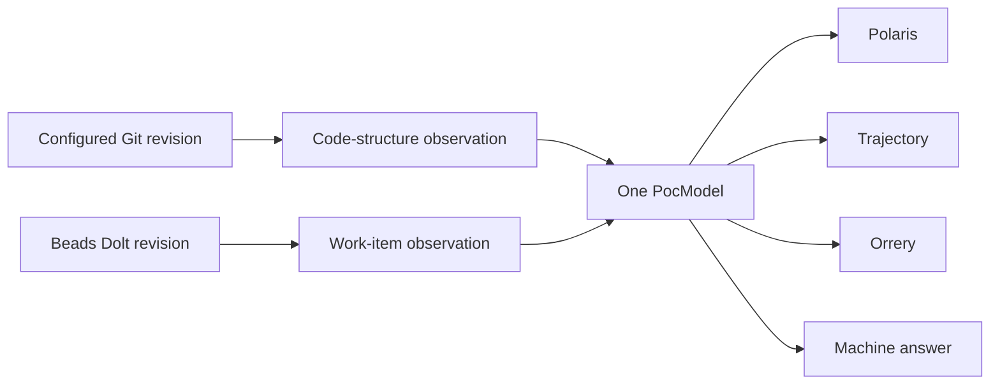

# Design — three-surface-poc-experience

The implementation extends the existing POC and keeps one `PocModel` as the
only truth store. This file is non-normative; the specification governs where
they disagree.

## Data flow

- **Code structure:** `packages/three-surface-poc-core` observes paths, sizes,
  digests and declared language classifications at an exact Git revision.
- **Work items:** the same package reads the registered prefix from Dolt,
  read-only, and records the Dolt revision.
- **Shared truth:** both observations enter the same model used by human and
  machine channels. No surface owns a second fact store.
- **Script-less backstop:** server-rendered exact tables and routes remain
  available when client enhancement is absent.

## Surfaces

- **Polaris — intent as a readable account.** Sections derive from intent
  entities. Claim markers bind every positive statement to model provenance.
- **Trajectory — work without the closure fallacy.** A declared status mapping
  places items into columns. Recorded instants drive time. Scope and excluded
  counts remain visible.
- **Orrery — observed structure without invented meaning.** A deterministic
  seeded layout projects directories and declared mappings. Its legend comes
  from the same encoding table as the renderer.

## Parity

Every rendered fact carries the parity marker used by the independent sweep.
The sweep reports its denominator and compares each value with `GET /api/poc`
for the same evaluation. Client rendering adds presentation, never facts.

## Verification seams

- **Observation boundaries:** sentinel-content sweep, induced observer failure,
  export mutation and direct Dolt comparison.
- **Determinism:** repeated structure observations, repeated time rendering and
  repeated Orrery layouts over one identified input.
- **Complete populations:** work-prefix, claim, mapping, relationship,
  accessibility and epistemic-marker sweeps with reported denominators.
- **Cause-correct failure:** missing or unreadable sources render Unknown with
  their reason; no partial or empty result is presented as complete.
- **Mutation proof:** each requirement's falsifier is exercised at its named
  seam before the corresponding check is trusted.

Stack and library choices remain implementation decisions unless a requirement
names their observable behavior.
