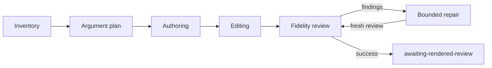

# Polaris generation core

Pure deterministic generation primitives. No source acquisition, permission
service, provider dispatch, filesystem writes or owner acts live here.

- **Canonical JSON** — a versioned, bounded encoding and its SHA-256 digest.
- **Editorial pipeline** — staged, validated generation through explicit
  adapters; a successful run ends at `awaiting-rendered-review`, never ready
  or adopted.

## Canonical JSON

`encodeCanonicalJson(value, limits)` defines `polaris-json-v1`, and
`digestCanonicalJson` hashes its exact bytes. Neither validates a generator
schema, resolves an identity, establishes source fidelity or authorizes an
effect.

**Encoding.** `polaris-json-v1` is compact JSON with UTF-16-sorted object
keys, original array order and ECMAScript JSON primitive spelling.

- The output uses UTF-8 for size and digest accounting, without Unicode
  normalization.
- Negative zero encodes as zero. Lone surrogates are JSON escapes.
- This is a local versioned encoding, not a claim of RFC 8785 conformance.

**Limits.** Every call supplies positive safe-integer byte and node limits and
a depth limit from 0 through 256.

- Root depth is zero; every value occurrence counts as a node.
- Shared objects count at each occurrence.

**Refusals.** Cycles, sparse arrays, non-finite numbers, non-JSON primitives,
proxies, custom prototypes, accessors, symbol/hidden fields, extra array
fields and `__proto__`/`constructor`/`prototype` object keys are refused.

- Plain and null-prototype data objects are supported.
- Diagnostics contain only bounded error codes, never input values or keys.

**Digest.** `digestCanonicalJson` hashes those exact bytes using SHA-256 and
returns the encoding and algorithm alongside the digest. It performs no I/O.

- Canonical shape validation does not validate a generator schema, resolve an
  identity, establish source fidelity or authorize any effect.
- Callers must first use a bounded parser that rejects duplicate keys;
  duplicate keys cannot be recovered from an already parsed JavaScript object.
- Schema validation remains a separate obligation.

## Editorial pipeline

`runGenerationPipeline` connects independent inventory → argument plan →
authoring → editing → fidelity review, with bounded repair and fresh review.
Its checks are mechanical; they cannot establish semantic truth.



**Stage contracts.**

- `promptForStage` and `stageSchema` supply versioned recipes and concrete
  provider-local response contracts. The serialized input binds both prompt
  and schema bytes.
  - They also serve the `dossier` profile (`promptForStage(stage, 'dossier')`)
    and the `discovery-map` / `discovery-reduce` stages. No target text
    reaches either symbol. Their shape illustrations are deep-frozen and
    serialized once at module load, and the package entry point does not
    export them, so no importer can change the instruction bytes.
  - The dossier profile reports a stated advantage, trade-off or comparison
    only as a quotation of the project's sources (`The project states: "…"`):
    one contiguous span of a cited source, at most two sentences or one list
    item, never elided or spliced. Double quotes are used for nothing else;
    identifiers outside a quotation go in backticks. An advantage no source
    states is never written. A mechanism-level cost no source states may be
    one `Inferred:` sentence citing the mechanism's sources and agreeing with
    them; otherwise it stays unresolved. Every inferential block must begin
    `Inferred:`.
  - `checkDraftQuotes` (`quote-fidelity.ts`) is the one deterministic quote
    check. A quotation opens with `The project states: "`, runs to the last
    straight quote before the next lead-in, and must equal one contiguous
    span of one cited source on word boundaries after whitespace runs
    collapse and formatting drift (comment leaders, link syntax, entities,
    backslash escapes, backticks, paired emphasis, curly quotes) is folded
    on both sides. An ellipsis is allowed only where the source has it
    (`elided-quote` otherwise). The pipeline joins it to the reviewer's
    verdict: a failure earns a repair, and one that survives the last repair
    is returned as `quoteFindings` so the renderer shows that block Unknown.
- `parseBoundedJson` refuses duplicate keys, malformed responses and
  byte/depth/node overflow before stage validation.
- `validateStage` checks closed fields, source references, requested section
  identities, diagram endpoints and review population declarations.
  - These checks cannot establish semantic truth.

**Draft shape (schema v2).** Draft stages use schema v2 (prompts v2 for plan,
author, edit and repair).

- Section and deep-dive blocks are one-level trees: a parent paragraph and
  0–12 leaf children, all counted as blocks for handles and review coverage.
- Each diagram names its `kind`, the `relationship` it explains and an
  observed/inferred/unknown marking on every node and edge.
- A produced diagram's node and edge labels must appear in its section's
  block text (`diagram-label-not-in-text`); that check is necessary, not
  sufficient.
- `diagramToMermaid` derives the reviewable Mermaid text from the structured
  record, which stays the declarative source.

**Sources and citations.** `GenerationSource` binds each countable source to
repository, revision, Git object and evaluation identities.

- Only a body-backed, validated byte span can be quoted.
- Path-only, excluded and unavailable rows remain in the denominator.
- Preview citations derive from validated anchors, so reordering sources
  cannot renumber them.
- The PWB model is projected by an app adapter without re-reading its
  released source bodies.

**Requested assets.** The operator supplies `requestedAssets` with stable IDs,
kinds and requiredness.

- The pipeline rejects malformed requests before dispatch.
- Validators join those requests and positive review references to the same
  draft and admitted inputs.

**Controller and adapters.** The controller requires explicit
source-verification, lifecycle/admission, provider, validation and receipt
adapters. It has no default network client.

- Requests name six stage routes, and receipts retain the route and reported
  model for each attempt.
- Fidelity and repair envelopes omit the author plan.
- After inventory, only source spans cited by the stage input travel in an
  envelope.

**Checkpoints and replay.** The private scripted adapter persists exclusive
reservations and validated checkpoints outside a governed tree. This is not a
live effect host.

- Completed stages are reused only under matching input, route, permission
  and artifact bindings.
- In-flight and uncertain attempts remain reserved; neither a missing receipt
  nor an expired lease permits replay.

**Obligations on real adapters.** Real adapters must atomically bind
immutable request inputs, enforce cumulative reservations across restarts and
concurrent callers, and re-evaluate authority.

- A stalled adapter is bounded by cancellation/deadline.
- A late admission or lost receipt remains conservatively reserved in its
  owning adapter, never permission to replay.
- Durable late receipt capture belongs to the adapter; the in-process
  callback supplements it and cannot survive a process crash.

**Outcomes.** Successful source review returns `awaiting-rendered-review`,
never ready/adopted.

- Stopped runs expose previously validated stage artifacts and content-free
  reasons; invalid provider bodies are not returned.
- A validator and a declared complete review denominator are mechanical
  evidence, not proof of model quality.

**Controlled example.** This kit grants no source access, provider egress,
authorship adoption or release.

- A real provider requires recorded per-project, provider and content consent
  under SEC-2; the synthetic command below makes no provider call.

Run the controlled end-to-end example from the repository root:

```sh
npm ci
npm run poc:generator-demo -- --out /tmp/polaris-generator-demo-new
```

- If dependencies are absent, the demo stops with an `npm ci` instruction
  before attempting a build.
- Use a fresh directory.
- The command creates two synthetic project previews, a changed-source
  variant, structured draft files and stage receipts.
- Responses and admission are scripted, explicitly synthetic adapters. No
  real source or model provider is accessed.
- Open the generated HTML to inspect supported diagrams, source references
  and optional depth.
- This intermediate preview is not the primary Polaris publication surface or
  the full authored asset schema.

**Still required:**

- live admitted source/provider/lifecycle adapters;
- protected effect host;
- full authored bundle and owner workflow;
- independent real-source and rendered quality judgments;
- unchanged-engine proof on two real admitted projects.

## Dossier evaluation

`evaluateDossier` measures a generated static dossier against frozen reader
questions (TRACKER G5, gap #10). It records; it never grades an answer,
awards acceptance or calls a model. Absent evidence is Unknown, never a pass.

**Input (`polaris-dossier-v1`).** A run directory holds `dossier.json`
(`format`, `title`, `entryPage`, `pages: [{ path, depth }]`, the entry page
alone at depth 0) and the pages. The evaluator reads markup from the page
bytes, never from the manifest:

- `data-reading-level="n"` marks reading levels; 0 is the first;
- `<section id data-topics="…">` names the owner topics a section claims;
- `data-claim-id` must carry `data-epistemic="observed|inferred|unknown"`;
- `data-quote-source`, `data-quote-start` and `data-quote-end` give
  **blob-absolute** UTF-8 byte offsets, the same base as the anchors. For a
  piece of a segmented blob the evaluator subtracts `segment.start`, and a
  quote must lie wholly inside the named piece (`crosses-piece-boundary`).
  The element's text, as a browser parses it (CRLF and lone CR become LF; a
  source CR survives only as `&#13;`), must equal those bytes exactly.

**Report.** Four parts, plus the subject's digests: the manifest, each page,
the questions file, a canonical digest of the admitted sources (ids,
identities, segments, exclusions and body hashes, in id order), the budget,
and the reader factory's kind and script digest.

- **Reader cost:** bytes and words to the first reading level, per page
  depth and per reading level, and each page against an optional budget.
  An undeclared bound is Unknown (`no-budget-declared`).
- **Fidelity:** each quote's outcome (`exact`, `text-mismatch`,
  `out-of-range`, `crosses-piece-boundary`, `not-utf8-boundary`,
  `unknown-source`, `unquotable-source`, `invalid-offsets`); quotes pass as
  `all-resolved`. Claims pass as `all-labelled`, which checks a label's
  presence and vocabulary only; `observedWithoutQuote` lists Observed claims
  with no quote of their own. With no quotes or no claims the outcome is
  `unknown`.
- **Reader test:** a `ReaderPortFactory` creates a fresh `ReaderAnswerPort`
  per question, given only the question's id and text and the page bytes.
  Answers, citations and attempted paths are recorded with the port kind and
  `accuracy: "not-evaluated"`. `scriptedAnswers` is the only implementation.
- **Coverage:** per owner topic, `scripted-answer-cited` (a scripted answer's
  resolving citation, carrying `readerPort` and `accuracy: "not-evaluated"`;
  a fixture, never reader evidence), `declared-only` (a section's own
  `data-topics`) or `unknown`.

The questions file (`polaris-reader-questions-v1`) is frozen by digest:
`expectedQuestionsSha256` refuses a file that no longer hashes to it.

```sh
npm run poc:dossier-evaluation -- --dossier <run-dir> --sources <sources.json> \
  --questions <questions.json> [--expect-questions-sha256 <hex>] \
  [--budget <budget.json>] [--answers <scripted-answers.json>] [--out <new-report.json>]
```

The command refuses a page that is a symlink, is not a regular file, or
resolves outside the run directory.

The renderer that emits this format from a pipeline run is
`apps/three-surface-poc/src/polaris-generation/dossier-render.ts`
(`npm run poc:dossier-render -- --run <run.json> --out <new-dir>`).
Generated prose is labelled Inferred when the fidelity review judged its
block supported and Unknown otherwise; diagram elements keep their own
marking. Quote offsets are blob-absolute. Without `--topics`, a section or deep
dive declares the owner topics among its produced asset ids. The run
directory gets `size-report.html` beside `size-report.json`. It is written
whole or not at all, through a sibling staging directory, and only under a
real parent that Git reports as outside any repository.
